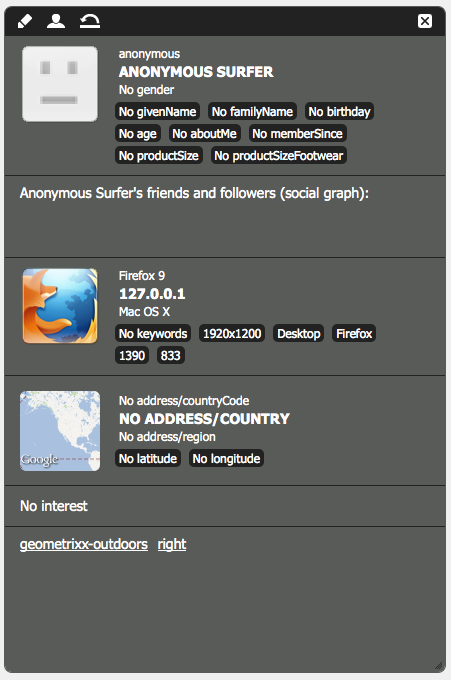

# Konfigurera segmentering{#configuring-segmentation}

>[!NOTE]
>
>I det här dokumentet beskrivs konfigurationen av segmentering så som den används med klientkontexten. Information om hur du konfigurerar segment med ContextHub med hjälp av pekgränssnittet finns i [Konfigurera segmentering med ContextHub](/help/sites-administering/segmentation.md).

Segmentering är en viktig faktor när man skapar en kampanj. Se [Segmenteringsordlista](/help/sites-authoring/segmentation-overview.md) för information om hur segmentering fungerar och nyckeltermer.

Beroende på den information du redan har samlat in om webbplatsbesökarna och vilka mål du vill uppnå, måste du definiera de segment och strategier som behövs för målinnehållet.

Dessa segment används sedan för att förse en besökare med specifikt riktat innehåll. Detta innehåll underhålls i [kampanjavsnittet](/help/sites-authoring/personalization.md) på webbplatsen. Teaser pages defined here can be included as teaser paragraphs on any page and define which visitor segment the specialized content is applicable for.

Med AEM kan ni enkelt skapa och uppdatera segment, teasers och kampanjer. Du kan även verifiera resultatet av dina definitioner.

Med **segmentredigeraren** kan du enkelt definiera ett segment:

Du kan **redigera** varje segment för att ange **titel**, **beskrivning** och **förstärkningsfaktor** . Med hjälp av sidosparken kan du lägga till **OCH** - och **OR** -behållare för att definiera **segmentlogiken** och sedan lägga till de **segmentegenskaper** som krävs för att definiera urvalskriterierna.

## Förstärkningsfaktor {#boost-factor}

Varje segment har en **startparameter** som används som viktningsfaktor. ett högre tal anger att segmentet kommer att markeras framför ett segment med ett lägre tal.

* Minsta värde: `0`
* Högsta värde: `1000000`

## Segmentlogik {#segment-logic}

Följande logikbehållare är tillgängliga när de är klara och gör att du kan skapa logiken för ditt segmentval. De kan dras från sidosparken till redigeraren:

<table> 
 <tbody> 
  <tr> 
   <td> AND-behållare  </td> 
   <td> Den booleska operatorn AND.  </td> 
  </tr> 
  <tr> 
   <td> ELLER-behållare  </td> 
   <td> Operatorn boolesk OR.</td> 
  </tr> 
 </tbody> 
</table>

## Segmentegenskaper {#segment-traits}

Följande segmentegenskaper är färdiga att användas: de kan dras från sidosparken till redigeraren:

<table> 
 <tbody> 
  <tr> 
   <td> IP-intervall  </td> 
   <td>Definierar ett intervall med IP-adresser som besökaren kan ha.  </td> 
  </tr> 
  <tr> 
   <td> Sidträffar  </td> 
   <td>Hur ofta sidan har begärts.   </td> 
  </tr> 
  <tr> 
   <td> Sidegenskap  </td> 
   <td>Alla egenskaper för den besökta sidan.  </td> 
  </tr> 
  <tr> 
   <td> Referensnyckelord  </td> 
   <td>Nyckelord som matchar information från den refererande webbplatsen.   </td> 
  </tr> 
  <tr> 
   <td> Skript</td> 
   <td>Javascript-uttryck som ska utvärderas.  </td> 
  </tr> 
  <tr> 
   <td> Segmentreferens   </td> 
   <td>Referens till en annan segmentdefinition.  </td> 
  </tr> 
  <tr> 
   <td> Tag Cloud  </td> 
   <td>Taggar som ska matchas med taggar från besökta sidor.  </td> 
  </tr> 
  <tr> 
   <td> Användarålder  </td> 
   <td>Som hämtat från användarprofilen.  </td> 
  </tr> 
  <tr> 
   <td> Användaregenskap  </td> 
   <td>Annan information som är tillgänglig i användarprofilen. </td> 
  </tr> 
 </tbody> 
</table>

Du kan kombinera dessa egenskaper med hjälp av de booleska operatorerna OR och AND (se [Skapa ett nytt segment](#creating-a-new-segment)) för att definiera det exakta scenariot för att markera det här segmentet.

När hela programsatsen utvärderas till true är det här segmentet löst. Om flera segment är tillämpliga används även **[ökningsfaktorn](/help/sites-administering/campaign-segmentation.md#boost-factor)**.

>[!CAUTION]
>
>Segmentredigeraren söker inte efter några cirkelreferenser. Segment A refererar till exempel till ett annat segment B, som i sin tur refererar till segment A. Du måste se till att dina segment inte innehåller några cirkelreferenser.

>[!NOTE]
>
>Egenskaper med suffixet **_i18n** anges av ett skript som är en del av personaliseringens användargränssnittsklient. Alla användargränssnittsrelaterade klienter läses bara in på författaren eftersom användargränssnittet inte behövs vid publicering.
>
>När du skapar ett segment med sådana egenskaper är det därför normalt nödvändigt att förlita dig på **browserFamily** , till exempel, i stället för **browserFamily_i18n**.

## Skapa ett nytt segment {#creating-a-new-segment}

Så här definierar du det nya segmentet:

1. Välj **Verktyg > Åtgärder > Konfiguration** på listen.
1. Klicka på sidan **Segmentering** i den vänstra rutan och navigera till önskad plats.
1. Skapa en [ny sida](/help/sites-authoring/managing-pages.md) med **segmentmallen** .
1. Öppna den nya sidan och se segmentredigeraren:

   

1. **Använd antingen sidosparken eller snabbmenyn (oftast högerklickning med musknappen) och välj sedan** Nytt... för att öppna fönstret Infoga ny komponent) för att hitta det segment du behöver. Dra den sedan till **segmentredigeraren** som den kommer att visas i standardbehållaren **AND** .
1. Dubbelklicka på den nya egenskapen för att redigera de specifika parametrarna. till exempel musens position:

   

1. Spara definitionen genom att klicka på **OK** :
1. Du kan **redigera** segmentdefinitionen för att ge den en **titel**-, **beskrivning** - och **[ökningsfaktor](/help/sites-administering/campaign-segmentation.md#boost-factor)**:

   

1. Lägg till fler egenskaper om det behövs. Du kan formulera booleska uttryck med **komponenterna AND Container** och **OR Container** som finns under **Segmentlogik**. Med segmentredigeraren kan du ta bort egenskaper eller behållare som inte längre behövs, eller dra dem till nya positioner i programsatsen.

## Använda OCH- och ELLER-behållare {#using-and-and-or-containers}

Du kan skapa komplexa segment i AEM. Man bör vara medveten om några grundläggande punkter:

* Definitionens översta nivå är alltid den AND-behållare som skapas från början. detta kan inte ändras, men påverkar inte resten av segmentdefinitionen.
* Se till att det är rimligt att kapsla behållaren. Behållarna kan ses som parenteser i ditt booleska uttryck.

Följande exempel används för att välja besökare som antingen är:

Man och mellan 16 och 65 år

ELLER

Kvinnor och mellan 16 och 62 år

Som huvudoperator är OR måste du börja med en **ELLER-behållare**. Här finns två AND-programsatser, för var och en av dem behöver du en **AND-behållare**, där du kan lägga till de enskilda egenskaperna.

## Testa tillämpningen av ett segment {#testing-the-application-of-a-segment}

När segmentet har definierats kan potentiella resultat testas med hjälp av **[klientkontexten](/help/sites-administering/client-context.md)**:

1. Välj det segment som ska testas.
1. Tryck på **[Ctrl-Alt-C](/help/sites-authoring/keyboard-shortcuts.md)**för att öppna**[ klientkontexten](/help/sites-administering/client-context.md)**, som visar de data som har samlats in. För testningsändamål kan du **redigera** vissa värden eller **läsa in** en annan profil för att se effekten där.

1. Beroende på vilka egenskaper som har definierats, kanske data som är tillgängliga för den aktuella sidan inte matchar segmentdefinitionen. Status för matchningen visas under definitionen.

En enkel segmentdefinition kan till exempel baseras på användarens ålder och kön. När du läser in en viss profil visas att segmentet har lösts:

Eller inte:

>[!NOTE]
>
>Alla egenskaper åtgärdas omedelbart, men de flesta ändras bara vid sidinläsning. Ändringar av musens position visas omedelbart, vilket är praktiskt vid testning.

Sådana tester kan även utföras på innehållssidor och i kombination med **Teaser** -komponenter.

Om du för musen över ett teaser-stycke visas de segment som används, oavsett om de för närvarande löses och varför den aktuella teaser-instansen har valts:

## Använda ditt segment {#using-your-segment}

Segment används för närvarande inom [kampanjer](/help/sites-authoring/personalization.md). De används för att styra det faktiska innehåll som ses av specifika målgrupper. Mer information finns i [Förstå segment](/help/sites-authoring/segmentation-overview.md) .
