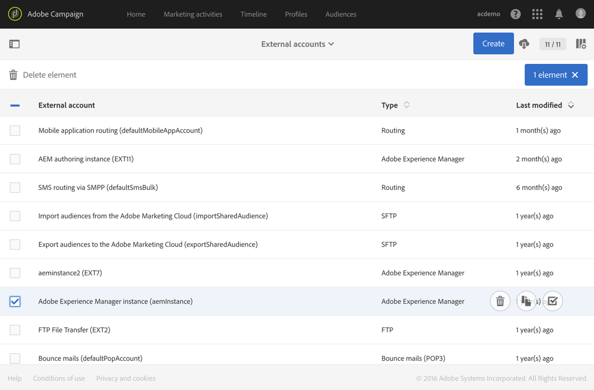

# Integrera med Adobe Campaign Standard{#integrating-with-adobe-campaign-standard}

>[!CAUTION]
>
>AEM 6.4 har nått slutet på den utökade supporten och denna dokumentation är inte längre uppdaterad. Mer information finns i [teknisk supportperiod](https://helpx.adobe.com/support/programs/eol-matrix.html). Hitta de versioner som stöds [här](https://experienceleague.adobe.com/docs/).

>[!NOTE]
>
>I den här dokumentationen beskrivs hur du integrerar AEM med Adobe Campaign Standard, den prenumerationsbaserade lösningen. Om du använder Adobe Campaign 6.1, se [Integrera med Adobe Campaign 6.1](/help/sites-administering/campaignonpremise.md) för dessa instruktioner.

Med Adobe Campaign kan ni hantera e-postinnehåll och formulär direkt i Adobe Experience Manager.

Om du vill använda båda lösningarna samtidigt måste du först konfigurera dem så att de ansluter till varandra. Detta inbegriper konfigurationssteg i både Adobe Campaign och Adobe Experience Manager. Dessa steg beskrivs i detalj i det här dokumentet.

Att arbeta med Adobe Campaign i AEM innefattar möjligheten att skicka e-post och formulär via Adobe Campaign och beskrivs på [Arbeta med Adobe Campaign](/help/sites-authoring/campaign.md).

Dessutom kan följande ämnen vara av intresse vid integrering av AEM med [Adobe Campaign](https://docs.campaign.adobe.com/doc/standard/en/home.html):

* [Bästa tillvägagångssätt för e-postmallar](/help/sites-administering/best-practices-for-email-templates.md)
* [Felsöka integreringen med Adobe Campaign](/help/sites-administering/troubleshooting-campaignintegration.md)

Om du utökar integreringen med Adobe Campaign kanske du vill se följande sidor:

* [Skapa anpassade tillägg](/help/sites-developing/extending-campaign-extensions.md)
* [Skapa anpassade formulärmappningar](/help/sites-developing/extending-campaign-form-mapping.md)

## Konfigurera Adobe Campaign {#configuring-adobe-campaign}

När du konfigurerar Adobe Campaign ingår följande:

1. Konfigurera **aemserver** användare.
1. Skapa ett dedikerat externt konto.
1. Verifierar alternativet AEMResourceTypeFilter.
1. Skapa en dedikerad leveransmall.

>[!NOTE]
>
>För att kunna utföra dessa åtgärder måste du ha **administration** i Adobe Campaign.

### Förutsättningar {#prerequisites}

Kontrollera att du har följande element i förväg:

* [En AEM](/help/sites-deploying/deploy.md#getting-started)
* [En AEM publiceringsinstans](/help/sites-deploying/deploy.md#author-and-publish-installs)
* [En Adobe Campaign-instans](https://docs.adobe.com/content/docs/en/campaign/ACS.html)

>[!CAUTION]
>
>Åtgärder som anges i [Konfigurera Adobe Campaign](#configuring-adobe-campaign) och [Konfigurera Adobe Experience Manager](#configuring-adobe-experience-manager) -avsnitt är nödvändiga för att integreringsfunktionerna mellan AEM och Adobe Campaign ska fungera korrekt.

### Konfigurera eServer-användaren {#configuring-the-aemserver-user}

The **aemserver** -användare måste konfigureras i Adobe Campaign. The **aemserver** är en teknisk användare som kommer att användas för att ansluta AEM till Adobe Campaign.

Gå till **Administration** >  **Användare och säkerhet** >  **Användare** och väljer **aemserver** användare. Klicka på den för att öppna användarinställningarna.

* Du måste ange ett lösenord för den här användaren. Detta kan inte göras via användargränssnittet. Den här konfigurationen måste utföras i REST av en teknisk administratör.
* Du kan tilldela specifika roller till den här användaren, till exempel **deliveryPrepare**, som gör att användaren kan skapa och redigera leveranser.

### Konfigurera ett externt Adobe Experience Manager-konto {#configuring-an-adobe-experience-manager-external-account}

Du måste konfigurera ett externt konto som gör att du kan ansluta Adobe Campaign till din AEM.

>[!NOTE]
>
>I AEM måste du ange lösenordet för kampanjens fjärranvändare. Du måste ange det här lösenordet för att kunna ansluta Adobe Campaign till AEM. Logga in som administratör och i användaradministrationskonsolen, sök efter användaren som är kampanjfjärrmedlem och klicka på **Ange lösenord**.

Så här konfigurerar du ett AEM externt konto:

1. Gå till **Administration** > **Programinställningar** > **Externa konton**.

   

1. Välj standard **aemInstance** externt konto eller skapa ett nytt genom att klicka på **Skapa** -knappen.
1. Välj **Adobe Experience Manager** i **Typ** och ange de åtkomstparametrar som används för AEM. serveradress, kontonamn och lösenord.

   >[!NOTE]
   >
   >Se till att du inte lägger till ett slut **/** snedstreck i slutet av URL:en, annars fungerar inte anslutningen.

1. Se till att **Aktiverad** kryssrutan är markerad och klicka sedan **Spara** för att spara ändringarna.

### Verifiera alternativet AEMResourceTypeFilter {#verifying-the-aemresourcetypefilter-option}

The **AEMResourceTypeFilter** används för att filtrera olika typer av AEM som kan användas i Adobe Campaign. På så sätt kan Adobe Campaign hämta AEM som är särskilt utformade för att endast användas i Adobe Campaign.

Det här alternativet är förkonfigurerat; Men om du ändrar det här alternativet kan det leda till att integreringen inte fungerar.

Verifiera **AEMResourceTypeFilter** är konfigurerat:

1. Gå till **Administration** > **Programinställningar** > **Alternativ**.
1. I listan kan du se till att **AEMResourceTypeFilter** finns med och sökvägarna är korrekta.

### Skapa en AEM specifik mall för e-postleverans {#creating-an-aem-specific-email-delivery-template}

Som standard är AEM inte aktiverat i Adobe Campaign e-postmallar. Du kan konfigurera en ny mall för e-postleverans som ska användas för att skapa e-postmeddelanden med AEM innehåll.

Så här skapar du en AEM e-postspecifik leveransmall:

1. Gå till **Resurser** > **Mallar** > **Leveransmallar**.
1. **Aktivera markering** genom att klicka på bockmarkeringen i åtgärdsfältet och välja den befintliga **Standardmejl (e-post)** standardmall och duplicera den sedan genom att klicka på **Kopiera** ikon och klicka **Bekräfta**.
1. Inaktivera markeringsläget genom att klicka på knappen **x** och öppna den nyskapade **Copy of Standard email (mail)** mall och välj sedan **Redigera egenskaper** i åtgärdsfältet på mallkontrollpanelen.

   Du kan ändra mallens **Etikett**.

1. I egenskaperna **Innehåll** -avsnittet, ändra **Innehållskälla** till **Adobe Experience Manager**. Välj sedan det externa kontot som skapades tidigare och klicka på **Bekräfta**.

   Spara ändringarna genom att klicka **Bekräfta** och klicka **Spara.**

   E-postleveranser som skapas från den här mallen kommer att ha funktionen AEM innehåll aktiverad.

   

## Konfigurera Adobe Experience Manager {#configuring-adobe-experience-manager}

För att konfigurera AEM måste du göra följande:

* Konfigurera replikering mellan instanser.
* Anslut AEM till Adobe Campaign.
* Konfigurera externaliseraren.

### Konfigurera replikering mellan AEM instanser {#configuring-replication-between-aem-instances}

Innehåll som skapas från AEM-författarinstansen skickas först till publiceringsinstansen. Den här publiceringsinstansen överför sedan innehållet till Adobe Campaign. Replikeringsagenten måste därför konfigureras att replikera från AEM till den AEM publiceringsinstansen.

>[!NOTE]
>
>Om du inte vill använda replikerings-URL:en utan i stället använda den offentliga URL:en kan du ange **Offentlig URL** i följande konfigurationsinställning i OSGi (**verktyg** > **Webbkonsol** > **OSGi Configuration > AEM Campaign Integration - Configuration**):
**Offentlig URL:** com.day.cq.mcm.campaign.impl.IntegrationConfigImpl#aem.mcm.campaign.publicUrl

Det här steget är också nödvändigt för att replikera vissa redigeringsinstanskonfigurationer till publiceringsinstansen.

Så här konfigurerar du replikering mellan AEM instanser:

1. Välj **AEM logotyp**> **Verktyg **ikon > **Distribution** > **Replikering** > **Agenter på författare** och sedan klicka **Standardagent**.

   

   >[!NOTE]
   Undvik att använda localhost (d.v.s. en lokal kopia av AEM) när du konfigurerar integreringen med Adobe Campaign, såvida inte både publicerings- och författarinstansen finns på samma dator.

1. Klicka **Redigera** väljer du **Transport** -fliken.
1. Konfigurera URI genom att ersätta **localhost** med IP-adressen eller adressen till den AEM publiceringsinstansen.

   

### Ansluta AEM till Adobe Campaign {#connecting-aem-to-adobe-campaign}

Innan ni kan använda AEM och Adobe Campaign tillsammans måste ni etablera en länk mellan båda lösningarna så att de kan kommunicera.

1. Anslut till AEM.
1. Välj **verktyg** > **Operationer** > **Cloud** > **Cloud Services** sedan **Konfigurera nu** i Adobe Campaign.

   

1. Skapa en ny konfiguration genom att ange en **Titel** och klicka **Skapa** eller välj den befintliga konfiguration som du vill länka till din Adobe Campaign-instans.
1. Redigera konfigurationen så att den matchar parametrarna för din Adobe Campaign-instans.

   * **Användarnamn**: **aemserver**, som används av paketoperatorn Adobe Campaign AEM Integration för att skapa länken mellan de två lösningarna.
   * **Lösenord**: Lösenord för operatorn Adobe Campaign aemserver. Du kan behöva ange lösenordet för den här operatorn igen direkt i Adobe Campaign.
   * **API-slutpunkt**: Adobe Campaign instans-URL.

1. Välj **Anslut till Adobe Campaign** och klicka **OK**.

   

   >[!NOTE]
   Efter [skapa e-post och publicera den](/help/sites-authoring/campaign.md)måste du publicera konfigurationen på nytt på din publiceringsinstans.

   

>[!NOTE]
Om anslutningen misslyckas kontrollerar du följande:
* Du kan stöta på ett certifikatproblem när du använder en säker anslutning till en Adobe Campaign-instans (https). Du måste lägga till Adobe Campaign-instanscertifikatet till **cacerts **filen i JDK:n.
* Se även [Felsöka din integrering med AEM/Adobe Campaign](/help/sites-administering/troubleshooting-campaignintegration.md).
>

### Konfigurera externaliseraren {#configuring-the-externalizer}

Du måste [konfigurera externaliseraren](/help/sites-developing/externalizer.md) i AEM på din författarinstans. Externalizer är en OSGi-tjänst som gör att du kan omvandla en resurssökväg till en extern och absolut URL. Den här tjänsten tillhandahåller en central plats för att konfigurera dessa externa URL:er och skapa dem.

Se [Konfigurera externaliseraren](/help/sites-developing/externalizer.md) för allmänna instruktioner. Kontrollera att du har konfigurerat publiceringsservern på `https://<host>:<port>/system/console/configMgr/com.day.cq.commons.impl.ExternalizerImpl` inte peka på `localhost:4503` till en server som kan nås av Adobe Campaign-konsolen.

Om den pekar på `localhost:4503` eller någon annan server som Adobe Campaign inte kan nå visas inte bilderna på Adobe Campaign-konsolen.

