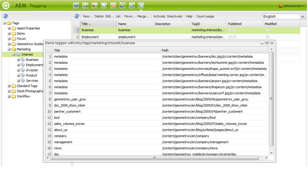

# Klassiskt gränssnitt, taggningskonsol{#classic-ui-tagging-console}

>[!CAUTION]
>
>AEM 6.4 har nått slutet på den utökade supporten och denna dokumentation är inte längre uppdaterad. Mer information finns i [teknisk supportperiod](https://helpx.adobe.com/support/programs/eol-matrix.html). Hitta de versioner som stöds [här](https://experienceleague.adobe.com/docs/).

Det här avsnittet gäller för den klassiska UI-taggningskonsolen.

Den pekoptimerade UI-taggningskonsolen är [här](/help/sites-administering/tags.md#tagging-console).

Så här kommer du åt konsolen Klassisk UI-taggning:

* on author
* logga in med administratörsbehörighet
* bläddra till konsolen

   till exempel [http://localhost:4502/tagging](http://localhost:4502/tagging)

## Skapa taggar och namnutrymmen {#creating-tags-and-namespaces}

1. Beroende på vilken nivå du börjar på kan du skapa en tagg eller ett namnutrymme med **Nytt**:

   Om du väljer **Taggar** du kan skapa ett namnutrymme:

   

   Om du väljer ett namnutrymme (till exempel **Demo**) kan du skapa en tagg i det namnutrymmet:

   

1. I båda fallen anger du

   * **Titel**
(
*Obligatoriskt*) Visningsrubriken för taggen. Alla tecken kan anges

      vi rekommenderar att du inte använder följande specialtecken:

      * `colon (:)` - namnutrymmesavgränsare
      * `forward slash (/)` - avgränsare för undertagg

      Dessa tecken visas inte om de anges.

   * **Namn**

      (*Obligatoriskt*) Taggens nodnamn.

   * **Beskrivning**

      (*Valfritt*) En beskrivning av taggen.

   * välj **Skapa**

## Redigera taggar {#editing-tags}

1. Markera den tagg som du vill redigera i den högra rutan.
1. Klicka **Redigera**.
1. Du kan ändra **Titel** och **Beskrivning**.
1. Klicka **Spara** för att stänga dialogrutan.

## Ta bort taggar {#deleting-tags}

1. Markera den tagg som du vill ta bort i den högra rutan.
1. Klicka **Ta bort**.
1. Klicka **Ja** för att stänga dialogrutan.

   Taggen ska inte längre listas.

## Aktivera och inaktivera taggar {#activating-and-deactivating-tags}

1. I den högra rutan markerar du namnutrymmet eller taggen som du vill aktivera (publicera) eller inaktivera (avpublicera).
1. Klicka **Aktivera** eller **Inaktivera** efter behov.

## Lista - visa var taggar refereras {#list-showing-where-tags-are-referenced}

**Lista** öppnar ett nytt fönster som visar sökvägarna för alla sidor som använder den markerade taggen:

## Flytta taggar {#moving-tags}

För att tagga administratörer och utvecklare så att de kan rensa taxonomin eller byta namn på ett tagg-ID kan du flytta en tagg till en ny plats:

1. Öppna **Taggning** konsol.
1. Markera taggen och klicka på **Flytta...** i det övre verktygsfältet (eller på snabbmenyn).
1. I **Flytta tagg** dialogruta, definiera:

   * **till**, målnoden.
   * **Byt namn till**, det nya nodnamnet.

1. Klicka **Flytta**.

The **Flytta tagg** ser ut så här:

>[!NOTE]
>
>Författare bör inte flytta taggar eller byta namn på ett tagg-ID. Vid behov bör författare endast [ändra taggtitlar](#editing-tags).

## Sammanfoga taggar {#merging-tags}

Du kan använda sammanfogningstaggar när en taxonomi har dubbletter. När tagg A sammanfogas med tagg B kommer alla sidor som taggas med tagg A att taggas med tagg B och tagg A är inte längre tillgängliga för författare.

Så här sammanfogar du en tagg till en annan:

1. Öppna **Taggning** konsol.
1. Markera taggen och klicka på **Sammanfoga...** i det övre verktygsfältet (eller på snabbmenyn).
1. I **Sammanfoga tagg** dialogruta, definiera:

   * **till**, målnoden.

1. Klicka **Sammanfoga**.

The **Sammanfoga tagg** ser ut så här:

## Räknar användning av taggar {#counting-usage-of-tags}

Så här ser du hur många gånger en tagg används:

1. Öppna **Taggning** konsol.
1. Klicka **Räkna användning** i det övre verktygsfältet: i kolumnen Antal visas resultatet.

## Hantera taggar på olika språk {#managing-tags-in-different-languages}

Valfritt `title`-egenskapen för en tagg kan översättas till flera språk. Tagg `titles` kan sedan visas enligt användarspråk eller sidspråk.

### Definiera taggtitlar på flera språk {#defining-tag-titles-in-multiple-languages}

Följande procedur visar hur du översätter `title`för -taggen **Djur** till engelska, tyska och franska:

1. Gå till **Taggning** konsol.
1. Redigera taggen **Djur** nedan **Taggar** > **Arkivfotografier**.
1. Lägg till översättningarna på följande språk:

   * **Engelska**: Djur
   * **Tyska**: Tiere
   * **Franska**: Animaux

1. Spara ändringarna.

Dialogrutan ser ut så här:

Taggningskonsolen använder språkinställningen för användaren, så för taggen Animal visas Animaux för en användare som anger språket som franska i användaregenskaperna.

Se avsnittet om du vill lägga till ett nytt språk i dialogrutan [Lägga till ett nytt språk i dialogrutan Redigera tagg](/help/sites-developing/building.md#adding-a-new-language-to-the-edit-tag-dialog) i **Tagga för utvecklare** -avsnitt.

### Visa taggtitlar i Sidegenskaper på ett visst språk {#displaying-tag-titles-in-page-properties-in-a-specified-language}

Som standard är taggen `titles`i sidegenskaperna visas på sidspråket. Dialogrutan Tagg i sidegenskaperna har ett språkfält som gör att taggen kan visas `titles`på ett annat språk. Följande procedur beskriver hur du visar taggen `titles`på franska:

1. Se föregående avsnitt för att lägga till den franska översättningen i **Djur** nedan **Taggar** > **Arkivfotografier**.
1. Öppna sidegenskaperna för **Produkter** på den engelska delen av **Geometrixx** webbplats.
1. Öppna **Taggar/nyckelord** (genom att välja den nedrullningsbara menyn till höger om visningsområdet Taggar/Nyckelord) och välja **Franska** i listrutan längst ned till höger.
1. Rulla med vänster-/högerpilarna tills du kan markera **Arkivfotografier** tab

   Välj **Djur** (**Animaux**) och markera utanför dialogrutan för att stänga den och lägga till taggen i sidegenskaperna.

   

Som standard visas taggen i dialogrutan Sidegenskaper `titles`enligt sidspråket.

I allmänhet hämtas taggens språk från sidspråket om sidspråket är tillgängligt. När [taggwidget](/help/sites-developing/building.md#tagging-on-the-client-side) används i andra fall (t.ex. i formulär eller i dialogrutor), beror taggspråket på sammanhanget.

>[!NOTE]
>
>Taggen cloud och meta-nyckelorden i standardsidkomponenten använder den lokaliserade taggen `titles`baserat på sidspråket, om tillgängligt.
