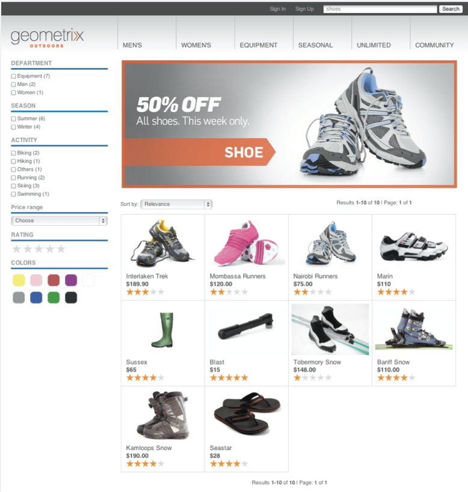

# eCommerce{#ecommerce}

* [Concepts](/help/sites-administering/concepts.md)
* [Administrering (allmän)](/help/sites-administering/generic.md)
* [SAP Commerce Cloud](/help/sites-administering/sap-commerce-cloud.md)
* [Salesforce Commerce Cloud](https://github.com/adobe/commerce-salesforce)
* [Magento](https://www.adobe.io/apis/experiencecloud/commerce-integration-framework/integrations.html#!AdobeDocs/commerce-cif-documentation/master/integrations/02-AEM-Magento.md)

Adobe tillhandahåller två versioner av Commerce Integration Framework:

|  | CIF lokal | CIF Cloud |
|-------------------------|--------------------------------------------------------------------------------------------------------------------------------------------------------------------------------------------------------|------------------------------------------------------------------------------------------------------------------------|
| AEM | AEM på plats eller AMS 6.x | AEM AMS 6.4 och 6.5 |
| Back-end | - AEM, Java   - Monolitisk integrering, mappning före bygge (mall)  - JCR-databas | - Magento  - Java och Javascript  - Inga handelsdata lagras i JCR-databasen |
| Front-end | AEM återgivna sidor på serversidan | Blandat sidprogram (hybridåtergivning) |
| Produktkatalog | - Produktimport, redigerare, cachelagring i AEM  - Vanliga kataloger med AEM- eller proxysidor | - Ingen produktimport  - Allmänna mallar  - On demand-data via anslutning |
| Skalbarhet | - Kan stödja upp till ett fåtal miljoner produkter (beroende på användningsfall)   - Cachelagring av Dispatcher | - Ingen volymbegränsning  - Cachelagring på Dispatcher eller CDN |
| Standardiserad datamodell | Nej | Ja, Magento GraphQL-schema |
| Tillgänglighet | Ja:  - SAP Commerce Cloud (tillägget har uppdaterats för att stödja AEM 6.4 och Hybris 5 (standard) och bibehåller kompatibiliteten med Hybris 4  - Salesforce Commerce Cloud (Connector open-sourced to support AEM 6.4) | Ja via öppen källkod via GitHub.   Magento Commerce (Stöder Magento 2.3.2 (standard) och är kompatibelt med Magento 2.3.1). |
| När ska användas | Begränsad användning: För scenarier där små, statiska kataloger kan behöva importeras | Rekommenderad lösning i de flesta fall |

eCommerce hanterar tillsammans med Product Information Management (PIM) verksamheten på en webbplats som är inriktad på att sälja produkter via en webbutik:

* En produkts generering, livstid och föråldring
* Prishantering
* Transaktionshantering
* Hantering av hela kataloger
* Live och centraliserad lagringspost
* Webbgränssnitt

AEM e-handel hjälper marknadsförare att leverera varumärkesanpassade, personaliserade shoppingupplevelser på webben, i mobilen och via sociala kontaktytor. I AEM kan du anpassa sidor och komponenter baserat på målgruppskontext och försäljningsstrategier. till exempel:

* Produktsidor
* Kundvagnskomponenter
* Utcheckningskomponenter

Implementeringen ger åtkomst i realtid till produktinformation. Detta kan användas för att framtvinga:

* Produktinformationsintegritet
* Priser
* Lager
* Variationer i kundvagnens status

>[!NOTE]
>
>Om du vill använda integreringsramverket med externa e-handelsleverantörer måste du först installera de paket som krävs. Mer information finns i [Distribuera e-handel](/help/sites-deploying/ecommerce.md).
>
>Mer information om hur du utökar e-handelsfunktionerna finns i [Utveckla e-handeln](/help/sites-developing/ecommerce.md).

## Huvudfunktioner {#main-features}

AEM eCommerce tillhandahåller:

* Ett antal **färdiga AEM** för att illustrera vad du kan göra med ditt projekt:

   * Produktvisning
   * Kundvagn
   * Checka ut
   * Nyligen visade produkter
   * Vouchers
   * och andra

   

   >[!NOTE]
   >
   >Integreringsramverket som AEM tillhandahåller gör det även möjligt att skapa ytterligare AEM komponenter för handelsfunktioner oberoende av din specifika e-handelsmotor.

* **Sök** - med antingen:

   * AEM
   * sökningen i e-handelssystemet
   * en tredje parts sökning
   * eller en kombination av dessa.

   

* Använder AEM möjlighet att **presentera innehållet i flera kanaler**, vara hela webbläsarfönstret eller den mobila enheten. Detta levererar innehållet i det format som besökarna behöver.

   

* Möjlighet att **utveckla er egen integrationsimplementering baserat på [AEM eCommerce Framework](#the-framework)**.

   De två implementeringar som är tillgängliga för närvarande är båda byggda på samma grund - utöver det allmänna API:t (ramverket). Implementering av en ny integrering innebär bara implementering av de funktioner som din integrering behöver. Front end-komponenter kan användas av alla nya implementeringar när de använder gränssnitt (så är oberoende av implementeringen).

* Möjligheten att utveckla **upplevelsestyrd e-handel baserad på kunddata och -aktivitet**. På så sätt kan du förverkliga många scenarier:

   * Ett exempel kan vara minskade fraktkostnader när den totala ordern överstiger ett visst belopp.
   * Ett annat kan göra att du kan erbjuda säsongserbjudanden som använder profildata (t.ex. plats). Dessa kan sedan markeras ytterligare, beroende på andra faktorer vid behov.

   I exemplet nedan visas en teaser eftersom innehållet i vagnen är mindre än $75:

   

   Detta kan ändras när innehållet i kundvagnen överstiger $75:

   

* Och andra funktioner:

   * Kundvagnsinnehåll behålls mellan sessioner
   * Full orderhistorik
   * Express catalog update

## Ramverket {#the-framework}

The [Concepts](/help/sites-administering/concepts.md) -avsnittet innehåller mer detaljerad information om ramverket, men följande ger en snabb översikt av ramverket på hög nivå:

### Vad? {#what}

* Integreringsramverket innehåller API:t, en rad komponenter som illustrerar funktioner och flera tillägg som ger exempel på anslutningsmetoder.
* Ramverket innehåller den grundläggande struktur som krävs för en projektimplementering.
* Ramverket är utökningsbart.
* I ramverket finns ingen användbar och färdig webbplats. En viss del av utvecklingsarbetet behövs alltid för att anpassa ramverket till dina specifikationer.

### Varför? {#why}

* Att tillhandahålla de grundläggande mekanismer som behövs för att snabbt realisera en anpassad e-handelsplats.
* Tp ger den flexibilitet som krävs för att utveckla en e-handelsplats i verkligheten.
* Illustrera metodtips.
