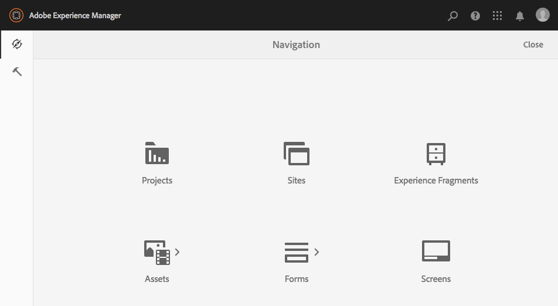

# Admin Consoles{#admin-consoles}

Som standard har möjligheten att växla till det klassiska användargränssnittet via administratörskonsolerna inaktiverats. Därför visas inte längre de popup-ikoner som visades när användaren placerade musen över vissa konsolikoner, vilket ger åtkomst till det klassiska gränssnittet.

Alla konsoler som har en klassisk användargränssnittsversion i `/libs/cq/core/content/nav` kan återaktiveras individuellt så att alternativet **Klassiskt användargränssnitt** visas igen över konsolikonen när användaren för musen över den.

I det här exemplet återaktiverar vi det klassiska gränssnittet för webbplatskonsolen.

1. Använd CRXDE Lite för att hitta noden som motsvarar administrationskonsolen som du vill återaktivera det klassiska användargränssnittet för. De finns under:

   `/libs/cq/core/content/nav`

   Exempel

   [ `http://localhost:4502/crx/de/index.jsp#/libs/cq/core/content/nav`](http://localhost:4502/crx/de/index.jsp#/libs/cq/core/content/nav)

1. Markera noden som motsvarar konsolen som du vill återaktivera det klassiska användargränssnittet för. Vi kommer till exempel att återaktivera det klassiska användargränssnittet för webbplatskonsolen.

   `/libs/cq/core/content/nav/sites`

1. Skapa en övertäckning med alternativet **Överläggsnod** ; till exempel:

   * **Sökväg**: `/apps/cq/core/content/nav/sites`
   * **Överläggsplats**: `/apps/`
   * **Matcha nodtyper**: aktiv (markera kryssrutan)

1. Lägg till följande boolesk egenskap till den överlagrade noden:

   `enableDesktopOnly = {Boolean}true`

1. Alternativet **Klassiskt användargränssnitt** är igen tillgängligt som ett poseralternativ i Admin Console.

   

Upprepa dessa steg för varje konsol som du vill återaktivera åtkomst till den klassiska användargränssnittsversionen för.
