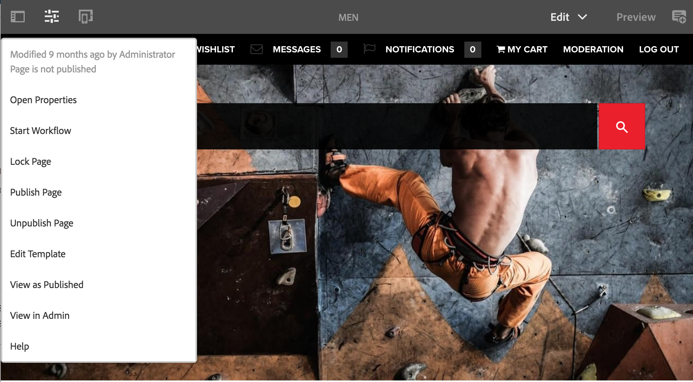

# Redigerare{#editor}

>[!CAUTION]
>
>AEM 6.4 har nått slutet på den utökade supporten och denna dokumentation är inte längre uppdaterad. Mer information finns i [teknisk supportperiod](https://helpx.adobe.com/support/programs/eol-matrix.html). Hitta de versioner som stöds [här](https://experienceleague.adobe.com/docs/).

Som standard har möjligheten att växla till det klassiska användargränssnittet från redigeraren inaktiverats.

Aktivera alternativet igen **Öppna i Classic UI** i **Sidinformation** gör du så här.

1. Använd CRXDE Lite för att hitta följande nod:

   `/libs/wcm/core/content/editor/jcr:content/content/items/content/header/items/headerbar/items/pageinfopopover/items/list/items/classicui`

   Till exempel

   `http://localhost:4502/crx/de/index.jsp#/libs/wcm/core/content/editor/jcr%3Acontent/content/items/content/header/items/headerbar/items/pageinfopopover/items/list/items/classicui](http://localhost:4502/crx/de/index.jsp#/libs/wcm/core/content/editor/jcr%3Acontent/content/items/content/header/items/headerbar/items/pageinfopopover/items/list/items/classicui`

1. Skapa en övertäckning med **Överläggsnod** option; till exempel:

   * **Bana**: `/apps/wcm/core/content/editor/jcr:content/content/items/content/header/items/headerbar/items/pageinfopopover/items/list/items/classicui`
   * **Överläggsplats**: `/apps/`
   * **Matcha nodtyper**: aktiv (markera kryssrutan)

1. Lägg till följande text-egenskap med flera värden i den åsidosatta noden:

   `sling:hideProperties = ["granite:hidden"]`

1. The **Öppna i Classic UI** finns igen i **Sidinformation** när du redigerar sidor.

   
