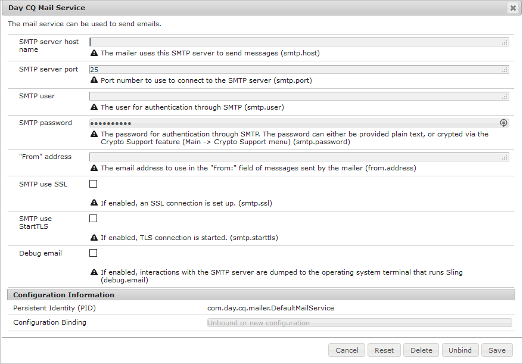

# Konfigurerar e-postmeddelande{#configuring-email-notification}

>[!CAUTION]
>
>AEM 6.4 har nått slutet på den utökade supporten och denna dokumentation är inte längre uppdaterad. Mer information finns i [teknisk supportperiod](https://helpx.adobe.com/support/programs/eol-matrix.html). Hitta de versioner som stöds [här](https://experienceleague.adobe.com/docs/).

AEM skickar e-postmeddelanden till användare som:

* Prenumerera på sidhändelser, t.ex. ändring eller replikering. The [Inkorgen för meddelanden](/help/sites-classic-ui-authoring/author-env-inbox.md#subscribing-to-notifications) I beskrivs hur du prenumererar på sådana händelser.

* Prenumerera på forumevent.
* Måste utföra ett steg i ett arbetsflöde. The [Deltagarsteg](/help/sites-developing/workflows-step-ref.md#participant-step) beskriver hur du aktiverar e-postmeddelanden i ett arbetsflöde.

Krav:

* Användaren/användarna måste ha en giltig e-postadress definierad i profilen.
* The **Dagens CQ-posttjänst** måste konfigureras korrekt.

När en användare meddelas får han eller hon ett e-postmeddelande på det språk som definieras i hans profil. Varje språk har en egen mall som kan anpassas. Nya e-postmallar kan läggas till för nya språk.

>[!NOTE]
>
>När du arbetar med AEM finns det flera metoder för att hantera konfigurationsinställningarna för sådana tjänster. se [Konfigurerar OSGi](/help/sites-deploying/configuring-osgi.md) om du vill ha mer information och rekommenderade rutiner.

## Konfigurera e-posttjänsten {#configuring-the-mail-service}

För AEM kunna skicka e-post **Dagens CQ-posttjänst** måste konfigureras korrekt. Du kan visa konfigurationen i webbkonsolen. När du arbetar med AEM finns det flera metoder för att hantera konfigurationsinställningarna för sådana tjänster. se [Konfigurerar OSGi](/help/sites-deploying/configuring-osgi.md) om du vill ha mer information och rekommenderade rutiner.

Följande begränsningar gäller:

* The **SMTP-serverport** måste vara 25 eller högre.

* The **Värdnamn för SMTP-server** får inte vara tomt.
* The **&quot;Från&quot;-adress** får inte vara tomt.

Så här felsöker du ett problem med **Dagens CQ-posttjänst** kan du titta på loggarna för tjänsten:

`com.day.cq.mailer.DefaultMailService`

Konfigurationen ser ut så här i webbkonsolen:



## Konfigurera e-postmeddelandekanalen {#configuring-the-email-notification-channel}

När du prenumererar på en sida eller ett forum-event-meddelande anges e-postadressen till `no-reply@acme.com` som standard. Du kan ändra det här värdet genom att konfigurera **E-postkanal för avisering** i webbkonsolen.

Om du vill konfigurera från-e-postadressen lägger du till en `sling:OsgiConfig` till databasen. Använd följande procedur för att lägga till noden direkt med CRXDE Lite:

1. Lägg till en mapp med namnet i CRXDE Lite `config` nedanför din programmapp.
1. Lägg till en nod med namnet:

   `com.day.cq.wcm.notification.email.impl.EmailChannel` av typen `sling:OsgiConfig`

1. Lägg till en `String` egenskap till noden med namnet `email.from`. Ange den e-postadress som du vill använda som värde.

1. Klicka **Spara alla**.

Använd följande procedur för att definiera noden i innehållspaketets källmappar:

1. I `jcr_root/apps/*app_name*/config folder`, skapa en fil med namnet `com.day.cq.wcm.notification.email.impl.EmailChannel.xml`

1. Lägg till följande XML för att representera noden:

   `<?xml version="1.0" encoding="UTF-8"?> <jcr:root xmlns:sling="https://sling.apache.org/jcr/sling/1.0" xmlns:jcr="https://www.jcp.org/jcr/1.0" jcr:primaryType="sling:OsgiConfig" email.from="name@server.com"/>`
1. Ersätt värdet för `email.from` attribute ( `name@server.com`) med din e-postadress.

1. Spara filen.

## Konfigurera e-postmeddelandetjänsten för arbetsflöde {#configuring-the-workflow-email-notification-service}

När du får e-postmeddelanden om arbetsflöden anges standardvärden för både from-email-adressen och värd-URL-prefixet. Du kan ändra dessa värden genom att konfigurera **Day CQ Workflow Email Notification Service** i webbkonsolen. Om du gör det bör du behålla ändringen i databasen.

Standardkonfigurationen ser ut så här i webbkonsolen:


### E-postmallar för sidmeddelanden {#email-templates-for-page-notification}

E-postmallar för sidmeddelanden finns nedan:

`/libs/settings/notification-templates/com.day.cq.wcm.core.page`

Standardmallen för engelska ( `en.txt`) definieras enligt följande:

```xml
subject=[CQ Page Event Notification]: Page Event

header=-------------------------------------------------------------------------------------\n \
Time: ${time}\n \
User: ${userFullName} (${userId})\n \
-------------------------------------------------------------------------------------\n\n

message=The following pages were affected by the event: \n \
 \n \
${modifications} \n \
 \n\n
footer=\n \
-------------------------------------------------------------------------------------\n \
This is an automatically generated message. Please do not reply.
```

#### Anpassa e-postmallar för sidmeddelanden {#customizing-email-templates-for-page-notification}

Så här anpassar du den engelska e-postmallen för sidmeddelanden:

1. Öppna filen i CRXDE:

   `/libs/settings/notification-templates/com.day.cq.wcm.core.page/en.txt`

1. Ändra filen efter dina behov.
1. Spara ändringarna.

Mallen måste ha följande format:

```
 subject=<text_1>
 header=<text_2>
 message=<text_3>
 footer=<text_4>
```

Plats &lt;text_x> kan vara en blandning av statisk text och dynamiska strängvariabler. Följande variabler kan användas i e-postmallen för sidmeddelanden:

* `${time}`, händelsens datum och tid.

* `${userFullName}`, det fullständiga namnet på den användare som utlöste händelsen.

* `${userId}`, ID:t för den användare som utlöste händelsen.
* `${modifications}`, beskriver sidhändelsens typ och sidsökvägen i formatet:

   &lt;page event=&quot;&quot; type=&quot;&quot;> => &lt;page path=&quot;&quot;>

   Till exempel:

   PageModified => /content/geometrixx/en/products

### E-postmallar för forummeddelanden {#email-templates-for-forum-notification}

E-postmallar för forummeddelanden finns under:

`/etc/notification/email/default/com.day.cq.collab.forum`

Standardmallen för engelska ( `en.txt`) definieras enligt följande:

```xml
subject=[CQ Forum Notification]

header=-------------------------------------------------------------------------------------\n \
Time: Time: ${time}\n \
Forum Page Path: ${forum.path}\n \
-------------------------------------------------------------------------------------\n\n

message=Page: ${host.prefix}${forum.path}.html\n

footer=\n \
-------------------------------------------------------------------------------------\n \
This is an automatically generated message. Please do not reply.
```

#### Anpassa e-postmallar för forummeddelanden {#customizing-email-templates-for-forum-notification}

Så här anpassar du den engelska e-postmallen för forummeddelanden:

1. Öppna filen i CRXDE:

   `/etc/notification/email/default/com.day.cq.collab.forum/en.txt`

1. Ändra filen efter dina behov.
1. Spara ändringarna.

Mallen måste ha följande format:

```
 subject=<text_1>
 header=<text_2>
 message=<text_3>
 footer=<text_4>
```

Plats `<text_x>` kan vara en blandning av statisk text och dynamiska strängvariabler.

Följande variabler kan användas i e-postmallen för forummeddelanden:

* `${time}`, händelsens datum och tid.

* `${forum.path}`, vägen till forumsidan.

### E-postmallar för arbetsflödesmeddelanden {#email-templates-for-workflow-notification}

E-postmallen för arbetsflödesmeddelanden (engelska) finns på:

`/libs/settings/workflow/notification/email/default/en.txt`

Den definieras enligt följande:

```xml
subject=Workflow notification: ${event.EventType}

header=-------------------------------------------------------------------------------------\n \
Time: ${event.TimeStamp}\n \
Step: ${item.node.title}\n \
User: ${participant.name} (${participant.id})\n \
Workflow: ${model.title}\n \
-------------------------------------------------------------------------------------\n\n

message=Content: ${host.prefix}${payload.path.open}\n

footer=\n \
-------------------------------------------------------------------------------------\n \
View the overview in your ${host.prefix}/aem/inbox\n \
-------------------------------------------------------------------------------------\n \
This is an automatically generated message. Please do not reply.
```

#### Anpassa e-postmallar för arbetsflödesmeddelanden {#customizing-email-templates-for-workflow-notification}

Så här anpassar du den engelska e-postmallen för meddelanden om arbetsflödeshändelser:

1. Öppna filen i CRXDE:

   `/libs/settings/workflow/notification/email/default/en.txt`

1. Ändra filen efter dina behov.
1. Spara ändringarna.

Mallen måste ha följande format:

```
subject=<text_1>
 header=<text_2>
 message=<text_3>
 footer=<text_4>
```

>[!NOTE]
>
>Plats `<text_x>` kan vara en blandning av statisk text och dynamiska strängvariabler. Varje rad i en `<text_x>` objektet måste avslutas med ett omvänt snedstreck ( `\`), förutom för den sista förekomsten, när frånvaron av omvänt snedstreck anger slutet på `<text_x>` strängvariabel.
>
>Mer information om mallformatet finns i [javadocs för Properties.load()](https://docs.oracle.com/javase/8/docs/api/java/util/Properties.html#load-java.io.InputStream-) -metod.

Metoden `${payload.path.open}` visar sökvägen till arbetsobjektets nyttolast. För en sida i Sites händer sedan `payload.path.open` skulle likna `/bin/wcmcommand?cmd=open&path=…`.; det här är utan servernamnet, vilket är orsaken till att mallen anger det här med `${host.prefix}`.

Följande variabler kan användas i e-postmallen:

* `${event.EventType}`, händelsens typ
* `${event.TimeStamp}`, datum och tid för händelsen
* `${event.User}`, den användare som utlöste händelsen
* `${initiator.home}`, initierarnodens sökväg

* `${initiator.name}`, initierarnamnet

* `${initiator.email}`, initierarens e-postadress
* `${item.id}`, arbetsuppgiftens ID
* `${item.node.id}`, ID för noden i arbetsflödesmodellen som är kopplad till det här arbetsobjektet
* `${item.node.title}`, arbetsuppgiftens titel
* `${participant.email}`, deltagarens e-postadress
* `${participant.name}`, deltagarens namn
* `${participant.familyName}`, deltagarens familjenamn
* `${participant.id}`, deltagarens id
* `${participant.language}`, deltagarspråket
* `${instance.id}`, arbetsflödes-ID
* `${instance.state}`, arbetsflödets status
* `${model.title}`, arbetsflödesmodellens titel
* `${model.id}`, ID:t för arbetsflödesmodellen

* `${model.version}`, arbetsflödesmodellens version
* `${payload.data}`, nyttolasten

* `${payload.type}`, nyttolasttypen
* `${payload.path}`, nyttolastens sökväg
* `${host.prefix}`, värdprefix, t.ex.: http://localhost:4502

### Lägga till en e-postmall för ett nytt språk {#adding-an-email-template-for-a-new-language}

Så här lägger du till en mall för ett nytt språk:

1. Lägg till en fil i CRXDE `<language-code>.txt` nedan:

   * `/libs/settings/notification-templates/com.day.cq.wcm.core.page` : för sidmeddelanden
   * `/etc/notification/email/default/com.day.cq.collab.forum` : för forummeddelanden
   * `/libs/settings/workflow/notification/email/default` : för arbetsflödesmeddelanden

1. Anpassa filen till språket.
1. Spara ändringarna.

>[!NOTE]
>
>The `<language-code>` som används som filnamn för e-postmallen måste vara en språkkod med två bokstäver och gemener som känns igen av AEM. För språkkoder använder AEM ISO-639-1.

## Konfigurera e-postmeddelanden från AEM Assets {#assetsconfig}

När samlingar i AEM Assets delas eller inte delas kan användare få e-postmeddelanden från AEM. Följ de här stegen för att konfigurera e-postmeddelanden.

1. Konfigurera e-posttjänsten enligt beskrivningen ovan i [Konfigurera e-posttjänsten](/help/sites-administering/notification.md#configuring-the-mail-service).
1. Logga in AEM som administratör. Klicka **verktyg** >  **Operationer** >  **Webbkonsol** för att öppna Konfiguration av webbkonsol.
1. Redigera **Day CQ DAM Resource Collection Service**. Välj **skicka e-post**. Klicka **Spara**.
