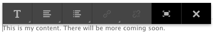

# Configure the Rich Text Editor {#configure-the-rich-text-editor}

Med textredigeraren får författarna ett stort antal funktioner för redigering av textinnehåll. Ikoner, markeringsrutor, verktygsfält och menyer finns för WYSIWYG-textredigering.

RTE kan konfigureras för att aktivera, inaktivera och utöka de funktioner som är tillgängliga i redigeringskomponenterna. Mer information om hur du använder RTE-funktioner för redigering finns i [Använda RTF-redigerare för redigering](/help/sites-authoring/rich-text-editor.md).

Följande arbetsflöde visar den rekommenderade ordningen för att slutföra RTE-konfigurationsuppgifterna.


**** Bild: *Vanligt arbetsflöde för att konfigurera RTF-redigeraren*

## Förstå användargränssnittet med pekskärmsfunktioner och det klassiska användargränssnittet {#understand-touch-enabled-ui-and-classic-ui}

Det användargränssnitt som har stöd för pekskärm är standardgränssnittet för AEM. Adobe introducerade Touch UI med [responsiv design](/help/sites-authoring/responsive-layout.md) för redigeringsmiljön i version 5.6.Touchgränssnittet är utformat för enheter med pekskärm och stationära datorer. Gränssnittet skiljer sig avsevärt från det ursprungliga klassiska användargränssnittet.


**** Bild: Verktygsfältet *RTF-redigerare i det pekaktiverade användargränssnittet*


**** Bild: Verktygsfältet *RTF-redigerare i det klassiska användargränssnittet*

**Se även**:

* [Gränssnittsrekommendationer](/help/sites-deploying/ui-recommendations.md)
* Information om hur du ersätter det klassiska användargränssnittet finns i [Versionsinformation för AEM 6.4](/help/release-notes/deprecated-removed-features.md)
* Skillnaden mellan användargränssnitten finns i [Touch-gränssnittet och det klassiska användargränssnittet](https://aemcq5pedia.wordpress.com/2018/01/05/touch-enabled-ui-aem6-3/)
* Mer information om användargränssnittet med pekfunktioner finns i [avsnittet om användargränssnittet i AEM Touch](/help/sites-developing/touch-ui-concepts.md)

## Olika redigeringslägen {#editingmodes}

Författare kan skapa och redigera textinnehåll i AEM med hjälp av de olika komponentlägena. Alternativen i verktygsfältet för att skapa och formatera innehåll och användarupplevelsen i komponenter med RTE-funktioner i olika redigeringslägen varierar beroende på RTE-konfigurationer.

<table> 
 <tbody> 
  <tr> 
   <th>Redigeringsläge</th> 
   <th>Redigeringsområde</th> 
   <th>Rekommenderade funktioner som ska aktiveras<br /> </th> 
   <th>Pekgränssnitt</th> 
   <th>Klassiskt användargränssnitt</th> 
  </tr> 
  <tr> 
   <td>Textbunden</td> 
   <td>On-place editing for quick, minor edits; Formatera utan att öppna en dialogruta</td> 
   <td>Minimala RTE-funktioner</td> 
   <td>J</td> 
   <td>J</td> 
  </tr> 
  <tr> 
   <td>RTE helskärm</td> 
   <td>Täcker hela sidan<br /> </td> 
   <td>Alla RTE-funktioner som krävs<br /> </td> 
   <td>J</td> 
   <td>N<br /> </td> 
  </tr> 
  <tr> 
   <td>Dialog</td> 
   <td>Dialogrutan visas ovanpå sidinnehållet men täcker inte hela sidan</td> 
   <td>Alla nödvändiga RTE-funktioner i Classic UI. aktivera funktioner i Touch-gränssnittet<br /> </td> 
   <td>J</td> 
   <td>J</td> 
  </tr> 
  <tr> 
   <td>Dialogruta i helskärmsläge<br /> </td> 
   <td>Samma som helskärmsläge. innehåller fält i dialogrutan vid sidan om textredigeringsprojektet<br /> </td> 
   <td>Alla RTE-funktioner som krävs</td> 
   <td>J</td> 
   <td>N</td> 
  </tr> 
 </tbody> 
</table>

>[!NOTE]
>
>Funktionen för källredigering är inte tillgänglig i inline-redigeringsläge i det användargränssnitt som har stöd för pekfunktioner. Du kan inte dra bilder i helskärmsläge. Alla andra funktioner fungerar i alla lägen.

### Inline-redigering {#inline-editing}

När innehållet öppnas (med en långsam dubbeltryckning/klick) kan det redigeras på sidan. Ett kompakt verktygsfält med grundläggande alternativ visas.



**** Bild: Redigera *textbundet med grundläggande verktygsfält i användargränssnittet med pekfunktion*

I det klassiska användargränssnittet kan du med en långsam dubbelklickning på komponenten redigera textbundet och med en orange kontur markeras innehållet. Om Innehållssökning är öppet visas ett verktygsfält med tillgängliga alternativ för RTF-formatering högst upp i fönstret. Om Innehållssökning inte är öppet visas inte formateringsalternativen och du kan bara göra grundläggande textredigeringar.

### Helskärmsredigering {#full-screen-editing}

AEM-komponenter kan öppnas i helskärmsläge som döljer sidinnehållet och tar upp den tillgängliga skärmen. Överväg att redigera i helskärmsläge som en detaljerad version av den infogade redigeringen eftersom den erbjuder de flesta redigeringsalternativen. Du kan öppna den genom att klicka på i det kompakta verktygsfältet när du använder det infogade redigeringsläget.

I helskärmsläget i dialogrutan finns ett detaljerat verktygsfält för textredigering, samt alternativ och komponenter som är tillgängliga i dialogruteläget. Det gäller endast för en dialogruta som innehåller RTE tillsammans med andra komponenter.


**** Bild: Detaljerat *verktygsfält för textredigering när du redigerar i helskärmsläge i det touchaktiverade gränssnittet*

### Dialogruteredigering {#dialog-editing}

När du dubbelklickar på en komponent i det klassiska användargränssnittet öppnas en dialogruta där du kan redigera innehållet. Dialogrutan öppnas ovanpå den befintliga sidan. I vissa specifika scenarier öppnas dialogrutan som ett popup-fönster. Om en textkomponent till exempel är en del av en kolumn i en sidlayout med flera kolumner och området som är tillgängligt för dialogrutan är mindre.


**** Bild: Redigeringsläge *för dialogrutor i användargränssnittet med pekfunktioner*


**** Bild: Dialogrutan *i Classic UI som innehåller ett detaljerat verktygsfält för redigering*

## Om RTE-plugin-program och associerade funktioner {#aboutplugins}

Funktionerna är tillgängliga via ett antal plugin-program, var och en med:

* En `features` egenskap:

   * Det används för att aktivera, eller inaktivera, grundläggande funktioner för det plugin-programmet.
   * Det kan konfigureras med en standardiserad procedur.

* Fler egenskaper och alternativ som kräver specialkonfigurering.

Grundfunktionerna i textredigeraren aktiveras, eller inaktiveras, av värdet för egenskapen på en nod som är specifik för det aktuella plugin-programmet. `features`

I följande tabell visas de aktuella plugin-programmen:

* Plugin-ID:n med en länk till API-dokumentationen. ID används som nodnamn när ett plugin-program [aktiveras](/help/sites-administering/configure-rich-text-editor-plug-ins.md#activateplugin).
* Tillåtna värden för `features` egenskapen.
* En beskrivning av de funktioner som tillhandahålls av plugin-programmet.

<table> 
 <tbody> 
  <tr> 
   <td><p>Plug-in-ID<br /><br /> </p> </td> 
   <td><p>funktioner<br /><br /> </p> </td> 
   <td><p>Beskrivning<br /> <br /> </p> </td> 
  </tr> 
  <tr> 
   <td><p>redigera</p> </td> 
   <td><p>cut<br /> copy<br /> paste-default<br /> paste-plaintext<br /> paste-wordhtml</p> </td> 
   <td><p><a href="/help/sites-administering/configure-rich-text-editor-plug-ins.md#textstyles" target="_blank">Klipp ut, kopiera och, de tre inklistringslägena</a>.</p> </td> 
  </tr> 
  <tr> 
   <td><p><a href="https://helpx.adobe.com/experience-manager/6-4/sites/developing/using/reference-materials/widgets-api/index.html?class=CQ.form.rte.plugins.FindReplacePlugin">findreplace</a></p> </td> 
   <td><p>sök<br /> efter ersätt</p> </td> 
   <td><p>Sök och ersätt.</p> </td> 
  </tr> 
  <tr> 
   <td><p><a href="https://helpx.adobe.com/experience-manager/6-4/sites/developing/using/reference-materials/widgets-api/index.html?class=CQ.form.rte.plugins.FormatPlugin">format</a></p> </td> 
   <td><p>fet<br /> kursiv<br /> understrykning</p> </td> 
   <td><p><a href="/help/sites-administering/configure-rich-text-editor-plug-ins.md#textstyles" target="_blank">Grundläggande textformatering</a>.</p> </td> 
  </tr> 
  <tr> 
   <td><p><a href="https://helpx.adobe.com/experience-manager/6-4/sites/developing/using/reference-materials/widgets-api/index.html?class=CQ.form.rte.plugins.ImagePlugin">image</a></p> </td> 
   <td><p>image</p> </td> 
   <td><p>Ange vissa bildegenskaper, till exempel justering och alternativ text. Grundläggande stöd för att dra och släppa bilder från Content Finder fungerar utan denna plugin.</p> <p><em>Obs</em>: Utvecklingsbeteendet kan variera beroende på webbläsaren. Mozilla Firefox har till exempel funktioner för storleksändring, men det har inte Google Chrome.</p> </td> 
  </tr> 
  <tr> 
   <td><p><a href="https://helpx.adobe.com/experience-manager/6-4/sites/developing/using/reference-materials/widgets-api/index.html?class=CQ.form.rte.plugins.KeyPlugin">tangenter</a></p> </td> 
   <td><p> </p> </td> 
   <td><p>Mer information om hur du definierar det här värdet finns i <a href="/help/sites-administering/configure-rich-text-editor-plug-ins.md#tabsize" target="_blank">Tabbstorlek</a>.</p> </td> 
  </tr> 
  <tr> 
   <td><p><a href="https://helpx.adobe.com/experience-manager/6-4/sites/developing/using/reference-materials/widgets-api/index.html?class=CQ.form.rte.plugins.JustifyPlugin">justera</a></p> </td> 
   <td><p>justera vänster<br /> justera centrera<br /> höger</p> </td> 
   <td><p>Styckejustering.</p> </td> 
  </tr> 
  <tr> 
   <td><p><a href="https://helpx.adobe.com/experience-manager/6-4/sites/developing/using/reference-materials/widgets-api/index.html?class=CQ.form.rte.plugins.LinkPlugin">länkar</a></p> </td> 
   <td><p>ändra<br /> länkavlänkningsankarpunkt<br /></p> </td> 
   <td><p><a href="/help/sites-administering/configure-rich-text-editor-plug-ins.md#linkstyles" target="_blank">Hyperlänkar och ankare</a>.</p> </td> 
  </tr> 
  <tr> 
   <td><p><a href="https://helpx.adobe.com/experience-manager/6-4/sites/developing/using/reference-materials/widgets-api/index.html?class=CQ.form.rte.plugins.ListPlugin">listor</a></p> </td> 
   <td><p>ordnad<br /> oordnad<br /> indrag<br /> indrag</p> </td> 
   <td><p>Denna plugin styr både <a href="/help/sites-administering/configure-rich-text-editor-plug-ins.md#indentmargin" target="_blank">indrag och listor</a>. inklusive kapslade listor.</p> </td> 
  </tr> 
  <tr> 
   <td><p><a href="https://helpx.adobe.com/experience-manager/6-4/sites/developing/using/reference-materials/widgets-api/index.html?class=CQ.form.rte.plugins.MiscToolsPlugin">felverktyg</a></p> </td> 
   <td><p>specialchars<br /> sourceedit</p> </td> 
   <td>Med andra verktyg kan författare ange <a href="/help/sites-administering/configure-rich-text-editor-plug-ins.md#spchar" target="_blank">specialtecken</a> eller redigera HTML-källan. Du kan också lägga till ett helt <a href="/help/sites-administering/configure-rich-text-editor-plug-ins.md#definerangechar" target="_blank">intervall med specialtecken</a> om du vill definiera en egen lista.</td> 
  </tr> 
  <tr> 
   <td><p>Paraformat</p> </td> 
   <td><p>paraformat</p> </td> 
   <td>Standardstyckeformaten är Stycke, Rubrik 1, Rubrik 2 och Rubrik 3 (&lt;p&gt;, &lt;h1&gt;, &lt;h2&gt; och &lt;h3&gt;). Du kan <a href="/help/sites-administering/configure-rich-text-editor-plug-ins.md#paraformats" target="_blank">lägga till fler styckeformat</a> eller utöka listan.</td> 
  </tr> 
  <tr> 
   <td><p>stavningskontroll</p> </td> 
   <td><p>checkText</p> </td> 
   <td><p><a href="/help/sites-administering/configure-rich-text-editor-plug-ins.md#adddict" target="_blank">Språkmedveten stavningskontroll</a>.</p> </td> 
  </tr> 
  <tr> 
   <td><p>stilar</p> </td> 
   <td><p>stilar</p> </td> 
   <td>Stöd för formatering med en CSS-klass. <a href="/help/sites-administering/configure-rich-text-editor-plug-ins.md#textstyles" target="-blank">Lägg till nya textformat</a> om du vill lägga till (eller utöka) egna format för användning med text.</td> 
  </tr> 
  <tr> 
   <td><p>nedsänkt</p> </td> 
   <td><p>nedsänkt<br /> upphöjd text</p> </td> 
   <td><p>Tillägg till de grundläggande formaten, med både sub- och super-script.</p> </td> 
  </tr> 
  <tr> 
   <td><p>tabell</p> </td> 
   <td><p>tabell<br /> borttagbar<br /> infogning<br /> borttagbar infogningkolumn<br /> borttagbar kolumn<br /> cellprops<br /> sammanfogningsceller<br /> delcellsväljare<br /><br /><br /> markeringskolumner</p> </td> 
   <td>Se <a href="/help/sites-administering/configure-rich-text-editor-plug-ins.md#tablestyles" target="_blank">Konfigurera tabellformat</a>om du vill lägga till egna format för hela tabeller eller enskilda celler.</td> 
  </tr> 
  <tr> 
   <td><p>ångra</p> </td> 
   <td><p>ångra<br /> gör om</p> </td> 
   <td>Historikstorlek för <a href="/help/sites-administering/configure-rich-text-editor-plug-ins.md#undohistory" target="_blank">ångra- och gör om-</a> åtgärder.</td> 
  </tr> 
 </tbody> 
</table>

>[!NOTE]
>
>Plugin-programmet för helskärm stöds inte i dialogruteläge. Använd inställningen för `dialogFullScreen` att konfigurera verktygsfältet för helskärmsläge.

## Förstå konfigurationssökvägar och -platser {#understand-the-configuration-paths-and-locations}

Det [läge för RTE-redigering (och användargränssnittet)](#editingmodes) som du anger för författarna avgör platsen för konfigurationsinformationen när du [aktiverar RTE-plugin-program](/help/sites-administering/configure-rich-text-editor-plug-ins.md#activateplugin):

| Redigeringsläge | Plats för Touch UI | Plats för Classic UI |
|---|---|---|
| Textbunden | `cq:editConfig/cq:inplaceEditing` | `cq:editConfig/cq:inplaceEditing` |
| Helskärm | `cq:editConfig/cq:inplaceEditing` | Ej relevant |
| Dialog | `cq:dialog` | `dialog` |
| Dialogrutan Helskärm | `cq:dialog` | Ej relevant |

>[!NOTE]
>
>Namnge inte noden under `cq:inplaceEditing` som `config`. Ange följande egenskaper på `cq:inplaceEditing` noden:
>
>* **Namn**: `configPath`
   >
   >
* **Typ**: `String`
   >
   >
* **Värde**: sökväg till noden som innehåller den faktiska konfigurationen
>
>
Ge inte RTE-konfigurationsnoden namnet `config`. Annars gäller RTE-konfigurationerna bara för administratörerna och inte för användarna i gruppen `content-author`.

Konfigurera följande egenskaper som gäller i redigeringsläget för dialogrutor endast i Touch-gränssnittet:

* `useFixedInlineToolbar`: Ställ in den här booleska egenskapen som definierats på noden RTE (en med sling:resourceType= `cq/gui/components/authoring/dialog/richtext`) på `True`, så att verktygsfältet RTE är fast i stället för flytande.

   När den här egenskapen är true startas Richtext-redigering som standard på händelsen &quot;foundation-contentloaded&quot;.

   Du kan förhindra detta genom att ange egenskapen `customStart` till `True`och utlösa händelsen&quot;start-start&quot; för att starta redigering av textredigering. När den här egenskapen är true fungerar inte standardbeteendet, som börjar med klickning.

* `customStart`: Ställ in den här booleska egenskapen som definierats på noden RTE till `True`, för att styra när RTE ska startas genom att händelsen utlöses `rte-start`.

* `rte-start`: Utlös den här händelsen i slutet `contenteditable-div` av textredigeraren, när textredigeringsredigeringen ska börja. Detta fungerar bara om `customStart` värdet är true.

Om RTE används i dialogrutan med pekfunktioner är det obligatoriskt att ange egenskapen `useFixedInlineToolbar` till true för att undvika problem.

## Aktivera RTE-funktioner genom att aktivera plugin-program {#enable-rte-functionalities-by-activating-plug-ins}

RTE-funktioner är tillgängliga via en serie plugin-program, var och en med features-egenskaper. Du kan konfigurera egenskapen features för att aktivera eller inaktivera de olika funktionerna i varje plugin-program.

Detaljerade konfigurationer av RTE-plugin-program finns i [hur du aktiverar och konfigurerar RTE-plugin-program](/help/sites-administering/configure-rich-text-editor-plug-ins.md).


Hämta den här exempelkonfigurationen för att förstå hur du konfigurerar RTE. I det här paketet är alla funktioner aktiverade.

[Hämta fil](/help/assets/assets/rte-sample-all-features-enabled-10.zip)

>[!NOTE]
>
>Textkomponenten [](https://helpx.adobe.com/experience-manager/core-components/using/text.html) Core Components gör det möjligt för mallredigerare att konfigurera många RTE-plugin-program i användargränssnittet som innehållsprinciper, vilket eliminerar behovet av teknisk konfiguration. Innehållsprinciper kan fungera med RTE-användargränssnittskonfigurationer enligt beskrivningen. Mer information finns i [RTE-inställningarna för användargränssnitt och innehållsprinciper](/help/sites-administering/rich-text-editor.md#rtecontentpolicies), [Skapa sidmallar](/help/sites-authoring/templates.md)och [dokumentationen](https://helpx.adobe.com/experience-manager/core-components/using/developing.html)för Core Components-utvecklare.

>[!NOTE]
>
>I referenssyfte finns textstandardkomponenterna (levereras som en del av en standardinstallation) på:
>
>* `/libs/wcm/foundation/components/text`
>* `/libs/foundation/components/text`
>
>
Om du vill skapa en egen textkomponent kopierar du ovanstående komponent i stället för att redigera de här komponenterna.

## Verktygsfältet Konfigurera RTE {#dialogfullscreen}

Med AEM kan du konfigurera gränssnittet för RichText Editor på olika sätt för de olika redigeringslägena. Standardinställningarna anges nedan. Du kan åsidosätta dessa standardinställningar baserat på dina behov.

För bästa redigeringsmiljö:

* I en flytande dialogruta aktiverar du bara de plugin-program som inte har något popup-fönster eftersom den flytande dialogrutan är mindre.
* Aktivera alla plugin-program som behövs i dialogrutan för helskärmsläge, även plugin-program med större popup-fönster, till exempel `Paste` plugin-program. Använd den `dialogFullScreen` konfiguration som beskrivs nedan.

```java
<uiSettings jcr:primaryType="nt:unstructured">
  <cui jcr:primaryType="nt:unstructured">
    <inline
      jcr:primaryType="nt:unstructured"
      toolbar="[format#bold,format#italic,format#underline,#justify,#lists,links#modifylink,links#unlink,#paraformat]">
      <popovers jcr:primaryType="nt:unstructured">
        <justify
          jcr:primaryType="nt:unstructured"
          items="[justify#justifyleft,justify#justifycenter,justify#justifyright]"
          ref="justify"/>
        <lists
          jcr:primaryType="nt:unstructured"
          items="[lists#unordered,lists#ordered,lists#outdent,lists#indent]"
          ref="lists"/>
        <paraformat
          jcr:primaryType="nt:unstructured"
          items="paraformat:getFormats:paraformat-pulldown"
          ref="paraformat"/>
      </popovers>
    </inline>
    <dialogFullScreen
      jcr:primaryType="nt:unstructured"
      toolbar="[format#bold,format#italic,format#underline,justify#justifyleft,justify#justifycenter,justify#justifyright,lists#unordered,lists#ordered,lists#outdent,lists#indent,links#modifylink,links#unlink,table#createoredit,#paraformat,image#imageProps]">
      <popovers jcr:primaryType="nt:unstructured">
        <paraformat
          jcr:primaryType="nt:unstructured"
          items="paraformat:getFormats:paraformat-pulldown"
          ref="paraformat"/>
      </popovers>
    </dialogFullScreen>
    <tableEditOptions
      jcr:primaryType="nt:unstructured"
      toolbar="[table#insertcolumn-before,table#insertcolumn-after,table#removecolumn,-,table#insertrow-before,table#insertrow-after,table#removerow,-,table#mergecells-right,table#mergecells-down,table#mergecells,table#splitcell-horizontal,table#splitcell-vertical,-,table#selectrow,table#selectcolumn,-,table#ensureparagraph,-,table#modifytableandcell,table#removetable,-,undo#undo,undo#redo,-,table#exitTableEditing,-]">
    </tableEditOptions>
  </cui>
</uiSettings>
```

Olika gränssnittsinställningar används för textbundet läge och helskärmsläge. Verktygsfältsegenskapen används för att ange knapparna i verktygsfältet. Om knappen i sig själv är en funktion (till exempel `Bold`), anges den som `PluginName#FeatureName` (till exempel `links#modifylink`). Om knappen är en pekare (som innehåller vissa funktioner i ett plugin-program) anges den som `#PluginName` (till exempel `#format`). Avgränsare (| ) mellan en grupp knappar kan anges med &#39;-&#39;.

Popup-noden under infogat läge eller helskärmsläge innehåller en lista över de poseringar som används. Varje underordnad nod under `popovers` noden namnges efter plugin-programmet (till exempel `format`). Den har en egenskap `items` som innehåller en lista med funktioner för plugin-programmet (till exempel `format#bold`).

## RTE-inställningar (User Interface Settings) och innehållsprinciper {#rtecontentpolicies}

Administratörer kan styra textredigeringsalternativen med hjälp av innehållsprinciper, till exempel i stället för att göra konfigurationen enligt beskrivningen ovan. Innehållsprofiler definierar designegenskaperna för en komponent när de används som en del av en [redigerbar mall](../sites-authoring/templates.md). Om en textkomponent som använder textredigeraren till exempel används med en redigerbar mall kan innehållsprincipen definiera att det feta alternativet är tillgängligt och att några styckeformateringsalternativ är tillgängliga. Innehållsprofilerna kan återanvändas och kan tillämpas på flera mallar.

Från och med AEM 6.4 Service Pack 3 flödar de tillgängliga alternativen i RTE nedåt från användargränssnittskonfigurationerna till innehållsprinciperna.

* Konfigurationsinställningarna för användargränssnittet definierar vilka alternativ som är tillgängliga för innehållsprinciperna.
* Om användargränssnittskonfigurationen för textredigeraren har tagits bort eller inte aktiverar ett objekt kan innehållsprincipen inte konfigurera det.
* En författare har bara tillgång till funktioner som är tillgängliga i användargränssnittskonfigurationerna och i innehållsprinciperna.

Du kan till exempel se dokumentationen [för](https://docs.adobe.com/content/help/en/experience-manager-core-components/using/components/text.html#the-text-component-and-the-rich-text-editor)textkärnkomponenten.

## Anpassa mappningen mellan verktygsfältsikoner och kommandon {#iconstoolbar}

Du kan anpassa mappningen mellan koralikonerna som visas i verktygsfältet för textredigering och de tillgängliga kommandona. Du kan inte använda några andra ikoner förutom kornikoner.

1. Skapa en nod med namnet `icons` under `uiSettings/cui`.

1. Skapa noder för enskilda ikoner under den.
1. På varje enskild ikonnod anger du en korallikon och ett kommando som ska kopplas till ikonen.

Nedan finns ett exempelfragment som kopplar kommandot Fet till ikonen Koral med namnet `textItalic`.

```java
<text jcr:primaryType="nt:unstructured" sling:resourceType="cq/gui/components/authoring/dialog/richtext" name="./text" useFixedInlineToolbar="{Boolean}true"> 
    <rtePlugins jcr:primaryType="nt:unstructured"> 
        <format jcr:primaryType="nt:unstructured" features="bold,italic"/> 
    </rtePlugins> 
    <uiSettings jcr:primaryType="nt:unstructured"> 
        <cui jcr:primaryType="nt:unstructured"> 
            <inline jcr:primaryType="nt:unstructured" 
                toolbar="[format#bold,format#italic,format#underline,links#modifylink,links#unlink]"> 
            </inline> 
            <icons jcr:primaryType="nt:unstructured"> 
                <bold jcr:primaryType="nt:unstructured" 
                    command="format#bold" 
                    icon="textItalic"/> 
            </icons> 
        </cui> 
    </uiSettings> 
</text>
```

## Växla till CoralUI 2 Rich Text Editor {#switch-to-coralui-rich-text-editor}

På en sida kan du antingen inkludera CoralUI 2 RTE clientlib eller CoralUI 3 RTE clientlib. Som standard innehåller textredigeraren klienten CoralUI 3 RTE. Så här byter du till CoralUI 2 RTE:

>[!NOTE]
>
>Adobe rekommenderar inte detta som en god praxis. Växla till CoralUI 2 RTE som sista utväg. Anpassade plugin-program för CoralUI 2 RTE fungerar med CoralUI 3 RTE om plugin-programmen inte är beroende av interna RTE-komponenter, till exempel klasser. Om du använder anpassade plugin-program för CoralUI 3 RTE använder du `rte.coralui3` library.

1. Lägg noden `/libs/cq/gui/components/authoring/editors/clientlibs/core` under `/apps`och gör följande:

   * Ersätt `rte.coralui3` med `rte.coralui2` för egenskapen för beroenden.
   * Ersätt `cq.authoring.editor.core.inlineediting.rte.coralui3` med `cq.authoring.editor.core.inlineediting.rte.coralui2` för egenskapen embed.
   * Ersätt `cq.authoring.rte.coralui3` med `cq.authoring.rte.coralui2` för egenskapen embed.

1. Täck över noderna `/libs/cq/gui/components/authoring/dialog/richtext/clientlibs/rte/coralui3` och `/libs/cq/gui/components/authoring/dialog/richtext/clientlibs/rte/coralui2` under `/apps`.

   Ta bort kategorin `cq.authoring.dialog` från `/apps/cq/gui/components/authoring/dialog/richtext/clientlibs/rte/coralui3` och lägg till den `/apps/cq/gui/components/authoring/dialog/richtext/clientlibs/rte/coralui2`.

1. Ändra eventuella andra beroenden som tas med på sidan från `rte.coralui3` till `rte.coralui2`. Om du till exempel har åsidosatt noden `/libs/mcm/campaign/components/touch-ui/clientlibs/rte` under `/apps`ändrar du beroendet av den från `rte.coralui3` till `rte.coralui2`.

1. Täck över noden `cq/ui/widgets` under `/apps`. Ersätt beroendet `cq.rte` vid noden `/apps/cq/ui/widgets` med `cq.coralui2.rte`.

>[!NOTE]
>
>CoralUI 2 RTE använder handspelsmallar för plugin-dialogrutor. Därför var CoralUI 2 RTE-klienten beroende av handlisten clientlib. CoralUI 3 RTE använder inte handspelsmallar och har inget associerat beroende. Om dina anpassade plugin-program använder mallar för verktygsfält, ska du ta med clientlib för verktygsfält på webbsidan.

## Ytterligare information {#further-information}

Mer information om hur du konfigurerar RTE finns i API-referensen för [AEM Widget](https://helpx.adobe.com/experience-manager/6-4/sites/developing/using/reference-materials/widgets-api/index.html) .

Du kan särskilt se vilka plugin-program och relaterade alternativ som är tillgängliga:

* Komponenten [CQ.form.RichText](https://helpx.adobe.com/experience-manager/6-4/sites/developing/using/reference-materials/widgets-api/index.html?class=CQ.form.RichText) innehåller ett formulärfält för redigering av formaterad textinformation (RTF). Mer information om alla parametrar som finns tillgängliga för RTF-formuläret finns i Konfigurationsalternativ.
* Komponenten RichText har ett brett utbud av funktioner med hjälp av plugin-program som listas under [CQ.form.form.plugins.Plugin](https://helpx.adobe.com/experience-manager/6-4/sites/developing/using/reference-materials/widgets-api/index.html?class=CQ.form.rte.plugins.Plugin). För varje plugin:

   * Mer information om funktioner som kan aktiveras (eller inaktiveras) finns i Funktioner
   * Se konfigurationsalternativen för alla tillgängliga parametrar för detaljerad konfiguration av lämpligt plugin-program

* Mer information om HTML-regler för länkar finns också.

Ovanstående alternativ kan användas för att utöka och anpassa din egen RTE. Om du till exempel vill visa de ankare som är tillgängliga på sidan när du skapar en länk kan du ange en egen implementering av `LinkPlugin`.

## Kända begränsningar {#known-limitations}

Funktionen AEM RTE har följande begränsningar:

* RTE-funktioner stöds endast i AEM-komponentdialogrutor. RTE stöds inte på guider eller grundformulär som [Sidegenskaper](../sites-developing/page-properties-views.md) och [Scaffolding](../sites-authoring/scaffolding.md) på användargränssnittet som har stöd för pekfunktioner.

* AEM fungerar inte på [hybridenheter](../release-notes/known-issues.md).

* Ge inte RTE-konfigurationsnoden ett namn `config`. Annars gäller RTE-konfigurationen bara för administratörerna och inte för användarna i gruppen `content-author`.

* RTE stöder inte infogad bildruta eller iframe för att bädda in innehåll.

>[!MORELIKETHIS]
>
>* [Konfigurera RTE-plugin-program](configure-rich-text-editor-plug-ins.md)
>* [Använd RTF-redigerare för att skapa](../sites-authoring/rich-text-editor.md)
>* [Konfigurera RTE för hjälpmedelsanpassade webbplatser](rte-accessible-content.md)
>* [Funktionsparitet för Touch UI och Classic UI](../release-notes/touch-ui-features-status.md)
>* [Självstudiekurs för att skapa en sammansatt flerfältskomponent](https://experience-aem.blogspot.com/2019/05/aem-65-touchui-composite-multifield-with-coral3-rte-rich-text.html)

