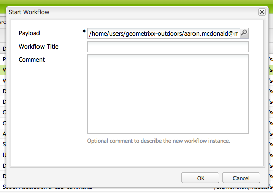
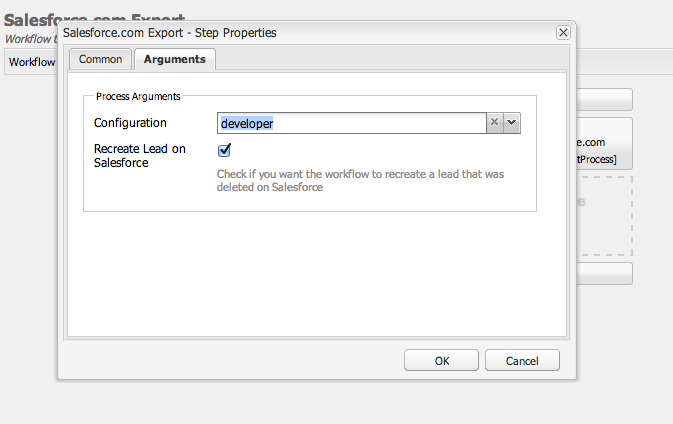

# Integrera med Salesforce{#integrating-with-salesforce}

Genom att integrera Salesforce med AEM får du funktioner för hantering av leads och kan utnyttja de befintliga funktioner som Salesforce tillhandahåller direkt. Du kan konfigurera AEM att publicera leads till Salesforce och skapa komponenter som får åtkomst till data direkt från Salesforce.

Den dubbelriktade och utbyggbara integrationen mellan AEM och Salesforce gör att du kan:

* Organisationer som fullt ut använder och uppdaterar data för att förbättra kundupplevelsen.
* Engagemang från marknadsföring till försäljning.
* Organisationer som automatiskt överför och tar emot data från ett Salesforce-datalager.

I det här dokumentet beskrivs följande:

* konfigurera Salesforce Cloud-tjänster (konfigurera AEM för integrering med Salesforce).
* hur du använder Salesforce-information om lead/kontakt i klientkontext och för personalisering.
* hur du använder Salesforce-arbetsflödesmodellen för att publicera AEM-användare som leads till salesforce.
* hur du skapar en komponent som visar data från Salesforce.

## Konfigurera AEM för integrering med Salesforce {#configuring-aem-to-integrate-with-salesforce}

Om du vill konfigurera AEM för integrering med Salesforce måste du först konfigurera ett fjärråtkomstprogram i Salesforce. Sedan konfigurerar du Salesforce-molntjänsten så att den pekar på det här fjärråtkomstprogrammet.

>[!NOTE]
>
>Du kan skapa ett kostnadsfritt utvecklarkonto i Salesforce.

Så här konfigurerar du AEM för integrering med Salesforce:

1. I AEM går du till **molntjänster**. I tredjepartstjänster klickar du på **Konfigurera nu** i **Salesforce**.

   

1. Skapa en ny konfiguration, till exempel **utvecklare**.

   >[!NOTE]
   >
   >Den nya konfigurationen dirigeras om till en ny sida: **http://localhost:4502/etc/cloudservices/salesforce/developer.html**. Detta är exakt samma värde som du måste ange i återanrops-URL när du skapar fjärråtkomstprogrammet i Salesforce. Dessa värden måste matcha.

1. Logga in på ditt Salesforce-konto (eller om du inte har något, skapa ett på [https://developer.force.com](https://developer.force.com).)
1. I Salesforce går du till **Skapa** > **appar** för att komma till **anslutna appar** (i tidigare versioner av Salesforce var arbetsflödet **Distribuera** > **Fjärråtkomst**).
1. Klicka på **Nytt** för att ansluta AEM till Salesforce.

   

1. Ange det **anslutna programnamnet**, **API-namnet** och e- **postadressen** till kontakten. Markera kryssrutan **Aktivera OAuth-inställningar** och ange **återanrops-URL** och lägg till ett OAuth-scope (till exempel fullständig åtkomst). Återanrops-URL:en ser ut ungefär så här: `http://localhost:4502/etc/cloudservices/salesforce/developer.html`

   Ändra servernamnet/portnumret och sidnamnet så att de matchar konfigurationen.

   

1. Klicka på **Spara** för att spara Salesforce-konfigurationen. Salesforce skapar en **konsumentnyckel** och **konsumenthemlighet**, som du behöver för AEM-konfiguration.

   

   >[!NOTE]
   >
   >Du kan behöva vänta flera minuter (upp till 15 minuter) på att fjärråtkomstprogrammet i Salesforce ska aktiveras.

1. I AEM navigerar du till **molntjänster** och navigerar till Salesforce-konfigurationen som du skapade tidigare (till exempel **utvecklare**). Klicka på **Redigera** och ange kundnyckeln och kundhemligheten från salesforce.com.

   

   | Inloggnings-URL | Det här är Salesforce-auktoriseringsslutpunkten. Dess värde är förifyllt och fungerar i de flesta fall. |
   |---|---|
   | Kundnyckel | Ange det värde som hämtas från registreringssidan för fjärråtkomstprogram (RAS) i salesforce.com |
   | Kundhemlighet | Ange det värde som hämtas från registreringssidan för fjärråtkomstprogram (RAS) i salesforce.com |

1. Klicka på **Anslut till Salesforce** för att ansluta. Salesforce begär att du tillåter din konfiguration att ansluta till Salesforce.

   

   I AEM öppnas en bekräftelsedialogruta som anger att du har anslutit.

1. Navigera till webbplatsens rotsida och klicka på **Sidegenskaper**. Välj sedan **molntjänster** , lägg till **Salesforce** och välj rätt konfiguration (till exempel **utvecklare**).

   

   Nu kan du använda arbetsflödesmodellen för att publicera leads till Salesforce och skapa komponenter som har åtkomst till data från Salesforce.

## Exportera AEM-användare som Salesforce-leads {#exporting-aem-users-as-salesforce-leads}

Om du vill exportera en AEM-användare som en säljchef måste du konfigurera arbetsflödet för att skicka leads till salesforce.

Så här exporterar du AEM-användare som Salesforce-leads:

1. Navigera till Salesforce-arbetsflödet på `http://localhost:4502/workflow` genom att högerklicka på arbetsflödet **Salesforce.com Export** och klicka på **Start**.

   

1. Välj den AEM-användare som du vill skapa som lead som **nyttolast** för det här arbetsflödet (hem -> användare). Se till att du väljer profilnoden för användaren eftersom den innehåller information som **givenName**, **familyName** och så vidare, som mappas till fälten **FirstName** och **LastName** för Salesforce-leadet.

   

   >[!NOTE]
   >
   >Innan det här arbetsflödet startas finns det vissa obligatoriska fält som en huvudnod i AEM måste ha innan de publiceras i Salesforce. Dessa är **givenName**, **familyName**, **** company och **email**. En fullständig lista över mappning mellan AEM-användare och Salesforce-lead finns i [Mappningskonfiguration mellan AEM-användare och Slaesforce-lead.](#mapping-configuration-between-aem-user-and-salesforce-lead)

1. Click **OK**. Användarinformationen exporteras till salesforce.com. Du kan verifiera den på salesforce.com.

   >[!NOTE]
   >
   >I felloggarna visas om ett lead har importerats. Mer information finns i felloggen.

### Konfigurera arbetsflödet för Salesforce.com-export {#configuring-the-salesforce-com-export-workflow}

Du kan behöva konfigurera exportarbetsflödet för Salesforce.com så att det matchar rätt Salesforce.com-konfiguration eller göra andra ändringar.

Så här konfigurerar du exportarbetsflödet för Salesforce.com:

1. Navigera till `http://localhost:4502/cf#/etc/workflow/models/salesforce-com-export.html.`

   

1. Öppna exportsteget för Salesforce.com, välj fliken **Argument** och markera rätt konfiguration och klicka sedan på **OK**. Om du dessutom vill att arbetsflödet ska återskapa ett lead som har tagits bort i Salesforce markerar du kryssrutan.

   

1. Klicka på **Spara** för att spara ändringarna.

   

### Mappningskonfiguration mellan AEM-användare och Salesforce-lead {#mapping-configuration-between-aem-user-and-salesforce-lead}

Om du vill visa eller redigera den aktuella mappningskonfigurationen mellan en AEM-användare och ett Salesforce-lead öppnar du Configuration Manager: `https://<hostname>:<port>/system/console/configMgr` och sök efter **Salesforce Lead Mapping Configuration**.

1. Öppna Configuration Manager genom att klicka på **webbkonsolen** eller gå direkt till `https://<hostname>:<port>/system/console/configMgr.`
1. Sök efter **Salesforce Lead Mapping Configuration**.

   

1. Ändra mappningar efter behov. Standardmappningen följer mönstret** aemUserAttribute=sfLeadAttribute**. Klicka på **Spara** för att spara ändringarna.

## Konfigurerar Salesforce Client Context Store {#configuring-salesforce-client-context-store}

I Salesforce-klientkontextarkivet visas ytterligare information om den inloggade användaren än vad som redan finns i AEM. Den hämtar denna ytterligare information från Salesforce beroende på användarens anslutning till Salesforce.

För att göra detta måste du konfigurera följande:

1. Länka en AEM-användare med ett Salesforce ID via Salesforce Connect-komponenten.
1. Lägg till Salesforce-profildata på klientkontextsidan för att konfigurera vilka egenskaper du vill se.
1. (Valfritt) Skapa ett segment som använder data från Salesforce Client Context Store.

### Länka en AEM-användare med ett Salesforce-ID {#linking-an-aem-user-with-a-salesforce-id}

Du måste mappa en AEM-användare med ett Salesforce ID för att kunna läsa in det i klientkontexten. I ett verkligt scenario skulle du länka baserat på kända användardata med validering. För demonstrationssyften använder du **Salesforce Connect** -komponenten i den här proceduren.

1. Navigera till en webbplats i AEM, logga in och dra och släpp **Salesforce Connect** -komponenten från sidan.

   >[!NOTE]
   >
   >Om **Salesforce Connect** -komponenten inte är tillgänglig går du till **designvyn** och markerar den för att göra den tillgänglig i **redigeringsvyn** .

   

   När du drar komponenten till sidan visas **Länk till Salesforce=Av**.

   

   >[!NOTE]
   >
   >Den här komponenten är endast avsedd som exempel. I verkliga scenarier finns det en annan process för att länka/matcha användare med leads.

1. När du har dragit komponenten på sidan öppnar du den för att konfigurera den. Välj konfiguration, typ av kontakt och Salesforce-lead eller -kontakt och klicka på **OK**.

   

   AEM länkar användaren till Salesforce-kontakten eller -leadet.

   

### Lägga till Salesforce-data i klientkontext {#adding-salesforce-data-to-client-context}

Du kan läsa in användardata från Salesforce i klientkontexten som ska användas för personalisering:

1. Öppna klientkontexten som du vill utöka genom att navigera där, till exempel `http://localhost:4502/etc/clientcontext/default/content.html.`

   

1. Dra **Salesforce-komponenten Profildata** till klientkontexten.

   

1. Dubbelklicka på komponenten för att öppna den. Välj **Lägg till objekt** och välj en egenskap i listrutan. Lägg till så många egenskaper du vill och välj **OK**.

   

1. Nu visas Salesforce-specifika egenskaper från Salesforce i klientkontexten.

   

### Bygga ett segment med data från Salesforce Client Context Store {#building-a-segment-using-data-from-salesforce-client-context-store}

Du kan skapa ett segment som använder data från Salesforce Client Context Store. Så här gör du:

1. Navigera till segmentering i AEM genom att antingen gå till **Verktyg** > **Segmentering** eller gå till [http://localhost:4502/miscadmin#/etc/segmentation](http://localhost:4502/miscadmin#/etc/segmentation).
1. Skapa eller uppdatera ett segment för att inkludera data från Salesforce. For more information, see [Segmentation](/help/sites-administering/campaign-segmentation.md).

## Söker efter leads {#searching-leads}

AEM levereras med en exempelsökkomponent som söker efter leads i Salesforce enligt angivna villkor. Den här komponenten visar hur du använder Salesforce REST API för att söka efter Salesforce-objekt. Du måste länka en sida med en Salesforce-konfiguration för att kunna utlösa ett anrop till salesforce.com.

>[!NOTE]
>
>Detta är en exempelkomponent som visar hur du använder Salesforce REST API för att fråga Salesforce-objekt. Använd det som exempel för att skapa mer komplexa komponenter utifrån dina behov.

Så här använder du den här komponenten:

1. Navigera till sidan där du vill använda den här konfigurationen. Öppna sidegenskaper och välj **molntjänster.** Klicka på **Lägg till tjänster** och välj **Salesforce** och lämplig konfiguration. Klicka sedan på **OK**.

   

1. Dra Salesforce-sökkomponenten till sidan (förutsatt att den har aktiverats). Om du vill aktivera det går du till designläge och lägger till det i lämpligt område).

   

1. Öppna sökkomponenten, ange sökparametrarna och klicka på **OK.**

   

1. AEM visar de leads som anges i sökkomponenten och som matchar de angivna villkoren.

   

