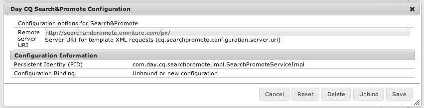

# Integrera med Adobe Search&amp;Promote{#integrating-with-adobe-search-promote}

Gör så här för att ringa tjänsten Adobe Search&amp;Promote från din webbplats:

1. Ange URL:en för molnet.
1. Konfigurera anslutningen till Search&amp;Promote-tjänsten.
1. Lägg till Search&amp;Promote-komponenter i [!UICONTROL Sidekick].
1. Använd komponenterna för att skapa innehållet. (Se [Lägga till sök&amp;befordra funktioner på en webbsida](/help/sites-authoring/search-and-promote.md).)
1. Lägg till banderoller på sidorna. Banderollbilder är känsliga för sök&amp;marknadsför data.
1. Generera en webbplatskarta så att Search&amp;Promote-tjänsten kan använda den.

>[!NOTE]
>
>Om du använder Search&amp;Promote med en anpassad proxykonfiguration måste du konfigurera båda HTTP-klientproxykonfigurationerna eftersom vissa funktioner i AEM använder 3.x-API:erna och andra 4.x-API:er:
>
>* 3.x är konfigurerat med [http://localhost:4502/system/console/configMgr/com.day.commons.httpclient](http://localhost:4502/system/console/configMgr/com.day.commons.httpclient)
>* 4.x är konfigurerat med [http://localhost:4502/system/console/configMgr/org.apache.http.proxyconfigurator](http://localhost:4502/system/console/configMgr/org.apache.http.proxyconfigurator)
>

## Ändra URL:en för Search&amp;Promote-tjänsten {#changing-the-search-promote-service-url}

Standardwebbadressen som är konfigurerad för tjänsten Search&amp;Promote är `https://searchandpromote.omniture.com/px/`. Om du vill använda en annan tjänst använder du OSGi-konsolen för att ange en annan URL.

**Så här ändrar du URL** för Search&amp;Promote-tjänsten:

1. Öppna [!UICONTROL OSGi] -konsolen och tryck på fliken **[!UICONTROL Konfiguration]** . ([http://localhost:4502/system/console/configMgr.](http://localhost:4502/system/console/configMgr))

1. Klicka på **[!UICONTROL Dag CQ Search&amp;Promote Configuration]** .
1. Ange URL:en i textfältet **[!UICONTROL Fjärrserverns URI]** och tryck sedan på **[!UICONTROL Spara]**.

## Konfigurera anslutningen till Search&amp;Promote {#configuring-the-connection-to-search-promote}

Konfigurera en eller flera anslutningar till Search&amp;Promote så att dina webbsidor kan interagera med tjänsten. För att kunna ansluta behöver du medlemsidentifiering och kontonummer för ditt Search&amp;Promote-konto.

**Så här konfigurerar du anslutningen till Search&amp;Promote**:

1. Välj **[!UICONTROL molntjänster]** från verktygsikonen **[!UICONTROL >]** Distribution ****.

   Detta tar dig till kontrollpanelen för molntjänster. Om du använder en lokal dator ser kontrollpanelens URL ut ungefär så här:

   [http://localhost:4502/libs/cq/core/content/tools/cloudservices.html](http://localhost:4502/libs/cq/core/content/tools/cloudservices.html)

1. På sidan [!UICONTROL Cloud Services] trycker du på länken **[!UICONTROL Adobe Search&amp;Promote]** eller **[!UICONTROL Search&amp;Promote]** .

1. Om det här är första gången du konfigurerar Adobe Search&amp;Promote trycker du på **[!UICONTROL Konfigurera nu]** för att öppna panelen [!UICONTROL Skapa konfiguration] .

   Om du vill veta mer om Search&amp;Promote klickar du i stället på **[!UICONTROL Läs mer]** .

   

1. Ange en **[!UICONTROL titel]** som sidförfattare kan känna igen, ange ett unikt **[!UICONTROL namn]** och tryck sedan på **[!UICONTROL Skapa]**.

   Dessutom visas den nya konfigurationen under **[!UICONTROL Tillgängliga konfigurationer]** på **[!UICONTROL Cloud Services-kontrollpanelen]** Adobe Search&amp;Promote-listobjektet.

   

1. Lägg till följande i fälten i dialogrutan [!UICONTROL Redigera komponent] :

   * **[!UICONTROL Medlems-ID]**
   * **[!UICONTROL Kontonummer]**
   >[!NOTE]
   >
   >Logga in på följande för att få tillgång till informationen själv:
   >
   >[https://searchandpromote.omniture.com/center/](https://searchandpromote.omniture.com/center/)
   >
   >med dina giltiga Seach&amp;Promote-inloggningsuppgifter (e-post/lösenord).
   >
   >Lägg märke till webbadressen i webbläsarens adressfält. Det ska se ut ungefär så här:
   >
   >
   >
   >[https://searchandpromote.omniture.com/px/home/?sp_id=XXXXXXXX-spYYYYYYYY](https://searchandpromote.omniture.com/px/home/?sp_id=XXXXXXXX-spYYYYYYYY)
   >
   >Där **XXXXXX** motsvarar ditt **[!UICONTROL medlems-ID]** och **[!UICONTROL spYYYYYYY]** motsvarar ditt kontonummer.

1. Tryck på **[!UICONTROL Anslut till sök&amp;höj]**.

   När meddelandet om att anslutningen lyckades visas trycker du på **[!UICONTROL OK]**.

   (När du har anslutit ändras knapptexten till **[!UICONTROL Koppla igen till sök&amp;Befordra]**.)

1. Tryck på **[!UICONTROL OK]**. Sidan Sök&amp;höj inställningar visas för den konfiguration som du just har skapat.

## Konfigurera datacentret {#configuring-the-data-center}

Om ditt Search&amp;Promote-konto finns i Asien eller Europa måste du ändra standarddatacentret så att det pekar till rätt datacenter (standarddatacentret är för nordamerikanska konton).

**Så här konfigurerar du datacentret**:

1. Navigera till webbkonsolen på `http://localhost:4502/system/console/configMgr/com.day.cq.searchpromote.impl.SearchPromoteServiceImpl`

   

1. Beroende på var servern finns ändrar du URI:n till något av följande:

   * Nordamerika: [https://center.atomz.com/px/](https://center.atomz.com/px/)
   * EMEA: [https://center.lon5.atomz.com/px/](https://center.lon5.atomz.com/px/)
   * APAC: [https://center.sin2.atomz.com/px/](https://center.sin2.atomz.com/px/)

1. Tryck på **[!UICONTROL Spara]**.

## Lägga till Search&amp;Promote-komponenter i Sidekick {#adding-search-promote-components-to-sidekick}

I [!UICONTROL designläget] kan du redigera en **[!UICONTROL del]** -komponent så att komponenterna Search&amp;Promote kan användas i [!UICONTROL Sidekick]. (Mer information finns i dokumentationen för [komponenter](/help/sites-developing/components.md) .)

Mer information om hur du använder komponenterna finns i [Lägga till sök- och höjdfunktioner på en webbsida](/help/sites-authoring/search-and-promote.md).

## Ange den Search&amp;Promote-tjänst som dina sidor använder {#specifying-the-search-promote-service-that-your-pages-use}

Konfigurera webbsidor så att de använder en viss Search&amp;Promote-tjänst. Search&amp;Promote-komponenter använder automatiskt tjänsten på sin värdsida.

När du konfigurerar egenskaperna Sök&amp;Befordra för en sida ärver alla underordnade sidor inställningarna. Om det behövs kan du konfigurera underordnade sidor så att de åsidosätter de ärvda inställningarna.

>[!NOTE]
>
>Tjänstanslutningen måste redan vara konfigurerad. Se [Konfigurera anslutningen till Search&amp;Promote](#configuring-the-connection-to-search-promote).

1. Öppna dialogrutan **[!UICONTROL Sidegenskaper]** . På sidan **[!UICONTROL Webbplatser]** högerklickar du på sidan och klickar på **[!UICONTROL Egenskaper]**.

1. Klicka på fliken **[!UICONTROL Molntjänster]** .

1. Om du vill inaktivera arvet av molntjänstkonfigurationer från en överordnad sida klickar du på hänglåsikonen bredvid arvsökvägen.

   

1. Klicka på **[!UICONTROL Lägg till tjänst]**, välj **[!UICONTROL Adobe Search&amp;Promote]** och klicka sedan på **[!UICONTROL OK]**.

1. Välj anslutningskonfiguration för ditt Search&amp;Promote-konto och klicka sedan på **[!UICONTROL OK]**.

## Produktfeed {#product-feed}

Med hjälp av Search&amp;Promote-integreringen kan du göra följande:

* Använd [!UICONTROL eCommerce] API, oberoende av den underliggande databasstrukturen och handelsplattformen.
* Utnyttja funktionen [!UICONTROL Index Connector] i Search&amp;Promote för att leverera en produktfeed i XML-format.
* Utnyttja [!UICONTROL fjärrstyrningsfunktionen] i Search&amp;Promote för att utföra on-demand- eller schemalagda begäranden i produktflödet.
* Flödesgenerering för olika Search&amp;Promote-konton, konfigurerade som molntjänster.

Mer information finns i [Produktfeed](/help/sites-administering/product-feed.md).
