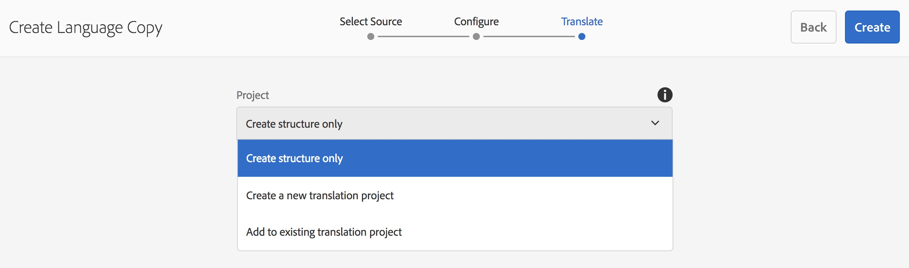

# Guiden Kopiera språk{#language-copy-wizard}

Guiden för språkkopiering är en guidad upplevelse när du skapar och instrumenterar struktur för flerspråkigt innehåll. Det är nu mycket enklare och snabbare att skapa en språkkopia.

>[!NOTE]
>
>Användaren måste vara medlem i en projektadministratörsgrupp för att kunna skapa språkkopian för en webbplats.

Så här öppnar du guiden:

1. Välj en sida i Platser och tryck/klicka på Skapa.

   

1. Välj Språkkopia så öppnas guiden.

   

1. I steget **Välj källa** i guiden kan du lägga till/ta bort sidor. Du kan också välja att ta med eller utesluta undersidor.

   

1. Med knappen **Nästa** kommer du till **konfigurationssteget** i guiden. Här kan du lägga till/ta bort språk och välja översättningsmetod.

   

   >[!NOTE]
   >
   >Som standard finns det bara en översättningsinställning. Om du vill kunna välja andra inställningar måste du först konfigurera molnkonfigurationer. Se [Konfigurera översättningsintegreringsramverket](/help/sites-administering/tc-tic.md).

1. Med knappen **Nästa** kommer du till **steget Översätt** i guiden. Här kan du välja mellan att skapa enbart strukturen, skapa ett nytt översättningsprojekt eller lägga till i ett befintligt översättningsprojekt.

   >[!NOTE]
   >
   >Om du valde flera språk i föregående steg skapas flera översättningsprojekt.

   

1. Knappen **Skapa** avslutar guiden.

   

