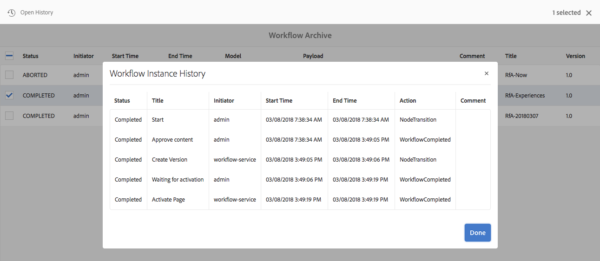

# Administrera arbetsflödesinstanser{#administering-workflow-instances}

>[!CAUTION]
>
>AEM 6.4 har nått slutet på den utökade supporten och denna dokumentation är inte längre uppdaterad. Mer information finns i [teknisk supportperiod](https://helpx.adobe.com/support/programs/eol-matrix.html). Hitta de versioner som stöds [här](https://experienceleague.adobe.com/docs/).

Arbetsflödeskonsolen innehåller flera verktyg för att administrera arbetsflödesinstanser för att säkerställa att de körs som förväntat.

>[!NOTE]
>
>The [JMX-konsol](/help/sites-administering/jmx-console.md#workflow-maintenance) tillhandahåller ytterligare underhållsåtgärder för arbetsflöden.

Det finns en rad konsoler som du kan använda för att administrera dina arbetsflöden. Använd [global navigering](/help/sites-authoring/basic-handling.md#global-navigation) för att öppna **verktyg** välj **Arbetsflöde**:

* **Modeller**: Hantera arbetsflödesdefinitioner
* **Instanser**: Visa och hantera pågående arbetsflödesinstanser
* **Startare**: Hantera hur arbetsflöden ska startas
* **Arkiv**: Visa historik över arbetsflöden som har slutförts
* **Fel**: Visa historik över arbetsflöden som slutförts med fel

## Övervaka status för arbetsflödesinstanser {#monitoring-the-status-of-workflow-instances}

1. Använd navigeringsval **verktyg** sedan **Arbetsflöde**.
1. Välj **Instanser** om du vill visa en lista över pågående arbetsflödesinstanser.

   

1. Markera ett specifikt objekt och sedan **Öppna historik** för mer information:

   

## Göra uppehåll, återuppta och avsluta en arbetsflödesinstans {#suspending-resuming-and-terminating-a-workflow-instance}

1. Använd navigeringsval **verktyg** sedan **Arbetsflöde**.
1. Välj **Instanser** om du vill visa en lista över pågående arbetsflödesinstanser.

   

1. Markera ett specifikt objekt och använd sedan **Avsluta**, **Gör uppehåll**, eller **Återuppta**, beroende på vad som är lämpligt, bekräftelse och/eller ytterligare uppgifter krävs:

   

## Visa arkiverade arbetsflöden {#viewing-archived-workflows}

1. Använd navigeringsval **verktyg** sedan **Arbetsflöde**.
1. Välj **Arkiv** om du vill visa en lista över arbetsflödesinstanser som har slutförts.

   

   >[!NOTE]
   >
   >Avbruten status betraktas som en avslutad åtgärd eftersom den inträffar till följd av en användaråtgärd. till exempel:
   >
   >* användning av **Avsluta** åtgärd
   >* när en sida, som är underställd ett arbetsflöde, tas bort (framtvingar), avslutas arbetsflödet

1. Markera ett specifikt objekt och sedan **Öppna historik** för mer information:

   

## Åtgärdar fel i arbetsflödesinstansen {#fixing-workflow-instance-failures}

När ett arbetsflöde misslyckas, innehåller AEM **Fel** så att du kan undersöka och vidta lämpliga åtgärder när originalorsaken har hanterats:

* **Felinformation**
Öppnar ett fönster för att visa 
**Felmeddelande**, **Steg** och **Felstapel**.

* **Öppna historik**
Visar information om arbetsflödeshistoriken.

* **Försök igen** Kör komponentinstansen Script Step igen. Använd kommandot Försök igen när du har åtgärdat orsaken till det ursprungliga felet. Du kan till exempel försöka utföra steget igen när du har åtgärdat ett fel i skriptet som utförs av processteget.
* **Avsluta** Avsluta arbetsflödet om felet har orsakat en oåterkallelig situation för arbetsflödet. Arbetsflödet kan t.ex. vara beroende av miljöförhållanden, t.ex. information i databasen som inte längre är giltig för arbetsflödesinstansen.
* **Avsluta och försök igen** Liknar **Avsluta** förutom att en ny arbetsflödesinstans startas med den ursprungliga nyttolasten, titeln och beskrivningen.

Så här undersöker du fel och sedan återupptar eller avslutar du arbetsflödet:

1. Använd navigeringsval **verktyg** sedan **Arbetsflöde**.
1. Välj **Fel** för att visa en lista över arbetsflödesinstanser som inte har slutförts korrekt.
1. Välj ett specifikt objekt och sedan lämplig åtgärd:

   

## Vanlig tömning av arbetsflödesinstanser {#regular-purging-of-workflow-instances}

Om du minimerar antalet arbetsflödesinstanser ökas arbetsflödesmotorns prestanda, så att du regelbundet kan rensa avslutade eller pågående arbetsflödesinstanser från databasen.

Konfigurera **Rensa arbetsflöde för Adobe Granite** för att rensa arbetsflödesinstanser utifrån deras ålder och status. Du kan också rensa arbetsflödesinstanser av alla modeller eller av en viss modell.

Du kan också skapa flera konfigurationer av tjänsten för att rensa arbetsflödesinstanser som uppfyller olika villkor. Skapa till exempel en konfiguration som tömmer instanser av en viss arbetsflödesmodell när de körs mycket längre än förväntat. Skapa en annan konfiguration som tömmer alla slutförda arbetsflöden efter ett visst antal dagar för att minimera databasens storlek.

Om du vill konfigurera tjänsten kan du använda [Webbkonsol](/help/sites-deploying/configuring-osgi.md#osgi-configuration-with-the-web-console) eller [lägga till en OSGi-konfiguration i databasen](/help/sites-deploying/configuring-osgi.md#osgi-configuration-in-the-repository). I följande tabell beskrivs de egenskaper som du behöver för någon av metoderna.

>[!NOTE]
>
>För att lägga till konfigurationen i databasen är tjänst-PID:
>
>`com.adobe.granite.workflow.purge.Scheduler`
>
>Eftersom tjänsten är en fabrikstjänst är namnet på `sling:OsgiConfig` noden kräver ett identifierarsuffix, till exempel:
>
>`com.adobe.granite.workflow.purge.Scheduler-myidentifier`

<table> 
 <tbody> 
  <tr> 
   <th>Egenskapsnamn (webbkonsol)</th> 
   <th>OSGi-egenskapsnamn</th> 
   <th>Beskrivning</th> 
  </tr> 
  <tr> 
   <td>Jobbnamn</td> 
   <td>scheduledpurge.name</td> 
   <td>Ett beskrivande namn för den schemalagda rensningen.</td> 
  </tr> 
  <tr> 
   <td>Arbetsflödesstatus</td> 
   <td>scheduledpurge.workflowStatus</td> 
   <td>
Status för de arbetsflödesinstanser som ska rensas. Följande värden är giltiga:
 
    <ul> 
     <li>SLUTFÖRT: Slutförda arbetsflödesinstanser rensas.</li> 
     <li>KÖRS: Körande arbetsflödesinstanser rensas.</li> 
    </ul> </td> 
  </tr> 
  <tr> 
   <td>Modeller att tömma</td> 
   <td>scheduledpurge.modelIds</td> 
   <td>
ID:t för arbetsflödesmodellerna som ska rensas. ID är sökvägen till modellnoden, till exempel:  /conf/global/settings/workflow/models/dam/update_asset/jcr:content/model  Ange inget värde för att rensa instanser av alla arbetsflödesmodeller.
 
Om du vill ange flera modeller klickar du på plusknappen (+) i webbkonsolen. 
 </td> 
  </tr> 
  <tr> 
   <td>Arbetsflödesålder</td> 
   <td>scheduledpurge.daysold</td> 
   <td>Åldern på arbetsflödesinstanserna som ska rensas, i dagar.</td> 
  </tr> 
 </tbody> 
</table>

## Ange maximal storlek för inkorgen {#setting-the-maximum-size-of-the-inbox}

Du kan ange den maximala storleken för inkorgen genom att konfigurera **Adobe Granite Workflow Service**, med [Webbkonsol](/help/sites-deploying/configuring-osgi.md#osgi-configuration-with-the-web-console) eller [lägga till en OSGi-konfiguration i databasen](/help/sites-deploying/configuring-osgi.md#osgi-configuration-in-the-repository). I följande tabell beskrivs egenskapen som du konfigurerar för båda metoderna.

>[!NOTE]
>
>För att lägga till konfigurationen i databasen är tjänst-PID:
>
>`com.adobe.granite.workflow.core.WorkflowSessionFactory`.

| Egenskapsnamn (webbkonsol) | OSGi-egenskapsnamn |
|---|---|
| Max Inbox Query Size | granite.workflow.inboxQuerySize |
