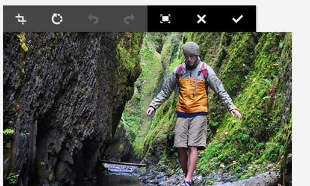

# Adobe Campaign Components{#adobe-campaign-components}

>[!CAUTION]
>
>AEM 6.4 har nått slutet på den utökade supporten och denna dokumentation är inte längre uppdaterad. Mer information finns i [teknisk supportperiod](https://helpx.adobe.com/support/programs/eol-matrix.html). Hitta de versioner som stöds [här](https://experienceleague.adobe.com/docs/).

När du integrerar med Adobe Campaign finns det komponenter som du kan använda när du arbetar med nyhetsbrev och formulär. Båda beskrivs i det här dokumentet.

## Adobe Campaign Newsletter Components {#adobe-campaign-newsletter-components}

Alla Campaign-komponenter följer de bästa metoderna som beskrivs i [Metodtips för e-postmallar](/help/sites-administering/best-practices-for-email-templates.md) och bygger på Adobe markup-språket [HTL](https://helpx.adobe.com/experience-manager/htl/using/overview.html).

När du öppnar ett nyhetsbrev/e-postmeddelande som är konfigurerat för integrering med Adobe Campaign, bör du se följande komponenter i **Adobe Campaign Newsletter** avsnitt:

* Rubrik (kampanj)
* Bild (Campaign)
* Länk (kampanj)
* Dynamic Media Image Template (Campaign)
* Riktad referens (Campaign)
* Text och bild (kampanj)
* Text och personalisering (Campaign)

En beskrivning av de här komponenterna finns i följande avsnitt.

Komponenterna ser ut så här:

### Rubrik (kampanj) {#heading-campaign}

Rubrikkomponenten kan antingen:

* Visa den aktuella sidans namn genom att lämna **Titel** fältet är tomt.
* Visa en text som du anger i dialogrutan **Titel** fält.

Du redigerar **Rubrik (kampanj)** direkt. Lämna tomt om du vill använda sidrubriken.

Du kan konfigurera följande:

* **Titel**
Om du vill använda ett annat namn än sidrubriken anger du det här.

* **Rubriknivå (1, 2, 3, 4)**
Rubriknivån baserad på HTML rubrikstorlekarna 1-4.

I följande exempel visas en rubrikkomponent (Campaign).

### Bild (Campaign) {#image-campaign}

Komponenten image (campaign) visar en bild och tillhörande text enligt de angivna parametrarna.

Du kan överföra en bild och sedan redigera den (till exempel beskära, rotera, lägga till länk/titel/text).

Du kan antingen dra och släppa en bild från [Resursläsaren](/help/sites-authoring/author-environment-tools.md#assets-browser) direkt till komponenten eller dess [Konfigurera dialogruta](/help/sites-authoring/editing-content.md#edit-configure-copy-cut-delete-paste). Du kan också överföra en bild från dialogrutan Konfigurera. Den här dialogrutan styr också alla definitioner och ändringar av bilden:

>[!NOTE]
>
>Du måste ange information i **Alt-text** eller så går det inte att spara bilden.

När bilden har överförts (och inte tidigare) kan du använda [redigering på plats](/help/sites-authoring/editing-content.md#edit-configure-copy-cut-delete-paste) för att beskära/rotera bilden efter behov:

>[!NOTE]
>
>I redigeraren på plats används bildens ursprungliga storlek och proportioner vid redigering. Du kan också ange höjd- och breddegenskaper. Alla storleks- och proportionsbegränsningar som definieras i egenskaperna används när du sparar redigeringsändringarna.
>
>Beroende på din instans kan minimi- och maximinivåer även anges av [sidans design](/help/sites-developing/designer.md); dessa utvecklas under projektgenomförandet.

Flera ytterligare alternativ finns i helskärmsläge. till exempel mappa och zooma:

När en bild har lästs in kan du konfigurera följande:

* **Karta**

   Om du vill mappa en bild väljer du Karta. Du kan ange hur du vill skapa bildschemat (rektangel, polygon och så vidare) och var området ska peka.

* **Beskär**

   Välj Beskär för att beskära en bild. Beskär bilden med musen.

* **Rotera**

   Om du vill rotera en bild väljer du Rotera. Använd detta upprepade gånger tills bilden roteras som du vill ha den.

* **Rensa**

   Ta bort den aktuella bilden.

* Zoomfält (endast klassisk)

   Om du vill zooma in och ut i bilden använder du bildfältet under bilden (ovanför knapparna OK och Avbryt)

* **Titel**

   Bildens titel.

* **Alt-text**

   En alternativ text som kan användas när hjälpmedelsanpassat innehåll skapas.

* **Länka till**

   Skapa en länk till resurser eller andra sidor på webbplatsen.

* **Beskrivning**

   En beskrivning av bilden.

* **Storlek**

   Anger bildens höjd och bredd.

>[!NOTE]
>
>Du måste ange information i **Alt-text** i **Avancerat** eller så kan bilden inte sparas och följande felmeddelande visas:
>
>`Validation failed. Verify the values of the marked fields.`

I följande exempel visas en bildkomponent (Campaign).

### Länk (kampanj) {#link-campaign}

Med komponenten Länk (Campaign) kan du lägga till en länk i nyhetsbrevet.

Du kan konfigurera följande i **Visa**, **URL-information**, eller **Avancerat** tabbar:

* **Länkbeskrivning**

   Länkens bildtext. Det här är den text som användarna ser.

* **Länkverktygstips**

   Lägger till ytterligare information om hur länken används.

* **LinkType**

   I listrutan väljer du mellan en **Anpassad URL** och **Adaptivt dokument**. Det här fältet är obligatoriskt. Om du väljer Anpassad URL kan du ange länkens URL. Om du väljer Adaptivt dokument kan du ange dokumentets sökväg.

* **Ytterligare URL-parameter**

   Lägg till eventuella ytterligare URL-parametrar. Klicka på Lägg till objekt om du vill lägga till flera objekt.

>[!NOTE]
>
>Du måste ange information i **Länktyp** i **URL-information** eller så kan komponenten inte spara och följande felmeddelande visas:
>
>`Validation failed. Verify the values of the marked fields.`

I följande exempel visas en länkkomponent (Campaign).

### Scene7 Image Template (Campaign) {#scene-image-template-campaign}

[Scene7-bildmallar](https://experienceleague.adobe.com/docs/dynamic-media-classic/using/template-basics/quick-start-template-basics.html#template-basics) är bildfiler med flera lager, där innehåll och egenskaper kan parametriseras för variabilitet. The **Bildmall** kan du använda Dynamic Media Classic-mallar (tidigare Scene7) i nyhetsbrev och ändra värdena för mallparametrar. Dessutom kan du använda Adobe Campaign-metadatavariabler inuti parametrarna, så att varje användare upplever bilden på ett personaliserat sätt.

Klicka **Redigera** för att konfigurera komponenten. Du kan konfigurera inställningarna som beskrivs i det här avsnittet. Den här Dynamic Media Classic-bildmallen (tidigare Scene7) beskrivs i detalj i [Komponenten Scene7 Image Template](/help/assets/scene7.md#image-template).

Dessutom listas alla mallparametrar som har definierats för mallen i Dynamic Media Classic (tidigare Scene7) på parameterpanelen. För var och en av dessa parametrar kan du anpassa värdet, infoga variabler eller återställa dem till deras standardvärde.

### Riktad referens (Campaign) {#targeted-reference-campaign}

Med komponenten Målreferens (Campaign) kan du skapa en referens till ett målstycke.

I den här komponenten navigerar du till målstycket för att markera det.

Klicka på mappikonen för att navigera till stycket som du vill referera till. När du är klar klickar du på bockmarkeringen.

### Text och bild (kampanj) {#text-image-campaign}

Komponenten Text och bild (Campaign) lägger till ett textblock och en bild.

När du klickar för att konfigurera komponenten väljer du Text eller Bild.

Markera **Text** visar en textbunden redigerare:

Markera **Bild** I visas redigeraren på plats för bilder:

Se [Bildkomponent (Campaign)](#image-campaign) om du vill ha mer information om hur du arbetar med bilder. Se [Text- och personaliseringskomponent (Campaign)](#text-personalization-campaign) om du vill ha mer information om hur du arbetar med text.

Precis som med komponenterna Text &amp; Personalization (Campaign) och Image (Campaign) kan du konfigurera:

* **Text**

   Ange text. Använd verktygsfältet för att ändra formatering, skapa listor och lägga till länkar.

* **Bild**

   Dra en bild från innehållssökaren eller klicka för att bläddra till en bild. Beskär eller rotera efter behov.

* **Bildegenskaper** (**Avancerade bildegenskaper**)

   Gör att du kan ange följande:

   * **Titel**

      Blockets titel. visas med muspekaren.

   * **Alt-text**

      Alternativ text som visas om bilden inte kan visas.

   * **Länka till**

      Skapa en länk till resurser eller andra sidor på webbplatsen.

   * **Beskrivning**

      En beskrivning av bilden.

   * **Storlek**

      Anger bildens höjd och bredd.

>[!NOTE]
>
>The **Alt-text** i **Avancerat** -fliken är obligatorisk eller komponenten kan inte sparas och följande felmeddelande visas:
>
>`Validation failed. Verify the values of the marked fields.`

I följande exempel visas en text- och bildkomponent (Campaign).

### Text och personalisering (Campaign) {#text-personalization-campaign}

Komponenten Text &amp; Personalization (Campaign) gör att du kan ange ett textblock med en WYSIWYG-redigerare med de funktioner som finns i [RTF-redigerare](/help/sites-authoring/rich-text-editor.md). Med den här komponenten kan du dessutom använda kontextfält och anpassningsblock som finns i Adobe Campaign; se [Infogar personalisering](/help/sites-authoring/campaign.md#inserting-personalization).

Om du väljer ikoner kan du formatera texten, inklusive teckensnittsegenskaper, justering, länkar, listor och indrag. Funktionerna är i stort sett desamma i [båda gränssnitten](/help/sites-authoring/editing-content.md)även om utseendet och känslan är annorlunda:

I redigeraren kan du lägga till text, ändra justeringen, lägga till och ta bort länkar, lägga till kontextfält eller anpassningsblock och ange helskärmsläge. När du är klar med att lägga till text/personalisering markerar du kryssrutan för att spara ändringarna (eller x för att avbryta). Se [In-redigering](/help/sites-authoring/editing-content.md#edit-configure-copy-cut-delete-paste) för mer information.

>[!NOTE]
>
>* Vilka anpassningsfält som är tillgängliga beror på vilken Adobe Campaign-mall nyhetsbrevet är länkat till.
>* När du har valt en profil från ContextHub ersätts personaliseringsfälten automatiskt av data från den valda profilen.
>
>Se [Infogar personalisering](/help/sites-authoring/campaign.md#inserting-personalization).

>[!NOTE]
>
>Endast de fält som definierats i **nms:seedMember** schemat eller något av dess tillägg tas med i beräkningen. Attributen för de tabeller som är länkade till **nms:seedMember** är inte tillgängliga.

## Adobe Campaign Form Components {#adobe-campaign-form-components}

Du använder Adobe Campaign-komponenter för att skapa ett formulär som användarna fyller i för att antingen prenumerera på ett nyhetsbrev, avbryta prenumerationen på ett nyhetsbrev eller uppdatera sina användarprofiler. Se [Skapa Adobe Campaign Forms](/help/sites-authoring/adobe-campaign-forms.md) för mer information.

Varje komponentfält kan länkas till ett Adobe Campaign-databasfält. De tillgängliga fälten skiljer sig åt beroende på vilken typ av data de innehåller, vilket beskrivs i avsnittet [Komponenter och datatyp](#components-and-data-type). Om du utökar ditt mottagarschema i Adobe Campaign är de nya fälten tillgängliga i de komponenter vars datatyper matchar.

När du öppnar ett formulär som är konfigurerat att integreras med Adobe Campaign visas följande komponenter i **Adobe Campaign** avsnitt:

* Kryssruta (kampanj)
* Datumfält (kampanj) och Datumfält/HTML5 (kampanj)
* Krypterad primärnyckel (kampanj)
* Felvisning (kampanj)
* Dold avstämningsnyckel (kampanj)
* Numeriskt fält (kampanj)
* Alternativfält (kampanj)
* Checklista för prenumerationer (kampanj)
* Textfält (kampanj)

Komponenterna ser ut så här:

I det här avsnittet beskrivs varje komponent i detalj.

### Komponenter och datatyp {#components-and-data-type}

I följande tabell beskrivs de komponenter som är tillgängliga för att visa och ändra Adobe Campaign-profildata. Varje komponent kan mappas till ett Adobe Campaign-profilfält för att visa dess värde och uppdatera fältet när formuläret skickas. De olika komponenterna kan bara matchas mot fält av lämplig datatyp.

<table> 
 <tbody> 
  <tr> 
   <td>
<strong>Komponent</strong>
 </td> 
   <td>
<strong>Datatyp för Adobe Campaign-fält</strong>
 </td> 
   <td>
<strong>Exempelfält</strong>
 </td> 
  </tr> 
  <tr> 
   <td>
Kryssruta (kampanj)
 </td> 
   <td>
boolesk
 </td> 
   <td>
Inte längre kontakt (via någon kanal)
 </td> 
  </tr> 
  <tr> 
   <td>
Datumfält (kampanj)
 
Datumfält/HTML 5 (kampanj)
 </td> 
   <td>
datum
 </td> 
   <td>
Födelsedatum
 </td> 
  </tr> 
  <tr> 
   <td>
Numeriskt fält (kampanj)
 </td> 
   <td>
numerisk (byte, short, long, double)
 </td> 
   <td>
Ålder
 </td> 
  </tr> 
  <tr> 
   <td>
Alternativfält (kampanj)
 </td> 
   <td>
byte med associerade värden
 </td> 
   <td>
Kön
 </td> 
  </tr> 
  <tr> 
   <td>
Textfält (kampanj)
 </td> 
   <td>
string
 </td> 
   <td>
E-post
 </td> 
  </tr> 
 </tbody> 
</table>

### Inställningar som är gemensamma för de flesta komponenter {#settings-common-to-most-components}

Adobe Campaign-komponenterna har inställningar som är gemensamma för alla komponenter (förutom komponenterna Encrypted Primary Key och Hidden Reconcilation Key).

I de flesta komponenter kan du konfigurera följande:

#### Titel och text {#title-and-text}

* **Titel**

   Om du vill använda ett annat namn än elementnamnet anger du det här.

* **Dölj titel**

   Markera den här kryssrutan om du inte vill att titeln ska vara synlig.

* **Beskrivning**

   Lägg till en beskrivning till fältet för att ge mer information till användarna.

* **Visa endast värde**

   Visar bara värdet, om det finns ett

#### Adobe Campaign {#adobe-campaign}

Du kan konfigurera följande:

* **Mappning**

   Välj ett personaliseringsfält från Adobe Campaign, om det är lämpligt.

* **Avstämningsnyckel**

   Markera den här kryssrutan om det här fältet är en del av avstämningsnyckeln.

#### Begränsningar {#constraints}

* **Obligatoriskt**

   Markera den här kryssrutan om du vill att komponenten ska vara obligatorisk. alltså måste användaren ange ett värde.

* **Nödvändigt meddelande**

   Du kan också lägga till ett meddelande om att fältet är obligatoriskt.

#### Stilar {#styling}

* **CSS**
Ange de CSS-klasser som du vill använda för den här komponenten.

### Kryssruta (kampanj) {#checkbox-campaign}

Med komponenten Kryssruta (Campaign) kan användaren ändra Adobe Campaign-profilfält som är av boolesk datatyp. Du kan till exempel ha en kryssrutekomponent (Campaign) som gör att mottagaren kan ange att han eller hon inte vill bli kontaktad via någon kanal.

Du kan [konfigurera inställningar som är gemensamma för de flesta Adobe Campaign-komponenter](#settings-common-to-most-components) i kryssrutekomponenten (Campaign).

I följande exempel visas en CheckBox-komponent (Campaign).

### Datumfält (kampanj) och Datumfält/HTML 5 (kampanj) {#date-field-campaign-and-date-field-html-campaign}

Använd datumfältet för att tillåta mottagarna att ange ett datum, Du kanske till exempel vill att mottagarna ska ange sina födelsedatum. Datumformatet matchar det format som används i din Adobe Campaign-instans.

Förutom [gemensamma inställningar för de flesta Adobe Campaign-komponenter](#settings-common-to-most-components)kan du konfigurera följande:

* **Begränsningar - begränsning** nedrullningsbar

   Du kan välja - **Ingen** eller **Datum**- om du vill lägga till en begränsning för ett datum eller ingen begränsning. Om du väljer ett datum måste de svar som användarna anger i fältet ha ett datumformat.

* **Begränsningsmeddelande**

   Dessutom kan du lägga till ett villkorsmeddelande så att användarna vet hur de formaterar sina svar på rätt sätt.
* **Format - bredd**
Justera fältets bredd genom att klicka eller trycka på knappen 
**+** och **-** ikoner eller ange ett tal.

I följande exempel visas en datumfältskomponent (Campaign) där bredden justeras.

### Krypterad primärnyckel (kampanj) {#encrypted-primary-key-campaign}

Den här komponenten definierar namnet på URL-parametern som kommer att innehålla identifieraren för en Adobe Campaign-profil (**Identifierare för huvudresurs** eller **Krypterad primärnyckel** i Adobe Campaign Standard och 6.1).

Varje formulär som visar och ändrar Adobe Campaign-profildata **måste** innehåller en krypterad primärnyckelkomponent.

Du kan konfigurera följande i komponenten Encrypted Primary Key (Campaign):

* **Titel och text - elementnamn**

   Standardvärdet är encryptedPK. Du behöver bara ändra elementnamnet när det står i konflikt med namnet på ett annat element i formuläret. Två formulärfält kan inte ha samma elementnamn.
* **Adobe Campaign - URL-parameter**
Lägg till URL-parametern för EPK. Du kan till exempel använda värdet 
**epk**.

I följande exempel visas en krypterad primärnyckelkomponent (Campaign).

### Felvisning (kampanj) {#error-display-campaign}

Med den här komponenten kan du visa serverdelsfel. Formulärets felhantering måste ställas in på Framåt för att komponenten ska fungera ordentligt.

I följande exempel visas en felvisningskomponent (Campaign).

### Dold avstämningsnyckel (kampanj) {#hidden-reconciliation-key-campaign}

Med komponenten Dold avstämningsnyckel (Campaign) kan du lägga till dolda fält som en del av avstämningsnyckeln i ett formulär.

Du kan konfigurera följande i komponenten Dold avstämningsnyckel (Campaign):

* **Titel och text - elementnamn**

   Standardvärdet är concilKey. Du behöver bara ändra elementnamnet när det står i konflikt med namnet på ett annat element i formuläret. Två formulärfält kan inte ha samma elementnamn.
* **Adobe Campaign - mappning**
Mappa till ett personaliseringsfält i Adobe Campaign.

I följande exempel visas en komponent för dold avstämningsnyckel (Campaign).

### Numeriskt fält (kampanj) {#numeric-field-campaign}

Använd det numeriska fältet för att tillåta mottagarna att ange siffror, till exempel deras ålder.

Förutom [gemensamma inställningar för de flesta Adobe Campaign-komponenter](#settings-common-to-most-components)kan du konfigurera följande:

* **Begränsningar - begränsning** nedrullningsbar

   Du kan välja - **Ingen** eller **Numeriskt** - om du vill lägga till begränsningen för ett tal eller ingen begränsning. Om du väljer siffra måste de svar som användarna anger i fältet vara numeriska.

* **Begränsningsmeddelande**

   Dessutom kan du lägga till ett villkorsmeddelande så att användarna vet hur de formaterar sina svar på rätt sätt.
* **Format - bredd**
Justera fältets bredd genom att klicka eller trycka på knappen 
**+** och **-** ikoner eller ange ett tal.

I följande exempel visas en Numeric Field-komponent (Campaign) med den konfigurerade bredden.

### Alternativfält (kampanj) {#option-field-campaign}

I den här nedrullningsbara listan kan du välja ett alternativ; till exempel en mottagares kön eller status.

Du kan [konfigurera inställningar som är gemensamma för de flesta Adobe Campaign-komponenter](#settings-common-to-most-components) i alternativfältskomponenten (Campaign). Om du vill fylla i den nedrullningsbara listan väljer du lämpligt fält i Adobe Campaign personaliseringsfält genom att klicka eller trycka på Adobe Campaign-symbolen och navigera till fältet.

I följande exempel visas en alternativfältskomponent (Campaign).

### Checklista för prenumerationer (kampanj) {#subscriptions-checklist-campaign}

Använd **Checklista för prenumerationer (kampanj)** om du vill ändra de prenumerationer som är kopplade till en Adobe Campaign-profil.

När den här komponenten läggs till i ett formulär visas alla tillgängliga prenumerationer som kryssrutor där användaren kan välja önskad prenumeration. När användare skickar formuläret prenumererar den här komponenten på eller avbryter prenumerationen för användaren från de valda tjänsterna beroende på typ av formuläråtgärd (**Adobe Campaign: Prenumerera på tjänster** eller **Adobe Campaign: Avbeställ Services**).

>[!NOTE]
>
>Komponenten kontrollerar inte vilka tjänster användaren redan prenumererar på/avbeställer.

Du kan [konfigurera inställningar som är gemensamma för de flesta Adobe Campaign-komponenter](#settings-common-to-most-components) i komponenten Checklista för prenumerationer (Campaign). (Det finns inga Adobe Campaign-konfigurationer tillgängliga för den här komponenten.)

I följande exempel visas en komponent för checklista för prenumerationer (Campaign).

### Textfält (kampanj) {#text-field-campaign}

Komponenten Textfält (Campaign) som gör att du kan ange strängtypsdata, t.ex. förnamn, efternamn, adress, e-postadress osv.

Förutom [gemensamma inställningar för de flesta Adobe Campaign-komponenter](#settings-common-to-most-components)kan du konfigurera följande:

* **Begränsningar - begränsning** nedrullningsbar

   Du kan välja - **Ingen, e-post,** eller **Namn (inga omljud)**- om du vill lägga till begränsningen för en e-postadress, ett namn eller ingen begränsning. Om du väljer e-postadress måste det svar som användarna anger i fältet vara en e-postadress. Om du väljer ett namn måste det vara ett namn (omljud tillåts inte).

* **Begränsningsmeddelande**

   Dessutom kan du lägga till ett villkorsmeddelande så att användarna vet hur de formaterar sina svar på rätt sätt.

* **Format - bredd**

   Justera fältets bredd genom att klicka eller trycka på knappen **+** och **-** ikoner eller ange ett tal.

I följande exempel visas en textfältskomponent (Campaign).

