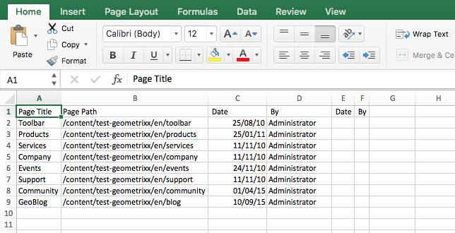

# Exportera till CSV{#export-to-csv}

**Med Skapa CSV-export** kan du exportera information om dina sidor till en CSV-fil på ditt lokala system.

* Den hämtade filen kallas `export.csv`
* Innehållet beror på de egenskaper du väljer.
* Du kan definiera banan tillsammans med exportens djup.

>[!NOTE]
>
>Hämtningsfunktionen och standarddestinationen för webbläsaren används.

Med guiden Skapa CSV-export kan du välja:

* Egenskaper att exportera

   * Metadata

      * Ändrad
      * Publicerad
   * Analyser

      * Sidvyer
      * Unika besökare
      * Tid på sidan

* Djup

   * Överordnad sökväg
   * Endast direktunderordnade
   * Ytterligare nivåer av barn
   * Nivåer

Den resulterande `export.csv` filen kan öppnas i Excel eller något annat kompatibelt program.

Alternativet Skapa **CSV-export** är tillgängligt när du bläddrar i **webbplatskonsolen** (i listvyn): det är ett alternativ i listrutan **Skapa** :

Så här skapar du en CSV-export:

1. Öppna konsolen **Platser** och navigera till önskad plats om det behövs.
1. I verktygsfältet väljer du **Skapa** och sedan **CSV-export** för att öppna guiden:

   

1. Välj de egenskaper som ska exporteras.
1. Välj **Skapa**.

