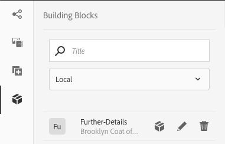

# Experience Fragments{#experience-fragments}

>[!CAUTION]
>
>AEM 6.4 har nått slutet på den utökade supporten och denna dokumentation är inte längre uppdaterad. Mer information finns i [teknisk supportperiod](https://helpx.adobe.com/support/programs/eol-matrix.html). Hitta de versioner som stöds [här](https://experienceleague.adobe.com/docs/).

Ett Experience Fragment är en grupp med en eller flera komponenter, inklusive innehåll och layout, som kan refereras till på sidor. De kan innehålla alla komponenter.

An Experience Fragment:

* Är en del av en upplevelse (sida).
* Kan användas på flera sidor.
* Är baserad på en mall (endast redigerbar) för att definiera struktur och komponenter.
* Består av en eller flera komponenter, med layout, i ett styckesystem.
* Kan innehålla andra upplevelsefragment.
* Kan kombineras med andra komponenter (inklusive andra Experience Fragments) för att skapa en komplett sida (upplevelse).
* Kan ha olika variationer, som kan dela innehåll och/eller komponenter.
* Kan delas upp i byggstenar som kan användas i flera varianter av fragmentet.

Du kan använda Experience Fragments:

* Om en författare vill återanvända delar (ett fragment av en upplevelse) av en sida måste de kopiera och klistra in det fragmentet. Att skapa och underhålla dessa klipp-och-klistra-upplevelser är tidskrävande och leder ofta till användarfel. Upplevelsefragment eliminerar behovet av att kopiera/klistra in.
* För att stödja headless CMS-fallstudier. Författare vill bara använda AEM för att skapa, men inte för att leverera till kunden. Ett system/kontaktyta från tredje part skulle förbruka upplevelsen och sedan leverera till slutanvändaren.

>[!NOTE]
>
>Skrivåtkomst för upplevelsefragment kräver att användarkontot är registrerat i gruppen:
>
>`experience-fragments-editors`
>
>Kontakta systemadministratören om du har problem.

## När ska ni använda upplevelsefragment? {#when-should-you-use-experience-fragments}

Experience Fragments ska användas:

* När ni vill återanvända upplevelser.

   * Upplevelser som återanvänds med samma eller liknande innehåll

* När du använder AEM som en innehållsleveransplattform för tredje part.

   * Alla lösningar som vill använda AEM som plattform för innehållsleverans
   * Bädda in innehåll i kontaktpunkter från tredje part

* Om du har en upplevelse med olika variationer eller renderingar.

   * Kanal- eller kontextspecifika varianter
   * Upplevelser som är bra att gruppera (till exempel en kampanj med olika upplevelser i olika kanaler)

* När ni använder Omnichannel Commerce.

   * Dela handelsrelaterat innehåll i sociala medier i stor skala
   * Göra kontaktytor transaktionella

## Organisera dina upplevelsefragment {#organizing-your-experience-fragments}

Det rekommenderas att
* använda mappar för att ordna dina upplevelsefragment,

* [konfigurera tillåtna mallar för dessa mappar](#configure-allowed-templates-folder).

Om du skapar mappar kan du:

* skapa en meningsfull struktur för era Experience Fragments, t.ex. efter klassificering

   >[!NOTE]
   >
   >Det är inte nödvändigt att anpassa strukturen för dina Experience Fragments till sidstrukturen på din plats.

* [allokera tillåtna mallar på mappnivå](#configure-allowed-templates-folder)

   >[!NOTE]
   >
   >Du kan använda [mallredigerare](/help/sites-authoring/templates.md) för att skapa en egen mall.

I följande exempel visas Experience Fragments som strukturerats enligt `Contributors`. Den struktur som används visar också hur andra funktioner, som Multi Site Management (inklusive språkkopior), kan användas.

>[!CAUTION]
>
>Följande skärmbild togs från WKND-webbplatsen med Adobe Experience Manager as a Cloud Service.

## Skapa och konfigurera en mapp för dina Experience Fragments {#creating-and-configuring-a-folder-for-your-experience-fragments}

Om du vill skapa och konfigurera en mapp för dina Experience Fragments bör du:

1. [Skapa en mapp](/help/sites-authoring/managing-pages.md#creating-a-new-folder).

1. [Konfigurera tillåtna Experience Fragment-mallar för den mappen](#configure-allowed-templates-folder).

>[!NOTE]
>
>Det går också att konfigurera [Tillåtna mallar för din instans](#configure-allowed-templates-instance), men den här metoden är **not** rekommenderas eftersom värdena kan skrivas över vid uppgradering.

### Konfigurera tillåtna mallar för mappen {#configure-allowed-templates-folder}

>[!NOTE]
>
>Detta är den rekommenderade metoden för att ange **[!UICONTROL Allowed Templates]**, eftersom värdena inte skrivs över vid uppgraderingen.

1. Navigera till önskad **[!UICONTROL Experience Fragments]** mapp.

1. Markera mappen och sedan **[!UICONTROL Properties]**.

1. Ange det reguljära uttrycket för hämtning av de nödvändiga mallarna i **[!UICONTROL Allowed Templates]** fält.

   Till exempel:
   `/conf/(.*)/settings/wcm/templates/experience-fragment(.*)?`

   

1. Välj **[!UICONTROL Save and Close]**.

### Konfigurera tillåtna mallar för din instans {#configure-allowed-templates-instance}

>[!CAUTION]
>
>Vi rekommenderar inte att du ändrar **[!UICONTROL Allowed Templates]** den här metoden eftersom de angivna mallarna kan skrivas över vid uppgradering.
>
>Använd den här dialogrutan endast i informationssyfte.

1. Navigera till önskad **[!UICONTROL Experience Fragments]** konsol.

1. Välj **[!UICONTROL Configuration options]**:

   

1. Ange de mallar som krävs i **[!UICONTROL Configure Experience Fragments]** dialog:

   

1. Välj **[!UICONTROL Save]**.

## Skapa ett upplevelsefragment {#creating-an-experience-fragment}

Så här skapar du ett Experience Fragment:

1. Välj **[!UICONTROL Experience Fragments]** från Global Navigation.

   

1. Navigera till önskad mapp och markera **[!UICONTROL Create]**.

1. Välj **[!UICONTROL Experience Fragment]** för att öppna **[!UICONTROL Create Experience Fragment]** guide.

   Välj önskat **[!UICONTROL Template]** sedan **[!UICONTROL Next]**:

   

1. Ange **[!UICONTROL Properties]** för er Experience Fragment.

   A **[!UICONTROL Title]** är obligatoriskt. Om **[!UICONTROL Name]** är tom kommer den att härledas från **[!UICONTROL Title]**.

   

1. Klicka på **[!UICONTROL Create]**.

   Ett meddelande visas. Välj:

   * **[!UICONTROL Done]** för att återgå till konsolen
   * **[!UICONTROL Open]** för att öppna fragmentredigeraren

## Redigera din upplevelsefragment {#editing-your-experience-fragment}

Experience Fragment Editor har funktioner som liknar den vanliga sidredigeraren. Se [Redigera sidinnehåll](/help/sites-authoring/editing-content.md) om du vill ha mer information om hur du använder den.

Följande exempelprocedur visar hur du skapar ett teaser för en produkt:

1. Dra och släpp en **[!UICONTROL Category Teaser]** från [Komponentbläddraren](/help/sites-authoring/author-environment-tools.md#components-browser).

   

1. Välj **[[!UICONTROL Configure]](/help/sites-authoring/editing-content.md#edit-configure-copy-cut-delete-paste)** i komponentens verktygsfält.
1. Lägg till **[!UICONTROL Asset]** och definiera **[!UICONTROL Properties]** efter behov.
1. Bekräfta definitionerna med **[!UICONTROL Done]** (bockikon).
1. Lägg till fler komponenter efter behov.

## Skapa en upplevelsefragmentvariant {#creating-an-experience-fragment-variation}

Ni kan skapa variationer av ert Experience Fragment, beroende på era behov:

1. Öppna fragmentet för [redigera](/help/sites-authoring/experience-fragments.md#editing-your-experience-fragment).
1. Öppna **[!UICONTROL Variations]** -fliken.

   

1. **Skapa** kan du skapa:

   * **[!UICONTROL Variation]**
   * **[!UICONTROL Variation as live-copy]**.

1. Definiera de nödvändiga egenskaperna:

   * **[!UICONTROL Template]**
   * **[!UICONTROL Title]**
   * **[!UICONTROL Name]**; om det lämnas tomt kommer det att härledas från titeln
   * **[!UICONTROL Description]**
   * **[!UICONTROL Variation tags]**

   

1. Bekräfta med **[!UICONTROL Done]** (bock-ikon) visas den nya varianten på panelen:

   

## Använda ditt Experience Fragment {#using-your-experience-fragment}

Nu kan du använda din Experience Fragment när du redigerar dina sidor:

1. Öppna en sida för redigering.

   Till exempel: [http://localhost:4502/editor.html/content/we-retail/language-masters/en/products/men.html](http://localhost:4502/editor.html/content/we-retail/language-masters/en/products/men.html)

1. Skapa en instans av Experience Fragment-komponenten genom att dra komponenten från komponentwebbläsaren till sidstyckesystemet:

   

1. Lägg till den faktiska Experience Fragment-funktionen i komponentinstansen. antingen:

   * Dra det önskade fragmentet från Resursläsaren och släpp det på komponenten
   * Välj **[!UICONTROL Configure]** från komponentverktygsfältet och ange vilket fragment som ska användas, bekräfta med **Klar** (tick)

   

   >[!NOTE]
   >
   >Redigera i komponentverktygsfältet fungerar som ett kortkommando för att öppna fragmentet i fragmentredigeraren.

## Byggblock {#building-blocks}

Du kan välja en eller flera komponenter för att skapa en byggsten för återvinning i fragmentet:

### Skapa ett byggblock {#creating-a-building-block}

Så här skapar du ett nytt byggblock:

1. Välj de komponenter som du vill återanvända i Experience Fragment-redigeraren:

   

1. Välj **[!UICONTROL Convert to building block]**:

   

   Till exempel:

   

1. Ange namnet på **[!UICONTROL Building Block]** och bekräfta med **[!UICONTROL Convert]**:

   

1. **Byggblocket** visas på fliken och kan markeras i styckesystemet:

   

### Hantera ett byggblock {#managing-a-building-block}

Byggblocket visas i **[!UICONTROL Building Blocks]** -fliken. Följande åtgärder är tillgängliga för varje block:

* Gå till master: öppna mastervarianten på en ny flik
* Byt namn
* Ta bort

### Använda ett byggblock {#using-a-building-block}

Du kan dra byggblocket till styckesystemet för vilket fragment som helst, precis som med vilken komponent som helst.

## The Plain HTML Rendition {#the-plain-html-rendition}

Använda `.plain.` -väljaren i URL-adressen kan du komma åt den vanliga HTML-återgivningen.

Det här är tillgängligt från webbläsaren, men det främsta syftet är att tillåta andra program (till exempel webbprogram från tredje part, anpassade mobilimplementeringar) att komma åt innehållet i Experience Fragment direkt, med enbart URL:en.

Den rena HTML-renderingen lägger till protokoll, värd och kontextsökväg till sökvägar som är:

* av typen: `src`, `href`, eller `action`

* eller avsluta med: `-src`, eller `-href`

Till exempel:

`.../brooklyn-coat/master.plain.html`

>[!NOTE]
>
>Länkar refererar alltid till publiceringsinstansen. De är avsedda att användas av tredje part, så länken anropas alltid från publiceringsinstansen, inte författaren.

## Exportera Experience Fragments {#exporting-experience-fragments}

Som standard levereras Experience Fragments i HTML-format. Detta kan användas av både AEM och tredjepartskanaler.

HTML används för export till Adobe Target. Se [Målintegrering med upplevelsefragment](/help/sites-administering/experience-fragments-target.md) för fullständig information.
