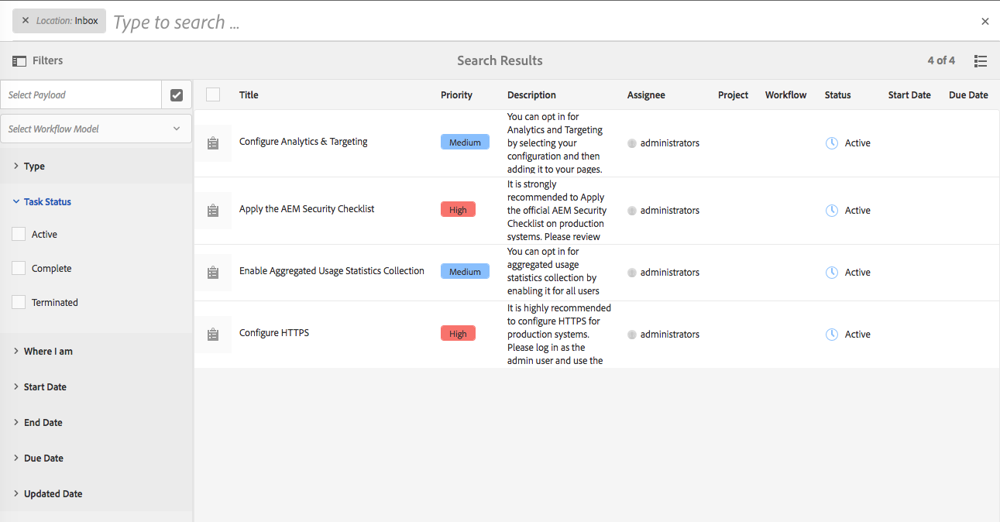

# Din inkorg{#your-inbox}

Du kan få meddelanden från olika AEM, inklusive arbetsflöden och projekt. om:

* Uppgifter:

   * dessa kan också skapas vid olika punkter i det AEM användargränssnittet, till exempel under **Projekt**,
   * dessa kan vara produkten av ett **steg i Skapa uppgift** eller **Skapa projektuppgift**.

* Arbetsflöden:

   * Arbetsobjekt som representerar åtgärder som du måste utföra på sidinnehåll.

      * det här är produkten av arbetsflödet **Deltagare** steg
   * felobjekt, så att administratörer kan försöka utföra det misslyckade steget igen.

Du får dessa meddelanden i din egen Inkorg där du kan visa dem och vidta åtgärder.

>[!NOTE]
>
>AEM levereras förinläst med administrativa uppgifter som tilldelats administratörsanvändargruppen. Mer information finns i [Administrativa åtgärder som inte är tillgängliga](#out-of-the-box-administrative-tasks).

>[!NOTE]
>
>Mer information om objekttyperna finns även i:
>
>* [Projekt](/help/sites-authoring/touch-ui-managing-projects.md)
>* [Projekt - arbeta med uppgifter](/help/sites-authoring/task-content.md)
>* [Arbetsflöden](/help/sites-authoring/workflows.md)
>* [Forms](/help/forms/home.md)

>

## Inkorgen i sidhuvudet {#inbox-in-the-header}

Från någon av konsolerna visas det aktuella antalet objekt i din inkorg i sidhuvudet. Indikatorn kan också öppnas för att ge snabb åtkomst till sidan/sidorna som kräver åtgärder eller åtkomst till inkorgen:

>[!NOTE]
>
>Vissa åtgärder visas också i [kortvyn för den aktuella resursen](/help/sites-authoring/basic-handling.md#card-view).

## Administrativa åtgärder som inte är tillgängliga {#out-of-the-box-administrative-tasks}

Färdiga AEM levereras förinläst med fyra uppgifter tilldelade till administratörsanvändargruppen.

* [Konfigurera analys och målgruppsanpassning](/help/sites-administering/opt-in.md)
* [Använd AEM checklista](/help/sites-administering/security-checklist.md)
* Aktivera insamling av aggregerad användningsstatistik
* [Konfigurera HTTPS](/help/sites-administering/ssl-by-default.md)

## Öppnar inkorgen {#opening-the-inbox}

Så här öppnar du AEM inkorg:

1. Klicka/tryck på indikatorn i verktygsfältet.

1. Välj **Visa alla**. **AEM -inkorgen** öppnas. I inkorgen visas objekt från arbetsflöden, projekt och uppgifter.
1. Standardvyn är [Listvy](#inbox-list-view), men du kan även växla till [Kalendervy](#inbox-calendar-view). Detta görs med vyväljaren (verktygsfält, överst till höger).

   För båda vyerna kan du även definiera [Visa inställningar](#inbox-view-settings); vilka alternativ som är tillgängliga beror på den aktuella vyn.

   

>[!NOTE]
>
>Inkorgen fungerar som en konsol, och du kan använda [Global navigering](/help/sites-authoring/basic-handling.md#global-navigation) eller [Sök](/help/sites-authoring/search.md) för att navigera till en annan plats när du är klar.

### Inkorg - listvy {#inbox-list-view}

I den här vyn visas alla objekt tillsammans med viktig relevant information:

### Inkorg - kalendervy {#inbox-calendar-view}

I den här vyn visas objekt efter deras placering i kalendern och den exakta vyn som du har valt:

Du kan:

* välja en specifik vy, **Tidslinje**, **Kolumn**, **Lista**

* Ange vilka uppgifter som ska visas enligt **Schema**; **Alla**, **Planerade**, **Pågår**, **Förfaller snart**, **Förfallna**

* detaljgranska för mer detaljerad information om ett objekt
* markera ett datumintervall som vyn ska fokuseras i:

### Inkorg - Visa inställningar {#inbox-view-settings}

För båda vyerna (List och Calendar) kan du definiera inställningar:

* **Kalendervy**

   För **Kalendervy** kan du konfigurera:

   * **Gruppera efter**
   * **Schema** eller **Ingen**
   * **Kortstorlek**

   

* **Listvy**

   För **listvyn** kan du konfigurera sorteringsmekanismen:

   * **Sortera efter**
   * **Sorteringsordning**

   

## Vidta åtgärder för ett objekt {#taking-action-on-an-item}

1. Om du vill utföra en åtgärd för ett objekt markerar du miniatyrbilden för det aktuella objektet. Ikoner för de åtgärder som är tillämpliga på det objektet visas i verktygsfältet:

   

   Åtgärderna är lämpliga för objektet och omfattar:

   * **** Slutförande. till exempel en uppgift eller ett arbetsflödesobjekt.
   * **Tilldela** om/**** delegera objekt.
   * **Öppen** post Beroende på objekttypen kan den här åtgärden:

      * visa objektegenskaperna
      * öppna en lämplig kontrollpanel eller guide för ytterligare åtgärder
      * öppna relaterad dokumentation
   * **Gå** tillbaka till ett tidigare steg.
   * Visa nyttolasten för ett arbetsflöde.
   * Skapa ett projekt från objektet.

   >[!NOTE]
   >
   >Mer information finns i:
   >
   >* Arbetsflödesobjekt - [Delta i arbetsflöden](/help/sites-authoring/workflows-participating.md)

1. Beroende på vilket objekt som valts kommer en åtgärd att startas; till exempel:

   * en dialogruta som är lämplig för åtgärden öppnas.
   * en åtgärdsguide startas.
   * en dokumentationssida öppnas.

   **Tilldela om** öppnar till exempel en dialogruta:

   

   Beroende på om en dialogruta, guide, dokumentationssida har öppnats kan du:

   * Bekräfta lämpliga åtgärder. t.ex. Tilldela igen.
   * Avbryt åtgärden.
   * Bakpil: Om en åtgärdsguide eller dokumentationssida till exempel har öppnats kan du gå tillbaka till Inkorgen.

## Skapar en aktivitet {#creating-a-task}

I inkorgen kan du skapa uppgifter:

1. Välj **Skapa** och sedan **Aktivitet**.
1. Fyll i de nödvändiga fälten på flikarna **Basic** och **Advanced**. endast **Titeln** är obligatorisk, alla andra är valfria:

   * **Grundläggande**:

      * **Titel**
      * **Projekt**
      * **Tilldelad**
      * **Innehåll**; liknar Nyttolast är detta en referens från aktiviteten till en plats i databasen
      * **Beskrivning**
      * **Aktivitetsprioritet**
      * **Startdatum**
      * **Förfallodatum**

   

   * **Avancerat**

      * **Namn**: detta kommer att användas för att skapa URL:en, om det är tomt baseras den på  **titeln**.

   

1. Välj **Skicka**.

## Skapa ett projekt {#creating-a-project}

För vissa uppgifter kan du skapa ett [projekt](/help/sites-authoring/projects.md) baserat på den uppgiften:

1. Välj lämplig åtgärd genom att trycka/klicka på miniatyrbilden.

   >[!NOTE]
   >
   >Endast uppgifter som skapats med alternativet **Skapa** i **Inkorgen** kan användas för att skapa ett projekt.
   >
   >Arbetsobjekt (från ett arbetsflöde) kan inte användas för att skapa ett projekt.

1. Välj **Skapa projekt** i verktygsfältet för att öppna guiden.
1. Välj lämplig mall och **Nästa**.
1. Ange de nödvändiga egenskaperna:

   * **Grundläggande**

      * **Titel**
      * **Beskrivning**
      * **Startdatum**
      * **Förfallodatum**
      * **** Användarroll
   * **Avancerat**

      * **Namn**
   >[!NOTE]
   >
   >Mer information finns i [Skapa ett projekt](/help/sites-authoring/touch-ui-managing-projects.md#creating-a-project).

1. Välj **Skapa** för att bekräfta åtgärden.

## Filtrera objekt i AEM Inkorg {#filtering-items-in-the-aem-inbox}

Du kan filtrera objekten i listan:

1. Öppna **AEM Inkorg**.

1. Öppna filterväljaren:

   

1. Du kan filtrera de listade objekten enligt ett antal kriterier, varav många kan förfinas; till exempel:

   

   >[!NOTE]
   >
   >Med [Visa inställningar](#inbox-view-settings) kan du även konfigurera sorteringsordningen när du använder [listvyn](#inbox-list-view).

