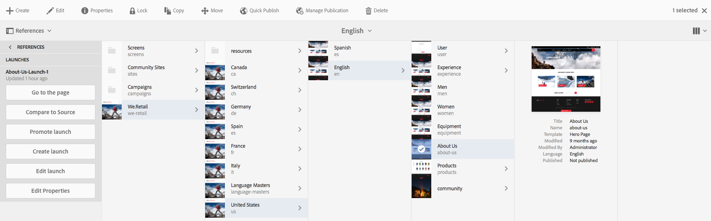
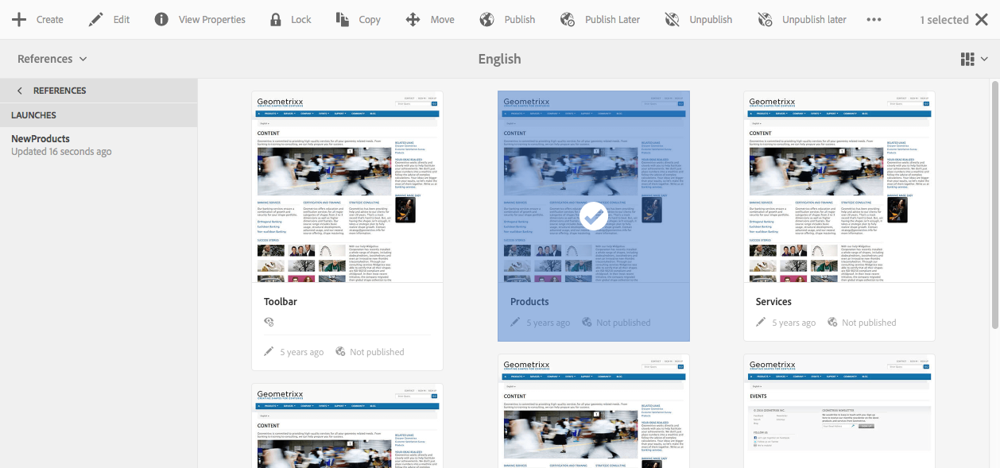

# Redigera Launches{#editing-launches}

>[!CAUTION]
>
>AEM 6.4 har nått slutet på den utökade supporten och denna dokumentation är inte längre uppdaterad. Mer information finns i [teknisk supportperiod](https://helpx.adobe.com/support/programs/eol-matrix.html). Hitta de versioner som stöds [här](https://experienceleague.adobe.com/docs/).

## Redigera startsidor {#editing-launch-pages}

När en startsida har skapats för en sida (eller en uppsättning sidor) kan du redigera innehållet i startkopian av sidorna.

1. Öppna [Starta från referenser (platskonsolen)](/help/sites-authoring/launches.md#launches-in-references-sites-console) för att visa tillgängliga åtgärder.
1. Välj **Gå till sidan** för att öppna sidan för redigering.

### Redigera startsidor som är beroende av en Live-kopia {#editing-launch-pages-subject-to-a-live-copy}

Om din lansering baseras på en [live copy](/help/sites-administering/msm.md) då kommer du att:

* se låssymboler (små hänglås) när du redigerar en komponent (innehåll och/eller egenskaper).
* se **Live Copy** tabba in **Sidegenskaper**

En live-kopia används för att synkronisera innehåll *från* källgrenen *till* startgrenen (för att hålla startsidan uppdaterad med ändringarna i källan).

Du kan göra ändringar på samma sätt som du kan redigera en vanlig Live-kopia; till exempel:

* Om du klickar på ett stängt hänglås bryts synkroniseringen och du kan göra nya uppdateringar av innehållet när du startar programmet. När du har låst upp (öppet hänglås) skrivs inte ändringarna över av ändringar som gjorts på samma plats i källgrenen.
* **Gör uppehåll i** (och **återuppta**) arv för en viss sida.

Se [Ändra innehåll i Live Copy](/help/sites-administering/msm-livecopy.md#changing-live-copy-content) för ytterligare information.

## Jämföra en startsida med dess källsida {#comparing-a-launch-page-to-its-source-page}

Om du vill spåra de ändringar du har gjort kan du visa startsidan i **Referenser** och jämföra startsidan med dess källsida:

1. I **Webbplatser** konsol, [navigera till startsidan och markera den](/help/sites-authoring/basic-handling.md#viewing-and-selecting-resources).
1. Öppna **[Referenser](/help/sites-authoring/basic-handling.md#references)** panel och markera **Startar**.
1. Välj en specifik start och sedan **Jämför med källa**:

   

1. De två sidorna (start och källa) öppnas sida vid sida.

   Mer information om hur du använder funktionen finns i [Sidskillnader](/help/sites-authoring/page-diff.md).

## Ändra använda källsidor {#changing-the-source-pages-used}

Du kan när som helst lägga till eller ta bort sidor till/från intervallet med källsidor för en start:

1. Öppna och välj programstart från:

   * den [Startar konsolen](/help/sites-authoring/launches.md#the-launches-console):

      * Välj **Redigera**.
   * [Referenser (platskonsolen)](/help/sites-authoring/launches.md#launches-in-references-sites-console) för att visa tillgängliga åtgärder:

      * Välj **Redigera start**.

   Källsidorna visas.

1. Gör önskade ändringar och bekräfta sedan med **Spara**.

   >[!NOTE]
   >
   >Om du vill lägga till sidor i en programstart måste de ligga under en gemensam språkrot. dvs. inom en enda plats.

## Redigera en startkonfiguration {#editing-a-launch-configuration}

Du kan när som helst redigera egenskaperna för en start:

1. Öppna och välj programstart från:

   * den [Startar konsolen](/help/sites-authoring/launches.md#the-launches-console):

      * Välj **Egenskaper**.
   * [Referenser (platskonsolen)](/help/sites-authoring/launches.md#launches-in-references-sites-console) för att visa tillgängliga åtgärder:

      * Välj **Redigera egenskaper**.

   Detaljerna visas.

1. Gör önskade ändringar och bekräfta sedan med **Spara**.

   Avsnittet [Startsidor och händelseordning](/help/sites-authoring/launches.md#launches-the-order-of-events) innehåller information om syftet med och interaktionen mellan fälten **Startdatum** och **Produktionsklar**.

## Identifiera startstatus för en sida {#discovering-the-launch-status-of-a-page}

Statusen visas när du väljer en viss start på fliken Inställningar (se [Startar i referenser (platskonsolen)](/help/sites-authoring/launches.md#launches-in-references-sites-console)).

