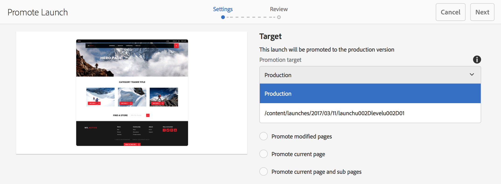

# Marknadsföra Launches{#promoting-launches}

>[!CAUTION]
>
>AEM 6.4 har nått slutet på den utökade supporten och denna dokumentation är inte längre uppdaterad. Mer information finns i [teknisk supportperiod](https://helpx.adobe.com/support/programs/eol-matrix.html). Hitta de versioner som stöds [här](https://experienceleague.adobe.com/docs/).

Du måste befordra startsidor för att kunna flytta tillbaka innehållet till källan (produktionen) innan du publicerar. När en startsida befordras ersätts motsvarande sida på källsidorna med innehållet på den befordrade sidan. Följande alternativ är tillgängliga när du befordrar en startsida:

* Anger om bara den aktuella sidan eller hela programstarten ska befordras.
* Anger om underordnade sidor för den aktuella sidan ska befordras.
* Anger om en fullständig start ska erbjudas eller endast sidor som har ändrats.

>[!NOTE]
>
>När du har befordrat startsidorna till målet (**Produktion**) kan du aktivera **Produktion** sidor som en enhet (för att göra processen snabbare). Lägg till sidorna i ett arbetsflödespaket och använd det som nyttolast för ett arbetsflöde som aktiverar ett sidpaket. Du måste skapa arbetsflödespaketet innan du befordrar starten. Se [Bearbeta befordrade sidor med AEM](#processing-promoted-pages-using-aem-workflow).

>[!CAUTION]
>
>En enstaka programstart kan inte befordras samtidigt. Det innebär att två befordra åtgärder samtidigt vid samma programstart kan resultera i ett fel - `Launch could not be promoted` (tillsammans med konfliktfel i loggen).

>[!CAUTION]
>
>När du befordrar starter för *ändrad* sidor, ändringar i både käll- och startgrenarna beaktas.

## Marknadsför startsidor {#promoting-launch-pages}

>[!NOTE]
>
>Detta omfattar den manuella åtgärden att marknadsföra startsidor när det bara finns en startnivå. Se:
>
>* [Befordra en kapslad start](#promoting-a-nested-launch) när det finns mer än en start i strukturen.
>* [Startar - ordningen för händelser](/help/sites-authoring/launches.md#launches-the-order-of-events) om du vill ha mer information om automatiska kampanjer och publiceringar.
>

Du kan befordra starter från **Webbplatser** konsolen eller **Startar** konsol:

1. Öppna:

   * den **Webbplatser** konsol:

      1. Öppna [referenser, räl](/help/sites-authoring/author-environment-tools.md#references) och välj en källsida med [markeringsläge](/help/sites-authoring/basic-handling.md) (eller markera och öppna referenslinjen är ordningen inte viktig). Alla referenser visas.

      1. Välj **Startar** (t.ex. Launches (1)) för att visa en lista över specifika starter.
      1. Välj den specifika starten för att visa tillgängliga åtgärder.
      1. Välj **Befordra lansering** för att öppna guiden.
   * den **Startar** konsol:

      1. Välj start (tryck/klicka på miniatyrbilden).
      1. Välj **Befordra**.

1. I det första steget kan du ange:

   * **Befordra en fullständig lansering**
   * **Befordra ändrade sidor**
   * **Höj upp aktuell sida**
   * **Befordra aktuella sidor och undersidor**

   Om du t.ex. väljer att bara befordra ändrade sidor:

   

   >[!NOTE]
   >
   >Detta omfattar en enstaka programstart, om du har kapslade programstarter, se [Befordra en kapslad start](#promoting-a-nested-launch).

1. Välj **Nästa** för att fortsätta.
1. Du kan granska de sidor som ska befordras, vilket beror på vilket sidintervall du har valt:

   

1. Välj **Befordra**.

## Befordra startsidor vid redigering {#promoting-launch-pages-when-editing}

När du redigerar en startsida visas **Promote Launch** åtgärd är också tillgänglig från **Sidinformation**. Guiden öppnas för att samla in den information som behövs.

>[!NOTE]
>
>Detta är tillgängligt för enstaka och [kapslade starter](#promoting-a-nested-launch).

## Befordra en kapslad start {#promoting-a-nested-launch}

När du har skapat en kapslad start kan du befordra den tillbaka till någon av källorna, inklusive rotkällan (produktionen).

1. Som med [Skapa en kapslad start](/help/sites-authoring/launches-creating.md#creating-a-nested-launch)navigerar du till och väljer önskad programstart i **Startar** konsolen eller **Referenser** järnväg.
1. Välj **Befordra lansering** för att öppna guiden.

1. Ange nödvändig information:

   * **Erbjudandemål**

      Du kan göra reklam för alla källor.

   * **Omfång**
Här kan du välja om du vill befordra hela starten eller bara sidor som faktiskt har redigerats. Om det är det senare alternativet kan du välja att ta med/exkludera underordnade sidor. Standardkonfigurationen är att endast befordra sidändringar för den aktuella sidan:

      * **Befordra en fullständig lansering**
      * **Befordra ändrade sidor**
      * **Höj upp aktuell sida**
      * **Befordra aktuella sidor och undersidor**

   

1. Välj **Nästa**.
1. Granska kampanjinformationen innan du väljer **Befordra**:

   

   >[!NOTE]
   >
   >Vilka sidor som visas beror på **Omfång** definierade och eventuellt de sidor som har redigerats.

1. Ändringarna kommer att främjas och återspeglas i **Startar** konsol:

   

## Bearbeta befordrade sidor med AEM Workflow {#processing-promoted-pages-using-aem-workflow}

Använd arbetsflödesmodeller för att utföra massbearbetning av befordrade startsidor:

1. Skapa ett arbetsflödespaket.
1. När författare befordrar startsidor lagrar de dem i arbetsflödespaketet.
1. Starta en arbetsflödesmodell med paketet som nyttolast.

Så här startar du ett arbetsflöde automatiskt när sidor befordras: [konfigurera en startfunktion för arbetsflöden](/help/sites-administering/workflows-starting.md#workflows-launchers) för paketnoden.

Du kan t.ex. automatiskt generera begäranden om sidaktivering när författare befordrar startsidor. Konfigurera en startfunktion för arbetsflödet för aktivering av begäran när paketnoden ändras.

