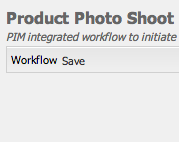

# Kreativt projekt- och PIM-integrering{#creative-project-and-pim-integration}

>[!CAUTION]
>
>AEM 6.4 har nått slutet på den utökade supporten och denna dokumentation är inte längre uppdaterad. Mer information finns i [teknisk supportperiod](https://helpx.adobe.com/support/programs/eol-matrix.html). Hitta de versioner som stöds [här](https://experienceleague.adobe.com/docs/).

Om du är marknadsförare eller kreatör kan du använda verktygen i Adobe Experience Manager (AEM) för att hantera e-handelsrelaterade produktfotografier och tillhörande kreativa processer inom organisationen.

Du kan särskilt använda Creative Project för att effektivisera följande uppgifter i arbetsflödet för fotografering:

* Generera en begäran om fotografering
* Överföra en fototagning
* Samarbeta i en fototagning
* Paketera godkända resurser

>[!NOTE]
>
>Se [Användarroller för projekt för information](/help/sites-authoring/projects.md#user-roles-in-a-project) om hur du tilldelar användarroller och arbetsflöden till vissa typer av användare.

## Utforska arbetsflöden för produktfotografering  {#exploring-product-photo-shoot-workflows}

Creative Project innehåller olika projektmallar som uppfyller olika projektkrav. Mallen **Product Photo Shoot Project **finns redan. Den här mallen innehåller arbetsflöden för fotoplåtning där du kan initiera och hantera begäranden om produktfotografering. Det innehåller även en rad uppgifter som gör att du kan få digitala bilder för produkter genom lämpliga gransknings- och godkännandeprocesser.

Mallen innehåller följande arbetsflöden:

* **Arbetsflöde för produktfototagning (e-handelsintegrering)**: Det här arbetsflödet utnyttjar handelsintegrering med PIM-systemet (product information management) för att automatiskt generera en tagningslista för de valda produkterna (hierarki). Du kan visa produktdata som en del av resursmetadata när arbetsflödet är klart.
* **Arbetsflöde för fotografering**: Med det här arbetsflödet kan du ange en tagningslista i stället för att vara beroende av handelsintegrering. Den mappar de överförda bilderna till en CSV-fil i projektresursmappen.

>[!NOTE]
>
>Den CSV-fil som överförs i listan Upload Shot i arbetsflödet Product Photo Shoot bör ha filnamnet shortList.csv.

## Skapa ett produktfotoprojekt {#create-a-product-photo-shoot-project}

1. I **Projekt** konsol, tryck/klicka **Skapa** och sedan välja **Skapa projekt** från listan.

   

1. I **Skapa projekt** väljer du projektmallen för fotoprojekt och trycker/klickar på **Nästa**.

   

1. Ange projektinformation, inklusive titel, beskrivning och förfallodatum. Lägg till användare och tilldela dem olika roller. Du kan också lägga till en miniatyrbild för projektet.

   

1. Tryck/klicka **Skapa**. Ett bekräftelsemeddelande meddelar att projektet har skapats.
1. Tryck/klicka **Klar** för att gå tillbaka till **Projekt** konsol. Du kan också trycka/klicka **Öppna** för att visa resurserna i fotoprojektet.

## Starta arbete i ett produktfotoprojekt {#starting-work-in-a-product-photo-shoot-project}

Om du vill starta en bildinspelningsförfrågan trycker eller klickar du på ett projekt och sedan på/klickar du **Lägg till arbete** på sidan med projektinformation för att starta ett arbetsflöde.


Ett produktfotoprojekt innehåller följande färdiga arbetsflöden:

* Arbetsflöde för produktfototagning (Commerce Integration)
* Fotofotografering

Använd arbetsflödet för produktfototagning (Commerce Integration) för att mappa bildresurser till produkterna i AEM. Det här arbetsflödet utnyttjar Commerce Integration för att länka de godkända bilderna till befintliga produktdata på platsen */etc/commerce*.

Arbetsflödet för produktfototagning (Commerce Integration) innehåller följande uppgifter:

* Skapa lista över bilder
* Överför fototagning
* Retuschera fototagning
* Granska och godkänn
* Flytta till produktionsuppgift

Om produktinformation inte är tillgänglig i AEM kan du använda arbetsflödet för produktfototagning för att mappa bildresurser med produkterna baserat på den information som du överför i en CSV-fil. CSV-filen måste innehålla grundläggande produktinformation, t.ex. produkt-ID, kategori och beskrivning. Arbetsflödet hämtar godkända resurser för produkterna.

Det här arbetsflödet innehåller följande uppgifter:

* Ladda upp lista över bilder
* Överför fototagning
* Retuschera fototagning
* Granska och godkänn
* Flytta till produktionsuppgift

Du kan anpassa det här arbetsflödet med hjälp av alternativet för arbetsflödeskonfigurationer.

Båda arbetsflödena innehåller steg för att länka produkter till deras godkända resurser. Varje arbetsflöde innehåller följande steg:

* Arbetsflödeskonfiguration: Beskriver alternativen för att anpassa arbetsflödet
* Starta ett projektarbetsflöde: Beskriver hur du startar en produktfototagning
* Information om arbetsflödesuppgifter: Visar information om uppgifter som är tillgängliga i arbetsflödet

## Spåra projektförlopp {#tracking-project-progress}

Du kan följa förloppet för ett projekt genom att övervaka de aktiva/slutförda uppgifterna i ett projekt.

Använd följande för att övervaka förloppet för ett projekt:

* **Uppgiftskort**

* **Uppgiftslista**

Uppgiftskortet visar projektets övergripande förlopp. Det visas bara på sidan Projektinformation om projektet har några relaterade uppgifter. Uppgiftskortet visar projektets aktuella slutförandestatus baserat på antalet slutförda uppgifter. Det omfattar inte framtida uppgifter.

Uppgiftskortet innehåller följande information:

* Procent av aktiva uppgifter
* Procent slutförda uppgifter


Uppgiftslistan innehåller detaljerad information om den aktuella arbetsflödesaktiviteten för projektet. Visa listan genom att trycka/klicka på aktivitetskortet. I uppgiftslistan visas även metadata som startdatum, förfallodatum, tilldelad, prioritet och status för uppgiften.


## Arbetsflödeskonfiguration {#workflow-configuration}

Den här uppgiften innebär att tilldela användare arbetsflödessteg baserat på deras roller.

Så här konfigurerar du **Fotofotografering** arbetsflöde:

1. Navigera till **verktyg** > **Arbetsflöden** och sedan trycker du på **Modeller** för att öppna **Arbetsflödesmodeller** sida.
1. Välj **Fotofotografering** arbetsflöde och tryck på **Redigera** i verktygsfältet för att öppna det i redigeringsläge.

   

1. I **Fotofotografering** öppnar du en projektuppgift. Öppna till exempel **Överför bildlista** uppgift.

   

1. Klicka på **Uppgift** för att konfigurera följande:

   * Namn på uppgiften
   * Standardanvändare (roll) som tar emot uppgiften
   * Uppgiftens standardprioritet, som visas i användarens uppgiftslista
   * Uppgiftsbeskrivning som ska visas när den som tilldelas öppnar uppgiften
   * Förfallodatum för en aktivitet, som beräknas baserat på den tid som aktiviteten startades

1. Klicka **OK** för att spara konfigurationsinställningarna.

   På samma sätt kan du konfigurera följande uppgifter för **Fotofotografering** arbetsflöde:

   * Överför fototagning
   * Retuschera produktfoto
   * Fotofotograferingsgranskning
   * Flytta till produktion

   Utför en liknande procedur för att konfigurera uppgifterna i **Arbetsflöde för produktfototagning (Commerce Integration)**.

I det här avsnittet beskrivs hur du integrerar produktinformationshantering med ditt kreativa projekt.

## Starta ett projektarbetsflöde {#starting-a-project-workflow}

1. Navigera till ett produktfotoprojekt och tryck/klicka på **Lägg till arbete** ikonen på **Arbetsflöden** kort.
1. Välj **Fotofoto (Commerce Integration)** arbetsflödeskort för att starta arbetsflödet för produktfototagning (Commerce Integration). Om produktinformationen inte är tillgänglig under /etc/commerce väljer du **Fotofotografering** arbetsflöde och starta arbetsflödet för produktfotografering.

   

1. Tryck/klicka **Nästa** för att initiera arbetsflödet i projektet.
1. Ange arbetsflödesinformation på nästa sida.

   

   Klicka **Skicka** för att starta arbetsflödet för fotografering. Sidan med projektinformation för fotoprojektet visas.

   

### Information om arbetsflödesuppgifter {#workflow-tasks-details}

Arbetsflödet för fotografering omfattar flera uppgifter. Varje uppgift tilldelas till en användargrupp baserat på den konfiguration som har definierats för uppgiften.

#### Skapa aktivitet för lista över bilder {#create-shot-list-task}

The **Skapa lista över bilder** gör att projektägaren kan välja produkter för vilka bilder krävs. Baserat på det alternativ som användaren valt skapas en CSV-fil som innehåller grundläggande produktinformation.

1. Tryck/klicka på ellipserna i projektmappen i [Aktivitetskort](#tracking-project-progress) om du vill visa uppgiftsobjektet i arbetsflödet.

   

1. Välj **Skapa lista över bilder** och sedan trycka/klicka på **Öppna** -ikonen i verktygsfältet.

   

1. Granska uppgiftsinformationen och tryck/klicka sedan på **Skapa lista över bilder** -knappen.

   

1. Välj produkter för vilka det finns produktdata utan kopplade bilder.

   

1. Tryck/klicka på **Lägg till i scenlista** om du vill skapa en CSV-fil som innehåller en lista över alla sådana produkter. Ett meddelande bekräftar att tagningslistan har skapats för de valda produkterna. Klicka **Stäng** för att slutföra arbetsflödet.
1. När du har skapat en tagningslista visas **Visa lista över bilder** visas. Om du vill lägga till fler produkter i fotolistan trycker du/klickar **Lägg till i lista över bilder**. I det här fallet läggs data till i den ursprungligen skapade tagningslistan.

   

1. Tryck/klicka **Visa lista över bilder** för att visa den nya tagningslistan.

   

   Om du vill redigera befintliga data eller lägga till nya data trycker/klickar du **Redigera** i verktygsfältet. Endast **Product **och **Beskrivning** fält kan redigeras.

   

   När du har uppdaterat filen trycker/klickar du **Spara** i verktygsfältet för att spara filen.

1. När du har lagt till produkterna trycker du på/klickar på **Slutförd** på sidan **Create Shot List **aktivitetsinformation för att markera uppgiften som slutförd. Du kan lägga till en valfri kommentar.

   När aktiviteten har slutförts introduceras följande ändringar i projektet:

   * Resurser som motsvarar produkthierarkin skapas i en mapp med samma namn som arbetsflödets rubrik.
   * Metadata för resurserna kan redigeras med Assets-konsolen, även innan fotografen visar bilderna.
   * Mappen Fototagning skapas som lagrar de bilder som fotografen tillhandahåller. Mappen Fototagning innehåller undermappar för varje produktpost i listan Fototagning.

   För arbetsflödet för produktfototagning (utan integration med andra program) är Upload Shot List den första uppgiften. Tryck/klicka **Överför bildlista** för att överföra en **fillista.csv** -fil. CSV-filen ska innehålla produkt-ID:t. De andra fälten är valfria. Du kan använda dem för att mappa resurser till produkter.

### Uppgift för överföring av lista över bilder {#upload-shot-list-task}

Den här uppgiften ingår i arbetsflödet för produktfotografering. Du utför den här uppgiften om produktinformation inte är tillgänglig i AEM. I det här fallet överför du en lista över produkter i en CSV-fil för vilka bildresurser krävs. Baserat på informationen i CSV-filen kan du mappa bildobjekt till produkterna.

Använd **Visa lista över bilder** under projektkortet i föregående procedur för att hämta en CSV-exempelfil. Granska exempelfilen för att ta reda på det vanliga innehållet i en CSV-fil.

Produktlistan eller CSV-filen kan innehålla fält, t.ex. **Kategori, produkt, ID, beskrivning** och **Bana**. The **ID** fältet är obligatoriskt och innehåller produkt-id:t. De andra fälten är valfria.

En produkt kan tillhöra en viss kategori. Produktkategorin kan listas i CSV-filen under **Kategori** kolumn. The **Produkt** -fältet innehåller namnet på produkten. I **Beskrivning** anger du produktbeskrivningen eller instruktionerna för fotografen.

>[!NOTE]
>
>Namnet på de bilder som ska överföras måste börja med &quot;**&lt;productid>_&quot;** där produkt-ID refereras från **ID** i *fillista.csv* -fil. För en produkt i bildlistan med **ID 397122** kan du överföra filer med namn **397122_highcontrast.jpg**, **397122_lowlight.png** och så vidare.

1. Tryck/klicka på ellipserna i projektmappen i [Aktivitetskort](#tracking-project-progress) om du vill visa en lista med uppgifter i arbetsflödet.
1. Välj **Överför bildlista** och sedan trycka/klicka på **Öppna** -ikonen i verktygsfältet.

   

1. Granska uppgiftsinformationen och tryck/klicka sedan på **Överför bildlista** -knappen.

   

1. Tryck/klicka på **Överför bildlista** om du vill överföra CSV-filen med filnamnet short.csv. Arbetsflödet identifierar den här filen som en källa som kan användas för att extrahera produktdata för nästa uppgift.
1. Överför en CSV-fil som innehåller produktinformation i lämpligt format. Länken **Visa överförda resurser **visas under kortet efter att CSV-filen har överförts.

   

   Klicka på **Slutförd** för att slutföra uppgiften.

1. Tryck/klicka på **Slutförd** för att slutföra uppgiften.

### Ladda upp fototagningsaktivitet {#upload-photo-shoot-task}

Om du är redigerare kan du överföra bilder för de produkter som listas i **fillista.csv** som skapades eller överfördes i föregående uppgift.

Namnet på de bilder som ska överföras ska börja med **&quot;&lt;productid>_&quot;** där produkt-ID refereras från **ID** i **fillista.csv** -fil. För en produkt med **ID 397122** i tagningslistan kan du överföra filer med namn **397122_highcontrast.jpg**, **397122_lowlight.png** och så vidare.

Du kan antingen överföra bilderna direkt eller överföra en ZIP-fil som innehåller bilderna. Baserat på deras namn placeras bilderna i respektive produktmapp i **Fototagning** mapp.

1. Under projektmappen trycker/klickar du på ellipserna i [Aktivitetskort](#tracking-project-progress) om du vill visa uppgiftsobjektet i arbetsflödet.
1. Välj **Överför fototagning** och sedan trycka/klicka på **Öppna** -ikonen i verktygsfältet.

   

1. Tryck/klicka på **Överför fototagning **och överför fototagningsbilderna.
1. Tryck/klicka på **Slutförd** ikonen i verktygsfältet för att slutföra uppgiften.

### Retuschera fototagningsaktivitet {#retouch-photo-shoot-task}

Om du har redigeringsbehörighet utför du åtgärden Retuschera fototagning för att redigera de bilder som överförts till mappen Fototagning.

1. Under projektmappen trycker/klickar du på ellipserna i [Aktivitetskort](#tracking-project-progress) om du vill visa uppgiftsobjektet i arbetsflödet.
1. Välj **Retuschera fototagning** och sedan trycka/klicka på **Öppna** -ikonen i verktygsfältet.

   

1. Tryck/klicka på **Visa överförda resurser** i **Retuschera fototagning** för att bläddra bland de överförda bilderna.

   

   Om det behövs kan du redigera bilderna i ett Adobe Creative Cloud-program.

   

1. Tryck/klicka på **Slutförd** ikonen i verktygsfältet för att slutföra uppgiften.

### Granska och godkänn uppgift {#review-and-approve-task}

I det här fallet granskar du fotot som överförts av en fotograf och markerar bilderna som godkända för användning.

1. Under projektmappen trycker/klickar du på ellipserna i [Aktivitetskort](#tracking-project-progress) om du vill visa uppgiftsobjektet i arbetsflödet.
1. Välj **Granska och godkänn** och sedan trycka/klicka på **Öppna** -ikonen i verktygsfältet.

   

1. I **Granska och godkänn** tilldelar du granskningsaktiviteten till roll, till exempel Granskare, och sedan trycker/klickar du på **Review **för att börja granska de överförda produktbilderna.

   

1. Välj en produktbild och tryck/klicka på ikonen Godkänn i verktygsfältet för att markera den som godkänd.

   

   När du har godkänt en bild visas en godkänd banderoll över den.

   >[!NOTE]
   Du kan utelämna vissa produkter utan någon bild. Senare kan du göra om uppgiften och markera den som slutförd när den är klar.

1. Tryck/klicka **Slutförd**. De godkända bilderna länkas till de tomma resurserna som skapades.

Du kan navigera till projektresurser med resursgränssnittet och verifiera godkända bilder.

Tryck/klicka på nästa nivå om du vill visa produkter enligt din produktdatahierarki.

Creative Project associerar godkända resurser med den refererade produkten. Metadata för resursen uppdateras med produktreferens och grundläggande information på fliken **Produktdata **under resursegenskaper som visas i avsnittet AEM.

>[!NOTE]
I arbetsflödet för produktfototagning (utan integration med andra program) har de godkända bilderna ingen koppling till produkterna.

### Flytta till produktionsuppgift {#move-to-production-task}

Den här aktiviteten flyttar de godkända resurserna till den produktionsklara mappen så att de blir tillgängliga för användning.

1. Under projektmappen trycker/klickar du på ellipserna i [Aktivitetskort](#tracking-project-progress) om du vill visa uppgiftsobjektet i arbetsflödet.
1. Välj **Flytta till produktion** och sedan trycka/klicka på **Öppna** -ikonen i verktygsfältet.

   

1. Om du vill visa godkända resurser för fototagningen innan du flyttar dem till produktionsklar mapp klickar du på knappen **Visa godkända resurser** länk under projektets miniatyrbild på sidan **Flytta till produktion** aktivitetssida.

   

1. Ange sökvägen till den produktionsklara mappen i **Flytta till** fält.

   

   Tryck/klicka **Flytta till produktion**. Stäng bekräftelsemeddelandet. Resurserna flyttas till den angivna sökvägen och en snurruppsättning skapas automatiskt för de godkända resurserna för varje produkt baserat på mapphierarkin.

1. Tryck/klicka på **Slutförd** -ikonen i verktygsfältet. Arbetsflödet slutförs när det sista steget markeras som slutfört.

## Visa DAM-resursmetadata {#viewing-dam-asset-metadata}

När du har godkänt mediefilerna länkas de till motsvarande produkter. The [Egenskaper](/help/assets/managing-assets-touch-ui.md#editing-properties) av de godkända tillgångarna har nu ytterligare **Produktdata** (länkad produktinformation). På den här fliken visas produktinformation, SKU-nummer och annan produktrelaterad information som länkar resursen. Tryck/klicka på **Redigera** om du vill uppdatera en resursegenskap. Produktrelaterad information förblir skrivskyddad.

Tryck/klicka på länken som visas för att navigera till respektive produktinformationssida i produktkonsolen som resursen är associerad med.

## Anpassa arbetsflödena för projektfototagning {#customizing-the-project-photo-shoot-workflows}

Du kan anpassa arbetsflödena för projektfototagning baserat på behov. Detta är en valfri rollbaserad uppgift som du utför för att ange värdet för en variabel i projektet. Senare kan du använda det konfigurerade värdet för att komma fram till ett beslut.

1. Klicka/tryck på AEM logotyp och navigera sedan till **verktyg** > **Arbetsflöde** > **Modeller** för att öppna sidan Arbetsflödesmodeller.
1. Välj **Fotofoto (Commerce Integration)** arbetsflöde eller **Fotofotografering** arbetsflöde och klicka/peka **Redigera** i verktygsfältet för att öppna arbetsflödet i redigeringsläge.
1. Öppna **Projekt** uppgifter i sidosparken och dra **Skapa rollbaserad projektaktivitet** steg till arbetsflödet.

   

1. Öppna **Rollbaserad aktivitet** steg.
1. I **Uppgift** anger du ett namn för uppgiften som ska visas på fliken **Uppgift** Lista. Du kan också tilldela en roll uppgiften, ange standardprioritet, ange en beskrivning och ange en tidpunkt när uppgiften förfaller.

   

1. I **Routning** anger du åtgärderna för uppgiften. Om du vill lägga till flera åtgärder trycker/klickar du på länken **Lägg till objekt **.

   

1. När du har lagt till alternativen klickar du på **OK** om du vill lägga till ändringarna i steget.

   >[!NOTE]
   Tryck/klicka **OK** sparar inte ändringarna i arbetsflödet. Om du vill spara ändringarna i arbetsflödet trycker du/klickar **Spara**.

1. Öppna **Arbetsflöde** aktiviteter från sidokickning och lägga till en **Gå** uppgift.
1. Öppna **Gå** och trycka/klicka på **Process** -fliken.
1. Ange följande kod i dialogrutan **Skript** box:

```
   function check() {

   if (workflowData.getMetaDataMap().get("lastTaskAction","") == "Reject All") {

   return true

   }

   // set copywriter user in metadata

   var previousId = workflowData.getMetaDataMap().get("lastTaskCompletedBy", "");

   workflowData.getMetaDataMap().put("copywriter", previousId);

   return false;

   }
```

>[!NOTE]
Mer information om skript i arbetsflödessteg finns i [Definiera en regel för en OR-delning](/help/sites-developing/workflows-models.md).


1. Tryck/klicka **OK**.

1. Tryck/klicka **Spara** för att spara arbetsflödet.

   

1. En ny accepterande uppgift för projektägare visas nu efter [Flytta till produktionsuppgift](#move-to-production-task) har slutförts och tilldelats ägaren.

   Användaren i rollen Ägare kan slutföra uppgiften och välja en åtgärd (från listan med åtgärder som lagts till i arbetsflödesstegskonfigurationerna) i listan i kommentarspopup-fönstret.

   

   Välj lämpligt alternativ och klicka på **Slutförd** för att köra **Gå till steg** i arbetsflödet.

>[!NOTE]
När du startar en server cachelagrar uppgiftslistservleten mappningarna mellan uppgiftstyper och URL:er som definieras under `/libs/cq/core/content/projects/tasktypes`. Sedan kan du utföra den vanliga övertäckningen och lägga till egna uppgiftstyper genom att placera dem under `/apps/cq/core/content/projects/tasktypes`.
