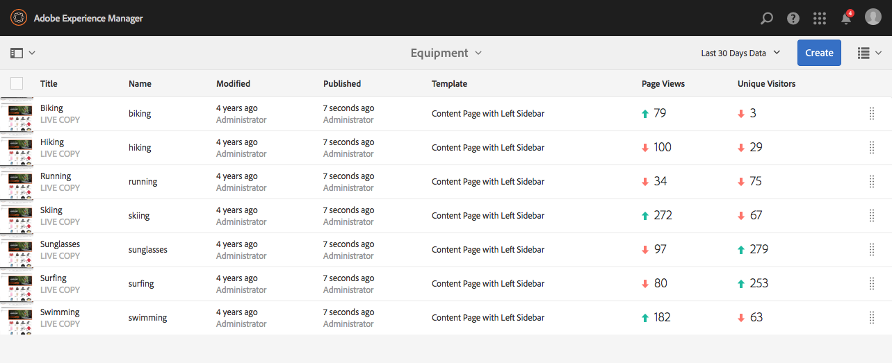
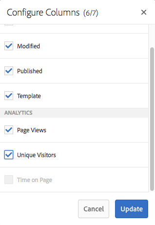

# Visa sidanalysdata{#seeing-page-analytics-data}

Använd sidanalysdata för att mäta hur effektivt sidinnehållet är.

## Analyser visas från konsolen {#analytics-visible-from-the-console}

Sidanalysdata visas i [listvyn](/help/sites-authoring/basic-handling.md#list-view) i webbplatskonsolen. När sidorna visas i listformat är följande kolumner tillgängliga som standard:

* Sidvyer
* Unika besökare
* Tid på sidan

Varje kolumn visar ett värde för den aktuella rapporteringsperioden och anger också om värdet har ökat eller minskat sedan den föregående rapporteringsperioden. De data du ser uppdateras var tolfte timme.

>[!NOTE]
>
>Om du vill ändra uppdateringsperioden [konfigurerar du importintervallet](/help/sites-administering/adobeanalytics-connect.md#configuring-the-import-interval).

1. Öppna **Sites** Console; till exempel [http://localhost:4502/sites.html/content](http://localhost:4502/sites.html/content)
1. Klicka på eller tryck på ikonen längst till höger i verktygsfältet (övre högra hörnet) för att välja **listvyn** (ikonen som visas beror på den [aktuella vyn](/help/sites-authoring/basic-handling.md#viewing-and-selecting-resources)).

1. Återigen, längst till höger i verktygsfältet (övre högra hörnet), klicka eller tryck på ikonen och välj sedan **Visa inställningar**. Dialogrutan **Konfigurera kolumner** öppnas. Gör nödvändiga ändringar och bekräfta med **Uppdatera**.

   

### Välja rapporteringsperiod {#selecting-the-reporting-period}

Välj den rapporteringsperiod för vilken analysdata visas på webbplatskonsolen:

* Data för de senaste 30 dagarna
* Data för de senaste 90 dagarna
* Årets data

Den aktuella rapportperioden visas i verktygsfältet i webbplatskonsolen (till höger i det övre verktygsfältet). Använd listrutan för att välja önskad rapporteringsperiod.\

### Konfigurera tillgängliga datakolumner {#configuring-available-data-columns}

Medlemmar i användargruppen analytics-administrators kan konfigurera konsolen Sites så att författare kan se extra analyskolumner.

>[!NOTE]
>
>När ett träd med sidor innehåller underordnade objekt som är kopplade till olika Adobe Analytics-molnkonfigurationer, kan du inte konfigurera tillgängliga datakolumner för sidorna.

1. I listvyn använder du vyväljarna (höger om verktygsfältet), väljer **Visa inställningar** och sedan **Lägg till anpassade analysdata**.

   

1. Markera de mätvärden som du vill visa för författare i webbplatskonsolen och klicka sedan på **Lägg till**.

   Kolumnerna som visas hämtas från Adobe Analytics.

   

### Öppna innehållsinsikter från webbplatser {#opening-content-insights-from-sites}

Öppna [Content Insight](/help/sites-authoring/content-insights.md) från Sites-konsolen för att utforska hur sidan fungerar.

1. I webbplatskonsolen väljer du den sida som du vill se innehållsinsikter för.
1. Klicka på ikonen Analytics (Analyser och rekommendationer) i verktygsfältet.

   

## Synliga analyser från sidredigeraren (aktivitetskarta) {#analytics-visible-from-the-page-editor-activity-map}

>[!CAUTION]
>
>På grund av säkerhetsändringar i Adobe Analytics-API:t är det inte längre möjligt att använda den version av Activity Map som ingår i AEM.
>
>Det [ActivityMap-plugin som tillhandahålls av Adobe Analytics](https://docs.adobe.com/content/help/en/analytics/analyze/activity-map/getting-started/get-started-users/activitymap-install.html) bör nu användas.
