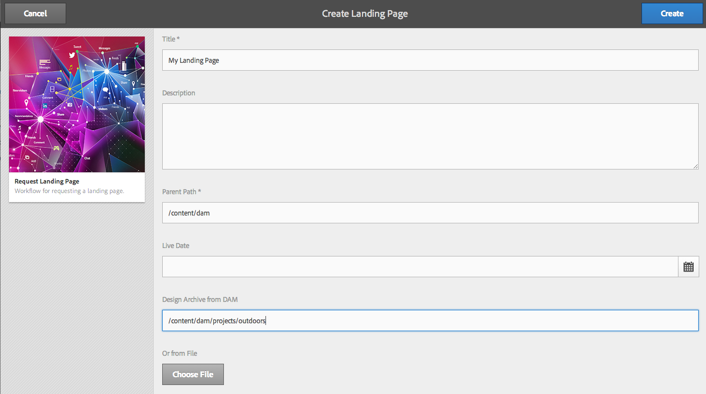

# Arbeta med projektarbetsflöden{#working-with-project-workflows}

>[!CAUTION]
>
>AEM 6.4 har nått slutet på den utökade supporten och denna dokumentation är inte längre uppdaterad. Mer information finns i [teknisk supportperiod](https://helpx.adobe.com/support/programs/eol-matrix.html). Hitta de versioner som stöds [här](https://experienceleague.adobe.com/docs/).

De projektarbetsflöden som är tillgängliga från paketet innehåller följande:

* **Arbetsflöde för projektgodkännande** - Med det här arbetsflödet kan du tilldela innehåll till en användare, granska och sedan godkänna.
* **Begär start** - Ett arbetsflöde som begär en start.
* **Begär landningssida** - Det här arbetsflödet begär en landningssida.
* **Begär e-post** - Arbetsflöde för att begära e-post.
* **Fotofoto och fotografering av produkter (handel)** - Mappar resurser med produkter
* **DAM Skapa och översätt kopia och DAM Skapa språkkopia** - Skapar översatta binärfiler, metadata och taggar för resurser och mappar.

Beroende på vilken projektmall du väljer finns det vissa arbetsflöden:

|  | **Enkelt projekt** | **Medieprojekt** | **Fotoprojekt för produkt** | **Översättningsprojekt** |
|---|:-:|:-:|:-:|:-:|
| Begär kopia |  | x |  |  |
| Fotofotografering |  | x | x |  |
| Fotofoto (Commerce) |  |  | x |  |
| Projektgodkännande | x |  |  |  |
| Begär start | x |  |  |  |
| Begär landningssida | x |  |  |  |
| Begär e-post | x |  |  |  |
| DAM - skapa &amp;språkkopia; |  |  |  | x |
| DAM Skapa och översätt &amp;språkkopia; |  |  |  | x |

>[!NOTE]
>
>&amp;ast; De här arbetsflödena har inte startats från **Arbetsflöde** i Projekt. Se [Skapa språkkopior för resurser.](/help/sites-administering/tc-manage.md)

Stegen för att starta och slutföra arbetsflöden är desamma oavsett vilket arbetsflöde du väljer. Bara stegen ändras.

Du startar ett arbetsflöde direkt i Projekt (förutom för DAM Create Language Copy eller DAM Create och Translate Language Copy). Information om utestående uppgifter i ett projekt finns i **Uppgifter** platta. Meddelanden om uppgifter som behöver slutföras visas bredvid användarikonen.

Mer information om hur du arbetar med arbetsflöden i AEM finns i:

* [Delta i arbetsflöden](/help/sites-authoring/workflows-participating.md)
* [Tillämpa arbetsflöden på sidor](/help/sites-authoring/workflows-applying.md)
* [Konfigurera arbetsflöden](/help/sites-administering/workflows.md)

I det här avsnittet beskrivs de arbetsflöden som är tillgängliga för projekt.

## Arbetsflödet Begär kopia {#request-copy-workflow}

Med det här arbetsflödet kan du begära ett manuskript från en användare och sedan godkänna det. Så här startar du arbetsflödet för begärandekopia:

1. I medieprojektet väljer du plustecknet (**+**) i rutan **Arbetsflöden** och väljer **arbetsflödet Begär kopiering**.
1. Ange en titel och en kort sammanfattning av vad du begär. Ange ett målordsantal, uppgiftsprioritet och ett förfallodatum om tillämpligt.

   

1. Klicka **Skapa**. Arbetsflödet startar. Uppgiften visas i **Uppgifter** platta.

   

## Arbetsflöde för fotografering {#product-photo-shoot-workflow}

Arbetsflödena för produktfotografering (både inom och utan handel) beskrivs i detalj [Kreativt projekt](/help/sites-authoring/managing-product-information.md).

## Arbetsflöde för projektgodkännande {#project-approval-workflow}

I arbetsflödet för projektgodkännande tilldelar du innehåll till en användare, granskar och godkänner sedan innehållet.

1. Välj ****+** logga in på **Arbetsflöden** platta och markera **Arbetsflöde för projektgodkännande**.
1. Ange en titel och välj vem du vill tilldela den till i grupplistan. Ange en beskrivning, innehållssökväg, uppgiftsprioritet och ett förfallodatum om tillämpligt.

   

1. Klicka **Skapa**. Arbetsflödet startar. Uppgiften visas i **Uppgifter** platta.

   

## Arbetsflödet Begär start {#request-launch-workflow}

Med det här arbetsflödet kan du begära att programmet startas.

1. I det enkla projektet väljer du plustecknet (**+**) i rutan **Arbetsflöden** och väljer **arbetsflödet Begär start**.
1. Ange en rubrik för startprogrammet och ange startkällans sökväg. Du kan också lägga till en beskrivning och ett live-datum, om du vill. Välj Ärv källsidans livedata eller exkludera undersidor beroende på hur du vill att startsidan ska fungera.

   

1. Klicka **Skapa**. Arbetsflödet startar. Arbetsflödet visas i **Arbetsflöden** lista (klicka på ovaler) **...** på **Arbetsflöden** för att komma åt den här listan).

## Begär arbetsflöde för landningssida {#request-landing-page-workflow}

Med det här arbetsflödet kan du begära en landningssida.

1. I ditt enkla projekt väljer du **+** logga in på **Arbetsflöden** och välj Request Landing Page Workflow.
1. Ange en rubrik för landningssidan och den överordnade sökvägen. Ange eventuellt ett live-datum eller välj en fil för landningssidan.

   

1. Klicka **Skapa**. Arbetsflödet startar. Uppgiften visas i **Uppgifter** platta.

## Begär e-postarbetsflöde {#request-email-workflow}

Med det här arbetsflödet kan du begära ett e-postmeddelande. Det är samma arbetsflöde som visas i **E-post** platta.

1. I ditt Media- eller Simple-projekt väljer du **+** logga in på **Arbetsflöden** platta och markera **Begär e-postarbetsflöde**.
1. Ange en e-posttitel samt kampanj- och mallsökvägar. Dessutom kan du ange namn, beskrivning och live-datum.

   

1. Klicka **Skapa**. Arbetsflödet startar. Uppgiften visas i **Uppgifter** platta.

   

## Skapa (och översätt) språkkopieringsarbetsflöde för resurser {#create-and-translate-language-copy-workflow-for-assets}

The **Skapa språkkopia** och **Skapa och översätta språkkopia** arbetsflöden beskrivs i detalj i [Skapa språkkopior för resurser.](/help/assets/translation-projects.md)
