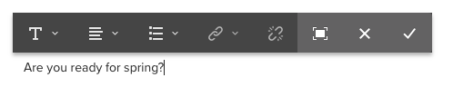

# Använda RTF-redigeraren för att skapa innehåll {#using-the-rich-text-editor-to-author-content}

RTE (Rich Text Editor) är ett grundläggande byggblock för redigering av text på AEM-sidor. Många komponenter som Text, Text och Bild och Tabell baseras på RTE.

>[!NOTE]
>
>Att kopiera kapslade listor till textredigeraren fungerar inte som förväntat. När du kopierar kapslade listor från Microsoft Word måste du manuellt rensa upp listorna efter att du har klistrat in texten i textredigeraren.

## In-place-redigering {#in-place-editing}

Om du markerar en textbaserad komponent med ett enda tryck eller klick visas [komponentens verktygsfält](../sites-authoring/editing-content.md#edit-configure-copy-cut-delete-paste).

Om du trycker/klickar igen eller till att börja med markerar komponenten med en långsam dubbeltryckning/klick öppnas redigering på plats, som har ett eget verktygsfält. Här kan du redigera innehållet och göra grundläggande formateringsändringar.

Det här verktygsfältet innehåller följande alternativ:

* **Format**: Ange fet, kursiv och understrykning.

* **Listor**: Skapa punktlistor eller numrerade listor eller ange indrag.

* **Hyperlänk**

* **Bryt länk**

* **Helskärm**

* **Stäng**

* **Spara**

## Redigering i helskärm {#full-screen-editing}

Om du väljer helskärmsläget i verktygsfältet för textbaserade komponenter öppnas textredigeraren och resten av sidinnehållet döljs.

I helskärmsläget visas alla alternativ i RTF-redigeraren som har konfigurerats av administratören. Dessa kan variera mellan AEM-instanser [beroende på konfigurationen](../sites-administering/rich-text-editor.md) som tillhandahålls av administratörer eller AEM-utvecklare. Om ett alternativ saknas ber du administratören att göra det tillgängligt.

Fler alternativ för textredigering:

* **Ankarpunkt**: Skapa en ankarpunkt i texten som du senare kan länka till/referera till.
* **Vänsterjustera text**
* **Centrera text**
* **Högerjustera text**

Om du vill stänga helskärmsläget klickar du på minimeringsikonen.

