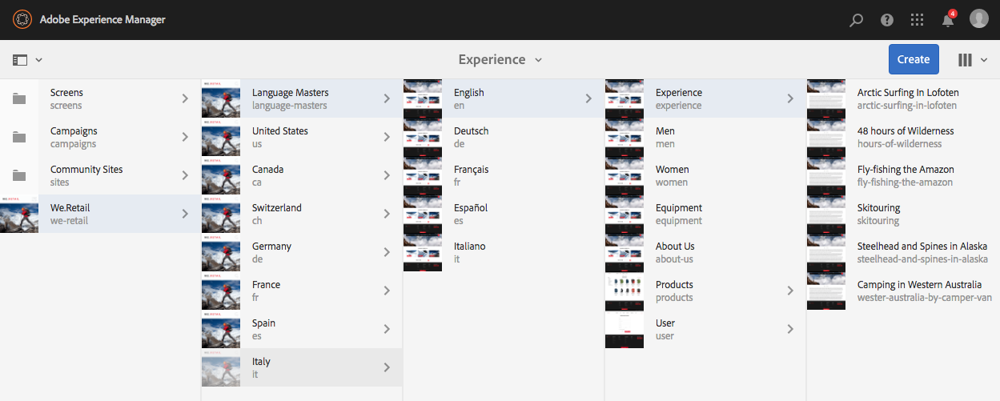

# Välja användargränssnitt{#selecting-your-ui}

## Förstå användargränssnitten

I redigeringsmiljön kan du:

* [Redigering](/help/sites-authoring/author.md) (inklusive [sidredigering](/help/sites-authoring/author-environment-tools.md), [hantering av resurser](/help/assets/home.md), [communities](/help/communities/author-communities.md))

* [Administrera](/help/sites-administering/home.md) uppgifter du behöver när du genererar och underhåller innehåll på webbplatsen

Det finns två grafiska användargränssnitt för att uppnå detta. De är tillgängliga via alla moderna webbläsare.

1. Pekaktiverat användargränssnitt

   * Det här är det moderna standardgränssnittet för AEM.
   * Den är främst grå, med ett rent, platt gränssnitt.
   * Utseendet och känslan är densamma på alla enheter, och de är avsedda att användas både på pekskärmar och på stationära datorer, även om [visning och val av resurser](/help/sites-authoring/basic-handling.md#viewing-and-selecting-resources) skiljer sig något (knapp eller klick).

      * Skrivbord:
   

   * Tablet-enheter (eller stationära datorer med en bredd på mindre än 1 024 pixlar):
   

1. Klassiskt användargränssnitt

   * Det här är det gamla användargränssnittet och har funnits i AEM i många år.
   * Den är främst grön.
   * Den har utformats för användning på stationära enheter.
   * Följande dokumentation fokuserar på det moderna användargränssnittet. Information om hur du skapar i det klassiska användargränssnittet finns i [redigeringsdokumentationen för det klassiska användargränssnittet](/help/sites-classic-ui-authoring/classicui.md).
   

## Byta gränssnitt

Även om det pekaktiverade användargränssnittet nu är standardgränssnittet och [funktionsparitet](../release-notes/touch-ui-features-status.md) har nåtts när webbplatser administreras och redigeras, kan det finnas tillfällen då användaren vill byta till det [klassiska användargränssnittet](/help/sites-classic-ui-authoring/classicui.md). Det finns flera alternativ för att göra detta.

>[!NOTE]
>
>Mer information om status för funktionsparitet med det klassiska användargränssnittet finns i dokumentet [Touch UI Feature Parity](../release-notes/touch-ui-features-status.md) .

Det finns olika platser där du kan definiera vilket användargränssnitt som ska användas:

* [Konfigurerar standardgränssnittet för instansen](#configuring-the-default-ui-for-your-instance) - Detta anger standardgränssnittet som ska visas vid användarinloggning, men användaren kan åsidosätta detta och välja ett annat användargränssnitt för sitt konto eller den aktuella sessionen.

* [Ställa in klassisk gränssnittsredigering för ditt konto](/help/sites-authoring/select-ui.md#setting-classic-ui-authoring-for-your-account) - Detta anger att användargränssnittet ska användas som standard när sidor redigeras, även om användaren kan åsidosätta detta och välja ett annat användargränssnitt för sitt konto eller den aktuella sessionen.

* [Växlar till det klassiska användargränssnittet för den aktuella sessionen](#switching-to-classic-ui-for-the-current-session) - Detta växlar till det klassiska användargränssnittet för den aktuella sessionen.

* När det gäller [sidredigering gör systemet vissa åsidosättningar i förhållande till användargränssnittet](#ui-overrides-for-the-editor).

>[!CAUTION]
>
>Olika alternativ för att växla till det klassiska användargränssnittet är inte omedelbart tillgängliga. De måste vara specifikt konfigurerade för din instans.
>
>Mer information finns i [Aktivera åtkomst till klassiskt gränssnitt](/help/sites-administering/enable-classic-ui.md) .

>[!NOTE]
>
>Instanser som uppgraderats från en tidigare version behåller det klassiska användargränssnittet för sidredigering.
>
>Efter uppgraderingen växlas inte sidredigering automatiskt till det beröringsaktiverade användargränssnittet, men du kan konfigurera detta med [OSGi-konfigurationen](/help/sites-deploying/configuring-osgi.md) för **WCM-redigeringsgränssnittets** (- `AuthoringUIMode` tjänsten). Se Åsidosättningar av [användargränssnitt för redigeraren](#ui-overrides-for-the-editor).

## Konfigurera standardgränssnittet för din instans {#configuring-the-default-ui-for-your-instance}

En systemadministratör kan konfigurera användargränssnittet som visas vid start och inloggning med hjälp av [rotmappning](/help/sites-deploying/osgi-configuration-settings.md).

Detta kan åsidosättas av användarens standardinställningar eller sessionsinställningar.

## Ange klassisk gränssnittsredigering för ditt konto {#setting-classic-ui-authoring-for-your-account}

Varje användare har tillgång till sina [användarinställningar](/help/sites-authoring/user-properties.md) för att definiera om han/hon vill använda det klassiska användargränssnittet för att skapa sidor (i stället för standardgränssnittet).

Detta kan åsidosättas av sessionsinställningarna.

## Växla till Classic UI för den aktuella sessionen {#switching-to-classic-ui-for-the-current-session}

När du använder det beröringskänsliga användargränssnittet kan det vara bra att återställa det klassiska användargränssnittet (endast datorer). Det finns flera metoder för att växla till det klassiska användargränssnittet för den aktuella sessionen:

* **Navigeringslänkar**

   >[!CAUTION]
   >
   >Det här alternativet för att växla till det klassiska användargränssnittet är inte omedelbart tillgängligt. Det måste vara specifikt konfigurerat för din instans.
   >
   >
   >Mer information finns i [Aktivera åtkomst till klassiskt gränssnitt](/help/sites-administering/enable-classic-ui.md) .

   Om det här alternativet är aktiverat visas en ikon (symbol för en bildskärm) när du för musen över en tillämplig konsol och trycker/klickar på den öppnas rätt plats i det klassiska användargränssnittet.

   Till exempel länkar från **platser** till **platadmin**:

   

* **Webbadress**

   Det klassiska användargränssnittet kan nås via webbadressen för välkomstskärmen på `welcome.html`. Exempel:

   `http://localhost:4502/welcome.html`

   >[!NOTE]
   >
   >Det beröringskänsliga användargränssnittet är tillgängligt via `sites.html`. Exempel:
   >
   >
   >`http://localhost:4502/sites.html`

### Växla till Classic UI när du redigerar en sida {#switching-to-classic-ui-when-editing-a-page}

>[!CAUTION]
>
>Det här alternativet för att växla till det klassiska användargränssnittet är inte omedelbart tillgängligt. Det måste vara specifikt konfigurerat för din instans.
>
>Mer information finns i [Aktivera åtkomst till klassiskt gränssnitt](/help/sites-administering/enable-classic-ui.md) .

Om det här alternativet är aktiverat är **Öppna det klassiska användargränssnittet** tillgängligt i dialogrutan **Sidinformation** :

### Gränssnittsåsidosättningar för redigeraren {#ui-overrides-for-the-editor}

De inställningar som definieras av en användare eller systemadministratör kan åsidosättas av systemet vid redigering av sidor.

* När du redigerar sidor:

   * Den klassiska redigeraren måste användas när sidan öppnas med hjälp av `cf#` URL:en. Exempel:

      `http://localhost:4502/cf#/content/geometrixx/en/products/triangle.html`

   * Den pekaktiverade redigeraren måste användas när du använder `/editor.html` URL:en eller en pekenhet. Exempel:

      `http://localhost:4502/editor.html/content/geometrixx/en/products/triangle.html`

* Alla tvång är tillfälliga och gäller endast för webbläsarsessionen

   * En cookie-uppsättning ställs in beroende på om touch-aktiverad ( `editor.html`) eller klassisk ( `cf#`) används.

* När sidor öppnas genom `siteadmin`görs en kontroll av om det finns

   * Kakan
   * En användarinställning
   * Om ingen av dem finns används de definitioner som anges i [OSGi-konfigurationen](/help/sites-deploying/configuring-osgi.md) i **WCM-redigeringsgränssnittets lägestjänst** ( `AuthoringUIMode` tjänsten).

>[!NOTE]
>
>Om [en användare redan har definierat en inställning för sidredigering](#setting-classic-ui-authoring-for-your-account), åsidosätts den inte genom att OSGi-egenskapen ändras.

>[!CAUTION]
>
>På grund av användningen av cookies, vilket redan har beskrivits, rekommenderas inte att du antingen:
>
>* Redigera URL:en manuellt - En URL som inte är standard kan resultera i en okänd situation och bristande funktionalitet.
>* Ha båda redigerarna öppna samtidigt - till exempel i separata fönster.
>

