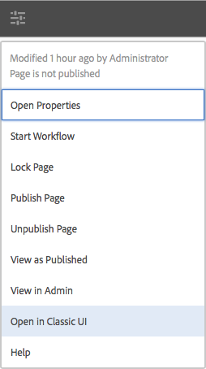

# Välja användargränssnitt{#selecting-your-ui}

>[!CAUTION]
>
>AEM 6.4 har nått slutet på den utökade supporten och denna dokumentation är inte längre uppdaterad. Mer information finns i [teknisk supportperiod](https://helpx.adobe.com/support/programs/eol-matrix.html). Hitta de versioner som stöds [här](https://experienceleague.adobe.com/docs/).

## Förstå användargränssnitten

I redigeringsmiljön kan du:

* [Redigering](/help/sites-authoring/author.md) (inklusive [sidredigering](/help/sites-authoring/author-environment-tools.md), [hantera resurser](/help/assets/home.md), [communities](/help/communities/author-communities.md))

* [Administratör](/help/sites-administering/home.md) uppgifter du behöver när du genererar och underhåller innehåll på webbplatsen

Det finns två grafiska användargränssnitt för att uppnå detta. De är tillgängliga via alla moderna webbläsare.

1. Pekaktiverat användargränssnitt

   * Det här är det moderna AEM.
   * Den är främst grå, med ett rent, platt gränssnitt.
   * Utseendet och känslan är densamma på alla enheter, men de är utformade för att användas både på pekskärmar och på stationära enheter [visa och välja resurser](/help/sites-authoring/basic-handling.md#viewing-and-selecting-resources) skiljer sig något (tryck mot klick).

      * Skrivbord:

   

   * Tablet-enheter (eller stationära datorer med en bredd på mindre än 1 024 pixlar):

   

1. Klassiskt användargränssnitt

   * Det här är det gamla användargränssnittet och har funnits i AEM i många år.
   * Den är främst grön.
   * Den har utformats för användning på stationära enheter.
   * Följande dokumentation fokuserar på det moderna användargränssnittet. Mer information om hur du skapar i det klassiska användargränssnittet finns i [Redigeringsdokumentation för det klassiska gränssnittet](/help/sites-classic-ui-authoring/classicui.md).

   

## Byta gränssnitt

Även om det pekaktiverade gränssnittet nu är standardgränssnittet och [funktionsparitet](../release-notes/touch-ui-features-status.md) har nästan nåtts vid administration och redigering av webbplatser, det kan finnas tillfällen då användaren vill byta till [klassiskt användargränssnitt](/help/sites-classic-ui-authoring/classicui.md). Det finns flera alternativ för att göra detta.

>[!NOTE]
>
>Mer information om status för funktionsparitet med det klassiska användargränssnittet finns i [Touch UI Feature Parity](../release-notes/touch-ui-features-status.md) -dokument.

Det finns olika platser där du kan definiera vilket användargränssnitt som ska användas:

* [Konfigurera standardgränssnittet för instansen](#configuring-the-default-ui-for-your-instance) - Detta anger standardgränssnittet som ska visas vid användarinloggning, men användaren kan åsidosätta detta och välja ett annat användargränssnitt för sitt konto eller den aktuella sessionen.

* [Ange klassisk gränssnittsredigering för ditt konto](/help/sites-authoring/select-ui.md#setting-classic-ui-authoring-for-your-account) - Detta anger att användargränssnittet ska användas som standard när sidor redigeras, men användaren kan åsidosätta detta och välja ett annat användargränssnitt för sitt konto eller den aktuella sessionen.

* [Växla till det klassiska användargränssnittet för den aktuella sessionen](#switching-to-classic-ui-for-the-current-session) - Detta växlar till det klassiska användargränssnittet för den aktuella sessionen.

* För [när sidan redigeras i systemet, görs vissa åsidosättningar i relation till användargränssnittet](#ui-overrides-for-the-editor).

>[!CAUTION]
>
>Olika alternativ för att växla till det klassiska användargränssnittet är inte omedelbart tillgängliga. De måste vara specifikt konfigurerade för din instans.
>
>Se [Aktivera åtkomst till klassiskt gränssnitt](/help/sites-administering/enable-classic-ui.md) för mer information.

>[!NOTE]
>
>Instanser som uppgraderats från en tidigare version behåller det klassiska användargränssnittet för sidredigering.
>
>Efter uppgraderingen växlas inte sidredigering automatiskt till det beröringsaktiverade användargränssnittet, men du kan konfigurera detta med [OSGi-konfiguration](/help/sites-deploying/configuring-osgi.md) i **Tjänsten WCM för användargränssnittsläge vid redigering** ( `AuthoringUIMode` service). Se [Gränssnittsåsidosättningar för redigeraren](#ui-overrides-for-the-editor).

## Konfigurera standardgränssnittet för din instans {#configuring-the-default-ui-for-your-instance}

En systemadministratör kan konfigurera användargränssnittet som visas vid start och inloggning med [Rotmappning](/help/sites-deploying/osgi-configuration-settings.md).

Detta kan åsidosättas av användarens standardinställningar eller sessionsinställningar.

## Ange klassisk gränssnittsredigering för ditt konto {#setting-classic-ui-authoring-for-your-account}

Varje användare har åtkomst till sin [användarinställningar](/help/sites-authoring/user-properties.md) för att definiera om han/hon vill använda det klassiska användargränssnittet för att skapa sidor (i stället för standardgränssnittet).

Detta kan åsidosättas av sessionsinställningarna.

## Växla till Classic UI för den aktuella sessionen {#switching-to-classic-ui-for-the-current-session}

När du använder det beröringskänsliga användargränssnittet kan det vara bra att återställa det klassiska användargränssnittet (endast datorer). Det finns flera metoder för att växla till det klassiska användargränssnittet för den aktuella sessionen:

* **Navigeringslänkar**

   >[!CAUTION]
   >
   >Det här alternativet för att växla till det klassiska användargränssnittet är inte omedelbart tillgängligt. Det måste vara specifikt konfigurerat för din instans.
   >
   >
   >Se [Aktivera åtkomst till klassiskt gränssnitt](/help/sites-administering/enable-classic-ui.md) för mer information.

   Om det här alternativet är aktiverat visas en ikon (symbol för en bildskärm) när du för musen över en tillämplig konsol och trycker/klickar på den öppnas rätt plats i det klassiska användargränssnittet.

   Länkarna från **Webbplatser** till **siteadmin**:

   

* **URL**

   Det klassiska användargränssnittet kan nås via webbadressen för välkomstskärmen på `welcome.html`. Till exempel:

   `http://localhost:4502/welcome.html`

   >[!NOTE]
   >
   >Det beröringskänsliga användargränssnittet är tillgängligt via `sites.html`. Till exempel:
   >
   >
   >`http://localhost:4502/sites.html`

### Växla till Classic UI när du redigerar en sida {#switching-to-classic-ui-when-editing-a-page}

>[!CAUTION]
>
>Det här alternativet för att växla till det klassiska användargränssnittet är inte omedelbart tillgängligt. Det måste vara specifikt konfigurerat för din instans.
>
>Se [Aktivera åtkomst till klassiskt gränssnitt](/help/sites-administering/enable-classic-ui.md) för mer information.

Om den är aktiverad **Öppna det klassiska gränssnittet** är tillgängligt från **Sidinformation** dialog:

### Gränssnittsåsidosättningar för redigeraren {#ui-overrides-for-the-editor}

De inställningar som definieras av en användare eller systemadministratör kan åsidosättas av systemet vid redigering av sidor.

* När du redigerar sidor:

   * Den klassiska redigeraren måste användas när sidan används `cf#` i webbadressen. Till exempel:

      `http://localhost:4502/cf#/content/geometrixx/en/products/triangle.html`

   * Den pekaktiverade redigeraren måste användas `/editor.html` i webbadressen eller när du använder en touchenhet. Till exempel:

      `http://localhost:4502/editor.html/content/geometrixx/en/products/triangle.html`

* Alla tvång är tillfälliga och gäller endast för webbläsarsessionen

   * En cookie-uppsättning ställs in beroende på om pekfunktionen är aktiverad ( `editor.html`) eller klassisk ( `cf#`) används.

* När sidor öppnas igenom `siteadmin`kommer det att kontrolleras om

   * Kakan
   * En användarinställning
   * Om ingen av dem finns används de definitioner som anges i [OSGi-konfiguration](/help/sites-deploying/configuring-osgi.md) i **Tjänsten WCM för användargränssnittsläge vid redigering** ( `AuthoringUIMode` service).

>[!NOTE]
>
>If [en användare redan har definierat en inställning för sidredigering](#setting-classic-ui-authoring-for-your-account), som inte åsidosätts genom att OSGi-egenskapen ändras.

>[!CAUTION]
>
>På grund av användningen av cookies, vilket redan har beskrivits, rekommenderas inte att du antingen:
>
>* Redigera URL:en manuellt - En URL som inte är standard kan resultera i en okänd situation och bristande funktionalitet.
>* Ha båda redigerarna öppna samtidigt - till exempel i separata fönster.
>

