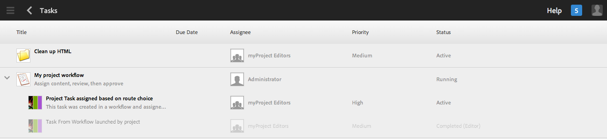

# Arbeta med uppgifter{#working-with-tasks}

>[!CAUTION]
>
>AEM 6.4 har nått slutet på den utökade supporten och denna dokumentation är inte längre uppdaterad. Mer information finns i [teknisk supportperiod](https://helpx.adobe.com/support/programs/eol-matrix.html). Hitta de versioner som stöds [här](https://experienceleague.adobe.com/docs/).

Uppgifter representerar arbetsuppgifter som ska utföras på innehåll. När du tilldelas en uppgift visas den i Inkorgen för arbetsflöde. Uppgiftsobjekt har värdet för uppgiften i kolumnen Typ.

Uppgifter används också i projekt för att avgöra hur fullständiga de aktuella uppgifterna är, inklusive arbetsflödesuppgifter.

## Spåra projektförlopp {#tracking-project-progress}

Du kan spåra projektförloppet genom att titta på aktiva/slutförda uppgifter i ett projekt som representeras av **Uppgifter** platta. Projektets förlopp kan avgöras av:

* **Uppgiftsruta:** Ett övergripande förlopp för projektet visas i uppgiftsrutan på sidan med projektinformation.

* **Uppgiftsruta:** När du klickar på uppgiftsrutan visas en lista med uppgifter. Den här listan innehåller detaljerad information om alla uppgifter som rör projektet.

Båda listar arbetsflödesuppgifter och uppgifter som du skapar direkt i **Uppgifter** platta.

### Åtgärdsfönster {#task-tile}

Om ett projekt innehåller några relaterade uppgifter visas en åtgärdsruta i projektet. Åtgärdsrutan visar projektets aktuella status. Detta baseras på befintliga uppgifter i arbetsflödet och inkluderar inga uppgifter som kommer att genereras i framtiden allt eftersom arbetsflödet fortsätter. Följande information visas i åtgärdsrutan:

* Procent slutförda uppgifter
* Procent av aktiva uppgifter
* Procent av försenade uppgifter

### Visa eller ändra uppgifter i ett projekt {#viewing-or-modifying-the-tasks-in-a-project}

Förutom att följa upp förloppet kanske du också vill visa mer information om projektet eller ändra det.

#### Uppgiftslista {#task-list}

Klicka på ellipsen (..) i aktivitetspanelen för att visa en lista med uppgifter som hör till projektet. Uppgifterna delas upp i överordnade arbetsflöden. Uppgiftsinformationen visas tillsammans med metadata som förfallodatum, tilldelad, prioritet och status.

#### Uppgiftsinformation {#task-details}

Mer information om en viss uppgift får du om du trycker/klickar på uppgiften i uppgiftslistan och **Aktivitetsinformation **öppna.

### Visa och ändra aktivitetskommentarer {#viewing-and-modifying-task-comments}

I Uppgiftsinformation kan du redigera eller lägga till kommentarer. Alla kommentarer i ett projekt visas dessutom i kommentarsområdet.

### Lägga till uppgifter {#adding-tasks}

Du kan lägga till nya uppgifter i projekt. Dessa uppgifter visas sedan på aktivitetspanelen och är tillgängliga i inkorgen Meddelanden för att utföra åtgärder.

Så här lägger du till en uppgift:

1. Tryck/klicka på ikonen + i rutan **Uppgifter** i projektet. Fönstret **Lägg till uppgift** öppnas.
1. Ange information om uppgiften. Titeln på uppgiften och vilken grupp den har tilldelats är obligatoriska. Ytterligare information som innehållssökväg, beskrivning, uppgiftsprioritet och förfallodatum är valfria. Dessutom kan du välja **Avancerat** för att ange namnet på uppgiften, som används för att namnge URL:en.

   

1. Tryck/klicka **Skapa**.

## Arbeta med uppgifter i Inkorgen {#working-with-tasks-in-the-inbox}

Ett annat sätt att komma åt uppgifter är via Inkorgen. I inkorgen kan du öppna innehållet för att implementera ändringarna. När du är klar anger du aktivitetsstatus till Slutförd. Uppgifter visas också i inkorgen när de tilldelas till en användargrupp som du tillhör. I det här fallet kan alla medlemmar i gruppen utföra arbetet och slutföra uppgiften.

Om du vill slutföra en uppgift markerar du uppgiften och klickar på **Slutförd**. Lägg till information till uppgiften och klicka sedan på **Klar**. Se [Din inkorg](/help/sites-authoring/inbox.md) för mer information.

