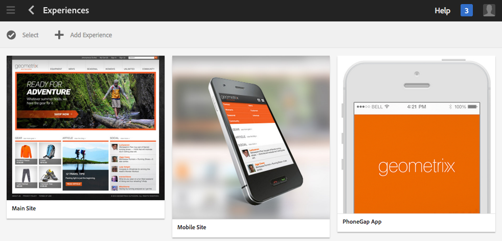

# Hantera projekt{#managing-projects}

>[!CAUTION]
>
>AEM 6.4 har nått slutet på den utökade supporten och denna dokumentation är inte längre uppdaterad. Mer information finns i [teknisk supportperiod](https://helpx.adobe.com/support/programs/eol-matrix.html). Hitta de versioner som stöds [här](https://experienceleague.adobe.com/docs/).

Med projekt kan du ordna ditt projekt genom att gruppera resurser i en enhet.

I **Projekt** konsolen kan du komma åt och vidta åtgärder i dina projekt:

I Projekt kan du skapa ett projekt, associera resurser med projektet och även ta bort en projekt- eller resurslänkar. Du kan öppna en platta om du vill visa dess innehåll och lägga till objekt i en platta. I det här avsnittet beskrivs dessa procedurer.

>[!NOTE]
>
>6.2 har gjort det möjligt att ordna projekt i mappar. På sidan Projekt kan du skapa ett projekt eller en mapp.
>
>Om en mapp skapas kommer användaren till den mappen där han/hon kan skapa en annan mapp eller ett projekt. Det hjälper dig att ordna projekt i mappar baserat på kategorier som produktkampanjer, plats, översättningsspråk och så vidare.
>
>Projekt och mappar kan visas i en listvy och även sökas igenom.

>[!CAUTION]
>
>För att användare i projekt ska kunna se andra användare/grupper medan de använder projektfunktioner som att skapa projekt, skapa uppgifter/arbetsflöden, se och hantera teamet, måste de användarna ha läsåtkomst på **/home/users** och **/home/groups**. Det enklaste sättet att implementera detta är att ge **projekt-användare** gruppläsåtkomst till **/home/users** och **/home/groups**.

## Skapa ett projekt {#creating-a-project}

AEM innehåller de här mallarna som du kan välja mellan när du skapar ett projekt:

* Enkelt projekt
* Medieprojekt
* Fotoprojekt för produkt
* Översättningsprojekt

Du skapar ett projekt på samma sätt med alla projekt. Projekttyperna skiljer sig åt bland annat vad gäller tillgängliga [användarroller](/help/sites-authoring/projects.md) och [arbetsflöden](/help/sites-authoring/projects-with-workflows.md).  Så här skapar du ett nytt projekt:

1. I **Projekt** trycker/klickar du på **Skapa** för att öppna guiden **Skapa projekt**:
1. Välj en mall. ur kartongen, enkelt projekt, mediaprojekt, [Översättningsprojekt](/help/sites-administering/tc-manage.md)och [Produkt - fotograferingsprodukt](/help/sites-authoring/managing-product-information.md) är tillgängliga och klickar på **Nästa**.

   

1. Definiera **Titel** och **Beskrivning** och lägga till en **Miniatyrbild** bild om det behövs. Du kan också lägga till eller ta bort användare och vilken grupp de tillhör. Klicka dessutom på **Avancerat** för att lägga till ett namn som används i URL:en.

   

1. Tryck/klicka **Skapa**. Bekräftelsen frågar om du vill öppna det nya projektet eller gå tillbaka till konsolen.

### Associera resurser med ditt projekt {#associating-resources-with-your-project}

När du kan gruppera resurser i en enhet i projekt vill du koppla resurser till projektet. Dessa resurser kallas **Plattor**. De typer av resurser du kan lägga till beskrivs i [Projektpaneler](/help/sites-authoring/projects.md#project-tiles).

Så här associerar du resurser med ditt projekt:

1. Öppna ditt projekt från **Projekt** konsol.
1. Tryck/klicka **Lägg till platta** och välj den platta som du vill länka till projektet. Du kan markera flera typer av rutor.

   

   >[!NOTE]
   >
   >Projekttitlar som kan kopplas till ett projekt beskrivs i detalj i [Projektpaneler.](/help/sites-authoring/projects.md#project-tiles)

1. Tryck/klicka **Skapa**. Resursen är länkad till ditt projekt och från och med nu kan du komma åt den från ditt projekt.

### Ta bort ett projekt eller en resurslänk {#deleting-a-project-or-resource-link}

Samma metod används för att ta bort ett projekt från konsolen eller en länkad resurs från ditt projekt:

1. Navigera till rätt plats:

   * Om du vill ta bort ett projekt går du till den översta nivån i **Projekt** konsol.
   * Om du vill ta bort en resurslänk i ett projekt öppnar du projektet i **Projekt** konsol.

1. Ange markeringsläge genom att klicka **Välj** och välja projekt- eller resurslänk.
1. Tryck/klicka **Ta bort**.

1. Du måste bekräfta borttagningen i en dialogruta. Om den bekräftas tas projekt- eller resurslänken bort. Tryck/klicka **Avmarkera** om du vill avsluta markeringsläget.

>[!NOTE]
>
>När du skapar projektet och lägger till användare för de olika rollerna skapas grupper som är kopplade till projektet automatiskt för att hantera associerade behörigheter. Ett projekt med namnet Myproject skulle till exempel ha tre grupper, **Myproject Owners**, **Myproject Editors** och **Myproject Observers**. Om projektet tas bort tas de grupperna dock inte bort automatiskt. En administratör måste ta bort grupperna manuellt i **Verktyg** > **Säkerhet** > **Grupper**.

### Lägga till objekt i en platta {#adding-items-to-a-tile}

I vissa rutor kanske du vill lägga till mer än ett objekt. Du kan till exempel ha flera arbetsflöden som körs samtidigt eller fler än en upplevelse.

Så här lägger du till objekt i en platta:

1. I **Projekt** navigerar du till projektet och klickar på ikonen Lägg till + på den ruta där du vill lägga till ett objekt.

   

1. Lägg till ett objekt i rutan på samma sätt som när du skapar en ny platta. Projektpaneler beskrivs [här](/help/sites-authoring/projects.md#project-tiles). I det här exemplet har ett annat arbetsflöde lagts till.

   

### Öppna en platta {#opening-a-tile}

Du kanske vill se vilka objekt som ingår i en aktuell platta eller ändra eller ta bort objekt i plattan.

Så här öppnar du en platta så att du kan visa eller ändra objekt:

1. Tryck/klicka på ellipserna (..) i projektkonsolen

   

1. AEM listar objekten i den rutan. Du kan gå in i markeringsläge för att ändra eller ta bort objekten.

   

## Visa projektstatistik {#viewing-project-statistics}

Så här visar du projektstatistik i **Projekt** konsol, klicka **Visa statistikvy**. Slutförandenivån för varje projekt visas. Klicka **Visa statistikvy** igen för att gå till **Projekt** konsol.

### Visa en projekttidslinje {#viewing-a-project-timeline}

Projektets tidslinje innehåller information om när resurser i projektet senast användes. Klicka/tryck för att visa projekttidslinjen **Tidslinje**, anger ett markeringsläge och väljer projektet. Resurser visas i den vänstra rutan. Klicka/tryck **Tidslinje** för att gå tillbaka till **Projekt** konsol.

### Visa aktiva/inaktiva projekt {#viewing-active-inactive-projects}

Växla mellan aktiva och inaktiva projekt i **Projekt** konsol, klicka **Växla aktiva projekt**. Om ikonen har en bockmarkering visas de aktiva projekten.

Om ikonen har ett x bredvid visas de inaktiva projekten.

## Göra projekt inaktiva eller aktiva {#making-projects-inactive-or-active}

Du kanske vill göra ett projekt inaktivt om du har slutfört det men ändå vill behålla informationen om projektet.

Så här gör du ett projekt inaktivt (eller aktivt):

1. I **Projekt** konsolen, öppna projektet och hitta sedan **Projektinformation** platta.

   >[!NOTE]
   Du kan behöva lägga till den här panelen om den inte redan finns i ditt projekt. Se [Lägga till rutor](#adding-items-to-a-tile).

1. Tryck/klicka **Redigera**.
1. Ändra väljaren från **Aktiv** till **Inaktiv** (eller vice versa).

   

1. Tryck/klicka **Klar** för att spara ändringarna.
