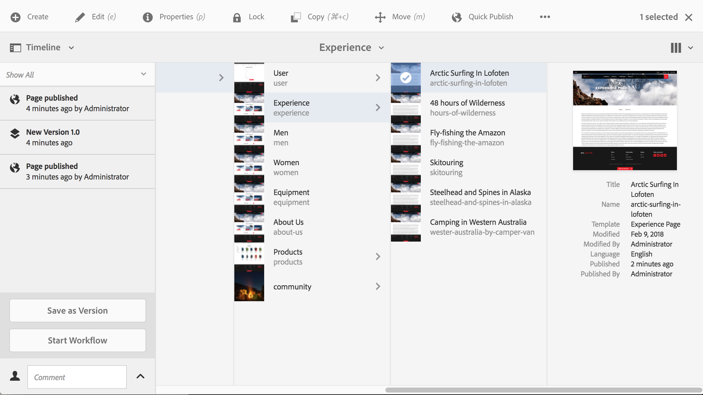
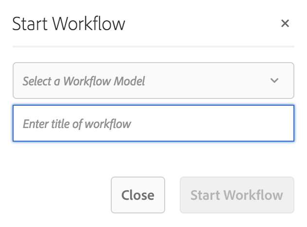

# Använda arbetsflöden på sidor{#applying-workflows-to-pages}

När du redigerar kan du anropa arbetsflöden för att göra något på sidorna; det går även att använda mer än ett arbetsflöde.

När du använder arbetsflödet anger du följande information:

* Arbetsflödet som ska användas.

   Du kan tillämpa vilket arbetsflöde som helst (som du har tillgång till, enligt din AEM-administratörs anvisningar).

* Alternativt kan du använda en titel som hjälper till att identifiera arbetsflödesinstansen i en användares inkorg.
* Arbetsflödets nyttolast. detta kan vara en eller flera sidor.

Arbetsflöden kan startas från:

* konsolen **[Platser](#starting-a-workflow-from-the-sites-console)**.
* när du redigerar en sida, från **[Sidinformation](#starting-a-workflow-from-the-page-editor)**.

>[!NOTE]
>
>Se även:
>
>* [Använda arbetsflöden för DAM-resurser](/help/assets/assets-workflow.md).
>* [Arbeta med projektarbetsflöden](/help/sites-authoring/projects-with-workflows.md).
>

>[!NOTE]
>
>AEM-administratörer kan [starta arbetsflöden på flera andra sätt](/help/sites-administering/workflows-starting.md).

## Starta ett arbetsflöde från platskonsolen {#starting-a-workflow-from-the-sites-console}

Du kan starta ett arbetsflöde från:

* alternativet **[Skapa](#starting-a-workflow-from-the-sites-toolbar)**i verktygsfältet Platser.
* tidslinjen **[i](#starting-a-workflow-from-the-timeline)**webbplatskonsolen.

I båda fallen måste du:

* [Ange arbetsflödesinformation i guiden](#specifying-workflow-details-in-the-create-workflow-wizard)Skapa arbetsflöde.

### Starta ett arbetsflöde från verktygsfältet Platser {#starting-a-workflow-from-the-sites-toolbar}

Du kan starta ett arbetsflöde från verktygsfältet i **webbplatskonsolen** :

1. Navigera till och markera önskad sida.

1. Från alternativet **Skapa** i verktygsfältet kan du nu välja **Arbetsflöde**.

   

1. Guiden **Skapa arbetsflöde** hjälper dig att [ange arbetsflödesinformation](#specifying-workflow-details-in-the-create-workflow-wizard).

### Starta ett arbetsflöde från tidslinjen {#starting-a-workflow-from-the-timeline}

Från **tidslinjen** kan du starta ett arbetsflöde som ska användas för den valda resursen.

1. [Markera resursen](/help/sites-authoring/basic-handling.md#viewing-and-selecting-resources) och öppna [tidslinjen](/help/sites-authoring/basic-handling.md#timeline) (eller öppna tidslinjen och välj sedan resursen).
1. Pilen i kommentarfältet kan användas för att visa **startarbetsflödet**:

   

1. Guiden **Skapa arbetsflöde** hjälper dig att [ange arbetsflödesinformation](#specifying-workflow-details-in-the-create-workflow-wizard).

### Ange arbetsflödesinformation i guiden Skapa arbetsflöde {#specifying-workflow-details-in-the-create-workflow-wizard}

Guiden **Skapa arbetsflöde** hjälper dig att välja arbetsflöde och ange nödvändig information.

När du har öppnat guiden **Skapa arbetsflöde** från:

* alternativet **[Skapa](#starting-a-workflow-from-the-sites-toolbar)**i verktygsfältet Platser.
* tidslinjen **[i](#starting-a-workflow-from-the-timeline)**webbplatskonsolen.

Du kan ange information:

1. I steget **Egenskaper** definieras de grundläggande alternativen för arbetsflödet:

   * **Arbetsflödesmodell**
   * **Arbetsflödets titel**

      * Du kan ange en titel för den här instansen så att du lättare kan identifiera den i ett senare skede.
   Beroende på arbetsflödesmodellen är följande alternativ också tillgängliga. Dessa gör att det paket som skapas som nyttolast kan behållas när arbetsflödet har slutförts.

   * **Behåll arbetsflödespaket**
   * **Pakettitel**

      * Du kan ange en rubrik för paketet för att underlätta identifieringen.
   >[!NOTE]
   >
   >Alternativet **Behåll arbetsflödespaket** är tillgängligt när arbetsflödet har konfigurerats för [Multi Resource Support](/help/sites-developing/workflows-models.md#configuring-a-workflow-for-multi-resource-support) och flera resurser har valts.

   När du är klar använder du **Nästa** för att fortsätta.

   

1. I steget **Omfång** kan du välja:

   * **Lägg till innehåll** för att öppna [sökvägsläsaren](/help/sites-authoring/author-environment-tools.md#path-browser) och välja ytterligare resurser, när du är i webbläsaren klickar/trycker du på **Välj** för att lägga till innehållet i arbetsflödesinstansen.
   * En befintlig resurs som visar ytterligare åtgärder:

      * **Inkludera underordnade objekt** för att ange att underordnade för den resursen ska inkluderas i arbetsflödet.

         En dialogruta öppnas där du kan förfina markeringen enligt:

         * Inkludera endast omedelbara barn.
         * Inkludera endast ändrade sidor.
         * Inkludera endast redan publicerade sidor.
         Alla underordnade objekt läggs till i listan över resurser som arbetsflödet gäller för.

      * **Ta bort markeringen** för att ta bort resursen från arbetsflödet.
   

   >[!NOTE]
   >
   >Om du lägger till ytterligare resurser kan du använda **Bakåt** för att justera inställningen för **Behåll arbetsflödespaket** i **egenskapssteget** .

1. Använd **Skapa** för att stänga guiden och skapa arbetsflödesinstansen. Ett meddelande visas i webbplatskonsolen.

## Starta ett arbetsflöde från sidredigeraren {#starting-a-workflow-from-the-page-editor}

När du redigerar en sida kan du välja **Sidinformation** i verktygsfältet. Listrutan har alternativet **Starta i arbetsflöde**. Då öppnas en dialogruta där du kan ange önskat arbetsflöde, tillsammans med en titel om det behövs:

