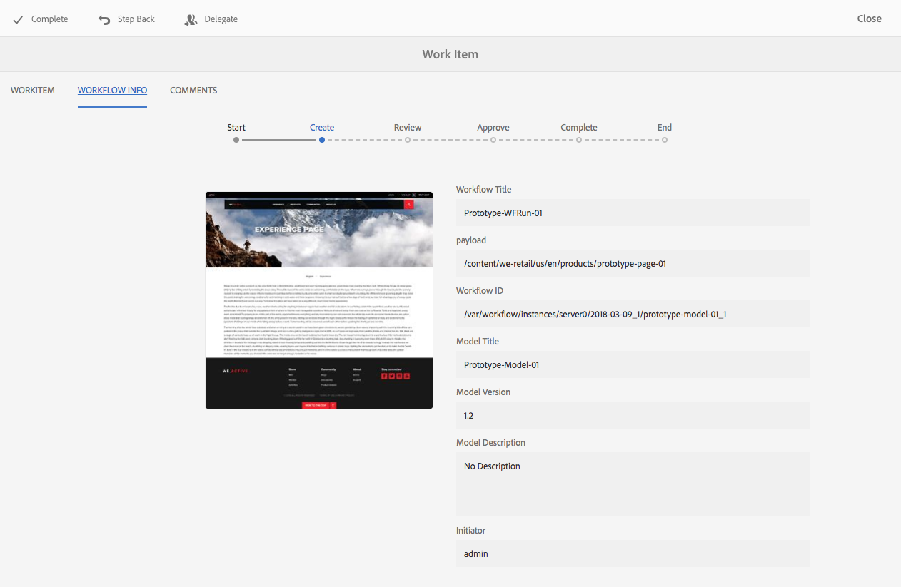

# Delta i arbetsflöden{#participating-in-workflows}

>[!CAUTION]
>
>AEM 6.4 har nått slutet på den utökade supporten och denna dokumentation är inte längre uppdaterad. Mer information finns i [teknisk supportperiod](https://helpx.adobe.com/support/programs/eol-matrix.html). Hitta de versioner som stöds [här](https://experienceleague.adobe.com/docs/).

Arbetsflödena omfattar vanligtvis steg som kräver att en person utför en aktivitet på en sida eller en resurs. Arbetsflödet väljer en användare eller grupp som ska utföra aktiviteten och tilldelar en arbetsuppgift till den personen eller gruppen. Användaren får ett meddelande och kan sedan vidta lämpliga åtgärder:

* [Visa meddelanden](#notifications-of-available-workflow-actions)
* [Slutför ett deltagarsteg](#completing-a-participant-step)
* [Delegera ett deltagarsteg](#delegating-a-participant-step)
* [Utför Stega bakåt i ett deltagarsteg](#performing-step-back-on-a-participant-step)
* [Öppna ett arbetsflödesobjekt om du vill visa information (och vidta åtgärder)](#opening-a-workflow-item-to-view-details-and-take-actions)
* [Visa arbetsflödets nyttolast (flera resurser)](#viewing-the-workflow-payload-multiple-resources)

## Meddelanden om tillgängliga arbetsflödesåtgärder {#notifications-of-available-workflow-actions}

När du tilldelas en arbetsuppgift (till exempel **Godkänn innehåll**) visas olika varningar och/eller meddelanden:

* Dina [meddelande](/help/sites-authoring/inbox.md) Indikatorn (verktygsfältet) ökas:

   

* Objektet kommer att listas i meddelandet [Inkorg](/help/sites-authoring/inbox.md):

   

* När du använder sidredigeraren visas statusfältet:

   * Namnet på det eller de arbetsflöden som ska användas på sidan. till exempel Begär aktivering.
   * Alla åtgärder som är tillgängliga för den aktuella användaren för det aktuella steget i arbetsflödet. till exempel Fullständig, Delegera, Visa information.
   * Antalet arbetsflöden som sidan är underställd. Du kan:

      * Använd vänster-/högerpilarna för att navigera i statusinformationen för de olika arbetsflödena.
      * klicka/tryck på det faktiska numret för att öppna en listruta med alla tillämpliga arbetsflöden och välj sedan det arbetsflöde som du vill visa i statusfältet.

   

   >[!NOTE]
   >
   >Statusfältet är endast synligt för användare med arbetsflödesbehörighet. till exempel medlemmar i `workflow-users` grupp.
   >
   >
   >Åtgärder visas när den aktuella användaren är direkt involverad i det aktuella steget i arbetsflödet.

* När **Tidslinje** är öppet för resursen visas arbetsflödessteget. När du klickar/trycker på varningsbanderollen visas även de tillgängliga åtgärderna:

   

### Slutför ett deltagarsteg {#completing-a-participant-step}

Du kan slutföra ett objekt så att arbetsflödet kan fortsätta till nästa steg.

På den här åtgärden kan du ange:

* **Nästa steg**: nästa steg som skall tas, du kan välja från en lista
* **Kommentar**: om det behövs

Du kan slutföra ett deltagarsteg från:

* [Inkorgen](#completing-a-participant-step-inbox)
* [sidredigeraren](#completing-a-participant-step-page-editor)
* [Tidslinje](#completing-a-participant-step-timeline)
* när [öppna ett arbetsflödesobjekt för att visa information](#opening-a-workflow-item-to-view-details-and-take-actions).

#### Slutför ett deltagarsteg - Inkorg {#completing-a-participant-step-inbox}

Gör så här för att slutföra arbetsuppgiften:

1. Öppna **[AEM](/help/sites-authoring/inbox.md)**.
1. Markera det arbetsflödesobjekt som du vill utföra åtgärden på (tryck/klicka på miniatyrbilden).
1. Välj **Slutförd** i verktygsfältet.
1. The **Slutför arbetsuppgift** öppnas. Välj **Nästa steg** i listrutan och lägg till en **Kommentar** vid behov.
1. Använd **OK** för att slutföra steget (eller **Avbryt** för att avbryta åtgärden).

#### Slutför ett deltagarsteg - sidredigeraren {#completing-a-participant-step-page-editor}

Gör så här för att slutföra arbetsuppgiften:

1. Öppna [sida för redigering](/help/sites-authoring/managing-pages.md#opening-a-page-for-editing).
1. Välj **Slutförd** i statusfältet högst upp.
1. The **Slutför arbetsuppgift** öppnas. Välj **Nästa steg** i listrutan och lägg till en **Kommentar** vid behov.
1. Använd **OK** för att slutföra steget (eller **Avbryt** för att avbryta åtgärden).

#### Slutför ett deltagarsteg - tidslinje {#completing-a-participant-step-timeline}

Du kan också använda tidslinjen för att slutföra och gå vidare ett steg:

1. Välj önskad sida och öppna **Tidslinje** (eller öppna **Tidslinje** och markera sidan):

   

1. Klicka/tryck på varningsbanderollen för att visa tillgängliga åtgärder. Välj **Förskott**:

   

1. Beroende på arbetsflödet kan du välja nästa steg:

   

1. Välj **Förskott** för att bekräfta åtgärden.

### Delegera ett deltagarsteg {#delegating-a-participant-step}

Om du har tilldelats ett steg, men av någon anledning inte kan utföra någon åtgärd, kan du delegera steget till en annan användare eller grupp.

Vilka användare som är tillgängliga för delegering beror på vem som har tilldelats arbetsposten:

* Om arbetsuppgiften har tilldelats en grupp är gruppmedlemmarna tillgängliga.
* Om arbetsuppgiften har tilldelats en grupp och sedan delegerats till en användare, är gruppmedlemmarna och gruppen tillgängliga.
* Om arbetsuppgiften har tilldelats en enskild användare kan arbetsuppgiften inte delegeras.

På den här åtgärden kan du ange:

* **Användare**: den användare du vill delegera till, du kan välja från en lista
* **Kommentar**: om det behövs

Du kan delegera ett deltagarsteg från antingen:

* [Inkorgen](#delegating-a-participant-step-inbox)
* [sidredigeraren](#delegating-a-participant-step-page-editor)
* [Tidslinje](#delegating-a-participant-step-timeline)
* när [öppna ett arbetsflödesobjekt för att visa information](#opening-a-workflow-item-to-view-details-and-take-actions).

#### Delegera ett deltagarsteg - Inkorg {#delegating-a-participant-step-inbox}

Använd följande procedur för att delegera en arbetsuppgift:

1. Öppna **[AEM](/help/sites-authoring/inbox.md)**.
1. Markera det arbetsflödesobjekt som du vill utföra åtgärden på (tryck/klicka på miniatyrbilden).
1. Välj **Delegera** i verktygsfältet.
1. Dialogrutan öppnas. Ange **Användare** i listrutan (det kan också vara en grupp) och lägga till en **Kommentar** vid behov.
1. Använd **OK** för att slutföra steget (eller **Avbryt** för att avbryta åtgärden).

#### Delegera ett deltagarsteg - sidredigeraren {#delegating-a-participant-step-page-editor}

Använd följande procedur för att delegera en arbetsuppgift:

1. Öppna [sida för redigering](/help/sites-authoring/managing-pages.md#opening-a-page-for-editing).
1. Välj **Delegera** i statusfältet högst upp.
1. Dialogrutan öppnas. Ange **Användare** i listrutan (det kan också vara en grupp) och lägga till en **Kommentar** vid behov.
1. Använd **OK** för att slutföra steget (eller **Avbryt** för att avbryta åtgärden).

#### Delegera ett deltagarsteg - tidslinje {#delegating-a-participant-step-timeline}

Du kan också använda tidslinjen för att delegera och/eller tilldela ett steg:

1. Välj önskad sida och öppna **Tidslinje** (eller öppna **Tidslinje** och markera sidan).
1. Klicka/tryck på varningsbanderollen för att visa tillgängliga åtgärder. Välj **Ändra tilldelad**:

   

1. Ange en ny tilldelad:

   

1. Välj **Tilldela** för att bekräfta åtgärden.

### Stega bakåt i ett deltagarsteg {#performing-step-back-on-a-participant-step}

Om du upptäcker att ett steg, eller en serie steg, måste upprepas, kan du stega tillbaka. På så sätt kan du välja ett steg som inträffade tidigare i arbetsflödet för ombearbetning. Arbetsflödet återgår till det steg du anger och fortsätter sedan därifrån.

På den här åtgärden kan du ange:

* **Föregående steg**: Det steg som ska återföras till. du kan välja från en lista
* **Kommentar**: om det behövs

Du kan utföra steg tillbaka för ett deltagarsteg från antingen:

* [Inkorgen](#performing-step-back-on-a-participant-step-inbox)
* [sidredigeraren](#performing-step-back-on-a-participant-step-page-editor)
* [Tidslinje](#performing-step-back-on-a-participant-step-timeline)
* när [öppna ett arbetsflödesobjekt för att visa information](#opening-a-workflow-item-to-view-details-and-take-actions).

#### Utför steg tillbaka på ett deltagarsteg - inkorgen {#performing-step-back-on-a-participant-step-inbox}

Använd följande procedur för att stega bakåt:

1. Öppna **[AEM](/help/sites-authoring/inbox.md)**.
1. Markera det arbetsflödesobjekt som du vill utföra åtgärden på (tryck/klicka på miniatyrbilden).
1. Välj **Stega bakåt** för att öppna dialogrutan.

1. Ange **Föregående steg** och lägga till en **Kommentar** vid behov.
1. Använd **OK** för att slutföra steget (eller **Avbryt** för att avbryta åtgärden).

#### Utför steg tillbaka på deltagarsteget - sidredigeraren {#performing-step-back-on-a-participant-step-page-editor}

Använd följande procedur för att stega bakåt:

1. Öppna [sida för redigering](/help/sites-authoring/managing-pages.md#opening-a-page-for-editing).
1. Välj **Stega bakåt** i statusfältet högst upp.
1. Ange **Föregående steg** och lägga till en **Kommentar** vid behov.
1. Använd **OK** för att slutföra steget (eller **Avbryt** för att avbryta åtgärden).

#### Stega bakåt i ett deltagarsteg - tidslinje {#performing-step-back-on-a-participant-step-timeline}

Du kan också använda tidslinjen för att återställa (steg) till ett tidigare steg:

1. Välj önskad sida och öppna **Tidslinje** (eller öppna **Tidslinje** och markera sidan).
1. Klicka/tryck på varningsbanderollen för att visa tillgängliga åtgärder. Välj **Återställ**:

   

1. Ange vilket steg arbetsflödet ska återgå till:

   

1. Välj **Återställ** för att bekräfta åtgärden.

### Öppna ett arbetsflödesobjekt för att visa detaljer (och vidta åtgärder) {#opening-a-workflow-item-to-view-details-and-take-actions}

Visa information om arbetsflödesuppgiften och vidta lämpliga åtgärder.

Arbetsflödesinformationen visas i flikar och lämpliga åtgärder är tillgängliga i verktygsfältet:

* **ARBETSOBJEKT** tab:

   

* **INFORMATION OM ARBETSFLÖDE**

   

   If [Arbetsflödessteg](/help/sites-developing/workflows.md#workflow-stages) har konfigurerats för modellen, kan du visa förloppet enligt följande:

   

* **KOMMENTARER**

   

Du kan öppna information om arbetsobjekt från:

* [Inkorgen](#performing-step-back-on-a-participant-step-inbox)
* [sidredigeraren](#performing-step-back-on-a-participant-step-page-editor)

#### Öppnar information om arbetsflöde - Inkorg {#opening-workflow-details-inbox}

Så här öppnar du ett arbetsflödesobjekt och visar information:

1. Öppna **[AEM](/help/sites-authoring/inbox.md)**.
1. Markera det arbetsflödesobjekt som du vill utföra åtgärden på (tryck/klicka på miniatyrbilden).
1. Välj **Öppna** för att öppna informationsflikarna.

1. Om det behövs väljer du lämplig åtgärd, anger information och bekräftar med **OK** (eller **Avbryt**).
1. Använd **Spara** eller **Avbryt** för att avsluta.

#### Öppnar arbetsflödesinformation - sidredigeraren {#opening-workflow-details-page-editor}

Så här öppnar du ett arbetsflödesobjekt och visar information:

1. Öppna [sida för redigering](/help/sites-authoring/managing-pages.md#opening-a-page-for-editing).
1. Välj **Visa detaljer** i statusfältet för att öppna informationsflikarna.

1. Om det behövs väljer du lämplig åtgärd, anger information och bekräftar med **OK** (eller **Avbryt**).
1. Använd **Spara** eller **Avbryt** för att avsluta.

### Visa arbetsflödets nyttolast (flera resurser) {#viewing-the-workflow-payload-multiple-resources}

Du kan visa information om nyttolasten som är kopplad till arbetsflödesinstansen. Till att börja med visas resurserna i paketet, så kan du gå ned i detalj och visa de enskilda sidorna.

Så här visar du arbetsflödesinstansens nyttolast och resurser:

1. Öppna **[AEM](/help/sites-authoring/inbox.md)**.
1. Markera det arbetsflödesobjekt som du vill utföra åtgärden på (tryck/klicka på miniatyrbilden).
1. Välj **Visa nyttolast** i verktygsfältet för att öppna dialogrutan.

   Eftersom ett arbetsflödespaket är en samling pekare till sökvägar i databasen, kan du lägga till/ta bort/ändra posterna här för att justera vad som refereras av arbetsflödespaketet. Använd **Resursdefinition** för att lägga till nya poster.

   

1. Länkarna kan användas för att öppna de enskilda sidorna.
