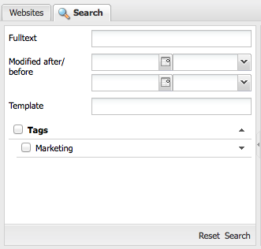
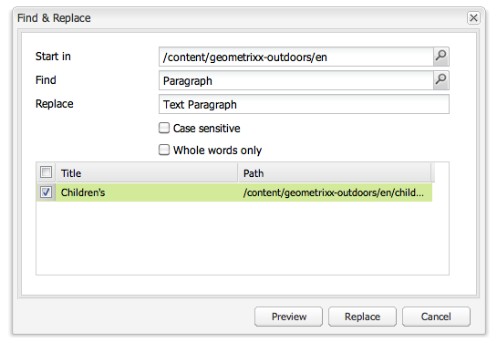

# Sökning{#search-features}

I författarmiljön i AEM finns olika sätt att söka efter innehåll, beroende på resurstypen.

>[!NOTE]
>
>Utanför författarmiljön finns det även andra sökfunktioner, till exempel [Query Builder](/help/sites-developing/querybuilder-api.md) och [CRXDE Lite](/help/sites-developing/developing-with-crxde-lite.md).

## Sökgrunder {#search-basics}

Om du vill komma åt sökpanelen klickar du på fliken **Sök** längst upp i den vänstra rutan i rätt konsol.

Med sökpanelen kan du söka på alla webbplatssidor. Den innehåller fält och widgetar för följande:

* **Fulltext**: Sök efter den angivna texten
* **Ändrad efter/före**: Sök bara på de sidor som har ändrats mellan de angivna datumen
* **Mall**: Sök bara på de sidor som är baserade på den angivna mallen
* **Taggar**: Sök bara på de sidor som har de angivna taggarna

>[!NOTE]
>
>När din instans har konfigurerats för [Lucene-sökning](/help/sites-deploying/queries-and-indexing.md) kan du använda följande i **Fulltext**:
>
>* [Jokertecken](https://lucene.apache.org/core/5_3_1/queryparser/org/apache/lucene/queryparser/classic/package-summary.html#Wildcard_Searches)
>* [Booleska operatorer](https://lucene.apache.org/core/5_3_1/queryparser/org/apache/lucene/queryparser/classic/package-summary.html#Boolean_operators)

   >
   >
* [Reguljära uttryck](https://lucene.apache.org/core/5_3_1/queryparser/org/apache/lucene/queryparser/classic/package-summary.html#Regexp_Searches)
>* [Fältgruppering](https://lucene.apache.org/core/5_3_1/queryparser/org/apache/lucene/queryparser/classic/package-summary.html#Field_Grouping)
>* [Boosting](https://lucene.apache.org/core/5_3_1/queryparser/org/apache/lucene/queryparser/classic/package-summary.html#Boosting_a_Term)

>

Utför sökningen genom att klicka på **Sök** längst ned i rutan. Klicka på **Återställ** för att rensa sökvillkoren.

## Filter {#filter}

På olika platser kan ett filter ställas in (och rensas) för att detaljgranska och förfina vyn:

## Sök och ersätt {#find-and-replace}

I konsolen **Webbplatser** med menyalternativet **Sök och ersätt** kan du söka efter och ersätta flera förekomster av en sträng i ett avsnitt på webbplatsen.

1. Markera rotsidan, eller mappen, där du vill att åtgärden Sök och ersätt ska utföras.
1. Välj **Verktyg** och **Sök och ersätt**:

   

1. Dialogrutan **Sök och ersätt** gör följande:

   * bekräftar rotsökvägen där sökåtgärden ska starta
   * definierar den term som ska hittas
   * definierar termen som ska ersätta den
   * anger om sökningen ska vara skiftlägeskänslig
   * anger om endast hela ord ska hittas (i annat fall hittas även delsträngar)

   Om du klickar på **Förhandsgranska** visas var termen har hittats. Du kan markera/rensa specifika förekomster som ska ersättas:

   

1. Klicka på **Ersätt** om du vill ersätta alla instanser. Du ombeds bekräfta åtgärden.

Standardomfånget för sök- och ersättningsservern omfattar följande egenskaper:

* `jcr:title`
* `jcr:description`
* `jcr:text`
* `text`

Omfånget kan ändras med Apache Felix Web Management Console (till exempel `http://localhost:4502/system/console/configMgr`). Välj `CQ WCM Find Replace Servlet (com.day.cq.wcm.core.impl.servlets.FindReplaceServlet)` och konfigurera scopet efter behov.

>[!NOTE]
>
>I en standardinstallation AEM Sök och ersätt används Lucene för sökfunktionen.
>
>Lucene indexerar strängegenskaper på upp till 16 kB. Strängar som överskrider detta söks inte igenom.

