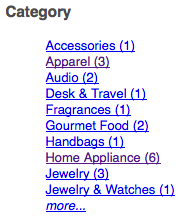

# Lägga till sök&amp;marknadsför funktioner på sidan {#adding-search-promote-features-to-your-page}

Om du vill integrera sök- och höjdfunktioner på din webbplats använder du komponenterna [!UICONTROL Sök och befordra] för att lägga till följande funktioner på dina sidor:

* Nyckelordssökning
* Sökresultatsida
* Sökförfining
* Banderoller

Observera att du bara kan använda funktionerna Sök och Befordra om AEM-administratören har aktiverat dem. Se [Integrera med Adobe Search&amp;Promote](/help/sites-administering/search-and-promote.md).

Ansikten konfigureras på Search&amp;Promote-servern, liksom den information som varje komponent tillhandahåller. Följande tabell innehåller en kort beskrivning av varje komponent. Efterföljande avsnitt innehåller detaljerad information om hur de används.

<table> 
 <tbody> 
  <tr> 
   <th>Sök&amp;höj upp komponent</th> 
   <th>Beskrivning</th> 
  </tr> 
  <tr> 
   <td>Banderoller</td> 
   <td>Visar banderollannonser. Banderoller väljs baserat på data som samlats in via Search&amp;Promote.  </td> 
  </tr> 
  <tr> 
   <td>Breadcrumbs</td> 
   <td>Visar söknyckelordet och den filtersekvens som användaren har tillämpat på sökresultaten.</td> 
  </tr> 
  <tr> 
   <td>Kryssrutelista-Fasett</td> 
   <td>En lista med kryssrutor för att välja aspekter för filtrering av sökresultat.</td> 
  </tr> 
  <tr> 
   <td>Listrutefrekvens</td> 
   <td>En nedrullningsbar lista med aspekter för filtrering av sökresultat.</td> 
  </tr> 
  <tr> 
   <td>Länklistefaktor</td> 
   <td>En lista med facet-länkar för filtrering av sökresultat.</td> 
  </tr> 
  <tr> 
   <td>Sidnumrering</td> 
   <td>Kontroller för navigering i sökresultatsidor.</td> 
  </tr> 
  <tr> 
   <td>Resultat</td> 
   <td>Visar resultatet av en nyckelordssökning.</td> 
  </tr> 
  <tr> 
   <td>Sökning</td> 
   <td>Lägger till ett sökfält på sidan.</td> 
  </tr> 
 </tbody> 
</table>

## Skapa sidan med sökresultat {#creating-the-search-results-page}

Använd WCM-webbplatskonsolen för att skapa en sida för att visa sökresultat. Resultatet av en sökning från en sökkomponent kan visas på den här sidan om samma Search&amp;Promote-tjänst används.

De komponenter som gör det möjligt för användare att granska sökresultat är Resultat och Sidnumrering. Komponenten **[!UICONTROL Resultat]** har inga konfigurerbara egenskaper i [!UICONTROL redigerings] - eller [!UICONTROL designläge] . Komponenten Results visar bara sökresultaten, som innehåller länkar till andra sidor, och visar antalet resultat för söknyckelordet.

Med komponenten **[!UICONTROL Sidnumrering]** kan användare navigera i flera sidor med sökresultat. Användaren kan se antalet sidor, gå till nästa eller föregående sida, välja en sida som ska öppnas eller sammanställa alla resultat på en sida.

Du kan konfigurera följande komponentegenskaper i [!UICONTROL redigeringsläget] för att styra körningsbeteendet:

* **[!UICONTROL Dölj en resultatsida]** - Välj det här alternativet om du vill dölja sidnavigeringskontrollerna när sökningen returnerar en enda resultatsida.
* **[!UICONTROL Dölj första/sista]** - Välj det här alternativet om du vill förhindra att användare hoppar till första eller sista resultatsidan.
* **[!UICONTROL Dölj föregående/nästa]** - Avgör om användare kan navigera på resultatsidor i förhållande till den aktuella sidan.
* **[!UICONTROL Dölj vy alla]** - Avgör om användaren kan konsolidera alla sökresultat på en enda sida. Vanligtvis blir användningen av serverresurser effektivare om du tillhandahåller växlingsdata. Välj det här alternativet om du vill förhindra överföring av stora datauppsättningar i ett svarsmeddelande.

## Aktivera filtrering av resultat efter facets {#enabling-the-filtering-of-results-by-facets}

Du kan göra det möjligt för användare att filtrera sökresultat efter aspekter. Med komponenterna **[!UICONTROL Checkbox List Facet]**, **[!UICONTROL Dropdown Facet]** och **[!UICONTROL Link List Facet]** kan användarna välja en eller flera aspekter för filtrering. När du använder de här komponenterna bör du även ta med komponenten **[!UICONTROL Breadcrumbs]** . Bläddringarna anger vilka filter som används.

Komponenterna **[!UICONTROL Checkbox List Facet**, **[!UICONTROL Dropdown Facet]** och **[!UICONTROL Link List Facet]** har båda följande egenskaper som du konfigurerar i **[!UICONTROL redigeringsläget]** :

* **[!UICONTROL Fasettnamn]** - Namnet på den aspekt som används för filter.

Komponenten **[!UICONTROL Checkbox List Facet]** visar en lista med facets med en medföljande kryssruta. Använd en **[!UICONTROL kryssrutelistefärg]** så att användarna kan visa en delmängd av resultaten som innehåller objekt från flera aspekter. Exempelvis är varumärkesaspekten lämplig eftersom flera varumärken tillhandahåller samma typ av produkt.

En kryssruta visas för varje aspekt som är associerad med ett sökresultat. När en användare markerar en kryssruta, läses sidan in igen med en uppdaterad resultatuppsättning. Alla kryssrutor finns kvar på sidan så att kunderna kan lägga till eller ta bort ansikten i filtret när som helst:

Med komponenten **[!UICONTROL Listrutebegränsning]** kan kunderna välja ett sidobjekt i en listruta. Den här komponenten är användbar när du vill att kunderna ska fokusera på ett enda sidobjekt samtidigt. Avdelningsaspekten är till exempel lämplig för att göra det möjligt för kunderna att begränsa produktsökningar efter kön. John söker efter *jeans* och filmar sedan på Men&#39;s Department.

Listrutan fylls i med de aspekter som är associerade med alla sökresultat. När du väljer ett objekt i listrutan läses sidan in igen med en uppdaterad resultatuppsättning. Objekten i listrutan ändras inte så att kunderna när som helst kan växla från aspekten till aspekten.

Med komponenten **[!UICONTROL Link List Facet]** kan kunderna stegvis begränsa sitt fokus till objekt som är kategoriserade under flera fasmedlemmar eller facets.

Fasettmedlemmar visas som en lista med länkar. Texten för varje länk är namnet på en fasmedlem som är associerad med det aktuella sökresultatet. När en kund klickar på en facet-länk läses sidan in igen och en delmängd av sökresultaten visas. Listan med länkar uppdateras för att ge ännu mindre fokus.

Länkarna i listan ändras också när ett filter tillämpas från en annan typ av [!UICONTROL Search&amp;Promote] -komponent. Användning av flera typer av filterkomponenter kan ge effektiva filterkombinationer.

Med komponenten **[!UICONTROL Breadcrumbs]** kan kunderna se de filter som för närvarande tillämpas på sökresultaten i den ordning som de tillämpades. Kunder kan klicka på objekten i den synliga sökvägen för att återgå till den filterkombinationen.

Du kan konfigurera följande egenskaper för vägbeskrivningar i redigeringsläget för att anpassa komponentens utseende:

* **[!UICONTROL Avgränsare]** - Definiera tecknet eller teckensträngen som ska fungera som avgränsare mellan varje avstavningssymbol. I fältet Avgränsare accepteras alla teckensträngar som indata. Standardinställningen är: &quot;>&quot; (utan citattecken)
* **[!UICONTROL Avslutande avgränsare]** - Definiera ett tecken eller en teckensträng som ska visas i slutet av kolumnmarginalerna. Fältet Avgränsare accepterar alla teckensträngar som indata. Standardinställningen för detta är &quot;blank&quot; (d.v.s. inget visas i slutet av den synliga raden)

## Lägga till sökrutor {#adding-search-boxes}

Med **[!UICONTROL sökkomponenten]** kan kunderna söka efter nyckelord. Lägg till sökkomponenter på varje sida där du vill ha tillgång till sökningen.

Konfigurera följande egenskaper i **[!UICONTROL redigeringsläget]** för att styra körningsbeteendet:

* **[!UICONTROL Resultatsidsökväg]** - Sökvägen till sidan där sökresultaten visas.
* **[!UICONTROL Aktivera Komplettera]** automatiskt - Välj det här alternativet om du vill att föreslagna söknyckelord ska visas när kunden börjar skriva i sökrutan.

## Lägga till banners {#adding-banners}

Komponenten **[!UICONTROL Banners]** visar bannerannonser enligt kundens Search&amp;Promote-sökningar. Logiken på Search&amp;Replace-servern avgör vilken banderoll som ska visas. En sökning på jeans kan till exempel få en moderelaterad banderoll att visas. Filtrering på Men&#39;s Department kan ytterligare förfina valet av banderoll.

Komponenten **[!UICONTROL Banners]** har en konfigurerbar egenskap med namnet **[!UICONTROL Banner Area]**. I **[!UICONTROL redigeringsläget]** väljer du ett av egenskapsvärdena för att ange hur banderollen ska visas. Tjänsten Sök&amp;Befordra avgör vilka värden du kan välja från.

## Exempel på sök&amp;befordra söksida {#example-search-promote-search-page}

I det här diagrammet visas de komponenter som har lagts till på en sida för att skapa den fullt funktionella söknings- och höjdresultatsidan nedan.

 

