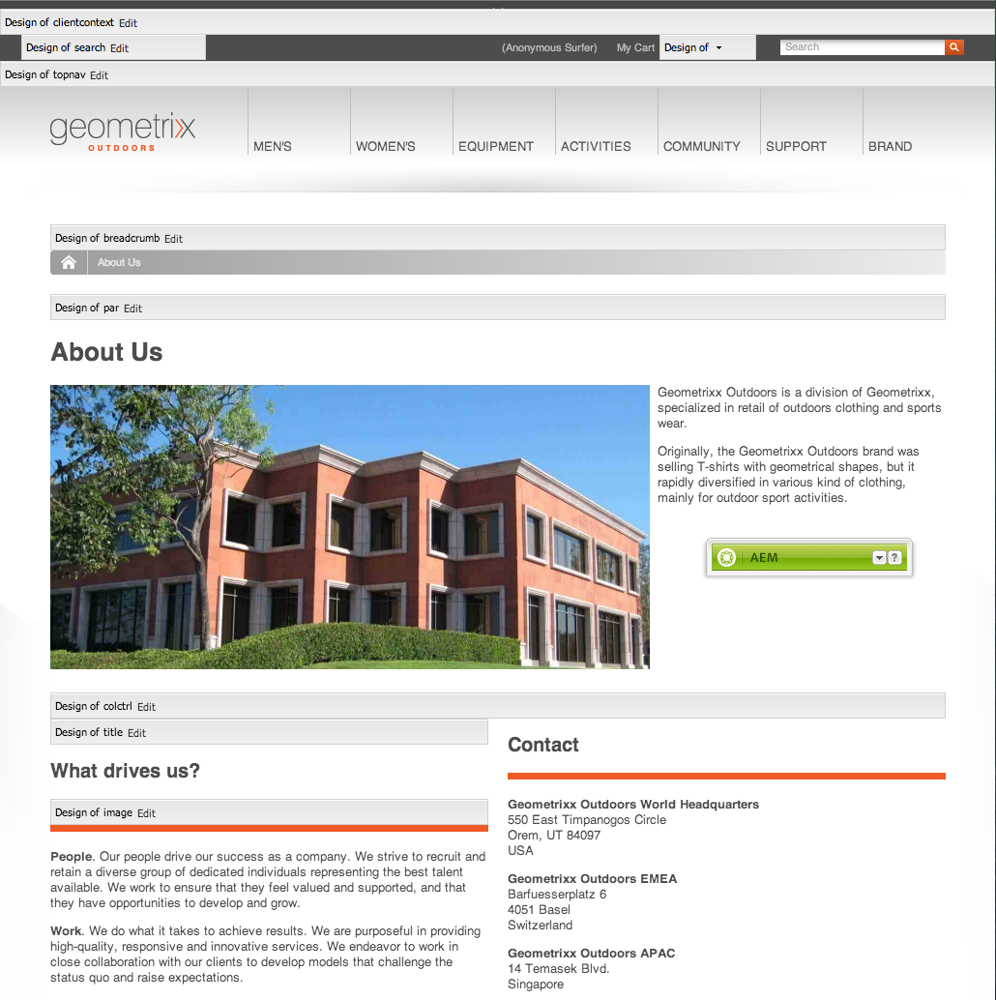

# Konfigurera komponenter i designläge{#configuring-components-in-design-mode}

När AEM-instansen är installerad direkt är ett urval av komponenter omedelbart tillgängliga i sidosparken.

Förutom dessa finns även andra komponenter tillgängliga. Du kan använda designläget för att [aktivera/inaktivera sådana komponenter](#enabledisablecomponentsusingdesignmode). När det är aktiverat och finns på sidan kan du sedan använda designläget för att [konfigurera olika aspekter av komponentdesignen](#configuringcomponentsusingdesignmode) genom att redigera attributparametrarna.

>[!NOTE]
>
>Försiktighet måste iakttas vid redigering av dessa komponenter. Designinställningarna är ofta en viktig del av designen för hela webbplatsen, så de bör bara ändras av någon med rätt behörighet (och upplevelse), ofta administratör eller utvecklare. Mer information finns i [Utveckla komponenter](/help/sites-developing/components.md) .

Detta innebär att lägga till, eller ta bort, de komponenter som är tillåtna i sidans styckesystem. Styckesystemet ( `parsys`) är en sammansatt komponent som innehåller alla andra styckekomponenter. Med styckesystemet kan författare lägga till komponenter av olika typer på en sida eftersom det innehåller alla andra styckekomponenter. Varje stycketyp representeras som en komponent.

Innehållet på en produktsida kan till exempel innehålla ett styckesystem som innehåller följande:

* En bild av produkten (i form av en bild eller ett textimagestycke)
* Produktbeskrivningen (som ett textstycke)
* En tabell med tekniska uppgifter (som ett tabellstycke)
* En formuläranvändare fyller i (när ett formulär börjar, formulärelement och slutstycke för formulär)

>[!NOTE]
>
>Mer information om hur du använder mallar och komponenter finns i [Utveckla komponenter](/help/sites-developing/components.md#paragraphsystem) och [Riktlinjer för användning av mallar och komponenter](/help/sites-developing/dev-guidelines-bestpractices.md#guidelines-for-using-templates-and-components) `parsys`.

## Aktivera/inaktivera komponenter {#enable-disable-components}

I designläget minimeras sidosparken och du kan konfigurera komponenter som är tillgängliga för redigering:

1. Öppna en sida för redigering och använd ikonen för att öppna designläget:

   

1. Klicka på **Redigera** i styckesystemet (**Utformning av paragraf**).

   

1. En dialogruta öppnas med en lista över de komponentgrupper som visas i Spark tillsammans med de enskilda komponenterna som de innehåller.

   Välj vad som krävs för att lägga till eller ta bort komponenterna som ska vara tillgängliga i sidosparken.

   

1. The Sidekick minimeras i designläge. Genom att klicka på pilen kan du maximera sparken och återgå till redigeringsläget:

   

## Konfigurera designen för en komponent {#configuring-the-design-of-a-component}

I designläget kan du även konfigurera attribut för de enskilda komponenterna. Varje komponent har sina egna parametrar visas i följande exempel **Image** -komponenten:

1. Öppna en sida för redigering och använd ikonen för att öppna designläget:

   

1. Du kan konfigurera komponenternas design.

   Om du till exempel klickar på **Redigera** i bildkomponenten (**Design of image**) kan du konfigurera komponentspecifika parametrar:

   

1. Spara ändringarna genom att klicka på **OK** .

1. The Sidekick minimeras i designläge. Genom att klicka på pilen kan du maximera sparken och återgå till redigeringsläget:

   

