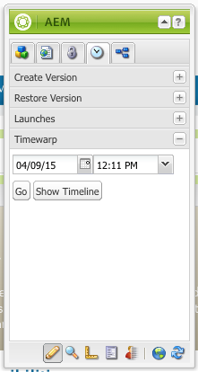
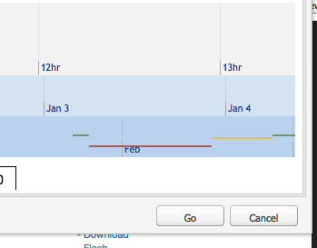

# Arbeta med sidversioner{#working-with-page-versions}

Versionshantering skapar en ögonblicksbild av en sida vid en viss tidpunkt. Med versionshantering kan du utföra följande åtgärder:

* Skapa en version av en sida.
* Återställ en sida till en tidigare version för att ångra en ändring som du har gjort på en sida, till exempel.
* Jämför den aktuella versionen av en sida med en tidigare version med skillnader i markerad text och bild.

## Skapa en ny version {#creating-a-new-version}

Så här skapar du en ny version av en sida:

1. Öppna sidan som du vill skapa en ny version för i webbläsaren.
1. I Spark väljer du fliken **Versioning** och därefter underfliken **Skapa version**.

   

1. Ange en **kommentar** (valfritt).
1. Om du vill ange en etikett för versionen (valfritt) klickar du på knappen **Mer >>** och anger namnet på **etiketten** för versionen. Om etiketten inte är inställd blir versionen ett automatiskt ökande nummer.
1. Klicka på **Skapa version**. Ett grått meddelande visas på sidan. till exempel:

   Version 1.2 har skapats för: Skruvar.

>[!NOTE]
>
>En version skapas automatiskt när sidan aktiveras.

## Återställa en sidversion från Sidekick {#restoring-a-page-version-from-sidekick}

Så här återställer du sidan till en tidigare version:

1. Öppna sidan som du vill återställa en tidigare version för.
1. I sidosparken väljer du fliken **Versioning** och sedan underfliken **Återställ version**.

   

1. Markera den version som du vill återställa och välj **Återställ**.

## Återställa en sidversion från konsolen {#restoring-a-page-version-from-the-console}

Den här metoden kan användas för att återställa en sidversion. Den kan även användas för att återställa sidor som tidigare har tagits bort:

1. Gå till sidan som du vill återställa och markera den i konsolen **Webbplatser**.
1. Välj **Verktyg** på den översta menyn och **Återställ**:

   

1. Väljer** Återställ version..** visar versioner av dokument i den aktuella mappen. Även om en sida har tagits bort visas den senaste versionen:

   

1. Markera den version som du vill återställa och klicka på **Återställ**. AEM återställer de versioner (eller träd) som du väljer.

### Återställa ett träd från konsolen {#restoring-a-tree-from-the-console}

Den här metoden kan användas för att återställa en sidversion. Den kan även användas för att återställa sidor som tidigare har tagits bort:

1. Gå till mappen som du vill återställa i konsolen **Webbplatser** och markera den.
1. Välj **Verktyg** på den översta menyn och sedan **Återställ**.
1. Väljer **Återställ träd..** öppnar dialogrutan där du kan välja det träd som du vill återställa:

   

1. Klicka på **Återställ**. AEM återställer det markerade trädet.

## Jämföra med föregående version {#comparing-with-a-previous-version}

Så här jämför du den aktuella versionen av sidan med en tidigare version:

1. I webbläsaren öppnar du sidan som du vill jämföra med en tidigare version för.
1. I Spark väljer du fliken **Versioning** och därefter underfliken **Återställ version** n.

   

1. Markera den version som du vill jämföra och klicka på knappen **Diff**.
1. Skillnaderna mellan den aktuella versionen och den valda versionen visas enligt följande:

   * Text som har tagits bort är röd och genomstruken.
   * Text som har lagts till är grön och markerad.
   * Bilder som har lagts till eller tagits bort är gröna ramar.

   

1. Välj underfliken **Återställ version** i Spark och klicka på knappen **&lt;&lt;Back** för att visa den aktuella versionen.

## Timewarp {#timewarp}

Timewarp är en funktion som är utformad för att simulera ***publicerat***-läge för en sida vid en viss tidpunkt.

Syftet är att du ska kunna spåra den publicerade webbplatsen vid den valda tidpunkten. Detta använder sidaktiveringarna för att avgöra status för publiceringsmiljön.

Så här gör du:

* Systemet söker efter den sidversion som var aktiv vid den valda tidpunkten.
* Det innebär att den visade versionen skapades/aktiverades *före* den tidpunkt som valdes i Timewarp.
* När du navigerar till en sida som har tagits bort återges även den, så länge som de gamla versionerna av sidan fortfarande är tillgängliga i databasen.
* Om ingen publicerad version hittas återgår Timewarp till sidans aktuella status i redigeringsmiljön (detta för att förhindra ett fel/404-sida, vilket innebär att du inte kan bläddra längre).

>[!NOTE]
>
>Om versioner tas bort från databasen kan inte Timewarp visa rätt vy. Om element (som kod, css, bilder osv.) för återgivning av webbplatsen har ändrats, skiljer sig vyn från den ursprungliga, eftersom objekten inte versionsindelas i databasen.

### Använda tidskonverteringskalendern {#using-the-timewarp-calendar}

Timewarp är tillgängligt från sidosparken.

Kalenderversionen används om du har en viss dag att visa:

1. Öppna fliken **Versionshantering** och klicka sedan på **Timewarp** (i sidsparkens nederkant). Följande dialogruta visas:

   

1. Använd väljarna för datum och tid för att ange önskat datum/tid och klicka på **Gå**.

   Timewarp visar sidan som den var i publicerat läge före/på det datum du valt.

   >[!NOTE]
   >
   >Timewarp fungerar bara helt om du tidigare har publicerat sidan. I annat fall visas den aktuella sidan i författarmiljön.

   >[!NOTE]
   >
   >Om du navigerar till en sida som har tagits bort/tagits bort från databasen kommer den att återges korrekt om äldre versioner av sidan fortfarande är tillgängliga i databasen.

   >[!NOTE]
   >
   >Du kan inte redigera den gamla versionen av sidan. Det är bara tillgängligt för visning. Om du vill återställa den äldre versionen måste du göra det manuellt med [restore](/help/sites-classic-ui-authoring/classic-page-author-work-with-versions.md#restoring-a-page-version-from-sidekick).

1. När du är klar med visningen av sidan klickar du på:

   * **Avsluta** Timewarpför att avsluta och återgå till den aktuella författarsidan.
   * [Visa ](#using-the-timewarp-timeline) tidslinjen om du vill visa tidslinjen.

   

### Använda tidslinjen för tidsförvrängning {#using-the-timewarp-timeline}

Tidslinjeversionen används om du vill se en översikt över publiceringsaktiviteterna på sidan.

Om du vill visa tidslinjen i dokumentet:

1. Så här visar du tidslinjen:

   1. Öppna fliken **Versionshantering** och klicka sedan på **Timewarp** (i sidsparkens nederkant).
   1. Använd dialogrutan som visas efter [med Timewarp-kalendern](#using-the-timewarp-calendar).

1. Klicka på **Visa tidslinje** - dokumentets tidslinje visas; till exempel:

   

1. Markera och flytta (håll ned och dra) tidslinjen för att flytta genom dokumentets tidslinje.

   * Alla rader visar publicerade versioner.

      När en sida är aktiverad börjar en ny rad. Varje gång dokumentet redigeras visas en ny färg.

      I exemplet nedan anger den röda linjen att sidan redigerades under tidsramen för den ursprungliga gröna versionen och den gula raden anger att sidan redigerades någon gång under den röda versionen osv.
   

1. Klicka på:

   1. **Visa innehållet** på den publicerade sidan vid den valda tidpunkten.
   1. När du visar innehållet använder du **Avsluta tidsförvrängning** för att avsluta och återgå till den aktuella författarsidan.

### Begränsningar för tidsförvrängning

Med Timewarp kan du göra ett bra försök att återskapa en sida vid en viss tidpunkt. På grund av komplexiteten i den kontinuerliga redigeringen av innehåll i AEM är detta dock inte alltid möjligt. Dessa begränsningar bör beaktas när du använder Timewarp.

* **Timewarp fungerar baserat på publicerade sidor**  - Timewarp fungerar bara helt om du tidigare har publicerat sidan. I annat fall visas den aktuella sidan i författarmiljön.
* **Vid tidsförvrängning används sidversioner** - Om du navigerar till en sida som har tagits bort/tagits bort från databasen kommer den att återges korrekt om gamla versioner av sidan fortfarande är tillgängliga i databasen.
* **Borttagna versioner påverkar Timewarp** - Om versioner tas bort från databasen kan inte Timewarp visa rätt vy.
* **Timewarp är skrivskyddat**  - Du kan inte redigera den gamla versionen av sidan. Det är bara tillgängligt för visning. Om du vill återställa den äldre versionen måste du göra det manuellt med hjälp av Återställ.
* **Timewarp baseras bara på sidinnehåll**  - Om element (som kod, css, resurser/bilder osv.) för återgivning av webbplatsen har ändrats, skiljer sig vyn från den ursprungliga vyn eftersom objekten inte har versionsindelats i databasen.

>[!CAUTION]
>
>Timewarp är ett verktyg som hjälper författare att förstå och skapa sitt innehåll. Den är inte avsedd som en revisionslogg eller för juridiska ändamål.