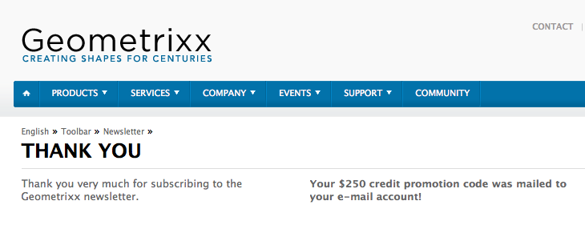

# Skapa en startsida för ett effektivt nyhetsbrev{#creating-an-effective-newsletter-landing-page}

>[!CAUTION]
>
>AEM 6.4 har nått slutet på den utökade supporten och denna dokumentation är inte längre uppdaterad. Mer information finns i [teknisk supportperiod](https://helpx.adobe.com/support/programs/eol-matrix.html). Hitta de versioner som stöds [här](https://experienceleague.adobe.com/docs/).

En effektiv startsida för nyhetsbrev hjälper er att få så många människor som möjligt att registrera sig för ert nyhetsbrev (eller andra e-postmarknadsföringskampanjer). Du kan använda den information du samlar in från nyhetsbrevet för att få leads.

Om du vill skapa en effektiv startsida för nyhetsbrevet måste du göra följande:

1. Skapa en lista för nyhetsbrevet så att andra kan prenumerera på det.
1. Skapa anmälningsformuläret. När du gör det lägger du till ett arbetsflödessteg som automatiskt lägger till personen som registrerar sig för nyhetsbrevet i din lista med leads.
1. Skapa en bekräftelsesida som tackar användarna för att de har anmält sig och eventuellt erbjuder dem en befordran.
1. Lägg på teasers.

>[!NOTE]
>
>Adobe planerar inte att ytterligare förbättra denna funktion (Hantera leads och listor).\
>Rekommendationen är att [Adobe Campaign och dess AEM](/help/sites-administering/campaign.md).

## Skapa en lista för nyhetsbrevet {#creating-a-list-for-the-newsletter}

Skapa en lista, till exempel **Geometrixx Newsletter**, i MCM för det nyhetsbrev som folk ska prenumerera på. Hur du skapar listor beskrivs i [Skapa listor](/help/sites-classic-ui-authoring/classic-personalization-campaigns.md#creatingnewlists).

I följande exempel visas ett exempel på en lista:

## Skapa ett anmälningsformulär {#create-a-sign-up-form}

Skapa ett registreringsformulär för nyhetsbrev där användarna kan prenumerera på taggar. Exempelwebbplatsen för Geometrixx innehåller en nyhetsbrevsida i verktygsfältet Geometrixx där du kan skapa ditt formulär.

Om du vill skapa ett eget nyhetsbrevformulär läser du i informationen om hur du skapar formulär i [Forms-dokumentation](/help/sites-authoring/default-components.md#form). Nyhetsbrevet använder taggarna från taggbiblioteket. Mer information om hur du lägger till ytterligare taggar finns i [Taggsadministration](/help/sites-authoring/tags.md#tagadministration).

De dolda fälten i följande exempel anger den minsta mängden information (e-post). Du kan dessutom lägga till fler fält senare, men detta påverkar konverteringsgraden.

Följande exempel är ett formulär som skapats på http://localhost:4502/cf#/content/geometrixx/en/toolbar/newsletter.html.

1. Skapa formuläret.

   

1. Klicka **Redigera** i formulärkomponenten för att konfigurera formuläret så att det går till en Tack-sida (se [Skapa tacksidor](#creating-a-thank-you-page)).

   

1. Ange formuläråtgärden (d.v.s. vad som ska hända när du skickar formuläret) och konfigurera gruppen så att den tilldelar registrerade användare till listan som du skapade tidigare (t.ex. geometrixx-nyhetsbrev).

   

## Skapa en tacksida {#creating-a-thank-you-page}

När användare klickar på **Prenumerera nu** vill du att sidan Tack ska öppnas automatiskt. Skapa sidan Tack på sidan Geometrixx Newsletter. När du har skapat nyhetsbrevformuläret redigerar du formulärelementet och lägger till sökvägen på tacksidan.

Om du skickar begäran tar det användaren till en **Tack** sida efter vilken de får ett e-postmeddelande. Denna tacksida skapades på /content/geometrixx/en/toolbar/newsletter/thanks_you.

## Lägga till lärare {#adding-teasers}

Lägg till [teasers](/help/sites-classic-ui-authoring/classic-personalization-campaigns.md#teasers) att inrikta sig på specifika målgrupper. Du kan till exempel lägga till lärare på sidan Tack och på registreringssidan för nyhetsbrev.

Så här lägger du till testare för att skapa en effektiv startsida för nyhetsbrevet:

1. Skapa en läcker paragraf för en gåva. Välj **Första** som strategi och innehåller text som informerar dem om vilken gåva de kommer att få.

   

1. Skapa ett underordnat stycke för sidan Tack. Välj **Första** som strategi och inkludera text som anger att presenten är på väg.

   

1. Skapa en kampanj med de två teasers - tagga en med företag och en utan taggar.

## Skicka innehåll till prenumeranter {#pushing-content-to-subscribers}

Gör ändringar i sidorna med funktionen för nyhetsbrev i MCM. Sedan skickar du uppdaterat innehåll till prenumeranterna.

Se [Skickar nyhetsbrev](/help/sites-classic-ui-authoring/classic-personalization-campaigns.md#newsletters).
