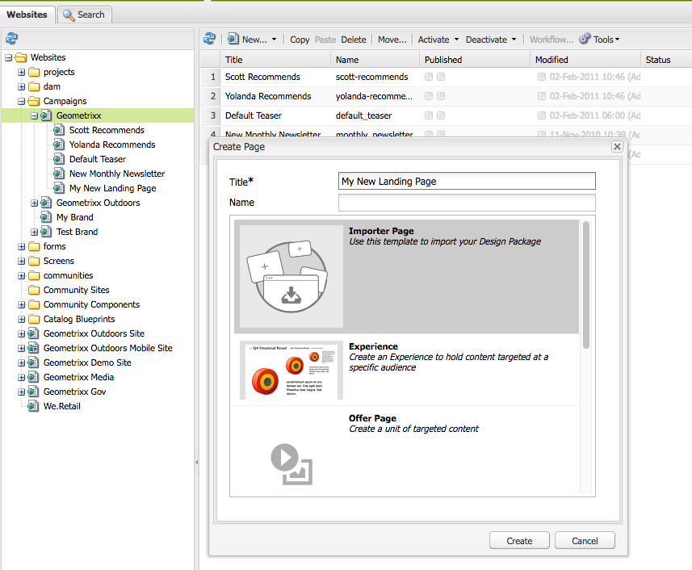

# Landningssidor{#landing-pages}

Med funktionen för landningssidor kan du snabbt och enkelt importera en design och ett innehåll direkt till en AEM-sida. En webbutvecklare kan förbereda HTML-koden och andra resurser som kan importeras som en hel sida eller som endast en del av en sida. Funktionen är användbar för att skapa landningssidor för marknadsföring som bara är aktiva under en begränsad tid och som behöver skapas snabbt.

På den här sidan beskrivs följande:

* hur landningssidorna ser ut i AEM, inklusive tillgängliga komponenter
* hur du skapar en landningssida och importerar ett designpaket
* Så här arbetar du med landningssidor i AEM
* konfigurera mobila landningssidor

Förberedelsen av designpaketet för import beskrivs i [Utöka och konfigurera designimporteraren](/help/sites-administering/extending-the-design-importer-for-landingpages.md). Integrering med Adobe Analytics ingår i [Integrering av landningssidor med Adobe Analytics.](/help/sites-administering/integrating-landing-pages-with-adobe-analytics.md)

## Vad är landningssidor? {#what-are-landing-pages}

Landningssidor är ensidiga eller flersidiga webbplatser som utgör&quot;slutpunkten&quot; för en marknadsföringsstrategi, till exempel e-post, lösenord/banners, sociala medier. En landningssida kan tjäna olika syften, men alla har en sak gemensamt - besökaren bör utföra en uppgift och som definierar landningssidans framgång.

Med funktionen för landningssidor i AEM kan marknadsförare arbeta med webbdesigners på byråer eller interna kreativa team för att skapa siddesign som enkelt kan importeras till AEM och fortfarande kan redigeras av marknadsförarna och publiceras under samma ledning som de andra AEM-baserade webbplatserna.

I AEM skapar du landningssidor genom att utföra följande steg:

1. Skapa en sida i AEM som innehåller startsidornas arbetsyta. AEM levereras med ett exempel som kallas **för importsida**.

1. [Förbered HTML och resurser.](/help/sites-administering/extending-the-design-importer-for-landingpages.md)
1. Paketera resurserna i en ZIP-fil som här kallas designpaket.
1. Importera designpaketet på importsidan.
1. Ändra och publicera sidan.

### Startsidor för datorer {#desktop-landing-pages}

Ett exempel på landningssida i AEM ser ut så här:

### Mobila landningssidor {#mobile-landing-pages}

En landningssida kan också ha en mobilversion av sidan. Om du vill ha en separat mobilversion av landningssidan måste importdesignen ha två html-filer: *index.htm(l)* och *mobile.index.htm(l)*.

Importproceduren för landningssidan är densamma som för en normal landningssida. Designen för landningssidan har en extra HTML-fil som motsvarar den mobila landningssidan. Även den här HTML-filen måste ha en arbetsyta `div` med `id=cqcanvas` samma innehåll som startsidan för stationära datorer (html) och har stöd för alla redigerbara komponenter som beskrivs för startsidan för stationära datorer.

Startsidan för mobilen skapas som en underordnad sida till startsidan för skrivbordslandningen. Du öppnar den genom att navigera till landningssidan på webbplatser och öppna den underordnade sidan.

>[!NOTE]
>
>Den mobila landningssidan tas bort/inaktiveras tillsammans med startsidan för stationära datorer om landningssidan för stationära datorer tas bort eller inaktiveras.

## Startsideskomponenter {#landing-page-components}

Om du vill göra delar av HTML-koden som importeras redigerbara i AEM, kan du mappa innehåll inom landningssidorna HTML till AEM-komponenter direkt. Designimporteraren förstår följande komponenter som standard:

* Text, för all text
* Titel, för innehåll i H1-6-taggar
* Bild, för bilder som ska vara utbytbara
* Call to Actions:

   * Klicka på länken
   * Grafisk länk

* CTA Lead-Form för inhämtning av användarinformation
* Styckesystem (parsys), för att tillåta att en komponent läggs till eller att ovanstående komponent konverteras

Dessutom kan du utöka detta och ge stöd för anpassade komponenter. I det här avsnittet beskrivs komponenterna i detalj.

### Text {#text}

Med komponenten Text kan du ange ett textblock med en WYSIWYG-redigerare. Mer information finns i [Textkomponenten](/help/sites-authoring/default-components.md#text) .

Följande är ett exempel på en textkomponent på en landningssida:

### Titel {#title}

Med titelkomponenten kan du visa en titel och konfigurera storleken (h1-6). Mer information finns i [Titelkomponent](/help/sites-authoring/default-components.md#title) .

Följande är ett exempel på en titelkomponent på en landningssida:

### Bild {#image}

I bildkomponenten visas en bild som du antingen kan dra och släppa från Innehållssökning eller klicka för att överföra. Mer information finns i [bildkomponenten](/help/sites-authoring/default-components.md) .

Följande är ett exempel på en bildkomponent på en landningssida:

### Call to Action (CTA) {#call-to-action-cta}

En landningssiddesign kan ha flera länkar - vissa av dessa kan vara avsedda som&quot;Anrop till åtgärd&quot;.

Call to action (CTA) används för att få besökaren att vidta omedelbara åtgärder på landningssidan, till exempel&quot;Subscribe Now&quot;,&quot;View this video&quot;,&quot;Limited Time Only&quot; och så vidare.

* Klicka på Via länk - Gör att du kan lägga till en textlänk som när du klickar på den leder besökaren till en mål-URL.
* Grafisk länk - Gör att du kan lägga till en bild som besökaren kommer till en mål-URL när du klickar på den.

Båda CTA-komponenterna har liknande alternativ. Klicka genom länk har ytterligare RTF-alternativ. Komponenterna beskrivs i detalj i följande stycken.

### Klicka genom länken {#click-through-link}

Denna CTA-komponent kan användas för att lägga till en textlänk på landningssidan. Länken kan klickas för att ta användaren till den mål-URL som anges i komponentegenskaperna. Det ingår i gruppen&quot;Call to Action&quot;.

**Etikett** Texten som användarna ser. Du kan ändra formateringen med textredigeraren.

**Mål-URL** Ange den URI som du vill att användarna ska besöka om de klickar på texten.

**Återgivningsalternativ** Beskriver återgivningsalternativen. Du kan välja bland följande:

* Läsa in sida i ett nytt webbläsarfönster
* Läs in sida i aktuellt fönster
* Läs in sida i den överordnade ramen
* Avbryt alla ramar och läs in sidan i hela webbläsarfönstret

**CSS** Ange en sökväg till din CSS-formatmall på fliken Format.

**ID** På fliken Format anger du ett ID för komponenten som unikt identifierar den.

Följande är ett exempel på en klickning genom länken:

### Grafisk länk {#graphical-link}

CTA-komponenten kan användas för att lägga till grafik med länk på landningssidan. Bilden kan vara en enkel knapp eller en grafisk bild som bakgrund. När användaren klickar på bilden dirigeras användaren till den mål-URL som anges i komponentegenskaperna. Det ingår i gruppen **Call to Action** .

**Etikett** Den text som visas i bilden. Du kan ändra formateringen med textredigeraren.

**Mål-URL** Ange den URI som du vill att användarna ska besöka om de klickar på bilden.

**Återgivningsalternativ** Beskriver återgivningsalternativen. Du kan välja bland följande:

* Läsa in sida i ett nytt webbläsarfönster
* Läs in sida i aktuellt fönster
* Läs in sida i den överordnade ramen
* Avbryt alla ramar och läs in sidan i hela webbläsarfönstret

**CSS** Ange en sökväg till din CSS-formatmall på fliken Format.

**ID** På fliken Format anger du ett ID för komponenten som unikt identifierar den.

Här följer ett exempel på en grafisk länk:

## Handläggningsblankett {#call-to-action-cta-lead-form}

Ett lead-formulär är ett formulär som används för att samla in profilinformation för en besökare/lead. Denna information kan lagras och användas senare för att skapa en effektiv marknadsföring utifrån informationen. Informationen innehåller vanligtvis titel, namn, e-postadress, födelsedatum, adress, ränta osv. Det ingår i **CTA Lead** -gruppen.

Ett exempel på ett CTA-formulär ser ut så här:

CTA-formulär bygger på flera olika komponenter:

* **Leadformulär** Ledformulärskomponenten definierar början och slutet av ett nytt lead-formulär på en sida. Andra komponenter kan sedan placeras mellan dessa element, som e-post-ID, förnamn och så vidare.

* **Formulärfält och -element** Formulärfält och -element kan innehålla textrutor, alternativknappar, bilder och så vidare. Användaren slutför ofta en åtgärd i ett formulärfält, till exempel att skriva text. Mer information finns i enskilda formulärelement.

* **Profilkomponenterna** för profiler relaterar till besökarprofiler som används för socialt samarbete och andra områden där besökaranpassning krävs.

I föregående exempel visas ett exempelformulär. den består av **lead-formulärkomponenten** (start och slut), med fälten **Förnamn** och **E-post-ID** som används för indata och ett **Skicka** -fält

Följande komponenter finns tillgängliga för CTA Lead-formuläret:

### Inställningar som är gemensamma för många komponenter i huvudformuläret {#settings-common-to-many-lead-form-components}

Även om var och en av de ledande formulärkomponenterna har olika syften, består många av liknande alternativ och parametrar.

När du konfigurerar någon av formulärkomponenterna är följande flikar tillgängliga i dialogrutan:

* **Titel och text** Här måste du ange grundläggande information, t.ex. komponentens rubrik och eventuell tillhörande text. Där det är lämpligt kan du även definiera annan nyckelinformation, t.ex. om fältet är flervalsbart och om det finns objekt tillgängliga för markering.

* **Inledande värden** Gör att du kan ange ett standardvärde.

* **Begränsningar** Här kan du ange om ett fält är obligatoriskt och om det finns platsbegränsningar i det fältet (måste till exempel vara numeriskt).

* **Formatering** Anger fältets storlek och format.

>[!NOTE]
>
>Fälten som visas varierar beroende på den enskilda komponenten.
>
>Alla alternativ är inte tillgängliga för alla komponenter för lead-formulär. Mer information om dessa [vanliga inställningar](/help/sites-authoring/default-components.md#formsgroup)finns i Formulär.

#### Formulärexponenter för lead {#lead-form-components}

I följande avsnitt beskrivs de komponenter som är tillgängliga för formulär för lead-anrop-till-åtgärd.

**Om** Tillåter användare att lägga till Om-information.

**Adressfält** Tillåter användare att ange adressinformation. När du konfigurerar den här komponenten måste du ange elementnamnet i dialogrutan. Elementnamnet är namnet på formulärelementet. Detta anger var i databasen data lagras.

**Födelsedatum** Användare kan ange födelsedatum.

**E-post-ID** Tillåter användare att ange en e-postadress (identifiering).

**Förnamn** Tillhandahåller ett fält där användare kan ange sitt förnamn.

**Genusanvändare** kan välja sitt kön i en listruta.

**Efternamn** Användare kan ange efternamnsinformation.

**Leadformulär** Lägg till den här komponenten för att lägga till ett leadformulär på landningssidan. Ett lead-formulär innehåller automatiskt fälten Början av lead-formulär och Slut på lead-formulär. däremellan lägger du till leadformulärskomponenterna som beskrivs i det här avsnittet.

Radavståndskomponenten definierar både början och slutet av ett formulär med elementen **Formulärstart** och **Formulärslut** . Dessa är alltid kopplade för att säkerställa att formuläret är korrekt definierat.

När du har lagt till leadformuläret kan du konfigurera början eller slutet av formuläret genom att klicka på **Redigera** i motsvarande fält.

**Början av leadformulär**

Det finns två flikar för **konfigurationsformulär** och **avancerat**:

**Tack** ! Sidan som ska refereras tackar besökarna för att de har skrivit in den. Om formuläret lämnas tomt visas det igen när det har skickats.

**Starta arbetsflöde** Avgör vilket arbetsflöde som utlöses när ett lead-formulär skickas.

**Inläggsalternativ** Följande inläggsalternativ är tillgängliga:

* Skapa lead
* E-posttjänst: Skapa prenumerant och lägg till i listan - Använd om du använder en e-postleverantör som ExactTarget.
* E-posttjänst: Skicka e-post med automatisk svarare - Använd om du använder en e-postleverantör som ExactTarget.
* E-posttjänst: Avbeställ användare från listan - Använd detta om du använder en e-postleverantör som ExactTarget.
* Avbeställ

**Formuläridentifierare** Formulärets identifierare identifierar lead-formuläret unikt. Använd formuläridentifieraren om du har flera formulär på en sida, se till att de har olika identifierare.

**Läs in sökväg** är sökvägen till nodegenskaper som används för att läsa in fördefinierade värden i lead-formulärfälten.

Detta är ett valfritt fält som anger sökvägen till en nod i databasen. När den här noden har egenskaper som matchar fältnamnen förinläses motsvarande fält i formuläret med egenskapsvärdet. Om det inte finns någon matchning innehåller fältet standardvärdet.

**Klientvalidering** Anger om klientvalidering krävs för det här formuläret (servervalidering sker alltid). Detta kan du göra med komponenten Forms Captcha.

**Valideringsresurstyp** definierar resurstypen för formulärvalidering om du vill validera hela lead-formuläret (i stället för enskilda fält).

Om du validerar det fullständiga formuläret ska du även inkludera något av följande:

* Ett skript för klientvalidering:

   ` /apps/<myApp>/form/<myValidation>/formclientvalidation.jsp`

* Ett skript för validering på serversidan:

   ` /apps/<myApp>/form/<myValidation>/formservervalidation.jsp`

**Åtgärdskonfiguration** Beroende på vad du har valt i Alternativ för åtgärder ändras åtgärdskonfigurationen. Om du till exempel väljer Skapa lead kan du konfigurera vilken lista leadet ska läggas till i.

* **Visa Skicka-knapp** Anger om en Skicka-knapp ska visas eller inte.

* **Skicka namn** En identifierare om du använder flera skicka-knappar i ett formulär.

* **Skicka titel** Namnet som visas på knappen, till exempel Skicka eller Skicka.

* **Visa kryssrutan Återställ knapp** Markera om du vill att knappen Återställ ska visas.

* **Återställ titel** Namnet som visas på knappen Återställ.

* **Beskrivningsinformation** som visas under knappen.

## Skapa en landningssida {#creating-a-landing-page}

När du skapar en landningssida måste du utföra tre steg:

1. Skapa en importsida.
1. [Förbered HTML för import.](/help/sites-administering/extending-the-design-importer-for-landingpages.md)
1. Importera designpaketet.

### Skapa en importsida {#creating-an-importer-page}

Innan du kan importera designen för landningssidan måste du skapa en importsida, till exempel under en kampanj. Med importsidmallen kan du importera hela HTML-landningssidan. Sidan innehåller en listruta där designpaketet för landningssidan kan importeras med dra och släpp.

>[!NOTE]
>
>Som standard kan en importsida bara skapas under kampanjer, men du kan också täcka över den här mallen för att skapa en landningssida under `/content/mysite.`

Så här skapar du en ny landningssida:

1. Gå till **webbplatskonsolen** .
1. Välj kampanj i den vänstra rutan.
1. Klicka på **Ny** för att öppna fönstret* Skapa sida **.
1. Välj mallen **Importera sida** och lägg till en rubrik och eventuellt ett namn. Klicka sedan på **Skapa**.

   

   Din nya importsida visas.

### Förbereda HTML för import {#preparing-the-html-for-import}

HTML-koden måste förberedas innan designpaketet importeras. Mer information finns i [Utöka och konfigurera designimporten](/help/sites-administering/extending-the-design-importer-for-landingpages.md) .

### Importera designpaketet {#importing-the-design-package}

När en importsida har skapats kan du importera ett designpaket till den. Information om hur du skapar designpaketet och dess rekommenderade struktur finns i [Utöka och konfigurera designimporten](/help/sites-administering/extending-the-design-importer-for-landingpages.md).

Om du har designpaketet klart beskrivs i följande steg hur du importerar designpaketet till en importsida.

1. Öppna importsidan som du [skapade tidigare](#creatingablankcanvaspage). En dropbox med text som säger **Zip** visas.

   

1. Dra och släpp designpaketet i listrutan. Observera att pilen ändrar riktning när ett paket dras över det.
1. När du drar och släpper ser du landningssidan i stället för importsidan. HTML-landningssidan har importerats.

   

>[!NOTE]
>
>Om du har problem med att importera designpaketet läser du [Felsökning](/help/sites-administering/extending-the-design-importer-for-landingpages.md#troubleshooting).

## Arbeta med landningssidor {#working-with-landing-pages}

Designen och resurserna för en landningssida skapas vanligtvis av en designer som kan finnas på en byrå i verktyg som de används för, till exempel Adobe Photoshop eller Adobe Dreamweaver. När designen är klar skickar designern en zip-fil med alla resurser till marknadsföringen. Kontakten inom marknadsföring ansvarar sedan för att ZIP-filen släpps till AEM och innehållet publiceras.

Dessutom kan det hända att designern måste göra ändringar på landningssidan efter att den har importerats genom att redigera eller ta bort innehåll och konfigurera komponenterna för att ringa in och ta bort. Slutligen vill marknadsföraren förhandsgranska landningssidan och sedan aktivera kampanjen för att säkerställa att landningssidan publiceras.

I det här avsnittet beskrivs hur du gör följande:

* Ta bort en landningssida
* Ladda ned designpaketet
* Visa importinformation
* Återställ en landningssida
* [Konfigurera CTA-komponenterna och lägga till innehåll på sidan](#call-to-action-cta)
* Förhandsgranska landningssidan
* Aktivera/publicera en landningssida

När du importerar designpaketet är följande verktygsfält tillgängligt högst upp på landningssidan:

### Hämta det importerade designpaketet {#downloading-the-imported-design-package}

När du laddar ned zip-filen kan du registrera vilken zip som importerades med en viss landningssida. Observera att ändringar som görs på en sida inte läggs till i zippen.

Om du vill hämta det importerade designpaketet klickar du på **Hämta zip** i verktygsfältet Landningssida.

### Visa importinformation {#viewing-import-information}

Du kan när som helst visa information om den senaste importen genom att klicka på det blå utropstecknet högst upp på landningssidan i det klassiska användargränssnittet.

Om det importerade designpaketet innehåller vissa problem, till exempel om det refererar till bilder/skript som inte finns i paketet och så vidare, visas sådana problem i form av en lista av designimporteraren. Om du vill visa en lista med problem i det klassiska användargränssnittet klickar du på problemlänken i verktygsfältet Landningssida. I följande bild öppnas fönstret Importera problem när du klickar på länken **Problem** .

### Återställa en landningssida {#resetting-a-landing-page}

Om du vill importera om designpaketet för landningssidan efter att ha gjort några ändringar kan du&quot;rensa&quot; landningssidan genom att klicka på **Rensa** högst upp på landningssidan i det klassiska användargränssnittet eller klicka på Rensa på inställningsmenyn i det pekoptimerade användargränssnittet. Om du gör det tas den importerade landningssidan bort och en tom importsida skapas.

När du rensar landningssidan kan du ta bort innehållsändringarna. Om du klickar på **Nej** bevaras innehållsändringarna, det vill säga strukturen under `jcr:content/importer`bevaras och endast importsidans komponent och resurserna i `etc/design` tas bort. Om du klickar på **Ja** tas även `jcr:content/importer` rutan bort.

>[!NOTE]
>
>Om du bestämmer dig för att ta bort innehållsändringarna försvinner alla ändringar som du har gjort på den importerade landningssidan samt alla sidegenskaper när du klickar på **Radera**.

### Ändra och lägga till komponenter på en landningssida {#modifying-and-adding-components-on-a-landing-page}

Om du vill ändra komponenterna på landningssidan dubbelklickar du på dem för att öppna dem och redigera dem precis som andra komponenter.

Om du vill lägga till komponenter på landningssidan drar och släpper du komponenter på landningssidan, antingen från sidosparken i det klassiska användargränssnittet eller från komponentpanelen i det pekoptimerade användargränssnittet, och redigerar efter behov.

>[!NOTE]
>
>Om en komponent på landningssidan inte kan redigeras måste du importera zip-filen igen när du har [ändrat HTML-filen.](/help/sites-administering/extending-the-design-importer-for-landingpages.md) Det innebär att de icke-redigerbara delarna inte konverterades till AEM-komponenter under importen.

### Ta bort en landningssida {#deleting-a-landing-page}

Att ta bort en landningssida är som att ta bort en vanlig AEM-sida.

Det enda undantaget är att när du tar bort en landningssida på en stationär dator tas även motsvarande mobillandningssida bort (om en sådan finns), men inte tvärtom.

### Publicera en landningssida {#publishing-a-landing-page}

Du kan publicera landningssidan och alla dess beroenden precis som när du publicerar en vanlig sida.

>[!NOTE]
>
>När du publicerar startsidan för stationära datorer publiceras även motsvarande mobilversion (om någon). Men publicering av en mobillandningssida publicerar inte datorversionen.

