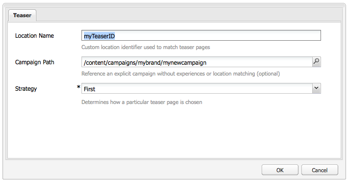
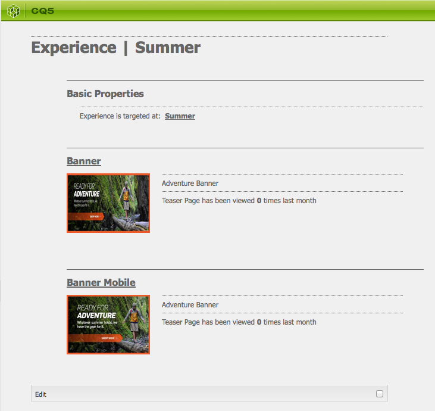

# Lärare och strategier{#teasers-and-strategies}

>[!CAUTION]
>
>AEM 6.4 har nått slutet på den utökade supporten och denna dokumentation är inte längre uppdaterad. Mer information finns i [teknisk supportperiod](https://helpx.adobe.com/support/programs/eol-matrix.html). Hitta de versioner som stöds [här](https://experienceleague.adobe.com/docs/).

Kampanjerna använder ofta teasers som en mekanism för att locka ett visst segment av besökspopulationen till innehåll som fokuserar på deras intressen. En eller flera lärare definieras för en viss kampanj.

>[!NOTE]
>
>Teaser-komponenten har ersatts i AEM 6.2.

* **Varumärkessidor** lagras i Campaigns-avsnittet på webbplatsen. Ett varumärke innehåller de enskilda kampanjerna.

* **Kampanjsidor** lagras i Campaigns-avsnittet på webbplatsen. Varje kampanj har en egen sida, där de mer detaljerade definitionerna finns. Behållaren, eller översikten, innehåller också viss information och statistik om de enskilda sidorna för teaser.

Teaser i AEM består av flera delar:

* **Teaser pages** lagras under rätt kampanjsida och innehåller definitioner för de steg som är tillgängliga för varje enskild kampanj. Dessa definitioner används när de teaser-styckena visas. inklusive innehållsvariationer, det segment som ska användas för att välja variations- och förstärkningsfaktor.
* The **Teaser component** är tillgängligt direkt och gör att du kan skapa en instans av ditt specifika steg på en innehållssida. Du kan dra teaserkomponenten från sidosparken och sedan ange din teaserdefinition för att skapa ett eget teaserstycke. **Obs!** Teaser-komponenten har ersatts i AEM 6.2.

* **Teaser paragraphs** är faktiska instanser av ditt suddgummi på en innehållssida. Dessa locka fram ett segment av besökare till innehåll som fokuserar på deras intressen.
* Sidor där kampanjinnehållet är inriktat på ett specifikt besökarsegment. Vanligtvis leder de smalare styckena besökaren till sådana sidor.

## Strategier {#strategies}

När du lägger till ett teaser-stycke på en sida måste du definiera **Strategi**.

Detta gäller om flera scener är tillgängliga för markering när deras tilldelade segment kan matchas. The **Strategi** anger sedan ett extra villkor som används för att välja den teaser som visas:

* **ClickStream-bakgrundsmusik**, baseras på de taggar och relaterade taggar som finns i besökarens klientkontext (visa hur ofta en besökare har klickat på sidor som innehåller respektive tagg). Träffarna för de taggar som definieras på scensidan jämförs.
* **Slumpmässig**, för &quot;slumpmässigt&quot; urval. använder den slumpmässiga faktorn som genereras för en sida, som kan ses med [klientkontext](/help/sites-administering/client-context.md).

* **Första** i listan över lösta segment. Ordningen är densamma som för teasers på kampanjbehållarsidan.

The [Förstärkningsfaktor](/help/sites-administering/campaign-segmentation.md#boost-factor) i segmentet påverkar också markeringen. Detta är en viktningsfaktor som läggs till i en segmentdefinition för att öka eller minska den relativa sannolikheten för att den väljs.

Processen och de inbördes förhållandena mellan de olika urvalskriterierna illustreras bäst med ett exempel (en metod som också kan användas för att säkerställa att dina lärare når rätt målgrupp).

Om följande segment redan har skapats och tilldelats respektive startfaktor:

| Segment | Förstärkningsfaktor |
|---|---|
| S1 | 0 |
| S2 | 0 |
| S3 | 10 |
| S4 | 30 |
| S5 | 0 |
| S6 | 100 |

Och vi använder följande definitioner av teaser:

<table> 
 <tbody> 
  <tr> 
   <td>Campaign</td> 
   <td>Teaser</td> 
   <td>Tilldelade segment</td> 
   <td>Tilldelade taggar </td> 
  </tr> 
  <tr> 
   <td>C1</td> 
   <td>T1</td> 
   <td>S1, S2</td> 
   <td>Näringsliv, marknadsföring</td> 
  </tr> 
  <tr> 
   <td>C1</td> 
   <td>T2 </td> 
   <td>S1</td> 
   <td>  </td> 
  </tr> 
  <tr> 
   <td>C1 </td> 
   <td>T3</td> 
   <td>S3, S4</td> 
   <td>  </td> 
  </tr> 
  <tr> 
   <td>C1 </td> 
   <td>T4</td> 
   <td>S2, S5</td> 
   <td>  </td> 
  </tr> 
  <tr> 
   <td>C1 </td> 
   <td>T5</td> 
   <td>S1, S2, S6</td> 
   <td>Marknadsföring</td> 
  </tr> 
  <tr> 
   <td>C1 </td> 
   <td>T6</td> 
   <td>S6</td> 
   <td>Företag  </td> 
  </tr> 
 </tbody> 
</table>

Om vi sedan tillämpar detta på en besökare där:

* **S1**, **S2** och **S6** har lösts

* taggen **marknadsföring** har 3 träffar
* taggen **företag** har 6 träffar

Vi kan se resultatet:

* matchar framgång - kan något av de segment som tilldelats till teaser matchas för den aktuella besökaren?
* förstärkningsfaktor - den högsta förstärkningsfaktorn för alla tillämpliga segment
* clickstream score - den ackumulerade summan för alla tillämpliga taggträffar

som beräknas innan lämplig strategi tillämpas:

<table> 
 <tbody> 
  <tr> 
   <td>Campaign</td> 
   <td>Teaser</td> 
   <td>Tilldelade segment</td> 
   <td>Taggar </td> 
   <td>Lyckad matchning?</td> 
   <td>Resultatförstärkningsfaktor</td> 
   <td>Resultat av Clickstream-bakgrundsmusik </td> 
  </tr> 
  <tr> 
   <td>C1</td> 
   <td>T1</td> 
   <td>S1, S2</td> 
   <td>Näringsliv, marknadsföring</td> 
   <td>Ja</td> 
   <td>0</td> 
   <td>9</td> 
  </tr> 
  <tr> 
   <td>C1</td> 
   <td>T2 </td> 
   <td>S1</td> 
   <td>  </td> 
   <td>Ja</td> 
   <td>0</td> 
   <td>  </td> 
  </tr> 
  <tr> 
   <td>C1 </td> 
   <td>T3</td> 
   <td>S3, S4</td> 
   <td>  </td> 
   <td>Nej</td> 
   <td>  </td> 
   <td>  </td> 
  </tr> 
  <tr> 
   <td>C1 </td> 
   <td>T4</td> 
   <td>S2, S5</td> 
   <td>  </td> 
   <td>Ja  </td> 
   <td>0  </td> 
   <td>  </td> 
  </tr> 
  <tr> 
   <td>C1 </td> 
   <td>T5</td> 
   <td>S1, S2, S6</td> 
   <td>Marknadsföring</td> 
   <td>Ja</td> 
   <td>100</td> 
   <td>3</td> 
  </tr> 
  <tr> 
   <td>C1 </td> 
   <td>T6</td> 
   <td>S6</td> 
   <td>Företag</td> 
   <td>Ja</td> 
   <td>100</td> 
   <td>6 </td> 
  </tr> 
 </tbody> 
</table>

Dessa värden används för att bestämma vilka steg som besökaren ska se, beroende på **Strategi** som tillämpas på teaser-stycket:

<table> 
 <tbody> 
  <tr> 
   <td>Strategi</td> 
   <td>Resulterande Teaser</td> 
   <td>Kommentarer</td> 
  </tr> 
  <tr> 
   <td>Första</td> 
   <td>T5</td> 
   <td>Endast T5 och T6 anses vara deras segment som alla löser <i>och</i> har den högsta förstärkningsfaktorn. Den returnerade listan är i ordningen T5, T6. så att T5 markeras och visas.</td> 
  </tr> 
  <tr> 
   <td>Slumpmässig</td> 
   <td>T5 eller T6</td> 
   <td>Båda teasers har segment som alla löser sig och samma förstärkningsfaktor. De två teasrarna visas därför i samma proportion.</td> 
  </tr> 
  <tr> 
   <td>ClickStream-bakgrundsmusik</td> 
   <td>T6</td> 
   <td>
Segmenten för T1, T4, T5 och T6 kan alla lösas för besökaren. De högre förstärkningsfaktorerna för T5 och T6 utesluter sedan T1 och T4. Det högre klickströms-poängen i T6 resulterar slutligen i att detta väljs.
 </td> 
  </tr> 
 </tbody> 
</table>

>[!NOTE]
>
>Om det efter upplösningsteknikerna ovan finns flera mätare tillgängliga för markering kommer ett internt urval (slumpmässigt) att markera ett enskilt teaser för visning.
>
>Om strategin till exempel var Clickstream-bakgrundsmusik och T5 hade samma Clickstream-bakgrundsmusik som T6 (dvs. 6 i stället för 3), skulle det interna urvalet (slumpmässigt) användas för att välja en av dessa båda.

Teaser Pages/Paragraphs används för att styra specifika besökarsegment till innehåll som är inriktat på deras intressen. De kan presentera en rad olika alternativ som besökaren kan välja mellan eller visa endast ett steg baserat på det specifika besökarsegmentet. Det streckade stycket kan t.ex. vara beroende av besökarens ålder.

Vanligtvis är en&quot;teaser&quot;-sida en tillfällig åtgärd som varar en viss tid tills den ersätts av nästa&quot;teaser&quot;-sida.

När ni har skapat ert varumärke och er kampanj kan ni skapa och skapa en läroupplevelse.

## Skapa en kontaktyta för din Teaser {#creating-a-touchpoint-for-your-teaser}

>[!NOTE]
>
>Teaser-komponenten har ersatts i AEM 6.2.

1. Navigera till innehållssidan där du vill placera det steg som ska leda till kampanjsidan.
1. Lägg till en **Teaser** -komponenten (tillgänglig i **Personalisering** sidbrytare) i önskad position. När den skapades visas att kampanjsökvägen ännu inte har konfigurerats:

   

1. Redigera teaserkomponenten för att lägga till:

   * **Kampanjsökväg**
Vägen till kampanjsidan som innehåller den enskilda lärarsidan. segment avgör exakt vilken teaser som visas.
   * **[Strategi](/help/sites-classic-ui-authoring/classic-personalization-campaigns.md#strategies)**
Metod som används för markering när flera segment har matchats.
   

1. Klicka **OK** att spara. Beroende på vilka segment du har angett för teaser och profilen för den användare du är inloggad som, visas rätt innehåll:

   

1. För musen över det trasiga stycket för att visa frågetecknet (komponentens nedre högra hörn). Klicka här om du vill visa de segment som används och om de för närvarande löses.

   

## Teaser Overview {#teaser-overview}

Förutom kampanjvyn i MCM ger kampanjsidan även information om de lärare som är kopplade till den:

1. Från **Webbplatser** konsol, öppna kampanjsidan; till exempel:

   `http://localhost:4502/content/campaigns/geometrixx-outdoors/storefront/summer.html`

   Här visas en översikt över definitioner och visningsstatistik för teaser:

   
