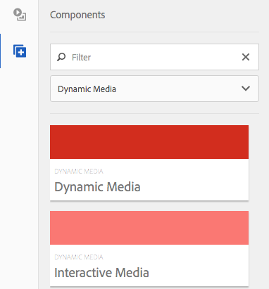

# Lägga till Dynamic Media-resurser på sidor{#adding-dynamic-media-assets-to-pages}

>[!CAUTION]
>
>AEM 6.4 har nått slutet på den utökade supporten och denna dokumentation är inte längre uppdaterad. Mer information finns i [teknisk supportperiod](https://helpx.adobe.com/support/programs/eol-matrix.html). Hitta de versioner som stöds [här](https://experienceleague.adobe.com/docs/).

Om du vill lägga till Dynamic Media-funktioner i resurser som du använder på dina webbplatser kan du lägga till **[!UICONTROL Dynamic Media]** eller **[!UICONTROL Interactive Media]** direkt på sidan. Du gör detta genom att ange [!UICONTROL Design] och aktivera de dynamiska mediekomponenterna. Sedan kan du lägga till komponenterna på sidan och lägga till resurser i komponenterna. Komponenterna för dynamiska media och interaktiva media är smarta - de vet om du lägger till en bild eller en video och de tillgängliga alternativen ändras i enlighet med detta.

Du lägger till dynamiska medieresurser direkt på sidan om du använder AEM som WCM-fil.

>[!NOTE]
>
>Bildscheman är tillgängliga direkt för karusellbanderoller.

## Lägga till en Dynamic Media-komponent på en sida {#adding-a-dynamic-media-component-to-a-page}

Lägga till [!UICONTROL Dynamic Media] eller [!UICONTROL Interactive Media] -komponenten på en sida är densamma som att lägga till en komponent på en sida. The [!UICONTROL Dynamic Media] och [!UICONTROL Interactive Media] beskrivs närmare i följande avsnitt.

Så här lägger du till en Dynamic Media-komponent/ett visningsprogram på en sida:

1. Öppna AEM sidan där du vill lägga till Dynamic Media-komponenten.
1. Om ingen Dynamic Media-komponent är tillgänglig klickar du på linjalen i dialogrutan [!UICONTROL Sidekick] att ange **[!UICONTROL Design]** läge, klicka **[!UICONTROL Edit]** parsys, och markera **[!UICONTROL Dynamic Media]** för att göra Dynamic Media-komponenterna tillgängliga.

   >[!NOTE]
   >
   >Se [Konfigurera komponenter i designläge](/help/sites-authoring/default-components-designmode.md) för mer information.

1. Återgå till **[!UICONTROL Edit]** genom att klicka på pennikonen i dialogrutan [!UICONTROL Sidekick].
1. Dra **[!UICONTROL Dynamic Media]** eller **[!UICONTROL Interactive Media]** från **[!UICONTROL Other]** på sidan i den önskade platsen.
1. Klicka **[!UICONTROL Edit]** för att öppna komponenten.
1. [Redigera komponenten](#dynamic-media-component) vid behov och klicka **[!UICONTROL OK]** för att spara ändringar.

## Dynamic Media Components {#dynamic-media-components}

[!UICONTROL Dynamic Media] och [!UICONTROL Interactive Media] finns i [!UICONTROL Sidekick] under **[!UICONTROL Dynamic Media]**. Du använder **[!UICONTROL Interactive Media]** -komponent för alla interaktiva resurser som interaktiv video, interaktiva bilder eller karuselluppsättningar. För alla andra dynamiska mediakomponenter använder du **[!UICONTROL Dynamic Media]** -komponenten.

>[!NOTE]
>
>De här komponenterna är inte tillgängliga som standard och måste markeras i designläge innan du använder. [När de har gjorts tillgängliga i designläge](/help/sites-authoring/default-components-designmode.md)kan du lägga till komponenterna på sidan på samma sätt som andra AEM.

### Dynamic Media-komponent {#dynamic-media-component}

Dynamic Media-komponenten är smart - beroende på om du lägger till en bild eller en video finns det olika alternativ. Komponenten har stöd för bildförinställningar, bildbaserade visningsprogram som bilduppsättningar, snurra, blandade medieuppsättningar och video. Dessutom är visningsprogrammet responsivt. Skärmstorleken ändras alltså automatiskt baserat på skärmstorleken. Alla visningsprogram är HTML5-baserade.

>[!NOTE]
>
>När du lägger till [!UICONTROL Dynamic Media] och **[!UICONTROL Dynamic Media Settings]** är tom eller du inte kan lägga till en resurs på rätt sätt, kontrollera följande:
>
>* Du har [aktiverad Dynamic Media](/help/assets/config-dynamic.md). Dynamic Media är inaktiverat som standard.
>* Bilden har en pyramidformad fil. Bilder som importerats innan dynamiska medier har aktiverats har ingen pyramiddiff-fil.
>

#### När du arbetar med bilder {#when-working-with-images}

The [!UICONTROL Dynamic Media] kan du lägga till dynamiska bilder, inklusive bilduppsättningar, snurra uppsättningar och blandade medieuppsättningar. Du kan zooma in, zooma ut och, om tillämpligt, vrida en bild i en snurra eller välja en bild från en annan typ av uppsättning.

Du kan också konfigurera visningsförinställningen, bildförinställningen eller bildformatet direkt i komponenten. Om du vill göra en bild responsiv kan du antingen ange brytpunkter eller använda en responsiv bildförinställning.

Du kan redigera följande Dynamic Media-inställningar genom att klicka på **[!UICONTROL Edit]** i komponenten och sedan klicka på **[!UICONTROL Dynamic Media Settings]** -fliken.

>[!NOTE]
>
>Som standard är Dynamic Media-bildkomponenten adaptiv. Om du vill göra den till en fast storlek anger du den i komponenten i **[!UICONTROL Advanced]** med **[!UICONTROL Width]** och **[!UICONTROL Height]** egenskaper.

**[!UICONTROL Viewer preset]** - Välj en befintlig visningsförinställning i listrutan. Om den visningsförinställning som du söker efter inte visas kanske du måste göra den synlig. Se [Hantera visningsförinställningar](/help/assets/managing-viewer-presets.md). Du kan inte välja en visningsförinställning om du använder en bildförinställning och vice versa.

Det här är det enda tillgängliga alternativet om du visar bilduppsättningar, snurruppsättningar eller blandade medieuppsättningar. De visningsförinställningar som visas är också smarta - endast relevanta visningsprogramförinställningar visas.

**[!UICONTROL Image preset]** - Välj en befintlig bildförinställning i listrutan. Om den bildförinställning du söker inte syns kan du behöva göra den synlig. Se [Hantera bildförinställningar](/help/assets/managing-image-presets.md). Du kan inte välja en visningsförinställning om du använder en bildförinställning och vice versa.

Det här alternativet är inte tillgängligt om du visar bilduppsättningar, snurruppsättningar eller blandade medieuppsättningar.

**[!UICONTROL Image Modifiers]** - Du kan ändra bildeffekter genom att ange ytterligare bildkommandon. Dessa beskrivs i [Hantera bildförinställningar](/help/assets/managing-viewer-presets.md) och [Kommandoreferens](https://experienceleague.adobe.com/docs/dynamic-media-developer-resources/image-serving-api/image-serving-api/http-protocol-reference/command-reference/c-command-reference.html).

Det här alternativet är inte tillgängligt om du visar bilduppsättningar, snurruppsättningar eller blandade medieuppsättningar.

**[!UICONTROL Breakpoints]** - Om du använder den här resursen på en responsiv webbplats måste du lägga till sidbrytpunkter. Bildbrytpunkter måste avgränsas med kommatecken (,). Det här alternativet fungerar när ingen höjd eller bredd har definierats i en bildförinställning.

Det här alternativet är inte tillgängligt om du visar bilduppsättningar, snurruppsättningar eller blandade medieuppsättningar.

Du kan redigera följande [!UICONTROL Advanced Settings] genom att klicka **[!UICONTROL Edit]** i komponenten.

**[!UICONTROL Title]** - Ändra bildens titel.

**[!UICONTROL Alt Text]** - Lägg till en titel i bilden för de användare som har inaktiverat grafik.

Det här alternativet är inte tillgängligt om du visar bilduppsättningar, snurruppsättningar eller blandade medieuppsättningar.

**[!UICONTROL URL, Open in]** - Du kan ställa in en resurs från för att öppna en länk. Ange **[!UICONTROL URL]** och **[!UICONTROL Open in]** för att ange om du vill att den ska öppnas i samma fönster eller i ett nytt fönster.

Det här alternativet är inte tillgängligt om du visar bilduppsättningar, snurruppsättningar eller blandade medieuppsättningar.

**[!UICONTROL Width and Height]** - Ange värdet i pixlar om du vill att bilden ska ha en fast storlek. Om du lämnar dessa värden tomma anpassas resursen.

#### När du arbetar med video {#when-working-with-video}

Använd [!UICONTROL Dynamic Media] för att lägga till dynamisk video på webbsidor. När du redigerar komponenten kan du välja att använda en fördefinierad videovisningsförinställning för att spela upp videon på sidan.

Du kan redigera följande [!UICONTROL Dynamic Media Settings] genom att klicka **[!UICONTROL Edit]** i komponenten.

>[!NOTE]
>
>Som standard är videokomponenten i Dynamic Media adaptiv. Om du vill göra den till en fast storlek anger du den i komponenten med **[!UICONTROL Width]** och **[!UICONTROL Height]** i **[!UICONTROL Advanced]** -fliken.

**[!UICONTROL Viewer preset]** - Välj en befintlig förinställning för visningsprogrammet för video i listrutan. Om den visningsförinställning som du söker efter inte visas kanske du måste göra den synlig. Se [Hantera visningsförinställningar](/help/assets/managing-viewer-presets.md).

Du kan redigera följande [!UICONTROL Advanced] inställningar genom att klicka på **[!UICONTROL Edit]** i komponenten.

**[!UICONTROL Title]** - Ändra videons titel.

**[!UICONTROL Width and Height]** - Ange värdet i pixlar om du vill att videon ska ha en fast storlek. Om du lämnar dessa värden tomma blir de anpassningsbara.

#### Leverera säker video {#how-to-delivery-secure-video}

I AEM 6.2 när du installerar [FP-13480](https://experience.adobe.com/#/downloads/content/software-distribution/en/aem.html?package=/content/software-distribution/en/details.html/content/dam/aem/public/adobe/packages/cq620/featurepack/cq-6.2.0-featurepack-13480)kan du styra om en video levereras via en säker SSL-anslutning (HTTPS) eller en osäker anslutning (HTTP). Som standard ärvs videoleveransprotokollet automatiskt från inbäddningswebbsidans protokoll. Om webbsidan läses in via HTTPS levereras videon också via HTTPS. Och tvärtom, om webbsidan finns på HTTP, levereras videon via HTTP. I de flesta fall är standardbeteendet bra och du behöver inte göra några konfigurationsändringar. Du kan dock åsidosätta standardbeteendet genom att lägga till `VideoPlayer.ssl=on` till slutet av en URL-sökväg eller till listan med andra parametrar för visningskonfiguration i ett inbäddat kodfragment, för att framtvinga säker videoleverans.

Mer information om säker videomaterial finns i `VideoPlayer.ssl` konfigurationsattribut i din URL-sökväg, se [Säker leverans av video](https://experienceleague.adobe.com/docs/dynamic-media-developer-resources/library/viewers-aem-assets-dmc/video/c-html5-video-viewer-20-securevideodelivery.html) i referenshandboken för visningsprogrammen. Förutom Video Viewer finns säker videoutgång för visningsprogram för Mixed Media och Interactive Video.

### Interaktiv mediakomponent {#interactive-media-component}

Komponenten Interactive Media är till för de resurser som har interaktivitet i dem, till exempel hotspot-områden eller bildscheman. Om du har en interaktiv bild, interaktiv video eller karusellbanderoll använder du **[!UICONTROL Interactive Media]** -komponenten.

The [!UICONTROL Interactive Media] -komponenten är smart - beroende på om du lägger till en bild eller en video har du olika alternativ. Dessutom är visningsprogrammet responsivt. Skärmstorleken ändras alltså automatiskt baserat på skärmstorleken. Alla visningsprogram är HTML5-baserade.

Du kan redigera följande **[!UICONTROL General]** inställningar genom att klicka på **[!UICONTROL Edit]** i komponenten.

**[!UICONTROL Viewer preset]** - Välj en befintlig visningsförinställning i listrutan. Om den visningsförinställning som du söker efter inte visas kanske du måste göra den synlig. Förinställningar för visningsprogram måste publiceras innan de kan användas. Se Hantera förinställningar för visningsprogram.

**[!UICONTROL Title]** - Ändra videons titel.

**[!UICONTROL Width and Height]** - Ange värdet i pixlar om du vill att videon ska ha en fast storlek. Om du lämnar dessa värden tomma blir de anpassningsbara.

Du kan redigera följande **[!UICONTROL Add To Cart]** inställningar genom att klicka på **[!UICONTROL Edit]** i komponenten.

**[!UICONTROL Show Product Asset]** - Som standard är det här värdet valt. Produktresursen visar en bild av produkten enligt definitionen i modulen Handel. Avmarkera kryssrutan om du inte vill visa produktresursen.

**[!UICONTROL Show Product Price]** - Som standard är det här värdet valt. Produktpriset visar priset för artikeln enligt definitionen i modulen Handel. Avmarkera kryssrutan om du inte vill visa produktpriset.

**[!UICONTROL Show Product Form]** - Som standard är det här värdet inte markerat. Produktformuläret innehåller alla produktvarianter som storlek och färg. Avmarkera kryssrutan om du inte vill visa produktvarianterna.
