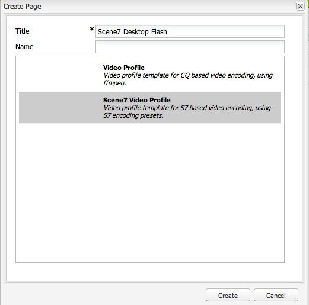

# Video{#video}

>[!CAUTION]
>
>AEM 6.4 har nått slutet på den utökade supporten och denna dokumentation är inte längre uppdaterad. Mer information finns i [teknisk supportperiod](https://helpx.adobe.com/support/programs/eol-matrix.html). Hitta de versioner som stöds [här](https://experienceleague.adobe.com/docs/).

Med Assets får du en centraliserad hantering av videoresurser där du kan överföra videor direkt till Assets för automatisk kodning till Dynamic Media Classic och få tillgång till Dynamic Media Classic videor direkt från Assets för sidredigering.

Tack vare Dynamic Media Classic videointegration kan optimerad video även användas på alla skärmar (automatisk enhets- och bandbreddsidentifiering).

* Dynamic Media Classic (Scene7)-videokomponenten utför automatiskt enhets- och bandbreddsidentifiering för att spela upp video i rätt format och med rätt kvalitet på datorer, surfplattor och mobila enheter.
* Resurser - Du kan inkludera adaptiva videouppsättningar i stället för bara enskilda videoresurser. En adaptiv videouppsättning är en behållare för alla videoåtergivningar som krävs för att spela upp video sömlöst på flera skärmar. En adaptiv videouppsättning grupperar versioner av samma video som är kodade med olika bithastigheter och format som 400 kbit/s, 800 kbit/s och 1 000 kbit/s. Du använder en adaptiv videouppsättning, tillsammans med S7-videokomponenten, för adaptiv videoströmning på flera skärmar, inklusive datorer, iOS, Android, Blackberry och Windows mobila enheter. Se [Scene7 dokumentation om adaptiva videouppsättningar för mer information](https://experienceleague.adobe.com/docs/dynamic-media-classic/using/setup/application-setup.html#video-presets-for-encoding-video-files).

## Om FFMPEG och Dynamic Media Classic {#about-ffmpeg-and-scene}

Standardprocessen för videokodning bygger på den FFMPEG-baserade integrationen med videoprofiler. Därför innehåller det färdiga arbetsflödet DAM Update Asset följande två åtgärder:

* FFMPEG-miniatyrbilder
* FFMPEG-kodning

Tänk på att aktivering och konfigurering av Dynamic Media Classic-integreringen inte automatiskt tar bort eller inaktiverar dessa två arbetsflödessteg från det körklara arbetsflödet för DAM Update Asset Input. Om du redan använder den FFMPEG-baserade videokodningen i AEM är det troligt att du har FFMPEG installerat i dina redigeringsmiljöer. I det här fallet kodas en ny video som hämtas med Assets två gånger: en gång från FFMPEG-kodaren och en gång från Dynamic Media Classic-integreringen.

Om du har konfigurerat och installerat den FFMPEG-baserade videokodningen i AEM rekommenderar Adobe att du tar bort de två FFMPEG-arbetsflödena från arbetsflödena för DAM Update Asset.

### Format som stöds {#supported-formats}

Följande format stöds för komponenten Dynamic Media Classic Video:

* F4V H.264
* MP4 H.264

### Bestäm var videon ska överföras {#deciding-where-to-upload-your-video}

Hur du avgör var du ska överföra dina videoresurser beror på följande:

* Behöver du ett arbetsflöde för videoresursen?
* Behöver du versionskontroll för videoresursen?

Om svaret är ja på någon av eller båda dessa frågor överför du videon direkt till Adobe DAM. Om svaret är&quot;nej&quot; på båda frågorna överför du videon direkt till Dynamic Media Classic. Arbetsflödet för varje scenario beskrivs i följande avsnitt.

#### Om du överför videon direkt till Adobe Assets {#if-you-are-uploading-your-video-directly-to-adobe-assets}

Om du behöver ett arbetsflöde eller en versionshantering för dina resurser bör du överföra dem till Adobe Assets först. Här följer det rekommenderade arbetsflödet:

1. Ladda upp videomaterialet till Adobe Assets och koda och publicera automatiskt till Dynamic Media Classic.
1. I AEM kommer du åt videomaterial i WCM i **[!UICONTROL Movies]** i Content Finder.
1. Skapa med Dynamic Media Classic video- eller grundvideokomponent.

#### Om du överför din video till Dynamic Media Classic {#if-you-are-uploading-your-video-to-scene}

Om du inte behöver ett arbetsflöde eller en versionshantering för dina resurser bör du överföra dina resurser till Dynamic Media Classic. Här följer det rekommenderade arbetsflödet:

1. I Dynamic Media Classic [konfigurera en schemalagd FTP-överföring och -kodning till Dynamic Media Classic (automatisk systeminstallation)](https://experienceleague.adobe.com/docs/dynamic-media-classic/using/upload-publish/uploading-files.html#uploading-your-files).
1. I AEM kommer du åt videomaterial i WCM i **[!UICONTROL Dynamic Media Classic]** i Content Finder.
1. Skapa med Dynamic Media Classic videokomponent.

### Konfigurera integrering med Dynamic Media Classic Video {#configuring-integration-with-scene-video}

**Konfigurera universella förinställningar**:

1. I **[!UICONTROL Cloud Services]** navigera till **[!UICONTROL Dynamic Media Classic]** konfiguration och klicka på **[!UICONTROL Edit]**.
1. Välj **[!UICONTROL Video]** -fliken.

   >[!NOTE]
   >
   >The **[!UICONTROL Video]** visas inte om sidan inte har någon molnkonfiguration. Se [Aktivera Dynamic Media Classic för WCM](#enablingscene7forwcm).

1. Välj den adaptiva videokodningsprofilen, en färdig videokodningsprofil eller en anpassad videokodningsprofil.

   >[!NOTE]
   >
   >Mer information om vad videoförinställningarna betyder finns i [Dynamic Media Classic-dokumentation](https://experienceleague.adobe.com/docs/dynamic-media-classic/using/setup/application-setup.html#video-presets-for-encoding-video-files).
   >
   >Adobe rekommenderar att du antingen väljer båda adaptiva videouppsättningar när du konfigurerar de universella förinställningarna eller väljer **[!UICONTROL Adaptive Video Encoding]** alternativ.

1. De valda kodningsprofilerna tillämpas automatiskt på alla videoklipp som överförs till CQ DAM-målmappen som du konfigurerar för den här Dynamic Media Classic-molnkonfigurationen. Du kan konfigurera flera Dynamic Media Classic molnkonfigurationer med olika målmappar för att tillämpa olika kodningsprofiler efter behov.

### Uppdatera visningsprogram och kodningsförinställningar {#updating-viewer-and-encoding-presets}

Om du behöver uppdatera visningsprogrammet och kodningsförinställningarna för video i AEM eftersom förinställningarna har uppdaterats i Dynamic Media Classic går du till Dynamic Media Classic-konfigurationen i molnkonfigurationen och klickar på **Uppdatera visningsprogrammet och kodningsförinställningarna**.

### Överföra din överordnad video {#uploading-your-master-video}

Så här överför du din överordnad video till Dynamic Media Classic från Adobe DAM:

1. Navigera till målmappen för CQ DAM där du har konfigurerat molnkonfigurationen med Dynamic Media Classic-kodningsprofiler.
1. Klicka **[!UICONTROL Upload]** för att ladda upp överordnad video. Videoöverföring och -kodning är klar efter [!UICONTROL DAM Update Asset] arbetsflödet är klart och **[!UICONTROL Publish to Dynamic Media Classic]** har en bock.

   >[!NOTE]
   >
   >Det kan ta en stund innan videominiatyrbilderna genereras.

   Dra den överordnad DAM-videon till videokomponentåtkomsten *alla* av Dynamic Media Classic-kodade proxyrenderingar för leverans.

### Foundation Video Component jämfört med Dynamic Media Classic Video Component {#foundation-video-component-versus-scene-video-component}

När du använder AEM har du tillgång till både videokomponenten som finns i Sites och videokomponenten i Dynamic Media Classic (Scene7). Dessa komponenter är inte utbytbara.

Dynamic Media Classic videokomponent fungerar bara för Dynamic Media Classic-videofilmer. Grundkomponenten fungerar med videor som lagras från AEM (med ffmpeg) och Dynamic Media Classic-videor.

I följande matris förklaras när du bör använda vilken komponent:

>[!NOTE]
>
>Dynamic Media Classic videokomponent har en universell videoprofil. Du kan dock hämta den HTML5-baserade videospelaren som kan användas av AEM. I Dynamic Media Classic kopierar du inbäddningskoden för den färdiga HTML5-videospelaren och placerar den på AEM.

## AEM videokomponent {#aem-video-component}

Även om du bör använda videokomponenten för Dynamic Media Classic för att visa Dynamic Media Classic-videofilmer beskrivs hur du använder Dynamic Media Classic-videofilmer med [!UICONTROL Foundation Video Component] AEM för fullständighetens skull.

### AEM Video och Dynamic Media Classic Video Comparison {#aem-video-and-scene-video-comparison}

I följande tabell visas en högnivåjämförelse av funktioner som stöds mellan AEM Foundation Video-komponenten och Scene7 Video-komponenten:

|  | AEM Foundation Video | Dynamic Media Classic Video |
|---|---|---|
| Metod | HTML5:a första metoden. Flash används endast för reservlösningar som inte är HTML5. | Flash på de flesta stationära datorer. HTML5 används för mobiler och surfplattor. |
| Leverans | Progressiv | Adaptiv strömning |
| Spårning | Ja | Ja |
| Utbyggbarhet | Ja | Ja (med Dynamic Media Classic Viewer SDK) |
| Mobilvideo | Ja | Ja |

### Konfigurera {#setting-up}

#### Skapa videoprofiler {#creating-video-profiles}

De olika videokodningarna skapas enligt de kodningsförinställningar för Dynamic Media Classic som valts i Dynamic Media Classic molnkonfiguration. För att den grundläggande videokomponenten ska kunna använda dem måste en videoprofil skapas för varje vald kodningsförinställning för Dynamic Media Classic. Detta gör att videokomponenten kan välja DAM-återgivningar utifrån detta.

>[!NOTE]
>
>Nya videoprofiler och ändringar av dem måste aktiveras för publicering.

1. I AEM, gå till **[!UICONTROL Tools]** väljer **[!UICONTROL Configuration Console]**. Gå till Konfiguration **[!UICONTROL Tools]** > **[!UICONTROL Assets]** > **[!UICONTROL Video Profiles]** i navigeringsträdet.
1. Skapa en ny Dynamic Media Classic-videoprofil. I **[!UICONTROL New...]** meny, välja **[!UICONTROL Create Page]** och sedan välja Dynamic Media Classic videoprofilmall. Ge den nya videoprofilsidan ett namn och klicka på **[!UICONTROL Create]**.

   

1. Redigera den nya videoprofilen. Välj molnkonfigurationen först. Välj sedan samma kodningsförinställning som du valde i molnkonfigurationen.

   

   | Egenskap | Beskrivning |
   |---|---|
   | Dynamic Media Classic (Scene7) Cloud Config | Den molnkonfiguration som ska användas för kodningsförinställningarna. |
   | Dynamic Media Classic (Scene7) Encoding Preset | Den kodningsförinställning som den här videoprofilen ska kopplas till. |
   | HTML5-videotyp | Med den här egenskapen kan du ange värdet för type-egenskapen i HTML5-videokällelementet. Den här informationen finns inte i Dynamic Media Classic-kodningsförinställningar, men krävs för att återge videoklippen med videoelementet HTML5 på rätt sätt. En lista över vanliga format tillhandahålls, men kan skrivas över för andra format. |

   Upprepa det här steget för alla kodningsförinställningar som är markerade i molnkonfigurationen och som du vill använda i videokomponenten.

#### Konfigurera design {#configuring-design}

Grundvideokomponenten måste känna till vilka videoprofiler som ska användas för att skapa listan över videokällor. Du måste öppna dialogrutan för videokomponentdesign och konfigurera komponentdesignen för de nya videoprofilerna.

>[!NOTE]
>
>Om du använder den grundläggande videokomponenten på en mobilsida kan du behöva upprepa de här stegen när du designar mobilsidan.

>[!NOTE]
>
>Ändringar i designen kräver att designen aktiveras för att börja gälla vid publiceringen.

1. Öppna den grundläggande videokomponentens designdialog och ändra till **[!UICONTROL Profiles]** -fliken. Ta sedan bort färdiga profiler och lägg till de nya videoprofilerna för Dynamic Media Classic. Ordningen på profillistan i designdialogrutan definierar också ordningen på videokällelementet vid återgivning.
1. För webbläsare som inte stöder HTML5 kan videokomponenten konfigurera ett flash-reserv. Öppna dialogrutan för design av videokomponenter och ändra till **[!UICONTROL Flash]** -fliken. Konfigurera Flash Player-inställningarna och tilldela en reservprofil för Flash Player.

#### Checklista {#checklist}

1. Skapa en Dynamic Media Classic-molnkonfiguration (Scene7). Kontrollera att förinställningarna för videokodning är angivna och att importeraren körs.
1. Skapa en Dynamic Media Classic-videoprofil för varje videokodningsförinställning som valts i molnkonfigurationen.
1. Videoprofilerna måste aktiveras.
1. Konfigurera utformningen av den grundläggande videokomponenten på sidan.
1. Aktivera designen när du är klar med designändringarna.
