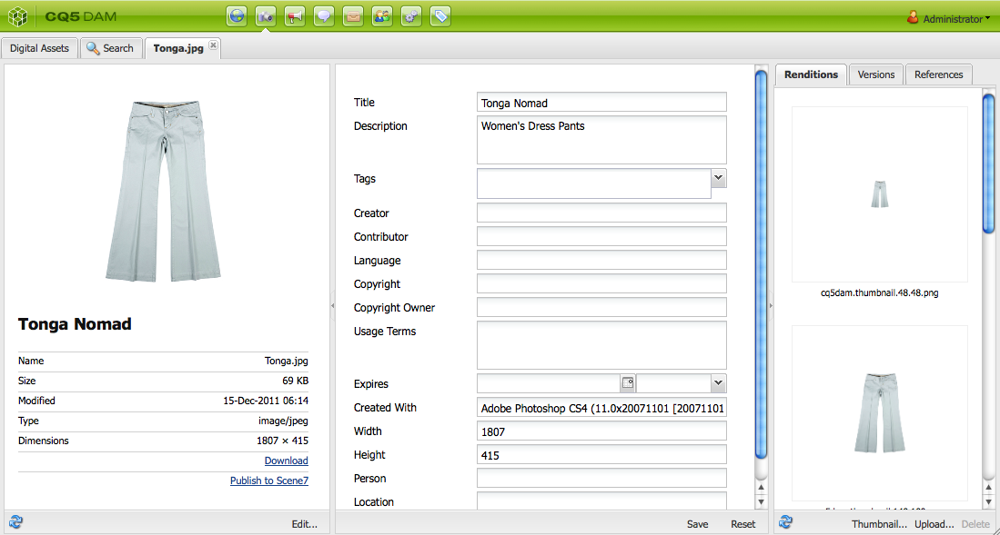
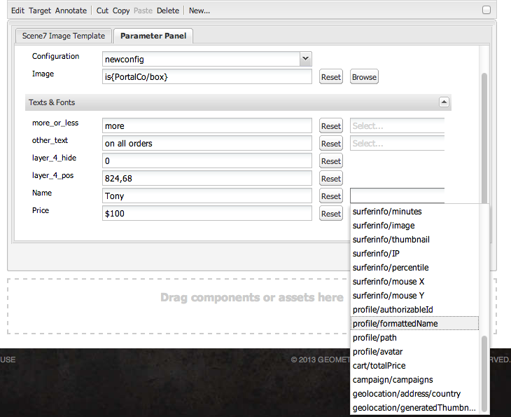

# Lägga till Dynamic Media Classic-funktioner på sidan{#adding-scene-features-to-your-page}

[Adobe Dynamic Media Classic](https://help.adobe.com/en_US/scene7/using/WS26AB0D9A-F51C-464e-88C8-580A5A82F810.html) är en värdbaserad lösning för att hantera, förbättra, publicera och leverera mediefiler till webben, mobiler, e-post och internetanslutna skärmar och för tryck.

Du kan visa AEM-resurser som publicerats i Dynamic Media Classic i olika visningsprogram:

* Zoomning
* Utfällbar
* Video
* Bildmall
* Bild

Du kan publicera digitala resurser direkt från AEM till Dynamic Media Classic och du kan publicera digitala resurser från Dynamic Media Classic till AEM.

I det här avsnittet beskrivs hur du publicerar digitala resurser från AEM till Dynamic Media Classic och vice versa. Visningsprogrammen beskrivs också i detalj. Information om hur du konfigurerar AEM för Dynamic Media Classic finns i [Integrera Dynamic Media Classic med AEM](/help/sites-administering/scene7.md).

Se även [Lägga till bildscheman](/help/assets/image-maps.md).

Mer information om hur du använder videokomponenter med AEM finns i:

* [Video](/help/sites-classic-ui-authoring/manage-assets-classic-s7-video.md)

>[!NOTE]
>
>Om resurserna i Dynamic Media Classic inte visas som de ska kontrollerar du att Dynamic Media är [inaktiverat](/help/assets/config-dynamic.md#disabling-dynamic-media) och uppdaterar sedan sidan.

## Publicera manuellt till Dynamic Media Classic från Assets {#manually-publishing-to-scene-from-assets}

Du kan publicera digitala resurser till Dynamic Media Classic antingen från Assets-konsolen i det klassiska användargränssnittet eller direkt från resursen.

>[!NOTE]
>
>AEM publicerar till Dynamic Media Classic asynkront. När du har klickat på **[!UICONTROL Publicera]** kan det ta flera sekunder för resursen att publicera till Dynamic Media Classic.

### Publicera från Resurskonsolen {#publishing-from-the-assets-console}

Så här publicerar du till Dynamic Media Classic från Resurskonsolen om resurserna finns i en Dynamic Media Classic-målmapp:

1. I det klassiska användargränssnittet för AEM klickar du på **[!UICONTROL Digital Assets]** .

1. Markera resursen (eller resurserna) eller mappen i målmappen som du vill publicera till Dynamic Media Classic, högerklicka och välj **[!UICONTROL Publicera till Dynamic Media Classic]**. Du kan också välja **[!UICONTROL Publicera till Dynamic Media Classic]** på menyn **[!UICONTROL Verktyg] .

   

1. Gå till Dynamic Media Classic och bekräfta att resurserna är tillgängliga.

   >[!NOTE]
   >
   >Om resurserna inte finns i en synkroniserad dynamisk Media Classic-mapp visas **[!UICONTROL Publicera till Dynamic Media Classic]** på båda menyerna, men de är inaktiverade.

### Publicera från en resurs {#publishing-from-an-asset}

Du kan publicera en resurs manuellt så länge som resursen finns i den synkroniserade dynamiska medieklassen.

>[!NOTE]
>
>Om resursen inte finns i den synkroniserade mappen Dynamic Media Classic är länken till **[!UICONTROL Publicera till Dynamic Media Classic]** inte tillgänglig.

**Så här publicerar du till Dynamic Media Classic direkt från en digital resurs**:

1. I AEM klickar du på **[!UICONTROL Digital Assets]** för att öppna den digitala resurshanteraren.

1. Dubbelklicka för att öppna en resurs.

1. I rutan med resursinformation väljer du **[!UICONTROL Publicera till Dynamic Media Classic]**.

   

1. **[!UICONTROL Länken ändras till]** Publicera ... och sedan **[!UICONTROL Publicerad]**. Gå till Dynamic Media Classic och bekräfta att resursen är tillgänglig.

   >[!NOTE]
   >
   >Om resursen inte publiceras korrekt till Dynamic Media Classic ändras länken till **[!UICONTROL Publicering misslyckades]**. Om resursen redan har publicerats till Dynamic Media Classic läser länken **[!UICONTROL Publicera igen till Dynamic Media Classic]**. Med ompublicering kan du göra ändringar i en mediefil i AEM och publicera om dem.

### Publicera resurser utanför CQ-målmappen {#publishing-assets-from-outside-the-cq-target-folder}

Adobe rekommenderar att du endast publicerar resurser till Dynamic Media Classic från resurser i målmappen Dynamic Media Classic. Men om du behöver överföra resurser från en mapp utanför målmappen kan du ändå göra det genom att överföra dem till en *ad hoc* -mapp i Dynamic Media Classic.

Det gör du genom att konfigurera molnkonfigurationen för sidan där resursen ska visas. Sedan lägger du till en Dynamic Media Classic-komponent på sidan och drar och släpper en resurs på komponenten. När sidegenskaperna har ställts in för den sidan visas länken **[!UICONTROL Publicera till Dynamic Media Classic]** , som utlöser överföringen till Dynamic Media Classic när du väljer det här alternativet.

>[!NOTE]
>
>Resurser som finns i ad hoc-mappen visas inte i den dynamiska medieläsaren.

**Så här publicerar du resurser som finns utanför CQ-målmappen**:

1. I AEM i det klassiska användargränssnittet klickar du på **[!UICONTROL Webbplatser]** och navigerar till den webbsida där du vill lägga till en digital resurs som ännu inte har publicerats till Dynamic Media Classic. (Normala sidarvsregler gäller.)

1. Klicka på ikonen **[!UICONTROL Sida]** i sidbrytaren och klicka sedan på **[!UICONTROL Sidegenskaper]**.

1. Klicka på **[!UICONTROL Cloud Services > Lägg till tjänster > Dynamic Media Classic (Scene7)**.
1. Välj önskad konfiguration i listrutan Adobe Dynamic Media Classic och klicka sedan på **[!UICONTROL OK]**.

   

1. På webbsidan lägger du till en Dynamic Media Classic-komponent (Scene7) till önskad plats på sidan.
1. Dra en digital resurs från innehållssökaren till komponenten. Du ser en länk för att **[!UICONTROL kontrollera status]** för Dynamic Media Classic Publication.

   >[!NOTE]
   >
   >Om den digitala resursen finns i CQ-målmappen visas ingen länk till **[!UICONTROL Kontrollera status]** för dynamisk Media Classic-publikation. Resurserna placeras bara i komponenten.

   

1. Klicka på **[!UICONTROL Kontrollera status]** för Dynamic Media Classic Publication. Om resursen inte publiceras publicerar AEM resursen till Dynamic Media Classic. När resursen har överförts finns den i ad hoc-mappen. Som standard finns ad hoc-mappen i `name_of_the_company/CQ5_adhoc`. Du kan [konfigurera detta vid behov](#configuringtheadhocfolder).

   >[!NOTE]
   >
   >Om resursen inte finns i en synkroniserad dynamisk Media Classic-mapp och det inte finns någon dynamisk Media Classic-molnkonfiguration kopplad till den aktuella sidan, misslyckas överföringen.

## Dynamic Media Classic-komponenter (Scene7) {#scene-components}

Följande Dynamic Media Classic-komponenter är tillgängliga i AEM:

* Zoomning
* Utfällbar (zoom)
* Bildmall
* Bild
* Video

>[!NOTE]
>
>De här komponenterna är inte tillgängliga som standard och måste markeras i **[!UICONTROL designläge]** innan du använder dem.

När de är tillgängliga i **[!UICONTROL designläge]** kan du lägga till komponenterna på sidan precis som andra AEM-komponenter. Resurser som ännu inte har publicerats till Dynamic Media Classic publiceras till Dynamic Media Classic om de ligger i en synkroniserad mapp, på en sida eller med en Dynamic Media Classic-molnkonfiguration.

### Flash viewers end-of-life notice {#flash-viewers-end-of-life-notice}

Från och med den 31 januari 2017 upphörde stödet för Flash-visningsprogramplattformen officiellt i Adobe Dynamic Media Classic.

Mer information om den här viktiga förändringen finns i Vanliga frågor och svar om [uttjänta versioner av Flash](https://docs.adobe.com/content/docs/en/aem/6-1/administer/integration/marketing-cloud/scene7/flash-eol.html)Viewer.

### Lägga till en Dynamic Media Classic-komponent på en sida {#adding-a-scene-component-to-a-page}

Att lägga till en Dynamic Media Classic-komponent på en sida är detsamma som att lägga till en komponent på en sida. Dynamiska Media Classic-komponenter beskrivs i detalj i följande avsnitt.

**Så här lägger du till en Dynamic Media Classic-komponent/ett visningsprogram på en sida i det klassiska användargränssnittet**:

1. I AEM öppnar du sidan där du vill lägga till komponenten Dynamic Media Classic.

1. Om det inte finns några Dynamic Media Classic-komponenter tillgängliga klickar du på linjalen i sidoknappen för att öppna **[!UICONTROL designläget]** , klickar på **[!UICONTROL Redigera]** parsys och väljer alla **[!UICONTROL Dynamic Media Classic]** -komponenter.

1. Gå tillbaka till **[!UICONTROL redigeringsläget]** genom att klicka på pennan i sidosparken.

1. Dra en komponent från gruppen **[!UICONTROL Dynamic Media Classic]** i sidosparken till den önskade platsen.

1. Klicka på **[!UICONTROL Redigera]** för att öppna komponenten.

1. Redigera komponenten efter behov och klicka på **[!UICONTROL OK]** för att spara ändringarna.

### Lägga till interaktiva tittarupplevelser på en responsiv webbplats {#adding-interactive-viewing-experiences-to-a-responsive-website}

Responsiv design för dina resurser innebär att dina resurser anpassas beroende på var de visas. Med responsiv design visas samma material effektivt på flera enheter.

**Så här lägger du till en interaktiv visningsupplevelse på en responsiv webbplats i det klassiska användargränssnittet**:

1. Logga in på AEM och kontrollera att du har [konfigurerat Adobe Dynamic Media Classic Cloud Services](/help/sites-administering/scene7.md#configuring-scene-integration) och att Dynamic Media Classic-komponenterna är tillgängliga.

   >[!NOTE]
   >
   >Om Dynamic Media Classic WCM-komponenter inte är tillgängliga måste du aktivera dem i **[!UICONTROL Design] -läget.

1. På en webbplats där komponenterna i Dynamic Media Classic är aktiverade drar du ett **[!UICONTROL bildvisningsprogram]** till sidan.
1. Redigera komponenten och justera brytpunkterna på fliken Inställningar **[!UICONTROL för]** Dynamic Media Classic.

   

1. Bekräfta att tittarna ändrar storlek rejält och att alla interaktioner är optimerade för datorer, surfplattor och mobiler.

### Gemensamma inställningar för alla komponenter i Dynamic Media Classic {#settings-common-to-all-scene-components}

Även om konfigurationsalternativen varierar är följande vanligt för alla komponenter i Dynamic Media Classic:

* **[!UICONTROL Filreferens]** - Bläddra till en fil som du vill referera till. Filreferensen visar resurs-URL:en och inte nödvändigtvis den fullständiga Dynamic Media Classic-URL:en, inklusive URL-kommandon och -parametrar. Du kan inte lägga till kommandon och parametrar för dynamiska Media Classic-URL i det här fältet. De måste läggas till med motsvarande funktioner i komponenten.
* **[!UICONTROL Bredd]** - Här kan du ange bredden.
* **[!UICONTROL Höjd]** - Här kan du ange höjden.

Du anger dessa konfigurationsalternativ genom att dubbelklicka på en Dynamic Media Classic-komponent, till exempel när du öppnar en **[!UICONTROL Zoom]** -komponent:

### Zoomning {#zoom}

HTML5 Zoom-komponenten visar en större bild när du trycker på +-knappen.

Resursen har zoomverktyg längst ned. Klicka **[!UICONTROL +]** för att förstora. Klicka **[!UICONTROL -]** för att minska. Om du klickar på **[!UICONTROL x]** eller zoompilen återställs bilden till den ursprungliga storlek som den importerades som. Klicka på de diagonala pilarna för att göra helskärmspilen. Klicka på **[!UICONTROL Redigera]** för att konfigurera komponenten. Med den här komponenten kan du konfigurera [inställningar som är gemensamma för alla Dynamic Media Classic-komponenter](#settings-common-to-all-scene-components).

### Utfällbar {#flyout}

I den utfällbara HTML5-komponenten visas resursen som en delad skärm. lämnade tillgången i den angivna storleken, till höger visas zoomdelen. Klicka på **[!UICONTROL Redigera]** för att konfigurera komponenten. Med den här komponenten kan du konfigurera [inställningar som är gemensamma för alla Dynamic Media Classic-komponenter](/help/sites-administering/scene7.md#settingscommontoalldynamicmediaclassiccomponents).

>[!NOTE]
>
>Om den utfällbara komponenten använder en anpassad storlek, används den anpassade storleken och responsiv konfiguration av komponenten inaktiveras.
>
>Om den utfällbara komponenten använder standardstorleken, enligt inställningarna i [!UICONTROL designvyn] , används standardstorleken och komponenten sträcks ut för att passa sidlayoutstorleken med responsiv konfiguration av komponenten aktiverad. Tänk dock på att det finns en begränsning för responsiv konfiguration av komponenten. När du använder den utfällbara komponenten med responsiv konfiguration bör du inte använda den med full sidsträckning. I annat fall kan den utfällbara menyn sträcka sig utanför sidans högra kant.

### Bild {#image}

Med komponenten Dynamic Media Classic Image kan du lägga till Dynamic Media Classic-funktioner i dina bilder, till exempel Dynamic Media Classic-modifierare, bild- eller visningsförinställningar samt skärpa. Bildkomponenten Dynamic Media Classic liknar andra bildkomponenter i AEM med speciella funktioner i Dynamic Media Classic. I det här exemplet används URL-modifieraren för Dynamic Media Classic, `&op_invert=1` .

**[!UICONTROL Titel, Alt-text]** - På fliken [!UICONTROL Avancerat] lägger du till en titel i bilden och alternativ text för de användare som har grafik inaktiverad.

**[!UICONTROL URL, Öppna i]** - Du kan ange en resurs från för att öppna en länk. Ange **[!UICONTROL URL]** och **[!UICONTROL Öppna i]** för att ange om du vill att den ska öppnas i samma fönster eller i ett nytt fönster.

**[!UICONTROL Visningsförinställning]** - Välj en befintlig visningsförinställning i listrutan. Om den visningsförinställning som du söker efter inte visas kanske du måste göra den synlig. Se [Hantera visningsförinställningar](/help/assets/managing-viewer-presets.md). Du kan inte välja en visningsförinställning om du använder en bildförinställning och vice versa.

**[!UICONTROL Dynamic Media Classic Configuration]** - Välj den Dynamic Media Classic-konfiguration som du vill använda för att hämta aktiva bildförinställningar från Scene7 Publishing System.

**[!UICONTROL Bildförinställning]** - Välj en befintlig bildförinställning i listrutan. Om den bildförinställning du söker inte syns kan du behöva göra den synlig. Se [Hantera bildförinställningar](/help/assets/managing-image-presets.md). Du kan inte välja en visningsförinställning om du använder en bildförinställning och vice versa.

**[!UICONTROL Utdataformat]** - Välj bildens utdataformat, till exempel jpeg. Beroende på vilket utdataformat du väljer kan det finnas ytterligare konfigurationsalternativ. Se [Hantera bildförinställningar](/help/assets/managing-image-presets.md).

**[!UICONTROL Skärpa]** - Välj hur du vill öka skärpan i bilden. Skärpeinställningen förklaras i detalj i [*Adobe Dynamic Media Classic Image Quality and Sharpening Best Practices *](/help/assets/assets/s7_sharpening_images.pdf).

**[!UICONTROL URL-modifierare]** - Du kan ändra bildeffekter genom att ange ytterligare Dynamic Media Classic-bildkommandon. Dessa beskrivs i [Hantera bildförinställningar](/help/assets/managing-image-presets.md) och i [Kommandoreferensen](https://marketing.adobe.com/resources/help/en_US/s7/is_ir_api/is_api/http_ref/c_command_reference.html).

**[!UICONTROL Brytpunkter]** - Om webbplatsen är responsiv bör du justera brytpunkterna. Brytpunkter måste avgränsas med kommatecken `,`.

### Bildmall {#image-template}

[Dynamic Media Classic Image Templates](https://help.adobe.com/en_US/scene7/using/WS60B68844-9054-4099-BF69-3DC998A04D3C.html) är lageruppbyggt Photoshop-innehåll som importerats till Dynamic Media Classic, där innehåll och egenskaper parametriserades för variabilitet. Med **[!UICONTROL bildmallskomponenten]** kan du importera bilder och ändra texten dynamiskt i AEM. Dessutom kan du konfigurera **[!UICONTROL Image-mallkomponenten]** så att värden från klientkontexten används, så att varje användare upplever bilden på ett personligt sätt.

Klicka på **[!UICONTROL Redigera]** för att konfigurera komponenten. Du kan konfigurera [inställningar som är gemensamma för alla komponenter](/help/sites-administering/scene7.md#settingscommontoalldynamicmediaclassicscomponents) i Dynamic Media Classic samt andra inställningar som beskrivs i det här avsnittet.

**[!UICONTROL Filreferens, Bredd, Höjd]** - Se inställningar som är gemensamma för alla komponenter i Dynamic Media Classic.

>[!NOTE]
>
>Dynamic Media Classic URL-kommandon och -parametrar kan inte läggas till direkt i filreferensens URL. De kan bara definieras i komponentgränssnittet på panelen **[!UICONTROL Parametrar]** .

**[!UICONTROL Titel, Alt-text]** På fliken [!UICONTROL Dynamic Media Classic Image Template] (Dynamisk Media Classic-bildmall) lägger du till en titel i bilden och alternativ text för användare som har grafik inaktiverad.

**[!UICONTROL URL, Öppna i]** Du kan ange en resurs från för att öppna en länk. Ange **[!UICONTROL URL]** och **[!UICONTROL Öppna i]** anger om du vill att den ska öppnas i samma fönster eller i ett nytt fönster.

**[!UICONTROL Parameterpanelen]** När du importerar en bild fylls parametrarna i automatiskt med information från bilden. Om det inte finns något innehåll som kan ändras dynamiskt är det här fönstret tomt.

#### Ändra text dynamiskt {#changing-text-dynamically}

Om du vill ändra texten dynamiskt anger du ny text i fälten och klickar på **[!UICONTROL OK]**. I det här exemplet är **[!UICONTROL priset]** nu 50 dollar och frakten 99 cent.

Texten i bilden ändras. Du kan återställa texten till det ursprungliga värdet genom att klicka på **[!UICONTROL Återställ]** bredvid fältet.

#### Ändra text så att värdet för en klientkontext återspeglas {#changing-text-to-reflect-the-value-of-a-client-context-value}

Om du vill länka ett fält till ett klientkontextvärde klickar du på **[!UICONTROL Välj]** för att öppna klientsnabbmenyn, markerar klientkontexten och klickar på **[!UICONTROL OK]**. I det här exemplet ändras namnet baserat på att namnet länkas till det formaterade namnet i profilen.

Texten återspeglar namnet på den inloggade användaren. Du kan återställa texten till det ursprungliga värdet genom att klicka på **[!UICONTROL Återställ]** bredvid fältet.

#### Göra bildmallen Dynamic Media Classic till en länk {#making-the-scene-image-template-a-link}

**Så här gör du en länk** till mallen Dynamic Media Classic:

1. Klicka på **[!UICONTROL Redigera]** på sidan med mallkomponenten Dynamic Media Classic.
1. I fältet **[!UICONTROL URL]** anger du den URL som användarna ska gå till när de klickar på bilden. I fältet **[!UICONTROL Öppna i]** väljer du om du vill att målet ska öppnas (ett nytt fönster eller samma fönster).

   

1. Click **[!UICONTROL OK]**.

### Videokomponent {#video-component}

Komponenten Dynamic Media Classic **[!UICONTROL Video]** (som finns under Dynamic Media Classic i sidosparken) använder enhets- och bandbreddsidentifiering för att leverera rätt video till varje skärm. Den här komponenten är en HTML5-videospelare; det är ett enda visningsprogram som kan användas över flera kanaler.

Den kan användas för adaptiva videouppsättningar, en enda MP4-video eller en enda F4V-video.

Se [Video](/help/sites-classic-ui-authoring/manage-assets-classic-s7-video.md) för mer information om hur videoklipp fungerar med integrering med Dynamic Media Classic. Jämför dessutom videokomponenten [i **Dynamic Media Classic** med **videokomponenten** som utgör grunden](/help/sites-classic-ui-authoring/manage-assets-classic-s7-video.md).

### Kända begränsningar för videokomponenten {#known-limitations-for-the-video-component}

Adobe DAM och WCM visar om en mastervideo har överförts. De visar inte följande proxyresurser:

* Dynamic Media Classic-kodade renderingar
* Dynamic Media Classic adaptive video sets

När du använder en adaptiv videouppsättning med videokomponenten Dynamic Media Classic måste du ändra storlek på komponenten så att den passar videofilens mått.

## Dynamisk Media Classic-innehållsläsare {#scene-content-browser}

Med webbläsaren Dynamic Media Classic kan du visa innehåll från Dynamic Media Classic direkt i AEM. Om du vill få åtkomst till innehållsläsaren väljer du **[!UICONTROL Dynamic Media Classic]** i det pekoptimerade användargränssnittet eller **[!UICONTROL S7]** -ikonen i det klassiska användargränssnittet. Funktionen är identisk mellan båda användargränssnitten.

Om du har flera konfigurationer visar AEM som standard [standardkonfigurationen](/help/sites-administering/scene7.md#configuring-a-default-configuration). Du kan välja olika konfigurationer direkt i webbläsaren Dynamic Media Classic-innehåll i listrutan.

>[!NOTE]
>
>* Resurser som finns i ad hoc-mappen visas inte i webbläsaren Dynamic Media Classic.
>* När [Säker förhandsvisning är aktiverat](/help/sites-administering/scene7.md#configuring-the-state-published-unpublished-of-assets-pushed-to-scene)visas både publicerade och opublicerade resurser i Dynamic Media Classic i webbläsaren för dynamiskt media Classic-innehåll.
>* Om du inte ser ikonen **[!UICONTROL Dynamic Media Classic]** eller **[!UICONTROL S7]** som ett alternativ i webbläsaren måste du [konfigurera Dynamic Media Classic så att det fungerar med AEM](/help/sites-administering/scene7.md).
   >
   >
* För video har webbläsaren Dynamic Media Classic stöd för:
   >
   >
* Adaptiva videouppsättningar: behållare för alla videoåtergivningar som behövs för sömlös uppspelning på flera skärmar
>* Enkel MP4-video
>* En F4V-video

### Bläddra bland innehåll i det klassiska användargränssnittet {#browsing-content-in-the-classic-ui}

Bläddra bland innehåll i Dynamic Media Classic genom att klicka på fliken **[!UICONTROL S7]** .

Du kan ändra konfigurationen som du använder genom att välja konfigurationen. Mapparna ändras beroende på vilken konfiguration du väljer.

Precis som med Innehållssökaren för Resurser kan du söka efter resurser och filtrera resultat. Till skillnad från Assets Finder **[!UICONTROL börjar filnamnet med]** den sträng du angav när du anger ett nyckelord på fliken *S7* , i stället för *att innehålla* nyckelordet i filnamnet.

Som standard visas resurser efter filnamn. Du kan också filtrera resultat efter resurstyp.

>[!NOTE]
>
>För video stöder webbläsaren Dynamic Media Classic-innehåll i WCM:
>
>* Adaptiva videouppsättningar: behållare för alla videoåtergivningar som behövs för sömlös uppspelning på flera skärmar
>* Enkel MP4-video
>* En F4V-video
>

### Söka efter Dynamic Media Classic-resurser med innehållsläsaren {#searching-for-scene-assets-with-the-content-browser}

Att söka efter dynamiska mediefiler liknar att söka efter AEM-resurser, förutom att när du söker ser du en fjärrvy av resurserna i Dynamic Media Classic-systemet i stället för att importera dem direkt till AEM.

Du kan använda det klassiska användargränssnittet eller det pekoptimerade användargränssnittet för att både visa och söka efter resurser. Beroende på gränssnittet är sökningen något annorlunda.

När du söker i något av användargränssnitten kan du filtrera efter följande villkor (visas här i det pekoptimerade användargränssnittet):

**[!UICONTROL Ange nyckelord]** - Du kan söka efter resurser efter namn. När du söker efter nyckelord som du anger är det filnamnet börjar med. Om du t.ex. skriver ordet &quot;simning&quot; söker du efter alla resursfilnamn som börjar med de bokstäverna i den ordningen. Var noga med att klicka på Ange när du har skrivit in termen för att hitta resursen.

**[!UICONTROL Mapp/sökväg]** - Namnet på mappen som visas baseras på den konfiguration du har valt. Du kan gå ned till lägre nivåer genom att klicka på mappikonen och välja en undermapp. Markera sedan kryssrutan för att markera den.

Om du anger ett nyckelord och väljer en mapp söker AEM igenom den mappen och eventuella undermappar. Om du inte anger några nyckelord när du söker efter, kommer endast resurserna i den mappen att visas om du väljer mappen. Inga undermappar kommer att visas.

Som standard söker AEM igenom den markerade mappen och alla undermappar.

**[!UICONTROL Typ av resurs]** Välj Dynamic Media Classic för att bläddra i dynamiskt Media Classic-innehåll. Det här alternativet är bara tillgängligt om du redan har konfigurerat Dynamic Media Classic.

**[!UICONTROL Konfiguration]** Om du har definierat mer än en dynamisk Media Classic-konfiguration i [!UICONTROL Cloud Services]kan du välja den här. Därför ändras mappen baserat på den konfiguration du har valt.

**[!UICONTROL Resurstyp]** I webbläsaren Dynamic Media Classic kan du filtrera resultaten så att de innehåller något av följande: bilder, mallar, videor och anpassningsbara videouppsättningar. Om du inte väljer någon resurstyp söker AEM som standard igenom alla resurstyper.

>[!NOTE]
>
>* När du söker efter video söker du efter en enskild återgivning. Resultatet returnerar den ursprungliga återgivningen (endast &amp;ast;.mp4) och den kodade återgivningen.
>* När du söker i en adaptiv videouppsättning söker du i mappen och i alla undermappar, men bara om du har lagt till ett nyckelord i sökningen. Om du inte har lagt till något nyckelord söker AEM inte igenom undermapparna.
>

**[!UICONTROL Publiceringsstatus]** Du kan filtrera efter resurser baserat på publiceringsstatus: [!UICONTROL Publicerad] eller [!UICONTROL Opublicerad]. Om du inte väljer någon [!UICONTROL publiceringsstatus]söker AEM som standard igenom alla publiceringsstatusar.

