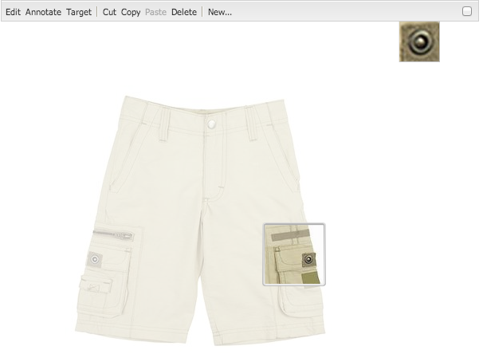

# Lägga till Dynamic Media Classic-funktioner på sidan{#adding-scene-features-to-your-page}

>[!CAUTION]
>
>AEM 6.4 har nått slutet på den utökade supporten och denna dokumentation är inte längre uppdaterad. Mer information finns i [teknisk supportperiod](https://helpx.adobe.com/support/programs/eol-matrix.html). Hitta de versioner som stöds [här](https://experienceleague.adobe.com/docs/).

Adobe Dynamic Media Classic är en värdbaserad lösning för att hantera, förbättra, publicera och leverera mediefiler för webben, mobiler, e-post och internetanslutna displayer samt tryck.

Du kan visa AEM resurser som publicerats i Dynamic Media Classic i olika visningsprogram:

* Zooma
* Utfällbar
* Video
* Bildmall
* Bild

Du kan publicera digitala resurser direkt från AEM till Dynamic Media Classic och du kan publicera digitala resurser från Dynamic Media Classic till AEM.

I det här avsnittet beskrivs hur du publicerar digitala resurser från AEM till Dynamic Media Classic och vice versa. Visningsprogrammen beskrivs också i detalj. Information om hur du konfigurerar AEM för Dynamic Media Classic finns i [Integrera Dynamic Media Classic med AEM](/help/sites-administering/scene7.md).

Se även [Lägga till bildscheman](/help/assets/image-maps.md).

Mer information om hur du använder videokomponenter med AEM finns i:

* [Video](/help/sites-classic-ui-authoring/manage-assets-classic-s7-video.md)

>[!NOTE]
>
>Om Dynamic Media Classic-mediefiler inte visas som de ska kontrollerar du att Dynamic Media [inaktiverad](/help/assets/config-dynamic.md#disabling-dynamic-media) och sedan uppdatera sidan.

## Publicera manuellt till Dynamic Media Classic från Assets {#manually-publishing-to-scene-from-assets}

Du kan publicera digitala resurser till Dynamic Media Classic antingen från Assets-konsolen i det klassiska användargränssnittet eller direkt från resursen.

>[!NOTE]
>
>AEM publicerar till Dynamic Media Classic asynkront. När du har klickat **[!UICONTROL Publish]** kan det ta några sekunder för resursen att publicera till Dynamic Media Classic.

### Publicera från Resurskonsolen {#publishing-from-the-assets-console}

Så här publicerar du till Dynamic Media Classic från Resurskonsolen om resurserna finns i en målmapp i Dynamic Media Classic:

1. I det AEM klassiska användargränssnittet klickar du på **[!UICONTROL Digital Assets]** för att få tillgång till resurshanteraren.

1. Markera resursen (eller resurserna) eller mappen i målmappen som du vill publicera till Dynamic Media Classic, högerklicka och välj **[!UICONTROL Publish to Dynamic Media Classic]**. Du kan också välja **[!UICONTROL Publish to Dynamic Media Classic]** från **[!UICONTROL Tools]** -menyn.

   

1. Gå till Dynamic Media Classic och bekräfta att resurserna är tillgängliga.

   >[!NOTE]
   >
   >Om resurserna inte finns i en synkroniserad Dynamic Media Classic-mapp **[!UICONTROL Publish to Dynamic Media Classic]** i båda menyerna visas men är inaktiverade.

### Publicera från en resurs {#publishing-from-an-asset}

Du kan publicera en resurs manuellt så länge som resursen finns inuti den synkroniserade Dynamic Media Classic-mappen.

>[!NOTE]
>
>Om resursen inte finns i den synkroniserade mappen för Dynamic Media Classic länkar du till **[!UICONTROL Publish to Dynamic Media Classic]** är inte tillgängligt.

**Publicera till Dynamic Media Classic direkt från en digital resurs**:

1. I AEM klickar du på **[!UICONTROL Digital Assets]** för att få tillgång till resurshanteraren.

1. Dubbelklicka för att öppna en resurs.

1. I rutan Resursinformation väljer du **[!UICONTROL Publish to Dynamic Media Classic]**.

   

1. Länken ändras till **[!UICONTROL Publishing ...]** och sedan **[!UICONTROL Published]**. Gå till Dynamic Media Classic och bekräfta att resursen är tillgänglig.

   >[!NOTE]
   >
   >Om resursen inte publiceras korrekt på Dynamic Media Classic ändras länken till **[!UICONTROL Publishing Failed]**. Om resursen redan har publicerats till Dynamic Media Classic läses länken **[!UICONTROL Re-Publish to Dynamic Media Classic]**. Med ompublicering kan du göra ändringar i en resurs i AEM och publicera om dem.

### Publicera resurser utanför CQ-målmappen {#publishing-assets-from-outside-the-cq-target-folder}

Adobe rekommenderar att du bara publicerar resurser till Dynamic Media Classic från resurser i Dynamic Media Classic målmapp. Men om du behöver överföra resurser från en mapp utanför målmappen kan du ändå göra det genom att överföra dem till en *ad hoc* i Dynamic Media Classic.

Det gör du genom att konfigurera molnkonfigurationen för sidan där resursen ska visas. Sedan lägger du till en Dynamic Media Classic-komponent på sidan och drar och släpper en resurs på komponenten. När sidegenskaperna har ställts in för den sidan, **[!UICONTROL Publish to Dynamic Media Classic]** visas när det här alternativet är markerat utlöses överföringen till Dynamic Media Classic.

>[!NOTE]
>
>Resurser som finns i ad hoc-mappen visas inte i Dynamic Media Classic innehållsläsare.

**Publicera resurser som finns utanför CQ-målmappen**:

1. I AEM i det klassiska användargränssnittet klickar du på **[!UICONTROL Websites]** och navigera till den webbsida där du vill lägga till en digital resurs som ännu inte har publicerats i Dynamic Media Classic. (Normala sidarvsregler gäller.)

1. Klicka på **[!UICONTROL Page]** ikonen och klicka sedan på **[!UICONTROL Page Properties]**.

1. Klicka på **[!UICONTROL Cloud Services]> [!UICONTROL Add services] >[!UICONTROL Dynamic Media Classic (Scene7)]**.
1. I listrutan Adobe Dynamic Media Classic väljer du önskad konfiguration och klickar sedan på **[!UICONTROL OK]**.

   

1. Lägg till en Dynamic Media Classic-komponent (Scene7) på önskad plats på webbsidan.
1. Dra en digital resurs från innehållssökaren till komponenten. Du ser en länk till **[!UICONTROL Check Dynamic Media Classic Publication Status]**.

   >[!NOTE]
   >
   >Om den digitala resursen finns i CQ-målmappen finns det ingen länk till **[!UICONTROL Check Dynamic Media Classic Publication Status]** visas. Resurserna placeras bara i komponenten.

   

1. Klicka på **[!UICONTROL Check Dynamic Media Classic Publication Status]**. Om resursen inte publiceras publicerar AEM resursen till Dynamic Media Classic. När resursen har överförts finns den i ad hoc-mappen. Som standard finns ad hoc-mappen i `name_of_the_company/CQ5_adhoc`. Du kan [konfigurera detta vid behov](#configuringtheadhocfolder).

   >[!NOTE]
   >
   >Om resursen inte finns i en synkroniserad Dynamic Media Classic-mapp och det inte finns någon Dynamic Media Classic-molnkonfiguration kopplad till den aktuella sidan, kommer överföringen att misslyckas.

## Komponenter i Dynamic Media Classic (Scene7) {#scene-components}

Följande Dynamic Media Classic-komponenter finns i AEM:

* Zooma
* Utfällbar (zoom)
* Bildmall
* Bild
* Video

>[!NOTE]
>
>Dessa komponenter är inte tillgängliga som standard och måste markeras i **[!UICONTROL Design]** före användning.

När de är tillgängliga i **[!UICONTROL Design]** kan du lägga till komponenterna på sidan som andra AEM. Resurser som ännu inte har publicerats till Dynamic Media Classic publiceras till Dynamic Media Classic om de ligger i en synkroniserad mapp, på en sida eller med en Dynamic Media Classic molnkonfiguration.

### Flash-tittare meddelande om att livscykeln upphör {#flash-viewers-end-of-life-notice}

Från och med den 31 januari 2017 upphörde Adobe Dynamic Media Classic officiellt stödet för visningsprogramplattformen Flash.

### Lägga till en Dynamic Media Classic-komponent på en sida {#adding-a-scene-component-to-a-page}

Att lägga till en Dynamic Media Classic-komponent på en sida är detsamma som att lägga till en komponent på en sida. Dynamic Media Classic-komponenter beskrivs i detalj i följande avsnitt.

**Lägga till en Dynamic Media Classic-komponent/ett visningsprogram på en sida i det klassiska användargränssnittet**:

1. Öppna AEM sidan där du vill lägga till Dynamic Media Classic-komponenten.

1. Om det inte finns några Dynamic Media Classic-komponenter tillgängliga klickar du på linjalen i sidoknappen för att ange **[!UICONTROL Design]** läge, klicka **[!UICONTROL Edit]** parsys, och markera alla **[!UICONTROL Dynamic Media Classic]** för att göra dem tillgängliga.

1. Återgå till **[!UICONTROL Edit]** genom att klicka på pennan i sidosparken.

1. Dra en komponent från **[!UICONTROL Dynamic Media Classic]** på sidan i den önskade platsen.

1. Klicka **[!UICONTROL Edit]** för att öppna komponenten.

1. Redigera komponenten efter behov och klicka på **[!UICONTROL OK]** för att spara ändringar.

### Lägga till interaktiva tittarupplevelser på en responsiv webbplats {#adding-interactive-viewing-experiences-to-a-responsive-website}

Responsiv design för dina resurser innebär att dina resurser anpassas beroende på var de visas. Med responsiv design visas samma material effektivt på flera enheter.

**Lägga till en interaktiv tittarupplevelse på en responsiv webbplats i det klassiska användargränssnittet**:

1. Logga in på AEM och kontrollera att du har [konfigurerade Adobe Dynamic Media Classic-Cloud Services](/help/sites-administering/scene7.md#configuring-scene-integration) och att Dynamic Media Classic-komponenterna är tillgängliga.

   >[!NOTE]
   >
   >Om Dynamic Media Classic WCM-komponenter inte är tillgängliga måste du aktivera dem via **[!UICONTROL Design] läge.

1. Dra en **[!UICONTROL Image]** till sidan.
1. Redigera komponenten och justera brytpunkterna i **[!UICONTROL Dynamic Media Classic Settings]** -fliken.

   

1. Bekräfta att tittarna ändrar storlek rejält och att alla interaktioner är optimerade för datorer, surfplattor och mobiler.

### Gemensamma inställningar för alla Dynamic Media Classic-komponenter {#settings-common-to-all-scene-components}

Även om konfigurationsalternativen varierar är följande vanligt för alla Dynamic Media Classic-komponenter:

* **[!UICONTROL File Reference]** - Bläddra till en fil som du vill referera till. Filreferensen visar resurs-URL:en och inte nödvändigtvis den fullständiga Dynamic Media Classic-URL:en inklusive URL-kommandon och -parametrar. Du kan inte lägga till Dynamic Media Classic URL-kommandon och -parametrar i det här fältet. De måste läggas till med motsvarande funktioner i komponenten.
* **[!UICONTROL Width]** - Ange bredden.
* **[!UICONTROL Height]** - Här kan du ange höjden.

Du anger dessa konfigurationsalternativ genom att dubbelklicka på en Dynamic Media Classic-komponent, till exempel när du öppnar en **[!UICONTROL Zoom]** komponent:

### Zooma {#zoom}

Zoomkomponenten för HTML5 visar en större bild när du trycker på plusknappen (+).

Resursen har zoomverktyg längst ned. Klicka **[!UICONTROL +]** för att förstora. Klicka **[!UICONTROL -]** för att minska. Klicka **[!UICONTROL x]** eller zoompilen återställer bilden till den ursprungliga storlek den importerades som. Klicka på de diagonala pilarna för att göra helskärmspilen. Klicka **[!UICONTROL Edit]** för att konfigurera komponenten. Med den här komponenten kan du konfigurera [gemensamma inställningar för alla Dynamic Media Classic-komponenter](#settings-common-to-all-scene-components).

### Utfällbar {#flyout}

I den utfällbara komponenten HTML5 visas resursen som en delad skärm. lämnade tillgången i den angivna storleken, till höger visas zoomdelen. Klicka **[!UICONTROL Edit]** för att konfigurera komponenten. Med den här komponenten kan du konfigurera [gemensamma inställningar för alla Dynamic Media Classic-komponenter](/help/sites-administering/scene7.md#settingscommontoalldynamicmediaclassiccomponents).

>[!NOTE]
>
>Om den utfällbara komponenten använder en anpassad storlek, används den anpassade storleken och responsiv konfiguration av komponenten inaktiveras.
>
>Om den utfällbara komponenten använder standardstorleken enligt inställningen i [!UICONTROL Design] används standardstorleken och komponenten töjs för att passa sidlayoutstorleken när en responsiv installation av komponenten är aktiverad. Tänk dock på att det finns en begränsning för responsiv konfiguration av komponenten. När du använder den utfällbara komponenten med responsiv konfiguration bör du inte använda den med full sidsträckning. I annat fall kan den utfällbara menyn sträcka sig utanför sidans högra kant.

### Bild {#image}

Med Dynamic Media Classic Image-komponenten kan du lägga till Dynamic Media Classic-funktioner i dina bilder, t.ex. Dynamic Media Classic-modifierare, bild- eller visningsförinställningar samt skärpa. Dynamic Media Classic bildkomponent liknar andra bildkomponenter i AEM med speciella Dynamic Media Classic-funktioner. I det här exemplet har bilden Dynamic Media Classic URL-modifieraren, `&op_invert=1` används.

**[!UICONTROL Title, Alt Text]** - I [!UICONTROL Advanced] lägger du till en titel i bilden och alternativ text för användare som har grafik inaktiverad.

**[!UICONTROL URL, Open in]** - Du kan ställa in en resurs från för att öppna en länk. Ange **[!UICONTROL URL]** och **[!UICONTROL Open in]** för att ange om du vill att den ska öppnas i samma fönster eller i ett nytt fönster.

**[!UICONTROL Viewer preset]** - Välj en befintlig visningsförinställning i listrutan. Om den visningsförinställning som du söker efter inte visas kanske du måste göra den synlig. Se [Hantera visningsförinställningar](/help/assets/managing-viewer-presets.md). Du kan inte välja en visningsförinställning om du använder en bildförinställning och vice versa.

**[!UICONTROL Dynamic Media Classic Configuration]** - Välj den Dynamic Media Classic-konfiguration som du vill använda för att hämta aktiva bildförinställningar från Scene7 Publishing System.

**[!UICONTROL Image preset]** - Välj en befintlig bildförinställning i listrutan. Om den bildförinställning du söker inte syns kan du behöva göra den synlig. Se [Hantera bildförinställningar](/help/assets/managing-image-presets.md). Du kan inte välja en visningsförinställning om du använder en bildförinställning och vice versa.

**[!UICONTROL Output Format]** - Välj bildens utdataformat, till exempel jpeg. Beroende på vilket utdataformat du väljer kan det finnas ytterligare konfigurationsalternativ. Se [Hantera bildförinställningar](/help/assets/managing-image-presets.md).

**[!UICONTROL Sharpening]** - Välj hur du vill öka skärpan i bilden. Skärpa förklaras i detalj i [*Adobe Dynamic Media Classic bästa praxis för bildkvalitet och skärpa*](/help/assets/assets/sharpening_images.pdf).

**[!UICONTROL URL Modifiers]** - Du kan ändra bildeffekter genom att ange ytterligare Dynamic Media Classic-bildkommandon. Dessa beskrivs i [Hantera bildförinställningar](/help/assets/managing-image-presets.md) och [Kommandoreferens](https://experienceleague.adobe.com/docs/dynamic-media-developer-resources/image-serving-api/image-serving-api/http-protocol-reference/command-reference/c-command-reference.html).

**[!UICONTROL Breakpoints]** - Om webbplatsen är responsiv vill du justera brytpunkterna. Brytpunkter måste avgränsas med kommatecken `,`.

### Bildmall {#image-template}

[Dynamic Media Classic-bildmallar](https://experienceleague.adobe.com/docs/dynamic-media-classic/using/template-basics/quick-start-template-basics.html#template-basics) är Photoshop-innehåll i lager som importerats till Dynamic Media Classic, där innehåll och egenskaper parametriserades för variabilitet. The **[!UICONTROL Image template]** kan ;importera bilder och ändra texten dynamiskt i AEM. Dessutom kan du konfigurera **[!UICONTROL Image template]** -komponent för att använda värden från klientkontext, så att varje användare upplever bilden på ett personaliserat sätt.

Klicka **[!UICONTROL Edit]** för att konfigurera komponenten. Du kan konfigurera [gemensamma inställningar för alla Dynamic Media Classic-komponenter](/help/sites-administering/scene7.md#settingscommontoalldynamicmediaclassicscomponents) samt andra inställningar som beskrivs i det här avsnittet.

**[!UICONTROL File Reference, Width, Height]** - Se gemensamma inställningar för alla Dynamic Media Classic-komponenter.

>[!NOTE]
>
>Dynamic Media Classic URL-kommandon och -parametrar kan inte läggas till direkt i filreferensens URL. De kan bara definieras i komponentens användargränssnitt i **[!UICONTROL Parameter]** -panelen.

**[!UICONTROL Title, Alt Text]** I [!UICONTROL Dynamic Media Classic Image Template] lägger du till en titel i bilden och alternativ text för användare som har grafik inaktiverad.

**[!UICONTROL URL, Open in]** Du kan ställa in en resurs från för att öppna en länk. Ange **[!UICONTROL URL]** och in **[!UICONTROL Open in]** ange om du vill att den ska öppnas i samma fönster eller i ett nytt fönster.

**[!UICONTROL Parameter Panel]** När du importerar en bild fylls parametrarna i automatiskt med information från bilden. Om det inte finns något innehåll som kan ändras dynamiskt är det här fönstret tomt.

#### Ändra text dynamiskt {#changing-text-dynamically}

Om du vill ändra texten dynamiskt anger du ny text i fälten och klickar på **[!UICONTROL OK]**. I det här exemplet **[!UICONTROL Price]** kostar nu 50 dollar och frakten är 99 cent.

Texten i bilden ändras. Du kan återställa texten till det ursprungliga värdet genom att klicka på **[!UICONTROL Reset]** bredvid fältet.

#### Ändra text så att värdet för en klientkontext återspeglas {#changing-text-to-reflect-the-value-of-a-client-context-value}

Om du vill länka ett fält till ett klientkontextvärde klickar du på **[!UICONTROL Select]** för att öppna klientsnabbmenyn, markera klientkontexten och klicka på **[!UICONTROL OK]**. I det här exemplet ändras namnet baserat på att namnet länkas till det formaterade namnet i profilen.

Texten återspeglar namnet på den inloggade användaren. Du kan återställa texten till det ursprungliga värdet genom att klicka på **[!UICONTROL Reset]** bredvid fältet.

#### Göra Dynamic Media Classic bildmall till en länk {#making-the-scene-image-template-a-link}

**Så här gör du Dynamic Media Classic bildmall till en länk**:

1. På sidan med Dynamic Media Classic bildmallskomponent klickar du på **[!UICONTROL Edit]**.
1. I **[!UICONTROL URL]** anger du den URL som användarna går till när de klickar på bilden. I **[!UICONTROL Open in]** väljer du om du vill att målet ska öppnas (ett nytt fönster eller samma fönster).

   

1. Klicka på **[!UICONTROL OK]**.

### Videokomponent {#video-component}

Dynamic Media Classic **[!UICONTROL Video]** -komponenten (tillgänglig från Dynamic Media Classic-delen av sidosparken) använder enhets- och bandbreddsidentifiering för att leverera rätt video till varje skärm. Den här komponenten är en videospelare för HTML5. det är ett enda visningsprogram som kan användas över flera kanaler.

Den kan användas för adaptiva videouppsättningar, en enda MP4-video eller en enda F4V-video.

Se [Video](/help/sites-classic-ui-authoring/manage-assets-classic-s7-video.md) om du vill ha mer information om hur videofilmer fungerar med Dynamic Media Classic-integrering. Se även hur [den **Dynamic Media Classic video** -komponenten jämfört med grunden **video** komponent](/help/sites-classic-ui-authoring/manage-assets-classic-s7-video.md).

### Kända begränsningar för videokomponenten {#known-limitations-for-the-video-component}

Adobe DAM och WCM visar om en överordnad video har överförts. De visar inte följande proxyresurser:

* Dynamic Media Classic-kodade renderingar
* Dynamic Media Classic adaptiva videouppsättningar

När du använder en adaptiv videouppsättning med videokomponenten i Dynamic Media Classic måste du ändra storlek på komponenten så att den passar videofilens mått.

## Dynamic Media Classic Content Browser {#scene-content-browser}

Med Dynamic Media Classic innehållsläsare kan du visa innehåll från Dynamic Media Classic direkt i AEM. Om du vill öppna innehållsläsaren väljer du i Innehållssökning **[!UICONTROL Dynamic Media Classic]** i det pekoptimerade användargränssnittet eller **[!UICONTROL S7]** -ikonen i det klassiska användargränssnittet. Funktionen är identisk mellan båda användargränssnitten.

Om du har flera konfigurationer visas AEM som standard [standardkonfiguration](/help/sites-administering/scene7.md#configuring-a-default-configuration). Du kan välja olika konfigurationer direkt i Dynamic Media Classic innehållsläsare i listrutan.

>[!NOTE]
>
>* Resurser som finns i ad hoc-mappen visas inte i Dynamic Media Classic innehållsläsare.
>* När [Säker förhandsvisning är aktiverat](/help/sites-administering/scene7.md#configuring-the-state-published-unpublished-of-assets-pushed-to-scene), både publicerade och opublicerade resurser på Dynamic Media Classic visas i Dynamic Media Classic innehållsläsare.
>* Om du inte ser **[!UICONTROL Dynamic Media Classic]** eller **[!UICONTROL S7]** som ett alternativ i webbläsaren måste du [konfigurera Dynamic Media Classic så att det fungerar med AEM](/help/sites-administering/scene7.md).
>
>* För video har Dynamic Media Classic Content Browser stöd för:
>
>* Adaptiva videouppsättningar: behållare för alla videoåtergivningar som behövs för sömlös uppspelning på flera skärmar
>* Enkel MP4-video
>* En F4V-video

### Bläddra bland innehåll i det klassiska användargränssnittet {#browsing-content-in-the-classic-ui}

Bläddra i Dynamic Media Classic genom att klicka på **[!UICONTROL S7]** -fliken.

Du kan ändra konfigurationen som du använder genom att välja konfigurationen. Mapparna ändras beroende på vilken konfiguration du väljer.

Precis som med Innehållssökaren för Resurser kan du söka efter resurser och filtrera resultat. Till skillnad från Assets Finder, när du anger ett nyckelord i **[!UICONTROL S7]** -fliken, filnamnet *börjar med* strängen som du angav, i stället för *innehållande* nyckelordet i filnamnet.

Som standard visas resurser efter filnamn. Du kan också filtrera resultat efter resurstyp.

>[!NOTE]
>
>För video har Dynamic Media Classic Content Browser of WCM stöd för:
>
>* Adaptiva videouppsättningar: behållare för alla videoåtergivningar som behövs för sömlös uppspelning på flera skärmar
>* Enkel MP4-video
>* En F4V-video
>

### Söka efter Dynamic Media Classic-resurser med innehållsläsaren {#searching-for-scene-assets-with-the-content-browser}

Att söka efter Dynamic Media Classic-resurser liknar att söka efter AEM resurser, förutom att när du söker igenom en fjärrvy av resurserna i Dynamic Media Classic-systemet, i stället för att importera dem direkt till AEM.

Du kan använda det klassiska användargränssnittet eller det pekoptimerade användargränssnittet för att både visa och söka efter resurser. Beroende på gränssnittet är sökningen något annorlunda.

När du söker i något av användargränssnitten kan du filtrera efter följande villkor (visas här i det pekoptimerade användargränssnittet):

**[!UICONTROL Enter keywords]** - Du kan söka efter resurser efter namn. När du söker efter nyckelord som du anger är det filnamnet börjar med. Om du t.ex. skriver ordet &quot;simning&quot; söker du efter alla resursfilnamn som börjar med de bokstäverna i den ordningen. Var noga med att klicka på Ange när du har skrivit in termen för att hitta resursen.

**[!UICONTROL Folder/path]** - Namnet på mappen som visas baseras på den konfiguration du har valt. Du kan gå ned till lägre nivåer genom att klicka på mappikonen och välja en undermapp. Markera sedan kryssrutan för att markera den.

Om du anger ett nyckelord och väljer en mapp söker AEM igenom den mappen och eventuella undermappar. Om du inte anger några nyckelord när du söker efter, kommer endast resurserna i den mappen att visas om du väljer mappen. Inga undermappar kommer att visas.

Som standard söker AEM i den markerade mappen och i alla undermappar.

**[!UICONTROL Type of Asset]** Välj Dynamic Media Classic om du vill bläddra i Dynamic Media Classic-innehåll. Det här alternativet är bara tillgängligt om du redan har konfigurerat Dynamic Media Classic.

**[!UICONTROL Configuration]** Om du har mer än en Dynamic Media Classic-konfiguration definierad i [!UICONTROL Cloud Services]väljer du den här. Därför ändras mappen baserat på den konfiguration du har valt.

**[!UICONTROL Asset type]** I Dynamic Media Classic webbläsare kan du filtrera resultaten så att de innehåller något av följande: bilder, mallar, videor och anpassningsbara videouppsättningar. Om du inte väljer någon resurstyp söker AEM som standard igenom alla resurstyper.

>[!NOTE]
>
>* När du söker efter video söker du efter en enskild återgivning. Resultatet returnerar den ursprungliga återgivningen (endast &amp;ast;.mp4) och den kodade återgivningen.
>* När du söker i en adaptiv videouppsättning söker du i mappen och i alla undermappar, men bara om du har lagt till ett nyckelord i sökningen. Om du inte har lagt till något nyckelord söker AEM inte igenom undermapparna.
>

**[!UICONTROL Publish Status]** Du kan filtrera efter resurser baserat på publiceringsstatus: [!UICONTROL Published] eller [!UICONTROL Unpublished]. Om du inte markerar någon [!UICONTROL Publish status]AEM söker som standard igenom alla publiceringsstatusar.

