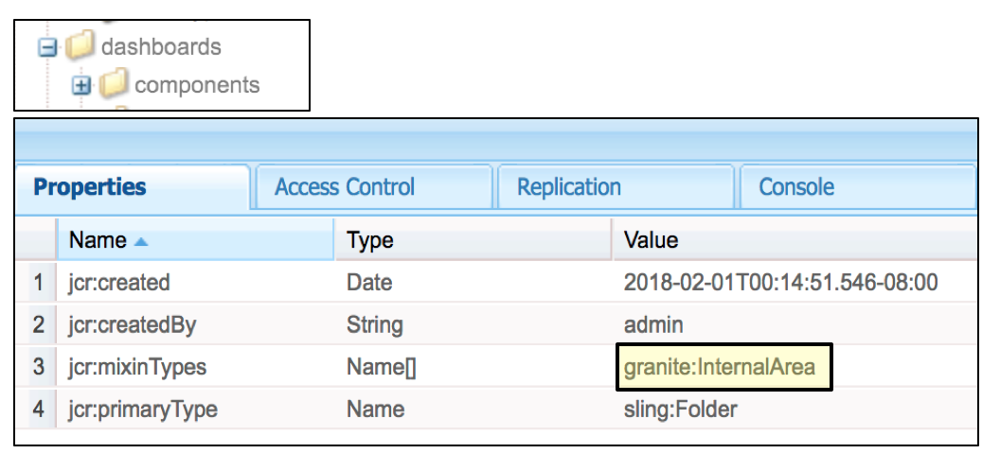
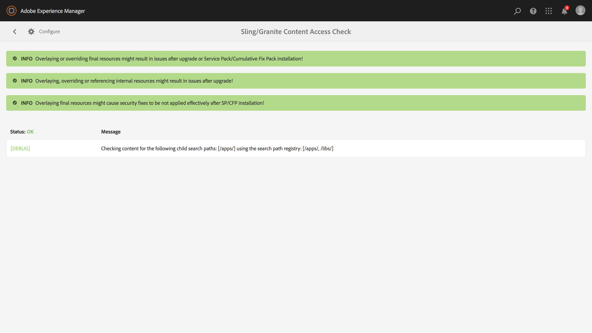

# Hållbara uppgraderingar{#sustainable-upgrades}

>[!CAUTION]
>
>AEM 6.4 har nått slutet på den utökade supporten och denna dokumentation är inte längre uppdaterad. Mer information finns i [teknisk supportperiod](https://helpx.adobe.com/support/programs/eol-matrix.html). Hitta de versioner som stöds [här](https://experienceleague.adobe.com/docs/).

## Anpassningsramverk {#customization-framework}

### Arkitektur (funktion/infrastruktur/innehåll/program)  {#architecture-functional-infrastructure-content-application}

Customization Framework-funktionen är utformad för att minska antalet fel i icke-utökningsbara områden av koden (som APIS) eller innehåll (som övertäckningar) som inte är uppgraderingsvänliga.

Det finns två komponenter i anpassningsramverket: den **API-gränssnitt** och **Innehållsklassificering**.

#### API-gränssnitt {#api-surface}

I tidigare versioner av AEM exponerades många API:er via Uber Jar. Vissa av dessa API:er var inte avsedda att användas av kunder, men exponerades för AEM funktioner i olika paket. I framtiden kommer Java-API:erna att markeras som Public eller Private för att visa kunderna vilka API:er som är säkra att använda i samband med uppgraderingar. Andra detaljer är:

* Java-API:er markerade som `Public` kan användas och refereras av anpassade implementeringspaket.

* Offentliga API:er är bakåtkompatibla med installationen av ett kompatibilitetspaket.
* Kompatibilitetspaketet innehåller en Uber JAR-kompatibel för att säkerställa bakåtkompatibilitet
* Java-API:er markerade som `Private` är avsedda att endast användas av AEM interna paket och ska inte användas av anpassade paket.

>[!NOTE]
>
>Begreppet `Private` och `Public` i detta sammanhang bör inte förväxlas med Java-föreläsningar av offentliga och privata klasser.

#### Innehållsklassificeringar {#content-classifications}

AEM har länge använt principen för övertäckningar och Sling Resource Merger för att ge kunderna möjlighet att utöka och anpassa AEM. Fördefinierade funktioner som driver AEM konsoler och användargränssnitt lagras i **/libs**. Kunderna kan aldrig ändra något under **/libs** men kan lägga till ytterligare innehåll under **/apps** för att täcka över och utöka funktionaliteten som definieras i **/libs** (Mer information finns i Utveckla med övertäckningar.) Detta orsakade fortfarande många problem när AEM uppgraderades som innehåll i **/libs** kan ändras så att övertäckningsfunktionen bryts på oväntade sätt. Kunderna kan också utöka AEM genom arv via `sling:resourceSuperType`eller bara referera till en komponent i **/libs** direkt via sling:resourceType. Liknande uppgraderingsproblem kan uppstå med referens- och åsidosättningsanvändningsfall.

För att göra det säkrare och enklare för kunderna att förstå vilka områden i **/libs** är säkra att använda och täcka över innehållet i **/libs** har klassificerats med följande blandningar:

* **Offentlig (granit:PublicArea)** - Definierar en nod som offentlig så att den kan överlappas, ärvs ( `sling:resourceSuperType`) eller används direkt ( `sling:resourceType`). Noder under /libs markerade som Public (Offentliga) kan uppgraderas utan risk med ett kompatibilitetspaket. I allmänhet bör kunderna endast utnyttja noder som är markerade som offentliga.

* **Abstrakt (granit:AbstractArea)** - Definierar en nod som abstrakt. Noder kan överlappas eller ärvas ( `sling:resourceSupertype`) men får inte användas direkt ( `sling:resourceType`).

* **Final (granite:FinalArea)** - Definierar en nod som final. Noder som klassificerats som final kan inte överlappas eller ärvas. Slutnoder kan användas direkt via `sling:resourceType`. Undernoder under den sista noden betraktas som interna som standard

* **Internal (granite:InternalArea)** - Definierar en nod som intern. Noder som klassificeras som interna kan inte överlappas, ärvas eller användas direkt. De här noderna är endast avsedda för AEM interna funktioner

* **Ingen anteckning** - Noderna ärver klassificering baserat på trädhierarkin. Roten / är som standard Public (Offentlig). **Noder med en överordnad som klassificerats som Internal eller Final ska också behandlas som Internal.**

>[!NOTE]
>
>Dessa profiler används endast mot Sling-sökvägsbaserade mekanismer. Andra områden i **/libs** som ett klientbibliotek kan markeras som `Internal`, men kan ändå användas med standardinkludering av klientlib. Det är viktigt att kunden i dessa fall fortsätter att respektera den interna klassificeringen.

#### Indikatorer för CRXDE Lite-innehållstyp {#crxde-lite-content-type-indicators}

Blandningar som används i CRXDE Lite visar innehållsnoder och träd som markerats som `INTERNAL` som att vara nedtonad. För `FINAL` bara ikonen är nedtonad. De underordnade noderna visas också i grått. Funktionen Overlay Node är inaktiverad i båda dessa fall.

**Offentlig**

**Slutlig**

**Intern**

**Hälsokontroll för innehåll**

AEM 6.4 kommer att levereras med en hälsokontroll som varnar kunderna om överlagrat eller refererat innehåll används på ett sätt som inte överensstämmer med innehållsklassificeringen.

The **Kontroll av innehållsåtkomst för Sling/Granite** är en ny hälsokontroll som övervakar databasen för att se om kundkoden inte har åtkomst till skyddade noder i AEM.

Detta kommer att skanna **/apps** och tar normalt några sekunder att slutföra.

För att få tillgång till den nya hälsokontrollen måste du göra följande:

1. Navigera AEM hemskärmen till **Verktyg > Åtgärder > Hälsorapporter**
1. Klicka på **Kontroll av innehållsåtkomst för Sling/Granite** enligt nedan:

   

När sökningen är klar visas en lista med varningar som meddelar slutanvändaren om den skyddade noden som felaktigt refereras till:

Efter att ha åtgärdat överträdelserna återgår den till grön stat:

Hälsokontrollen visar information som samlats in av en bakgrundstjänst som kontrollerar asynkront när en övertäckning eller resurstyp används i alla Sling-sökvägar. Om innehållsblandningar används felaktigt rapporteras en överträdelse.
