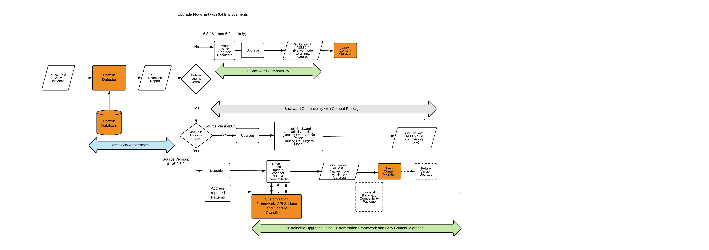

# Uppgradera till AEM 6.4{#upgrading-to-aem}

>[!CAUTION]
>
>AEM 6.4 har nått slutet på den utökade supporten och denna dokumentation är inte längre uppdaterad. Mer information finns i [teknisk supportperiod](https://helpx.adobe.com/support/programs/eol-matrix.html). Hitta de versioner som stöds [här](https://experienceleague.adobe.com/docs/).

I detta avsnitt beskriver vi uppgradering av en AEM till AEM 6.4:

* [Planera din uppgradering](/help/sites-deploying/upgrade-planning.md)
* [Utvärdera Upgrade Complexity med Pattern Detector](/help/sites-deploying/pattern-detector.md)
* [Bakåtkompatibilitet i AEM 6.4](/help/sites-deploying/backward-compatibility.md)
* [Uppgraderingsprocedur](/help/sites-deploying/upgrade-procedure.md)
* [Uppgradera kod och anpassningar](/help/sites-deploying/upgrading-code-and-customizations.md)
* [Underhållsaktiviteter före uppgraderingen](/help/sites-deploying/pre-upgrade-maintenance-tasks.md)
* [Utföra en uppgradering på plats](/help/sites-deploying/in-place-upgrade.md)
* [Kontrollera och felsök efter uppgradering](/help/sites-deploying/post-upgrade-checks-and-troubleshooting.md)
* [Hållbara uppgraderingar](/help/sites-deploying/sustainable-upgrades.md)
* [Lazy Content Migration](/help/sites-deploying/lazy-content-migration.md)
* [Omstrukturering av lager i AEM 6.4](/help/sites-deploying/repository-restructuring.md)

För att underlätta referensen till de AEM förekomsterna i dessa procedurer används följande termer i alla dessa artiklar:

* The *källa* -instans är den AEM som du uppgraderar från.
* The *target* -instans är den som du uppgraderar till.

>[!NOTE]
>
>Som en del av arbetet med att förbättra uppgraderingarnas tillförlitlighet har AEM 6.4 genomgått en omfattande omstrukturering av databasen. Mer information om hur du justerar med den nya strukturen finns i [Omstrukturering av lager i AEM 6.4](/help/sites-deploying/repository-restructuring.md)

## Vad har ändrats? {#what-has-changed}

Nedan följer viktiga ändringar av anmärkningar under de senaste versionerna av AEM:

AEM 6.0 introducerade den nya Jackrabbit Oak-databasen. Persistence Managers ersattes av [Micro Kernels](/help/sites-deploying/recommended-deploys.md). Från och med version 6.1 stöds inte längre CRX2. Ett migreringsverktyg som kallas crx2oak måste köras för att kunna migrera CRX2-databaser från 5.6.1-instanser. Mer information finns i [Använda CRX2OAK-migreringsverktyget](/help/sites-deploying/using-crx2oak.md).

Om Assets Insights ska användas och du uppgraderar från en version som är äldre än AEM 6.2, måste resurserna migreras och ha ID:n som genereras via en JMX-böna. I våra interna tester migrerades 125 K-resurser på en TjärMK-miljö på en timme, men resultatet kan variera.

I AEM 6.3 introducerades ett nytt format för `SegmentNodeStore`, som är grunden för TjärMK-implementeringen. Om du uppgraderar från en version som är äldre än AEM 6.3 måste du migrera databasen som en del av uppgraderingen, vilket innebär driftstopp.

Adobe Engineering beräknar att det är ca 20 minuter. Observera att omindexering inte behövs. Dessutom har en ny version av crx2oak-verktyget släppts för att fungera med det nya databasformatet.

**Denna migrering krävs inte om du uppgraderar från AEM 6.3 till AEM 6.4.**

Underhållsuppgifterna före uppgraderingen har optimerats för automatisering.

Kommandoradsalternativen för crx2oak-verktyget har ändrats till att vara automatiseringsvänliga och ha stöd för fler uppgraderingsalternativ.

Kontrollerna efter uppgraderingen har också gjorts automatiseringsvänliga.

Periodisk skräpinsamling med revideringar och skräpinsamling i datalager är nu rutinuppgifter som måste utföras regelbundet. I och med introduktionen av AEM 6.3 stöder och rekommenderar Adobe Online Revision Cleanup. Se [Revision Cleanup](/help/sites-deploying/revision-cleanup.md) om du vill ha information om hur du konfigurerar dessa uppgifter.

**AEM 6.4** introducerar [Mönsteravkännare](/help/sites-deploying/pattern-detector.md) för bedömning av uppgraderingens komplexitet när du börjar planera för uppgraderingen. 6.4 har också ett starkt fokus på [bakåtkompatibilitet](/help/sites-deploying/backward-compatibility.md) av funktioner. Slutligen, bästa praxis för [hållbara uppgraderingar](/help/sites-deploying/sustainable-upgrades.md) läggs också till.

Mer information om vad mer som har ändrats i de senaste AEM versionerna finns i den fullständiga versionsinformationen:

* [https://helpx.adobe.com/experience-manager/6-2/release-notes.html](https://helpx.adobe.com/experience-manager/6-2/release-notes.html)
* [https://helpx.adobe.com/experience-manager/6-3/release-notes.html](https://helpx.adobe.com/experience-manager/6-3/release-notes.html)
* [https://helpx.adobe.com/experience-manager/6-4/release-notes.html](https://helpx.adobe.com/experience-manager/6-4/release-notes.html)

## Uppgradera - översikt {#upgrade-overview}

Uppgradering av AEM är en flerstegsprocess som ibland tar flera månader. Följande översikt har bifogats som en översikt över vad som ingår i ett uppgraderingsprojekt och det innehåll som ingår i den här dokumentationen:

## Uppgradera flöde med 6.4 uppgraderingsförbättringar {#upgrade-overview-1}

Bilden nedan visar det rekommenderade arbetsflödet för uppgradering. Observera referensen till de nya funktioner som vi har infört. Uppgraderingen ska börja med Mönsteravkännaren (se [Utvärdera Upgrade Complexity med Pattern Detector](/help/sites-deploying/pattern-detector.md)) som låter dig bestämma vilken väg du vill ta för kompatibilitet med AEM 6.4 baserat på mönstren i den genererade rapporten.

I 6.4 fokuserades alla nya funktioner bakåt så att de var kompatibla, men i de fall där du fortfarande ser problem med bakåtkompatibilitet kan du i kompatibilitetsläget tillfälligt skjuta upp utvecklingen så att den anpassade koden är kompatibel med 6.4. Med den här metoden undviker du utvecklingsarbete direkt efter uppgraderingen (se [Bakåtkompatibilitet i AEM 6.4](/help/sites-deploying/backward-compatibility.md)).

Slutligen, under utvecklingscykeln 6.4, funktioner som introducerats under Hållbara uppgraderingar (se [Hållbara uppgraderingar](/help/sites-deploying/sustainable-upgrades.md)) hjälper er att följa bästa praxis för att göra framtida uppgraderingar ännu effektivare och smidigare.

