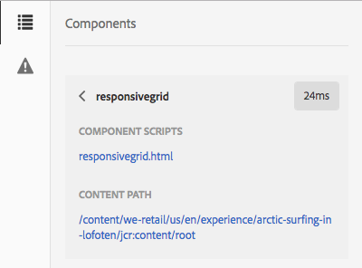
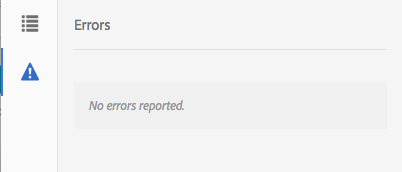

# Utvecklarläge{#developer-mode}

När du redigerar sidor i AEM finns flera [lägen](/help/sites-authoring/author-environment-tools.md#page-modes) tillgängliga, bland annat i utvecklarläget. Då öppnas en sidopanel med flera flikar som ger utvecklaren information om den aktuella sidan. De tre flikarna är:

* **[Komponenter](#components)**för att visa struktur- och prestandainformation.
* **[Test](#tests)**för att köra tester och analysera resultaten.
* **[Fel](#errors)**som visar att det har uppstått problem.

Detta hjälper en utvecklare att:

* Upptäck: vilka sidor som är sammansatta av.
* Felsök: vad som händer var och när, vilket i sin tur hjälper till att lösa problem.
* Test: fungerar programmet som förväntat.

>[!CAUTION]
>
>Utvecklarläge:
>
>* Är bara tillgängligt i det beröringsaktiverade användargränssnittet (vid redigering av sidor).
>* Är inte tillgängligt på mobila enheter eller små fönster på skrivbordet (på grund av utrymmesbegränsningar).
   >   * Detta inträffar när bredden är mindre än 1024px.
>* Är bara tillgängligt för användare som är medlemmar i `administrators` gruppen.

>[!CAUTION]
>
>Utvecklarläget är bara tillgängligt på en standardförfattarinstans som inte använder körläget nosampling content.
>
>Om det behövs kan det konfigureras för användning:
>
>* på en författarinstans med nosamplsinnehållets körningsläge
>* en publiceringsinstans
>
>
Det bör inaktiveras igen efter användning.

>[!NOTE]
>
>Se
>
>* Kunskapsbasartikeln [Troubleshooting AEM TouchUI issues](https://helpx.adobe.com/experience-manager/kb/troubleshooting-aem-touchui-issues.html), där du hittar fler tips och verktyg.
>* AEM Gems-session om [AEM 6.0 Developer Mode](https://docs.adobe.com/content/ddc/en/gems/aem-6-0-developer-mode.html).

## Öppnar utvecklarläge {#opening-developer-mode}

Utvecklarläget implementeras som en sidopanel i sidredigeraren. Öppna panelen genom att välja **Utvecklare** i lägesväljaren i verktygsfältet i sidredigeraren:

Panelen är uppdelad i två flikar:

* **[Komponenter](/help/sites-developing/developer-mode.md#components)**- Detta visar ett komponentträd, som liknar[innehållsträdet](/help/sites-authoring/author-environment-tools.md#content-tree)för författare

* **[Fel](/help/sites-developing/developer-mode.md#errors)**- När problem uppstår visas information för varje komponent.

### Komponenter {#components}

Detta visar ett komponentträd som:

* Visar kedjan med komponenter och mallar som återges på sidan (SLY, JSP osv.). Trädet kan expanderas för att visa kontext i hierarkin.
* Visar den datortid på serversidan som krävs för att återge komponenten.
* Gör att du kan expandera trädet och välja specifika komponenter i trädet. Markeringen ger åtkomst till komponentinformation. t.ex.

   * Databassökväg
   * Länkar till skript (används i CRXDE Lite)

* De valda komponenterna (i innehållsflödet, vilket anges med en blå ram) markeras i innehållsträdet (och tvärtom).

Detta kan hjälpa till att:

* Fastställ och jämför återgivningstiden per komponent.
* Se och förstå hierarkin.
* Förstå och förbättra sidinläsningstiden genom att hitta långsamma komponenter.

Varje komponentpost kan visa (till exempel:

* **Visa detaljer**: en länk till en lista som visar

   * alla komponentskript som används för att återge komponenten.
   * databasens innehållssökväg för den här specifika komponenten.
   

* **Redigera skript**: en länk som:

   * öppnar komponentskriptet i CRXDE Lite.

* När du expanderar en komponentpost (pilhuvud) kan du även visa:

   * Hierarkin i den markerade komponenten.
   * Återgivningstider för den markerade komponenten separat, alla enskilda kapslade komponenter i den och den kombinerade summan.
   

>[!CAUTION]
>
>Vissa länkar pekar på skript under `/libs`. De här är bara till för referens, du **får inte** redigera något under `/libs`eftersom ändringar du gör kan gå förlorade. Detta beror på att den här grenen kan ändras när du uppgraderar eller installerar en programfix/funktionspaket. Alla ändringar du behöver göra under `/apps`finns i [Övertäckningar och åsidosättningar](/help/sites-developing/overlays.md).

### Fel {#errors}

Förhoppningsvis är fliken **Fel** alltid tom (som ovan), men när problem uppstår visas följande information för varje komponent:

* En varning om komponenten skriver en post i felloggen, tillsammans med information om felet och direktlänkar till rätt kod i CRXDE Lite.
* En varning om komponenten öppnar en administratörssession.

Om till exempel en odefinierad metod anropas visas det resulterande felet på fliken **Fel** :

Komponentposten i trädet på fliken Komponenter markeras också med en indikator när ett fel inträffar.

### Test {#tests}

>[!CAUTION]
>
>I AEM 6.2 återimplementerades testfunktionerna i utvecklarläget som ett fristående verktygsprogram.
>
>Mer information finns i [Testa användargränssnittet](/help/sites-developing/hobbes.md).
