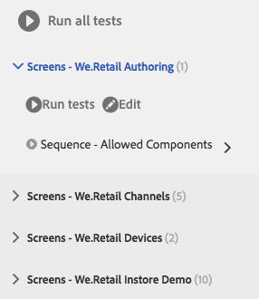

# Testa användargränssnittet{#testing-your-ui}

AEM tillhandahåller ett ramverk för automatisering av tester för ditt AEM-gränssnitt. Med hjälp av ramverket kan du skriva och köra gränssnittstester direkt i en webbläsare. Ramverket innehåller ajavascript-API för att skapa tester.

I AEM-testmiljön används Hobbes.js, ett testbibliotek som är skrivet i Javascript. Hobbes.js-ramverket utvecklades för att testa AEM som en del av utvecklingsprocessen. Ramverket är nu tillgängligt för allmän användning för testning av dina AEM-program.

>[!NOTE]
>
>Mer information om API:t finns i Hobbes.js- [dokumentationen](https://helpx.adobe.com/experience-manager/6-4/sites/developing/using/reference-materials/test-api/index.html) .

## Testernas struktur {#structure-of-tests}

När du använder automatiska tester i AEM är följande termer viktiga att förstå:

|  |  |
|---|---|
| Åtgärd | Ett **funktionsmakro** är en specifik aktivitet på en webbsida, som att klicka på en länk eller en knapp. |
| Testfall | Ett **testfall** är en specifik situation som kan bestå av en eller flera **åtgärder**. |
| Test Suite | En **testsvit** är en grupp av relaterade **testfall** som tillsammans testar ett visst användningsfall. |

## Kör tester {#executing-tests}

### Visa testsviter {#viewing-test-suites}

Öppna testkonsolen för att se de registrerade testsviterna. Testpanelen innehåller en lista med testsviter och deras testfall.

Navigera till verktygskonsolen via **Global navigering -> Verktyg > Åtgärder -> Testning**.


När du öppnar konsolen visas testsviterna till vänster tillsammans med ett alternativ för att köra alla sekventiellt. Det utrymme till höger som visas med en schackmönstrad bakgrund är en platshållare för hur sidinnehållet visas när testerna körs.


### Köra en testsvit {#running-a-single-test-suite}

Testsviter kan köras individuellt. När du kör en testsvit ändras sidan allt eftersom testärenden och deras åtgärder körs och resultaten visas när testet har slutförts. Ikoner anger resultatet.

En bockmarkeringsikon anger att testet har slutförts:


En X-ikon anger att testet misslyckades:


Så här kör du en testsvit:

1. Klicka på eller tryck på namnet på det testfall som du vill köra för att utöka detaljerna för åtgärderna.

   

1. Klicka eller tryck på knappen **Kör test** .

   

1. Platshållaren ersätts med sidinnehåll när testet utförs.

   

1. Granska resultatet av testfallet genom att trycka på eller klicka på beskrivningen för att öppna panelen **Resultat** . Om du trycker eller klickar på namnet på testfallet på panelen **Resultat** visas all information.

   

### Köra flera tester {#running-multiple-tests}

Testsviter körs sekventiellt i den ordning som de visas i konsolen. Du kan fördjupa dig i ett test för att se de detaljerade resultaten.


1. På testpanelen trycker eller klickar du på knappen **Kör alla tester** eller på knappen **Kör tester** under titeln på testsviten som du vill köra.

   

1. Om du vill visa resultatet av varje testfall trycker eller klickar du på titeln för testfallet. Om du trycker eller klickar på namnet på testet på panelen **Resultat** visas all information.

   

## Skapa och använda en enkel testsvit {#creating-and-using-a-simple-test-suite}

I proceduren nedan steg du igenom när du skapar och kör en Test Suite med [We.Retail-innehåll](/help/sites-developing/we-retail.md), men du kan enkelt ändra testet så att det använder en annan webbsida.

Mer information om hur du skapar egna testsviter finns i [Hobbes.js API-dokumentationen](https://helpx.adobe.com/experience-manager/6-4/sites/developing/using/reference-materials/test-api/index.html).

1. Öppna CRXDE Lite. ([http://localhost:4502/crx/de](http://localhost:4502/crx/de))
1. Högerklicka på `/etc/clientlibs` mappen och klicka på **Skapa > Skapa mapp**. Skriv namnet `myTests` och klicka på **OK**.
1. Högerklicka på `/etc/clientlibs/myTests` mappen och klicka på **Skapa > Skapa nod**. Använd följande egenskapsvärden och klicka sedan på **OK**:

   * Namn: `myFirstTest`
   * Typ: `cq:ClientLibraryFolder`

1. Lägg till följande egenskaper i noden myFirstTest:

   | Namn | Typ | Värde |
   |---|---|---|
   | `categories` | `String[]` | `granite.testing.hobbes.tests` |
   | `dependencies` | `String[]` | `granite.testing.hobbes.testrunner` |

   >[!NOTE]
   >
   >**Endast AEM-formulär**
   >
   >Om du vill testa adaptiva formulär lägger du till följande värden i kategorierna och beroenden. Exempel:
   >
   >**kategorier**: `granite.testing.hobbes.tests, granite.testing.hobbes.af.commons`
   >
   >**beroenden**: `granite.testing.hobbes.testrunner, granite.testing.hobbes.af`

1. Klicka på **Spara alla**.
1. Högerklicka på `myFirstTest` noden och klicka på **Skapa > Skapa fil**. Name the file `js.txt` and click **OK**.
1. Ange följande text i `js.txt` filen:

   ```
   #base=.
   myTestSuite.js
   ```

1. Klicka på **Spara alla** och stäng sedan `js.txt` filen.
1. Högerklicka på `myFirstTest` noden och klicka på **Skapa > Skapa fil**. Name the file `myTestSuite.js` and click **OK**.
1. Kopiera följande kod till `myTestSuite.js` filen och spara sedan filen:

   ```
   new hobs.TestSuite("Experience Content Test Suite", {path:"/etc/clientlibs/myTests/myFirstTest/myTestSuite.js"})
      .addTestCase(new hobs.TestCase("Navigate to Experience Content")
         .navigateTo("/content/we-retail/us/en/experience/arctic-surfing-in-lofoten.html")
      )
      .addTestCase(new hobs.TestCase("Hover Over Topnav")
         .mouseover("li.visible-xs")
      )
      .addTestCase(new hobs.TestCase("Click Topnav Link")
         .click("li.active a")
   );
   ```

1. Gå till **testkonsolen** för att testa testsviten.

