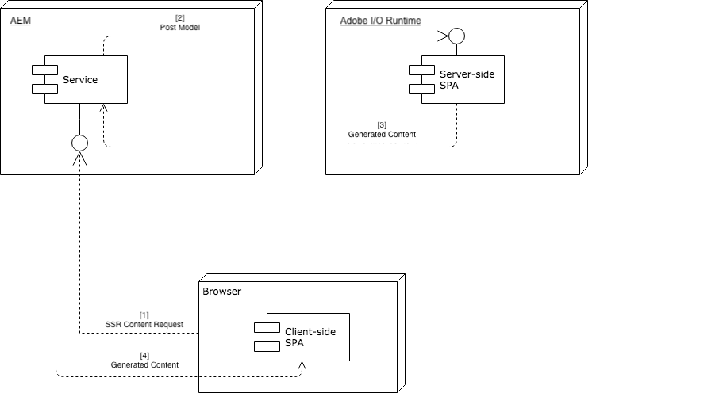

# Återgivning på SPA- och serversidan{#spa-and-server-side-rendering}

>[!NOTE]
>Funktionen SPA (Single-Page Application Editor) kräver [AEM 6.4 Service Pack 2](https://helpx.adobe.com/experience-manager/6-4/release-notes/sp-release-notes.html) eller senare.
>
>SPA Editor är den rekommenderade lösningen för projekt som kräver SPA ramverksbaserad återgivning på klientsidan (t.ex. Reaktion eller Angular).

>[!NOTE]
>
>AEM 6.4.5.0 eller senare krävs för att använda de återgivningsfunktioner på SPA serversidan som beskrivs i det här dokumentet.

## Översikt {#overview}

Applikationer för en enda sida (SPA) kan ge användaren en rik, dynamisk upplevelse som reagerar och beter sig på välbekanta sätt, ofta precis som med andra applikationer. [Detta uppnås genom att kunden förlitar sig på att läsa in innehållet i förväg och sedan gör en reaktiv hantering av ](/help/sites-developing/spa-walkthrough.md#how-does-a-spa-work) användarinteraktionen, vilket minimerar mängden kommunikation mellan klienten och servern.

Detta kan dock leda till längre inledande inläsningstider, särskilt om SPA är stor och har mycket innehåll. För att optimera inläsningstiden kan en del av innehållet återges på serversidan. Serversidorendering (SSR) kan snabba upp den initiala inläsningen av sidan och sedan överföra ytterligare återgivning till klienten.

## När SSR {#when-to-use-ssr} ska användas

SSR krävs inte för alla projekt. Även om AEM stöder JS SSR fullt ut för SPA rekommenderar Adobe inte att man implementerar det systematiskt för varje projekt.

När du beslutar dig för att implementera SSR måste du först uppskatta vilken ytterligare komplexitet, insats och kostnad som SSR innebär på ett realistiskt sätt för projektet, inklusive det långsiktiga underhållet. En SSR-arkitektur bör endast väljas när mervärdet klart överstiger de uppskattade kostnaderna.

SSR ger vanligtvis ett visst värde när det finns ett tydligt&quot;ja&quot; till någon av följande frågor:

* **SEO:** Krävs det fortfarande SSR för att din webbplats ska kunna indexeras korrekt av sökmotorer som genererar trafik? Kom ihåg att de viktigaste sökmotorcrawlarna nu utvärderar JS.
* **Sidhastighet:** Ger SSR en mätbar hastighetsförbättring i realtidsmiljöer och ökar den övergripande användarupplevelsen?

Endast när minst en av dessa två frågor besvaras med ett tydligt&quot;ja&quot; för ditt projekt rekommenderar Adobe att SSR implementeras. I följande avsnitt beskrivs hur du gör detta med Adobe I/O Runtime.

## Adobe I/O Runtime {#adobe-io-runtime}

Om du är [säker på att ditt projekt kräver SSR](#when-to-use-ssr) bör du använda Adobe I/O Runtime som lösning rekommenderas i Adobe.

Mer information om Adobe I/O Runtime finns på

* [https://www.adobe.io/apis/experienceplatform/runtime.html](https://www.adobe.io/apis/experienceplatform/runtime.html)  - för en översikt över tjänsten
* [https://www.adobe.io/apis/experienceplatform/runtime/docs.html](https://www.adobe.io/apis/experienceplatform/runtime/docs.html) - för detaljerad dokumentation om plattformen

I följande avsnitt beskrivs hur Adobe I/O Runtime kan användas för att implementera SSR för dina SPA i två olika modeller:

* [AEM kommunikationsflöde](#aem-driven-communication-flow)
* [Kommunikationsflöde via Adobe I/O-miljön](#adobe-io-driven-communication-flow)

>[!NOTE]
>
>Adobe rekommenderar en separat Adobe I/O Runtime-instans för varje AEM (författare, publicering, scen osv.).

## Konfiguration för fjärrinnehållsåtergivning {#remote-content-renderer-configuration}

AEM måste veta var det fjärråtergivna innehållet kan hämtas. Oavsett vilken [modell du väljer att implementera för SSR](#adobe-io-runtime) måste du ange AEM hur du ska få åtkomst till den här fjärråtergivningstjänsten.

Detta görs via tjänsten **RemoteContentRenderer - Configuration Factory** OSGi. Sök efter strängen RemoteContentRenderer i webbkonsolens konfigurationskonsol på `http://<host>:<port>/system/console/configMgr`.


Följande fält är tillgängliga för konfigurationen:

* **Mönster**  för innehållssökväg - Reguljärt uttryck för att matcha en del av innehållet, om det behövs
* **URL**  för fjärrslutpunkt - URL för slutpunkten som ansvarar för att generera innehållet
   * Använd det säkra HTTPS-protokollet om det inte finns i det lokala nätverket.
* **Ytterligare begäranrubriker**  - Ytterligare rubriker som ska läggas till i begäran som skickas till fjärrslutpunkten
   * Mönster: `key=value`
* **Timeout**  för begäran - Timeout för fjärrvärdbegäran i millisekunder

>[!NOTE]
>
>Oavsett om du väljer att implementera [AEM kommunikationsflöde](#aem-driven-communication-flow) eller [Adobe I/O Runtime-drivet flöde](#adobe-io-driven-communication-flow), måste du definiera en konfiguration för fjärrinnehållsåtergivning.
>
>Den här konfigurationen måste också definieras om du väljer att [använda en anpassad Node.js-server](#using-node-js).

>[!NOTE]
>
>Den här konfigurationen utnyttjar [Renderer för fjärrinnehåll](#remote-content-renderer), som har ytterligare tillgängliga alternativ för tillägg och anpassning.

## AEM kommunikationsflöde {#aem-driven-communication-flow}

När du använder SSR innehåller arbetsflödet för [komponentinteraktion](/help/sites-developing/spa-overview.md#workflow) för SPA i AEM en fas i vilken det inledande innehållet i programmet genereras av Adobe I/O Runtime.

1. Webbläsaren begär SSR-innehåll från AEM.
1. AEM skickar modellen till Adobe I/O Runtime.
1. Adobe I/O Runtime returnerar det genererade innehållet
1. AEM visar HTML-koden som returneras av Adobe I/O Runtime via HTML-mallen för backend-sidkomponenten.



### Adobe I/O Runtime-drivet kommunikationsflöde {#adobe-io-driven-communication-flow}

Avsnittet [AEM-drivet kommunikationsflöde](#aem-driven-communication-flow) beskriver standardimplementering och rekommenderad implementering av serversidorendering med avseende på SPA i AEM, där AEM utför start och visning av innehåll.

Alternativt kan SSR implementeras så att Adobe I/O Runtime ansvarar för startkomponenten, vilket effektivt kan vända kommunikationsflödet.

Båda modellerna är giltiga och stöds av AEM. Man bör dock beakta fördelarna och nackdelarna med var och en av modellerna innan man implementerar en viss modell.

| Bootstrap | Fördelar | Nackdelar |
|---|---|---|
| via AEM | AEM hanterar inmatning av bibliotek där det behövs<br>Resurser behöver bara underhållas på AEM | SPA utvecklare kanske inte känner till |
| via Adobe I/O Runtime | Mer bekant för SPA utvecklare | Klientlib-resurser som krävs av programmet, t.ex. CSS och JavaScript, måste göras tillgängliga av AEM utvecklare via egenskapen [`allowProxy`](/help/sites-developing/clientlibs.md#locating-a-client-library-folder-and-using-the-proxy-client-libraries-servlet)<br>Resurserna måste synkroniseras mellan AEM och Adobe I/O Runtime<br>För att det ska gå att skapa SPA kan det vara nödvändigt med en proxyserver för Adobe I/O Runtime |

## Planering för SSR {#planning-for-ssr}

I allmänhet behöver bara en del av ett program återges på serversidan. Det vanliga exemplet är det innehåll som ska visas ovanför vikningen vid den första inläsningen av sidan måste återges på serversidan. Detta sparar tid genom att leverera till klienten, som redan har återgett innehåll. När användaren interagerar med SPA återges det extra innehållet av klienten.

När du funderar på att implementera serversidorendering för SPA måste du granska vilka delar av appen som kräver SSR.

## Utveckla en SPA med SSR {#developing-an-spa-using-ssr}

SPA kan återges av klienten (i webbläsaren) eller serversidan. Webbläsaregenskaper som fönsterstorlek och plats finns inte på den återgivna serversidan. SPA bör därför vara isomorfa, utan att man vet var de kommer att återges.

Om du vill använda SSR måste du distribuera koden i AEM och på Adobe I/O Runtime, som ansvarar för återgivningen på serversidan. Den mesta koden blir densamma, men serverspecifika åtgärder skiljer sig åt.

## SSR för SPA i AEM {#ssr-for-spas-in-aem}

SSR för SPA i AEM kräver Adobe I/O Runtime, vilket krävs för återgivning av programinnehållsserversidan. I programmets HTML anropas en resurs på Adobe I/O Runtime för att återge innehållet.

Precis som AEM stöder ramverken Angular och React SPA direkt, stöds även serversidorendering för Angular- och React-appar. Mer information finns i NPM-dokumentationen för båda ramverken.

* Reagera: [https://github.com/adobe/aem-sample-we-retail-journal/blob/master/react-app/DEVELOPMENT.md#enabling-the-server-side-rendering-using-the-aem-page-component](https://github.com/adobe/aem-sample-we-retail-journal/blob/master/react-app/DEVELOPMENT.md#enabling-the-server-side-rendering-using-the-aem-page-component)
* Angular: [https://github.com/adobe/aem-sample-we-retail-journal/blob/master/react-app/DEVELOPMENT.md#enabling-the-server-side-rendering-using-the-aem-page-component](https://github.com/adobe/aem-sample-we-retail-journal/blob/master/react-app/DEVELOPMENT.md#enabling-the-server-side-rendering-using-the-aem-page-component)

Ett enkelt exempel finns i [We.Retail Journal-appen](https://github.com/Adobe-Marketing-Cloud/aem-sample-we-retail-journal). Det återger hela programserversidan. Även om detta inte är ett verkligt exempel visar det vad som behövs för att implementera SSR.

>[!CAUTION]
>Appen [We.Retail Journal](https://github.com/Adobe-Marketing-Cloud/aem-sample-we-retail-journal) är endast avsedd som exempel och använder därför Node.js som ett enkelt exempel i stället för den rekommenderade Adobe I/O Runtime. Det här exemplet ska inte användas för något projektarbete.

>[!NOTE]
>Alla AEM ska utnyttja den AEM projekttypen [som stöder SPA projekt med React eller Angular och använder SPA SDK.](https://docs.adobe.com/content/help/en/experience-manager-core-components/using/developing/archetype/overview.html)

## Använda Node.js {#using-node-js}

Adobe I/O Runtime rekommenderas för implementering av SSR för SPA i AEM.

För premesis AEM-instanser är det också möjligt att implementera SSR med en anpassad Node.js-instans på samma sätt som beskrivs ovan. Även om detta stöds av Adobe rekommenderas det inte.

Node.js stöds inte för instanser med värdbaserade AEM i Adobe.

>[!NOTE]
>
>Om SSR måste implementeras via Node.js rekommenderar Adobe en separat Node.js-instans för varje AEM (författare, publicering, scen osv.).

## Renderare för fjärrinnehåll {#remote-content-renderer}

Konfigurationen [Remote Content Renderer](#remote-content-renderer-configuration) som krävs för att använda SSR med SPA i AEM finns i en mer generaliserad renderingstjänst som kan utökas och anpassas efter dina behov.

### RemoteContentRenderingService {#remotecontentrenderingservice}

`RemoteContentRenderingService` är en OSGi-tjänst som hämtar innehåll som återges på en fjärrserver, till exempel från Adobe I/O. Innehållet som skickas till fjärrservern baseras på den begärandeparameter som skickas.

`RemoteContentRenderingService` kan injiceras genom beroendeinvertering till antingen en anpassad Sling-modell eller servlet när ytterligare innehållsmanipulering krävs.

Den här tjänsten används internt av [RemoteContentRendererRequestHandlerServlet](#remotecontentrendererrequesthandlerservlet).

### RemoteContentRendererRequestHandlerServlet {#remotecontentrendererrequesthandlerservlet}

`RemoteContentRendererRequestHandlerServlet` kan användas för att ställa in konfigurationen för begäran programmatiskt. `DefaultRemoteContentRendererRequestHandlerImpl`, den medföljande standardimplementeringen av begäranhanteraren, gör att du kan skapa flera OSGi-konfigurationer för att mappa en plats i innehållsstrukturen till en fjärrslutpunkt.

Implementera gränssnittet `RemoteContentRendererRequestHandler` om du vill lägga till en anpassad begärandehanterare. Se till att du anger `Constants.SERVICE_RANKING`-komponentegenskapen till ett heltal som är högre än 100, vilket är rankningen för `DefaultRemoteContentRendererRequestHandlerImpl`.

```
@Component(immediate = true,
        service = RemoteContentRendererRequestHandler.class,
        property={
            Constants.SERVICE_RANKING +":Integer=1000"
        })
public class CustomRemoteContentRendererRequestHandlerImpl implements RemoteContentRendererRequestHandler {}
```

### Konfigurera OSGi-konfigurationen för standardhanteraren {#configure-default-handler}

Konfigurationen av standardhanteraren måste konfigureras enligt beskrivningen i avsnittet [Konfiguration av fjärrinnehållsåtergivning](#remote-content-renderer-configuration).

###  Användning av fjärråtergivning av innehåll {#usage}

Så här hämtar du en servlet och returnerar innehåll som kan injiceras på sidan:

1. Kontrollera att fjärrservern är tillgänglig.
1. Lägg till ett av följande kodfragment i HTML-mallen för en AEM.
1. Du kan också skapa eller ändra OSGi-konfigurationerna.
1. Bläddra i webbplatsens innehåll

Vanligtvis är HTML-mallen för en sidkomponent huvudmottagaren för en sådan funktion.

```
<sly data-sly-resource="${resource @ resourceType='cq/remote/content/renderer/request/handler'}" />
```

### Krav {#requirements}

Servlets använder Sling Model Exporter för att serialisera komponentdata. Som standard stöds både `com.adobe.cq.export.json.ContainerExporter` och `com.adobe.cq.export.json.ComponentExporter` som Sling Model-kort. Om det behövs kan du lägga till klasser som begäran ska anpassas till med `RemoteContentRendererServlet` och implementera `RemoteContentRendererRequestHandler#getSlingModelAdapterClasses`. Ytterligare klasser måste utöka `ComponentExporter`.
