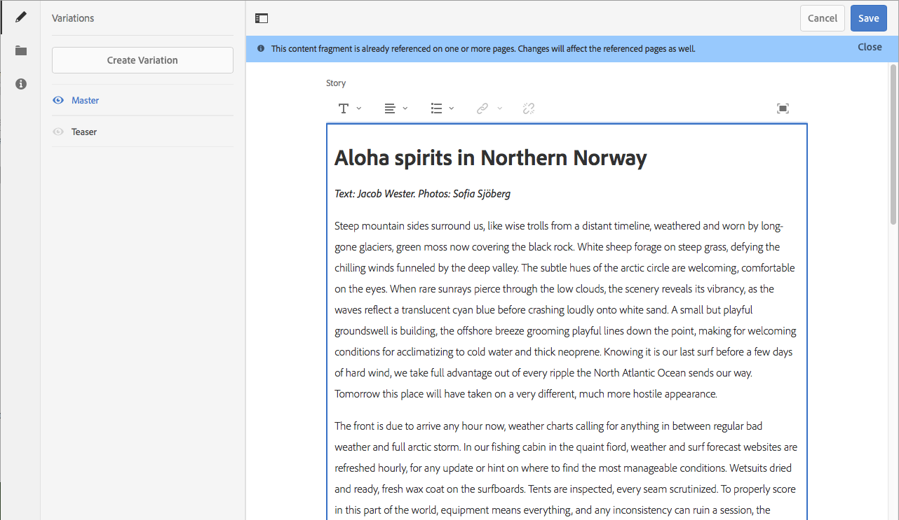

# Testa innehållsfragment i webb.detaljhandel{#trying-out-content-fragments-in-we-retail}

>[!CAUTION]
>
>AEM 6.4 har nått slutet på den utökade supporten och denna dokumentation är inte längre uppdaterad. Mer information finns i [teknisk supportperiod](https://helpx.adobe.com/support/programs/eol-matrix.html). Hitta de versioner som stöds [här](https://experienceleague.adobe.com/docs/).

Med innehållsfragment kan du skapa kanalneutralt innehåll tillsammans med (eventuellt kanalspecifika) variationer. **Vi.butik** (som är tillgängligt i en körklar instans av AEM) innehåller fragmentet **Arktisk surfning i Lofoten** som ett grundläggande urval. Detta visar att:

* Innehållsfragment i Adobe Experience Manager (AEM) [skapas och hanteras som sidoberoende resurser](/help/assets/content-fragments.md). Med dem kan du skapa kanalneutralt innehåll tillsammans med (eventuellt kanalspecifika) variationer.

   * Se [Var kan du hitta resurser för innehållsfragment i webb.butik](#where-to-find-content-fragments-in-we-retail)

* Då kan du [använda dessa fragment och deras variationer vid redigering](/help/sites-authoring/content-fragments.md) dina innehållssidor.

   * Se [Där innehållsfragment används i webb.butik](#where-content-fragments-are-used-in-we-retail)

Den fullständiga dokumentationen om hur du skapar, hanterar, använder och utvecklar innehållsfragment finns i:

* Se [Ytterligare information](#further-information)

>[!NOTE]
>
>**Innehållsfragment** och **[Upplevelsefragment](/help/sites-authoring/experience-fragments.md)** har olika funktioner i AEM:
>
>* **Innehållsfragment** är redaktionellt innehåll, främst text och relaterade bilder. De är rent innehåll, utan design och layout.
>* **Upplevelsefragment** är helt utformat, ett fragment av en webbsida.
>
>Upplevelsefragment kan innehålla innehåll i form av innehållsfragment, men inte tvärtom.

## Var kan man hitta innehållsfragment i webb.butik {#where-to-find-content-fragments-in-we-retail}

Det finns flera exempelinnehållsfragment i We.Retail; navigera via **Resurser**, **Filer**, **Vi.butik**, **Engelska**, **Erfarenheter**.

Dessa innehåller **Arktisk surfning i Lofoten**, ett fragment tillsammans med relaterade visuella resurser:

* Navigera via **Resurser**, **Filer**, **Vi.butik**, **Engelska**, **Erfarenheter**, **Artisk surfning i Lofoten**:

   * [http://localhost:4502/assets.html/content/dam/we-retail/en/experiences/arctic-surfing-in-lofoten](http://localhost:4502/assets.html/content/dam/we-retail/en/experiences/arctic-surfing-in-lofoten)

Du kan markera och redigera **Arktisk surfning i Lofoten** fragment:

* [http://localhost:4502/editor.html/content/dam/we-retail/en/experiences/arctic-surfing-in-lofoten/arctic-surfing-in-lofoten](http://localhost:4502/editor.html/content/dam/we-retail/en/experiences/arctic-surfing-in-lofoten/arctic-surfing-in-lofoten)

Här kan du [redigera och hantera](/help/assets/content-fragments.md) fragmentet med hjälp av flikarna (vänster sida):

 

* **[Variationer](/help/assets/content-fragments-variations.md)** inkluderar [Markering](/help/assets/content-fragments-markdown.md)

* **[Associerat innehåll](/help/assets/content-fragments-assoc-content.md)**
* **[Metadata](/help/assets/content-fragments-metadata.md)**

## Där innehållsfragment används i webb.butik {#where-content-fragments-are-used-in-we-retail}

För att illustrera [skapa sidor med ett innehållsfragment](/help/sites-authoring/content-fragments.md) det finns flera exempelsidor i, till exempel:

* [http://localhost:4502/sites.html/content/we-retail/language-masters/en/experience](http://localhost:4502/sites.html/content/we-retail/language-masters/en/experience)

Till exempel **Arktisk surfning i Lofoten** Det finns referenser till innehållsfragment på sidan Platser:

* Navigera via **Webbplatser**, **Vi.butik**, **Språkmallar**, **Engelska**, **Upplevelse**. Öppna **Arktisk surfning i Lofoten** för redigering:

   * [http://localhost:4502/editor.html/content/we-retail/language-masters/en/experience/arctic-surfing-in-lofoten.html](http://localhost:4502/editor.html/content/we-retail/language-masters/en/experience/arctic-surfing-in-lofoten.html)

## Ytterligare information {#further-information}

Mer information finns i:

* [Arbeta med innehållsfragment](/help/assets/content-fragments.md)

   * Lär dig hur du skapar, redigerar och hanterar resurser för innehållsfragment.

* [Sidredigering med innehållsfragment](/help/sites-authoring/content-fragments.md)

   * Använd ditt innehållsfragment när du redigerar en sida.

* [Utveckla AEM - Komponenter för innehållsfragment](/help/sites-developing/components-content-fragments.md)

   * En översikt över komponenterna för innehållsfragment.

* [Utveckla och utöka innehållsfragment](/help/sites-developing/customizing-content-fragments.md)

   * Information som hjälper dig att utveckla och utöka innehållsfragment.
