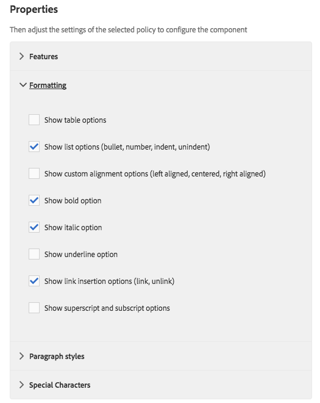

# Provar kärnkomponenter i We.Retail{#trying-out-core-components-in-we-retail}

De centrala komponenterna är moderna, flexibla komponenter som är enkla att utöka och som gör det enkelt att integrera i projekten. Kärnkomponenterna har byggts kring flera viktiga designprinciper, som HTML, användbarhet, färdig installation, konfigurerbarhet, versionshantering och utbyggbarhet. Vi.Retail har byggts på kärnkomponenter.

## Prova {#trying-it-out}

1. Börja AEM med exempelinnehållet för We.Retail och öppna [komponentkonsolen](/help/sites-authoring/default-components-console.md).

   **Global navigering -> Verktyg -> Komponenter**

1. När du öppnar rälen i komponentkonsolen kan du filtrera efter en viss komponentgrupp. Kärnkomponenterna finns i

   * `.core-wcm`: Standardkärnkomponenterna
   * `.core-wcm-form`: Baskomponenter för att skicka in formulär

   Choose `.core-wcm`.

   

1. Observera att alla kärnkomponenter har namnet **v1**, vilket visar att detta är den första versionen av kärnkomponenten. Vi kommer att lansera de senaste versionerna, som blir versionskompatibla med AEM och gör det enkelt att uppgradera så att du kan dra nytta av de senaste funktionerna.
1. Klicka på **Text (v1)**.

   Se till att **Resurstypen** för komponenten är `/apps/core/wcm/components/text/v1/text`. Kärnkomponenter finns under `/apps/core/wcm/components` och versionsindelas per komponent.

   

1. Klicka på fliken **Dokumentation** för att se utvecklardokumentationen för komponenten.

   

1. Återgå till komponentkonsolen. Filtrera för gruppen **We.Retail** och välj komponenten **Text**.
1. Se till att **Resurstypen** pekar på en komponent som förväntat under `/apps/weretail`, men **Resurssupertypen** pekar tillbaka på kärnkomponenten `/apps/core/wcm/components/text/v1/text`.

   

1. Klicka på fliken **Live-användning** för att se vilka sidor den här komponenten används för närvarande. Klicka på den första **Tack-** sidan för att redigera sidan.

   

1. På sidan Tack markerar du textkomponenten och klickar på ikonen Avbryt arv på komponentens Redigera-meny.

   [Vi.Retail har en global ](/help/sites-developing/we-retail-globalized-site-structure.md) webbplatsstruktur där innehåll överförs från språkmallar till  [live-kopior via en mekanism som kallas arv](/help/sites-administering/msm.md). Arvet måste därför avbrytas för att användaren ska kunna redigera text manuellt.

   

1. Bekräfta annulleringen genom att klicka på **Ja**.

   

1. När arvet har avbrutits och du väljer textkomponenterna finns det många fler alternativ. Klicka på** Redigera**.

   

1. Nu kan du se vilka redigeringsalternativ som är tillgängliga för textkomponenten.

   

1. Välj **Redigera mall** på menyn **Sidinformation**.
1. Klicka på ikonen **Policy** för textkomponenten i **layoutbehållaren** på sidan i mallredigeraren på sidan.

   

1. Med huvudkomponenterna kan mallskapare konfigurera vilka egenskaper som är tillgängliga för sidförfattarna. Dessa innehåller funktioner som tillåtna inklistringskällor, formateringsalternativ, tillgängliga styckeformat osv.

   Sådana designdialogrutor är tillgängliga för många viktiga komponenter och fungerar tillsammans med mallredigeraren. När de är aktiverade är de tillgängliga för författaren via komponentredigerarna.

   

## Ytterligare information {#further-information}

Mer information om kärnkomponenterna finns i dokumentet [Core Components](https://docs.adobe.com/content/help/en/experience-manager-core-components/using/introduction.html) för en översikt över kärnkomponenternas funktioner och i utvecklardokumentet [Developing Core Components](https://helpx.adobe.com/experience-manager/core-components/using/developing.html) för en teknisk översikt.

Du kanske också vill undersöka [redigerbara mallar](/help/sites-developing/we-retail-editable-templates.md) ytterligare. Mer information om redigerbara mallar finns i redigeringsdokumentet [Creating Page Templates](/help/sites-authoring/templates.md) eller i utvecklardokumentet Page [Templates - Editable](/help/sites-developing/page-templates-editable.md).
