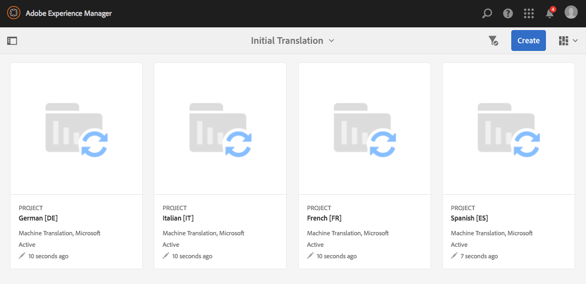

# Prova den globala webbplatsstrukturen i webb.butik{#trying-out-the-globalized-site-structure-in-we-retail}

>[!CAUTION]
>
>AEM 6.4 har nått slutet på den utökade supporten och denna dokumentation är inte längre uppdaterad. Mer information finns i [teknisk supportperiod](https://helpx.adobe.com/support/programs/eol-matrix.html). Hitta de versioner som stöds [här](https://experienceleague.adobe.com/docs/).

Vi.Retail har byggts med en global webbplatsstruktur som erbjuder språkmallar som kan kopieras live till landsspecifika webbplatser. Allt är klart att användas för att experimentera med den här strukturen och de inbyggda översättningsfunktionerna.

## Prova {#trying-it-out}

1. Öppna webbplatskonsolen från **Global navigering -> Webbplatser**.
1. Växla till kolumnvyn (om den inte redan är aktiv) och välj We.Retail. Anteckna landstrukturen med Schweiz, USA, Frankrike osv., tillsammans med språkmallarna.

   

1. Välj Schweiz och se språkrötterna för det landets språk. Observera att det ännu inte finns något innehåll under dessa rötter.

   

1. Växla till listvyn och se att språkkopiorna för länderna är live-kopior.

   

1. Gå tillbaka till kolumnvyn och klicka på Överordnad Språk och se det språk som är överordnad med innehåll. Observera att endast engelska har innehåll.

   Vi.Retail innehåller inget översatt innehåll, men strukturen och konfigurationen finns på plats så att du kan demonstrera översättningstjänsterna.

   

1. När Överordnad för engelska är markerad öppnar du **Referenser** i webbplatskonsolen och välj **Språkkopior**.

   

1. Markera kryssrutan bredvid **Språkkopior** etikett för att välja alla språkkopior. I **Uppdatera språkkopior** markerar du alternativet att **Skapa ett nytt översättningsprojekt**. Ange ett namn för projektet och klicka på **Uppdatera**.

   

1. Ett projekt skapas för varje språköversättning. Visa dem under **Navigering -> Projekt**.

   

1. Klicka på tyska för att se information om översättningsprojektet. Observera att statusen är **Utkast**. Om du vill starta översättningen med Microsoft översättningstjänst klickar du på markören bredvid **Översättningsjobb** rubrik och markera **Starta**.

   

1. Översättningsprojektet startar. Klicka på ellipsen längst ned på kortet Översättningsjobb för att se mer information. Sidor med läget **Klar för granskning** har redan översatts av översättningstjänsten.

   

1. Markera en av sidorna i listan och sedan **Förhandsgranska på platser** i verktygsfältet öppnar den översatta sidan i sidredigeraren.

   

>[!NOTE]
>
>Den här proceduren demonstrerade den inbyggda integrationen med Microsoft maskinöversättning. Använda [AEM Translation Integration Framework](/help/sites-administering/translation.md)kan ni integrera med många standardöversättningstjänster för att samordna översättningen av AEM.

## Ytterligare information {#further-information}

Mer information finns i redigeringsdokumentet [Översätta innehåll för flerspråkiga webbplatser](/help/sites-administering/translation.md) för fullständig teknisk information.
