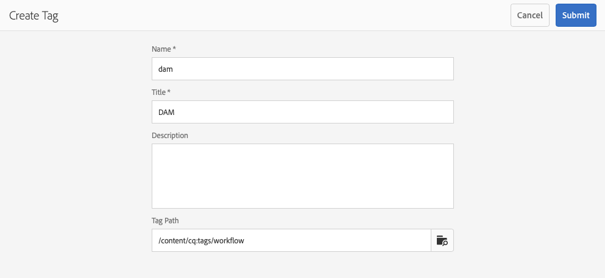

# Skapa arbetsflödesmodeller{#creating-workflow-models}

>[!CAUTION]
>
>Om du vill använda det klassiska användargränssnittet läser du [AEM 6.3-dokumentationen](https://helpx.adobe.com/experience-manager/6-3/sites-developing/workflows-models.html) .

Du skapar en [arbetsflödesmodell](/help/sites-developing/workflows.md#model) som definierar den serie steg som körs när en användare startar arbetsflödet. Du kan också definiera modellegenskaper, t.ex. om arbetsflödet är tillfälligt eller använder flera resurser.

När en användare startar ett arbetsflöde startas en instans; detta är motsvarande körningsmodell som skapas när du [synkroniserar](#sync-your-workflow-generate-a-runtime-model) dina ändringar.

## Skapa ett nytt arbetsflöde {#creating-a-new-workflow}

När du först skapar en ny arbetsflödesmodell innehåller den:

* Stegen **[!UICONTROL Flow Start]** och **[!UICONTROL Flow End]**.

   Dessa representerar början och slutet av arbetsflödet. Dessa steg är obligatoriska och kan inte redigeras eller tas bort.

* Ett exempel på **deltagarsteg** som heter **Steg 1**.

   Det här steget är konfigurerat för att tilldela en arbetsuppgift till arbetsflödesinitieraren. Redigera eller ta bort det här steget och lägg till steg efter behov.

Så här skapar du ett nytt arbetsflöde med redigeraren:

1. Öppna **[!UICONTROL Workflow Models]** konsolen, genom **[!UICONTROL Tools]**, **[!UICONTROL Workflow]** eller **[!UICONTROL Models]** t.ex.

   [http://localhost:4502/aem/workflow](http://localhost:4502/aem/workflow)

1. Välj **[!UICONTROL Create]** sedan **[!UICONTROL Create Model]**.
1. The **[!UICONTROL Add Workflow Model]** dialog box appears. Ange **[!UICONTROL Title]** och **[!UICONTROL Name]** (valfritt) innan du väljer **[!UICONTROL Done]**.
1. Den nya modellen visas i **[!UICONTROL Workflow Models]** konsolen.
1. Välj det nya arbetsflödet och använd det sedan [**[!UICONTROL Edit]** för att öppna det för konfiguration](#editing-a-workflow):

   

>[!NOTE]
>
>Om du skapar modeller programmatiskt (med ett crx-paket) kan du även skapa en undermapp i:
>
>`/var/workflow/models`
>
>Till exempel, `/var/workflow/models/prototypes`
>
>Den här mappen kan sedan användas för [att hantera åtkomst till modellerna i den mappen](/help/sites-administering/workflows-managing.md#create-a-subfolder-in-var-workflow-models-and-apply-the-acl-to-that).

## Redigera ett arbetsflöde {#editing-a-workflow}

Du kan redigera alla befintliga arbetsflödesmodeller till:

* [definiera steg](#adding-a-step-to-a-model) och deras [parametrar](#configuring-a-workflow-step)

* konfigurera arbetsflödesegenskaper, inklusive [faser](#configuring-workflow-stages-that-show-workflow-progress), [om arbetsflödet är tillfälligt](#creating-a-transient-workflow) och/eller [använder flera resurser](#configuring-a-workflow-for-multi-resource-support)

Om du redigerar ett [**standardarbetsflöde eller äldre **arbetsflöde](#editing-a-default-or-legacy-workflow-for-the-first-time)(ej ikryssat) får du ett steg till för att se till att en[säker kopia](/help/sites-developing/workflows-best-practices.md#locations-workflow-models)görs innan ändringarna görs.

När uppdateringarna av arbetsflödet är klara måste du använda **[!UICONTROL Sync]** för **[!UICONTROL Generate a Runtime Model]**. Mer information finns i [Synkronisera arbetsflödet](#sync-your-workflow-generate-a-runtime-model) .

### Synkronisera arbetsflödet - Skapa en körningsmodell {#sync-your-workflow-generate-a-runtime-model}

**Synkronisering** (direkt i redigeringsverktygsfältet) genererar en [körningsmodell](/help/sites-developing/workflows.md#runtime-model). Körningsmodellen är den modell som faktiskt används när en användare startar ett arbetsflöde. Om du inte gör **[!UICONTROL Sync]** ändringarna kommer ändringarna inte att vara tillgängliga vid körning.

När du (eller någon annan användare) gör några ändringar i arbetsflödet måste du använda **[!UICONTROL Sync]** för att generera en körningsmodell, även när enskilda dialogrutor (till exempel för steg) har egna sparalternativ.

När ändringarna synkroniseras med körningsmodellen (sparad) **[!UICONTROL Synched]** visas i stället.

Vissa steg har obligatoriska fält och/eller inbyggd validering. När dessa villkor inte är uppfyllda visas ett fel när du försöker **[!UICONTROL Sync]** modellen. Om ingen deltagare har definierats för ett **[!UICONTROL Participant]** steg:


### Redigera ett standardarbetsflöde eller äldre arbetsflöde för första gången {#editing-a-default-or-legacy-workflow-for-the-first-time}

När du öppnar en [standardmodell och/eller äldre modell](/help/sites-developing/workflows.md#workflow-types) för redigering:

* Webbläsaren är inte tillgänglig (vänster sida). **[!UICONTROL Steps]**
* Det finns en tillgänglig åtgärd i verktygsfältet (höger sida). **[!UICONTROL Edit]**
* Till att börja med visas modellen och dess egenskaper i skrivskyddat läge som:

   * Standardarbetsflöden finns i `/libs`
   * Äldre arbetsflöden finns i `/etc`

Markeringen **[!UICONTROL Edit]** kommer att:

* ta en kopia av arbetsflödet till `/conf`
* göra **[!UICONTROL Steps]** webbläsaren tillgänglig
* gör att du kan göra ändringar

>[!NOTE]
>
>Mer information finns [i Platser för arbetsflödesmodeller](/help/sites-developing/workflows-best-practices.md#locations-workflow-models) .


### Lägga till ett steg i en modell {#adding-a-step-to-a-model}

Du måste lägga till steg i modellen för att representera aktiviteten som ska utföras - varje steg utför en specifik aktivitet. Ett urval stegkomponenter är tillgängliga i en AEM.

När du redigerar en modell visas de tillgängliga stegen i de olika grupperna i **[!UICONTROL Steps]** webbläsaren. Till exempel:


>[!NOTE]
>
>Mer information om de komponenter i det primära steget som installeras med AEM finns i [Referens](/help/sites-developing/workflows-step-ref.md)för arbetsflödessteg.

**Så här lägger du till ett steg i en modell**:

1. Öppna en befintlig arbetsflödesmodell för redigering. Välj önskad modell i **[!UICONTROL Workflows Model]** konsolen och sedan **[!UICONTROL Edit]**.
1. Öppna **[!UICONTROL Steps]** webbläsaren, längst **[!UICONTROL Toggle Side Panel]** till vänster i det övre verktygsfältet. Här kan du:

   * **[!UICONTROL Filter]** för specifika steg.
   * Använd listruteväljaren för att begränsa markeringen till en viss grupp steg.
   * Välj ikonen Visa beskrivning (  ) om du vill visa mer information om det aktuella steget.

   

1. Dra lämpliga steg till önskad plats i modellen.

   Till exempel en **[!UICONTROL Participant Step]**.

   När det har lagts till i flödet kan du [konfigurera steget](#configuring-a-workflow-step).

   

1. Lägg till så många steg eller andra uppdateringar som behövs.

   Vid körning utförs stegen i den ordning som de visas i modellen. När du har lagt till stegkomponenter kan du dra dem till en annan plats i modellen.

   Du kan också kopiera, klippa ut, klistra in, gruppera eller ta bort befintliga steg; som med [sidredigeraren.](/help/sites-authoring/editing-content.md)

   Delade steg kan också komprimeras/expanderas med verktygsfältsalternativet: 

1. Bekräfta ändringarna med **[!UICONTROL Sync]** (redigeringsverktygsfältet) för att generera körningsmodellen.

   Mer information finns i [Synkronisera arbetsflödet](#sync-your-workflow-generate-a-runtime-model) .

### Konfigurera ett arbetsflödessteg {#configuring-a-workflow-step}

Du kan **konfigurera** och anpassa ett arbetsflödesstegs beteende med hjälp av **[!UICONTROL Step Properties]** dialogrutorna.

1. Så här öppnar du **[!UICONTROL Step Properties]** dialogrutan för ett steg:

   * Tryck på steget i arbetsflödesmodellen och välj **[!UICONTROL Configure]** i komponentverktygsfältet.
   * Dubbelklicka på steget.

   >[!NOTE]
   >
   >Information om de komponenter i det primära steget som installeras med AEM finns i [Referens](/help/sites-developing/workflows-step-ref.md)för arbetsflödessteg.

1. Konfigurera vid **[!UICONTROL Step Properties]** behov, Vilka egenskaper som är tillgängliga beror på stegtypen. Det kan också finnas flera tillgängliga flikar. Som standard **[!UICONTROL Participant Step]** visas i ett nytt arbetsflöde som `Step 1`:

   

1. Bekräfta uppdateringarna.
1. Bekräfta ändringarna med **[!UICONTROL Sync]** (redigeringsverktygsfältet) för att generera körningsmodellen.

   Mer information finns i [Synkronisera arbetsflödet](#sync-your-workflow-generate-a-runtime-model) .

### Skapa ett tillfälligt arbetsflöde {#creating-a-transient-workflow}

Du kan skapa en [tillfällig](/help/sites-developing/workflows.md#transient-workflows) arbetsflödesmodell när du skapar en ny modell, eller genom att redigera en befintlig:

1. Öppna arbetsflödesmodellen för [redigering](#editing-a-workflow).
1. Select **[!UICONTROL Workflow Model Properties]** from the toolbar.
1. Aktivera **[!UICONTROL Transient Workflow]** (eller inaktivera vid behov) i dialogrutan:

   

1. Bekräfta ändringen med **[!UICONTROL Save & Close]**; följt av **[!UICONTROL Sync]** (redigeringsverktygsfältet) för att generera körningsmodellen.

   Mer information finns i [Synkronisera arbetsflödet](#sync-your-workflow-generate-a-runtime-model) .

>[!NOTE]
>
>När du kör ett arbetsflöde i [tillfälligt](/help/sites-developing/workflows.md#transient-workflows) läge lagras ingen arbetsflödeshistorik i AEM. Därför visas ingen information om arbetsflödet i [tidslinjen](/help/sites-authoring/basic-handling.md#timeline) . [](/help/sites-authoring/basic-handling.md#timeline)

### Göra arbetsflödesmodeller tillgängliga i Touch UI {#make-workflow-models-available-in-touchui}

Om det finns en arbetsflödesmodell i det klassiska användargränssnittet, men den saknas på snabbmenyn för val i snabbmenyn för Touch-användargränssnittet, följer du konfigurationen för att göra den tillgänglig. **[!UICONTROL Timeline]** Följande steg visar hur du använder arbetsflödesmodellen **[!UICONTROL Request for Activation]**.

1. Bekräfta att modellen inte är tillgänglig i det beröringsaktiverade användargränssnittet. Få åtkomst till en resurs med `/assets.html/content/dam` sökväg. Välj en resurs. Öppna **[!UICONTROL Timeline]** i vänster räl. Klicka **[!UICONTROL Start Workflow]** och bekräfta att **[!UICONTROL Request for Activation]** modellen inte finns i popup-listan.

1. Navigera genom **[!UICONTROL Tools > General > Tagging]**. Välj **[!UICONTROL Workflow]**.

1. Välj **[!UICONTROL Create > Create Tag]**. Ange **[!UICONTROL Title]** som `DAM` och **[!UICONTROL Name]** som `dam`. Välj **[!UICONTROL Submit]**.
   

1. Navigera till **[!UICONTROL Tools > Workflow > Models]**. Markera **[!UICONTROL Request for Activation]** och markera sedan **[!UICONTROL Edit]**.

1. Välj **[!UICONTROL Edit]** och öppna sedan **[!UICONTROL Workflow Model Properties]**. Go to the **[!UICONTROL Basic]** tab.

1. Lägg till `Workflow : DAM` i **[!UICONTROL Tags]** fält. Bekräfta markeringen med bocken.

1. Bekräfta att taggen har lagts till med **[!UICONTROL Save & Close]**.
   

1. Slutför processen med **[!UICONTROL Sync]**. Arbetsflödet är nu tillgängligt i det Touch-aktiverade gränssnittet.

### Konfigurera ett arbetsflöde för stöd för flera resurser {#configuring-a-workflow-for-multi-resource-support}

Du kan konfigurera en arbetsflödesmodell för [Multi Resource Support](/help/sites-developing/workflows.md#multi-resource-support) när du skapar en ny modell, eller genom att redigera en befintlig:

1. Öppna arbetsflödesmodellen för [redigering](#editing-a-workflow).
1. Select **[!UICONTROL Workflow Model Properties]** from the toolbar.

1. Aktivera **[!UICONTROL Multi Resource Support]** (eller inaktivera vid behov) i dialogrutan:

   

1. Bekräfta ändringen med **[!UICONTROL Save & Close]**; följt av **[!UICONTROL Sync]** (redigeringsverktygsfältet) för att generera körningsmodellen.

   Mer information finns i [Synkronisera arbetsflödet](#sync-your-workflow-generate-a-runtime-model) .

### Konfigurera arbetsflödessteg (som visar förlopp för arbetsflöde) {#configuring-workflow-stages-that-show-workflow-progress}

[Arbetsflödesfaser](/help/sites-developing/workflows.md#workflow-stages) hjälper dig att visualisera förloppet för ett arbetsflöde när du hanterar uppgifter.

>[!CAUTION]
>
>Om arbetsflödesfaser definieras i **[!UICONTROL Page Properties]**, men inte används för något av arbetsflödesstegen, visas inga förlopp i förloppsindikatorn (oavsett aktuellt arbetsflödessteg).

De steg som ska vara tillgängliga definieras i arbetsflödesmodellerna. befintliga arbetsflödesmodeller kan uppdateras så att de innehåller scendefinitioner. Du kan definiera valfritt antal steg för arbetsflödesmodellen.

Så här definierar du **[!UICONTROL Stages]** arbetsflödet:

1. Öppna arbetsflödesmodellen för redigering.
1. Select **[!UICONTROL Workflow Model Properties]** from the toolbar. Öppna sedan **[!UICONTROL Stages]** fliken.
1. Lägg till (och placera) det du behöver **[!UICONTROL Stages]**. Du kan definiera valfritt antal steg för arbetsflödesmodellen.

   Till exempel:

   

1. Klicka **[!UICONTROL Save & Close]** för att spara egenskaperna.
1. Tilldela en fas till varje steg i arbetsflödesmodellen. Till exempel:

   

   En scen kan tilldelas till mer än ett steg. Till exempel:

   | **Steg** | **Scen** |
   |---|---|
   | Steg 1 | Skapa |
   | Steg 2 | Skapa |
   | Steg 3 | Granska |
   | Steg 4 | Godkänn |
   | Steg 5 | Godkänn |
   | Steg 6 | Slutförd |

1. Bekräfta ändringarna med **[!UICONTROL Sync]** (redigeringsverktygsfältet) för att generera körningsmodellen.

   Mer information finns i [Synkronisera arbetsflödet](#sync-your-workflow-generate-a-runtime-model) .

## Exportera en arbetsflödesmodell i ett paket {#exporting-a-workflow-model-in-a-package}

1. Skapa ett nytt paket med [Pakethanteraren](/help/sites-administering/package-manager.md#package-manager):

   1. Navigera till Package Manager via **[!UICONTROL Tools]**, **[!UICONTROL Deployment]**, **[!UICONTROL Packages]**.
   1. Klicka på **[!UICONTROL Create Package]**.
   1. Ange **[!UICONTROL Package Name]** och annan information efter behov.
   1. Klicka på **[!UICONTROL OK]**.

1. Klicka **[!UICONTROL Edit]** på verktygsfältet i det nya paketet.

1. Öppna **[!UICONTROL Filters]** fliken.

1. Markera **[!UICONTROL Add Filter]** och ange sökvägen till arbetsflödesmodellens *design*:

   `/conf/global/settings/workflow/models/<*your-model-name*>`

   Klicka på **[!UICONTROL Done]**.

1. Markera **[!UICONTROL Add Filter]** och ange sökvägen till arbetsflödesmodellen för *körning* :

   `/var/workflow/models/<*your-model-name*>`

   Klicka på **[!UICONTROL Done]**.

1. Lägg till ytterligare filter för anpassade skript som används av modellen.
1. Klicka **[!UICONTROL Save]** för att bekräfta filterdefinitionerna.
1. Välj **[!UICONTROL Build]** i verktygsfältet för paketdefinitionen.
1. Välj **[!UICONTROL Download]** i paketets verktygsfält.

## Använda arbetsflöden för att bearbeta inskickade formulär {#using-workflows-to-process-form-submissions}

Du kan konfigurera ett formulär som ska bearbetas av det valda arbetsflödet. När användare skickar formuläret skapas en ny arbetsflödesinstans med data från formuläröverföringen som nyttolast.

Så här konfigurerar du arbetsflödet som ska användas med formuläret:

1. Skapa en ny sida och öppna den för redigering.
1. Lägg till en **[!UICONTROL Form]** komponent på sidan.
1. Konfigurera **[!UICONTROL Form Start]** komponenten som visades på sidan.
1. Använd **[!UICONTROL Start Workflow]** för att välja önskat arbetsflöde bland de tillgängliga:

   

1. Bekräfta den nya formulärkonfigurationen med krysset.

## Testa arbetsflöden {#testing-workflows}

Det är en god vana att testa ett arbetsflöde för att använda olika typer av nyttolast. inklusive typer som skiljer sig från den för vilken den har utvecklats. Om du t.ex. vill att ditt arbetsflöde ska hantera resurser testar du det genom att ange en sida som nyttolast och se till att den inte orsakar fel.

Testa till exempel ditt nya arbetsflöde på följande sätt:

1. [Starta arbetsflödesmodellen](/help/sites-administering/workflows-starting.md) från konsolen.
1. Definiera **[!UICONTROL Payload]** och bekräfta.

1. Utför de åtgärder som behövs så att arbetsflödet fortsätter.
1. Övervaka loggfilerna medan arbetsflödet körs.

Du kan också konfigurera AEM så att **[!UICONTROL DEBUG]** meddelanden visas i loggfilerna. Mer information finns i [Loggning](/help/sites-deploying/configure-logging.md) . När utvecklingen är klar anger du **[!UICONTROL Log Level]** tillbaka till **[!UICONTROL Info]**.

## Exempel {#examples}

### Exempel: Skapa ett (enkelt) arbetsflöde för att acceptera eller avvisa en begäran om publicering {#example-creating-a-simple-workflow-to-accept-or-reject-a-request-for-publication}

För att illustrera några av möjligheterna att skapa ett arbetsflöde skapar följande exempel en variant av `Publish Example` arbetsflödet.

1. [Skapa en ny arbetsflödesmodell](#creating-a-new-workflow).

   Det nya arbetsflödet kommer att innehålla:

   * **[!UICONTROL Flow Start]**
   * `Step 1`
   * **[!UICONTROL Flow End]**

1. Ta bort `Step 1` (eftersom det är fel stegtyp för det här exemplet):

   * Klicka på steget och välj **[!UICONTROL Delete]** i komponentens verktygsfält. Bekräfta åtgärden.

1. Dra en fil från **[!UICONTROL Workflow]** webbläsaren till arbetsflödet **[!UICONTROL Participant Step]** och placera den mellan **[!UICONTROL Flow Start]** och **[!UICONTROL Flow End*]*.
1. Så här öppnar du egenskapsdialogrutan:

   * Klicka på deltagarsteget och välj **[!UICONTROL Configure]** i komponentens verktygsfält.
   * Dubbelklicka på deltagarsteget.

1. På **[!UICONTROL Common]** fliken anger du `Validate Content` för både **[!UICONTROL Title]** och **[!UICONTROL Description]**.
1. Öppna **[!UICONTROL User/Group]** fliken:

   * Aktivera **[!UICONTROL Notify user via email]**.
   * Välj `Administrator` ( `admin`) för **[!UICONTROL User/Group]** fältet.

   >[!NOTE]
   >
   >För att e-postmeddelanden ska kunna skickas måste [informationen för e-posttjänsten och användarkontot konfigureras](/help/sites-administering/notification.md).

1. Bekräfta uppdateringarna med en bock.

   Du återgår till översikten över arbetsflödesmodellen där deltagarsteget har bytt namn till `Validate Content`.

1. Dra en **[!UICONTROL Or Split]** till arbetsflödet och placera den mellan `Validate Content` och **[!UICONTROL Flow End]**.
1. Öppna **[!UICONTROL Or Split]** för konfiguration.
1. Konfigurera:

   * **[!UICONTROL Common]**: select **[!UICONTROL 2 Branches]**
   * **[!UICONTROL Branch 1]**: select **[!UICONTROL Default Route]**.
   * **[!UICONTROL Branch 2]**: kontrollera att **[!UICONTROL Default Route]** inte är markerat.

1. Bekräfta uppdateringarna av **[!UICONTROL OR Split]**.
1. Dra en linje **[!UICONTROL Participant Step]** till den vänstra grenen, öppna egenskaperna, ange följande värden och bekräfta sedan ändringarna:

   * **[!UICONTROL Title]**: `Reject Publish Request`
   * **[!UICONTROL User/Group]**: till exempel `projects-administrators`
   * **[!UICONTROL Notify user via email]**: Aktivera om du vill att användaren ska meddelas via e-post.

1. Dra en linje **[!UICONTROL Process Step]** till den högra grenen, öppna egenskaperna, ange följande värden och bekräfta sedan ändringarna:

   * **[!UICONTROL Title]**: `Publish Page as Requested`
   * **[!UICONTROL Process]**: select `Activate Page`. Den här processen publicerar den valda sidan till utgivarinstanserna.

1. Klicka **[!UICONTROL Sync]** (redigeringsverktygsfältet) för att generera körningsmodellen.

   Mer information finns i [Synkronisera arbetsflödet](#sync-your-workflow-generate-a-runtime-model) .

   Den nya arbetsflödesmodellen ser ut så här:

   

1. Använd det här arbetsflödet på sidan så att användaren kan välja om han/hon vill **[!UICONTROL Complete]** eller **[!UICONTROL Validate Content]** när han/hon går vidare till **[!UICONTROL Publish Page as Requested]****[!UICONTROL Reject Publish Request]** steget.

   

### Exempel: Definiera en regel för en OR-delning {#example-defining-a-rule-for-an-or-split}

**[!UICONTROL OR Split]** kan du använda villkorsstyrda bearbetningssökvägar i arbetsflödet.

Så här definierar du en OR-regel:

1. Skapa två skript och spara dem i databasen, till exempel under:

   `/apps/myapp/workflow/scripts`

   >[!NOTE]
   >
   >Skripten måste ha en [funktion `check()`](#function-check) som returnerar ett booleskt värde.

1. Redigera arbetsflödet och lägg till det **[!UICONTROL OR Split]** i modellen.
1. Redigera egenskaperna för **[!UICONTROL Branch 1]** i **[!UICONTROL OR Split]**:

   * Definiera detta som **[!UICONTROL Default Route]** genom att ställa in **[!UICONTROL Value]** på `true`.
   * Ange sökvägen **[!UICONTROL Rule]** till skriptet. Till exempel:

      `/apps/myapp/workflow/scripts/myscript1.ecma`
   >[!NOTE]
   >
   >Du kan ändra grenordningen om det behövs.

1. Redigera egenskaperna för **[!UICONTROL Branch 2]** delen av **[!UICONTROL OR Split]**.

   * Som **[!UICONTROL Rule]** anger du sökvägen till det andra skriptet. Till exempel:

      `/apps/myapp/workflow/scripts/myscript2.ecma`

1. Ange egenskaperna för de enskilda stegen i varje gren. Kontrollera att **[!UICONTROL User/Group]** inställningen är inställd.
1. Klicka på **Synkronisera** (redigeringsverktygsfältet) för att behålla ändringarna i körningsmodellen.

   Mer information finns i [Synkronisera arbetsflödet](#sync-your-workflow-generate-a-runtime-model) .

#### Funktionskontroll() {#function-check}

>[!NOTE]
>
>Se [Använda ECMAScript](/help/sites-developing/workflows-customizing-extending.md#using-ecmascript).

Följande exempelskript returnerar `true` om noden finns `JCR_PATH` under `/content/we-retail/us/en`:

```
function check() {
    if (workflowData.getPayloadType() == "JCR_PATH") {
      var path = workflowData.getPayload().toString();
      var node = jcrSession.getItem(path);

      if (node.getPath().indexOf("/content/we-retail/us/en") >= 0) {
       return true;
      } else {
       return false;
      } 
     } else {
      return false;
     }
}
```

### Exempel: Anpassad aktiveringsbegäran {#example-customized-request-for-activation}

Du kan anpassa alla färdiga arbetsflöden. Om du vill ha ett anpassat beteende lägger du över information om rätt arbetsflöde.

Till exempel, **[!UICONTROL Request for Activation]**. Det här arbetsflödet används för att publicera sidor inom **[!UICONTROL Sites]** och aktiveras automatiskt när en innehållsförfattare inte har rätt replikeringsbehörighet. Mer information finns i [Anpassa sidredigering - Anpassa arbetsflödet](/help/sites-developing/customizing-page-authoring-touch.md#customizing-the-request-for-activation-workflow) för begäran om aktivering.
