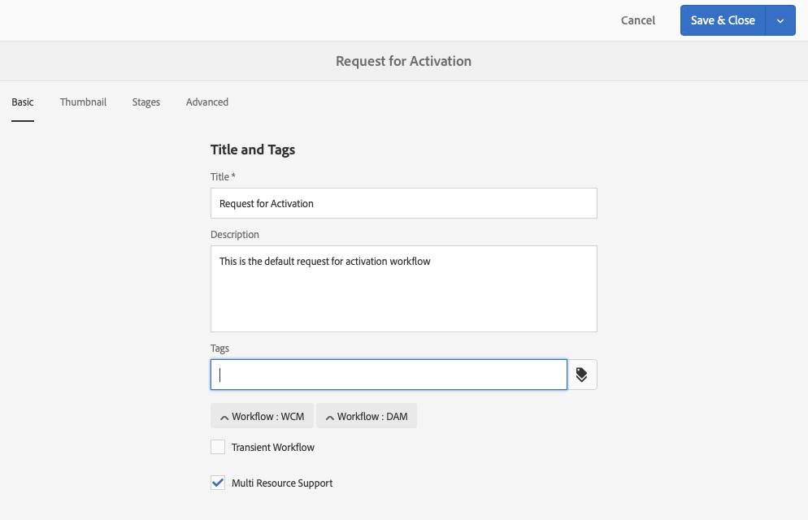

# Skapa arbetsflödesmodeller{#creating-workflow-models}

>[!CAUTION]
>
>AEM 6.4 har nått slutet på den utökade supporten och denna dokumentation är inte längre uppdaterad. Mer information finns i [teknisk supportperiod](https://helpx.adobe.com/support/programs/eol-matrix.html). Hitta de versioner som stöds [här](https://experienceleague.adobe.com/docs/).

>[!CAUTION]
>
>Om du vill använda det klassiska användargränssnittet läser du [AEM 6.3-dokumentation](https://helpx.adobe.com/experience-manager/6-3/sites-developing/workflows-models.html) för referens.

Du skapar en [arbetsflödesmodell](/help/sites-developing/workflows.md#model) för att definiera serie steg som körs när en användare startar arbetsflödet. Du kan också definiera modellegenskaper, t.ex. om arbetsflödet är tillfälligt eller använder flera resurser.

När en användare startar ett arbetsflöde startas en instans; detta är motsvarande körningsmodell som skapades när du [Synkronisera](#sync-your-workflow-generate-a-runtime-model) dina ändringar.

## Skapa ett nytt arbetsflöde {#creating-a-new-workflow}

När du först skapar en ny arbetsflödesmodell innehåller den:

* Stegen, **[!UICONTROL Flow Start]** och **[!UICONTROL Flow End]**.

   Dessa representerar början och slutet av arbetsflödet. Dessa steg är obligatoriska och kan inte redigeras eller tas bort.

* Ett exempel **Deltagare** step named **Steg 1**.

   Det här steget är konfigurerat för att tilldela en arbetsuppgift till arbetsflödesinitieraren. Redigera eller ta bort det här steget och lägg till steg efter behov.

Så här skapar du ett nytt arbetsflöde med redigeraren:

1. Öppna **[!UICONTROL Workflow Models]** konsol, genom **[!UICONTROL Tools]**, **[!UICONTROL Workflow]**, **[!UICONTROL Models]** eller, till exempel:

   [http://localhost:4502/aem/workflow](http://localhost:4502/aem/workflow)

1. Välj **[!UICONTROL Create]** sedan **[!UICONTROL Create Model]**.
1. The **[!UICONTROL Add Workflow Model]** visas. Ange **[!UICONTROL Title]** och **[!UICONTROL Name]** (valfritt) före markering **[!UICONTROL Done]**.
1. Den nya modellen listas i **[!UICONTROL Workflow Models]** konsol.
1. Välj ditt nya arbetsflöde och använd sedan [**[!UICONTROL Edit]**för att öppna den för konfiguration](#editing-a-workflow):

   

>[!NOTE]
>
>Om du skapar modeller programmatiskt (med ett crx-paket) kan du även skapa en undermapp i:
>
>`/var/workflow/models`
>
>Till exempel, `/var/workflow/models/prototypes`
>
>Den här mappen kan sedan användas för [hantera åtkomst till modellerna i den mappen](/help/sites-administering/workflows-managing.md#create-a-subfolder-in-var-workflow-models-and-apply-the-acl-to-that).

## Redigera ett arbetsflöde {#editing-a-workflow}

Du kan redigera alla befintliga arbetsflödesmodeller till:

* [definiera steg](#adding-a-step-to-a-model) och [parameters](#configuring-a-workflow-step)

* konfigurera arbetsflödesegenskaper, inklusive [faser](#configuring-workflow-stages-that-show-workflow-progress), [om arbetsflödet är tillfälligt](#creating-a-transient-workflow) och/eller [använder flera resurser](#configuring-a-workflow-for-multi-resource-support)

Redigera en [**Standard eller äldre** arbetsflöde](#editing-a-default-or-legacy-workflow-for-the-first-time) har ytterligare ett steg för att säkerställa att [säker kopia](/help/sites-developing/workflows-best-practices.md#locations-workflow-models) tas innan ändringarna görs.

När uppdateringarna av arbetsflödet är klara måste du använda **[!UICONTROL Sync]** till **[!UICONTROL Generate a Runtime Model]**. Se [Synkronisera arbetsflödet](#sync-your-workflow-generate-a-runtime-model) för mer information.

### Synkronisera arbetsflödet - Skapa en körningsmodell {#sync-your-workflow-generate-a-runtime-model}

**Synkronisera** (direkt i redigeringsverktygsfältet) genererar ett [körningsmodell](/help/sites-developing/workflows.md#runtime-model). Körningsmodellen är den modell som faktiskt används när en användare startar ett arbetsflöde. Om du inte gör det **[!UICONTROL Sync]** Om du ändrar något kommer ändringarna inte att vara tillgängliga vid körning.

När du (eller någon annan användare) gör ändringar i arbetsflödet måste du använda **[!UICONTROL Sync]** för att generera en körningsmodell - även när enskilda dialogrutor (till exempel för steg) har egna sparalternativ.

När ändringarna synkroniseras med körningsmodellen (sparad), **[!UICONTROL Synched]** visas i stället.

Vissa steg har obligatoriska fält och/eller inbyggd validering. När dessa villkor inte uppfylls visas ett fel när du försöker **[!UICONTROL Sync]** modellen. Om till exempel ingen deltagare har definierats för en **[!UICONTROL Participant]** steg:


### Redigera ett standardarbetsflöde eller äldre arbetsflöde för första gången {#editing-a-default-or-legacy-workflow-for-the-first-time}

När du öppnar en [Standardmodell och/eller äldre modell](/help/sites-developing/workflows.md#workflow-types) för redigering:

* The **[!UICONTROL Steps]** webbläsaren är inte tillgänglig (vänster sida).
* Det finns en **[!UICONTROL Edit]** åtgärd som finns i verktygsfältet (höger sida).
* Till att börja med visas modellen och dess egenskaper i skrivskyddat läge som:

   * Standardarbetsflöden finns i `/libs`
   * Äldre arbetsflöden finns i `/etc`

Markera **[!UICONTROL Edit]** kommer att:

* ta en kopia av arbetsflödet till `/conf`
* skapa **[!UICONTROL Steps]** webbläsare tillgänglig
* gör att du kan göra ändringar

>[!NOTE]
>
>Se [Platser för arbetsflödesmodeller](/help/sites-developing/workflows-best-practices.md#locations-workflow-models) för ytterligare information.


### Lägga till ett steg i en modell {#adding-a-step-to-a-model}

Du måste lägga till steg i modellen för att representera aktiviteten som ska utföras - varje steg utför en specifik aktivitet. Ett urval stegkomponenter är tillgängliga i en AEM.

När du redigerar en modell visas de tillgängliga stegen i de olika grupperna i **[!UICONTROL Steps]** webbläsare. Till exempel:


>[!NOTE]
>
>Mer information om de komponenter i det primära steget som installeras med AEM finns i [Referens för arbetsflödessteg](/help/sites-developing/workflows-step-ref.md).

**Lägga till ett steg i en modell**:

1. Öppna en befintlig arbetsflödesmodell för redigering. Från **[!UICONTROL Workflows Model]** väljer du önskad modell och sedan **[!UICONTROL Edit]**.
1. Öppna **[!UICONTROL Steps]** webbläsare, använda **[!UICONTROL Toggle Side Panel]**, längst till vänster i det övre verktygsfältet. Här kan du:

   * **[!UICONTROL Filter]** för specifika steg.
   * Använd listruteväljaren för att begränsa markeringen till en viss grupp steg.
   * Välj ikonen Visa beskrivning  om du vill visa mer information om rätt steg.

   

1. Dra lämpliga steg till önskad plats i modellen.

   Till exempel en **[!UICONTROL Participant Step]**.

   När den har lagts till i flödet kan du [konfigurera steget](#configuring-a-workflow-step).

   

1. Lägg till så många steg eller andra uppdateringar som behövs.

   Vid körning utförs stegen i den ordning som de visas i modellen. När du har lagt till stegkomponenter kan du dra dem till en annan plats i modellen.

   Du kan också kopiera, klippa ut, klistra in, gruppera eller ta bort befintliga steg; som med [sidredigeraren.](/help/sites-authoring/editing-content.md)

   Delade steg kan också komprimeras/expanderas med verktygsfältsalternativet: 

1. Bekräfta ändringarna med **[!UICONTROL Sync]** (redigeringsverktygsfältet) för att generera körningsmodellen.

   Se [Synkronisera arbetsflödet](#sync-your-workflow-generate-a-runtime-model) för mer information.

### Konfigurera ett arbetsflödessteg {#configuring-a-workflow-step}

Du kan **Konfigurera** och anpassa ett arbetsflödesstegs beteende med **[!UICONTROL Step Properties]** dialogrutor.

1. Öppna **[!UICONTROL Step Properties]** för ett steg:

   * Tryck på steget i arbetsflödesmodellen och välj **[!UICONTROL Configure]** i komponentens verktygsfält.
   * Dubbelklicka på steget.

   >[!NOTE]
   >
   >Mer information om de komponenter i det primära steget som installeras med AEM finns i [Referens för arbetsflödessteg](/help/sites-developing/workflows-step-ref.md).

1. Konfigurera **[!UICONTROL Step Properties]** vid behov, Vilka egenskaper som är tillgängliga beror på stegtypen. Det kan också finnas flera tillgängliga flikar. Som standard **[!UICONTROL Participant Step]**, visas i ett nytt arbetsflöde som `Step 1`:

   

1. Bekräfta uppdateringarna.
1. Bekräfta ändringarna med **[!UICONTROL Sync]** (redigeringsverktygsfältet) för att generera körningsmodellen.

   Se [Synkronisera arbetsflödet](#sync-your-workflow-generate-a-runtime-model) för mer information.

### Skapa ett tillfälligt arbetsflöde {#creating-a-transient-workflow}

Du kan skapa en [Övergående](/help/sites-developing/workflows.md#transient-workflows) arbetsflödesmodell när du skapar en ny modell eller redigerar en befintlig:

1. Öppna arbetsflödesmodellen för [redigera](#editing-a-workflow).
1. Välj **[!UICONTROL Workflow Model Properties]** i verktygsfältet.
1. Aktivera i dialogrutan **[!UICONTROL Transient Workflow]** (eller inaktivera vid behov):

   

1. Bekräfta ändringen med **[!UICONTROL Save & Close]**; följt av **[!UICONTROL Sync]** (redigeringsverktygsfältet) för att generera körningsmodellen.

   Se [Synkronisera arbetsflödet](#sync-your-workflow-generate-a-runtime-model) för mer information.

>[!NOTE]
>
>När du kör ett arbetsflöde i [övergående](/help/sites-developing/workflows.md#transient-workflows) AEM lagrar ingen arbetsflödeshistorik. Därför [Tidslinje](/help/sites-authoring/basic-handling.md#timeline) visar inte någon information om det arbetsflödet. [](/help/sites-authoring/basic-handling.md#timeline)

### Göra arbetsflödesmodeller tillgängliga i Touch UI {#make-workflow-models-available-in-touchui}

Om det finns en arbetsflödesmodell i det klassiska användargränssnittet, men den saknas på snabbmenyn för val i **[!UICONTROL Timeline]** pekskärmsgränssnittet och följ sedan konfigurationen för att göra det tillgängligt. Följande steg visar hur du använder arbetsflödesmodellen med namnet **[!UICONTROL Request for Activation]**.

1. Bekräfta att modellen inte är tillgänglig i det beröringsaktiverade användargränssnittet. Åtkomst till en resurs med `/assets.html/content/dam` bana. Välj en resurs. Öppna **[!UICONTROL Timeline]** i vänster räl. Klicka **[!UICONTROL Start Workflow]** och bekräfta att **[!UICONTROL Request for Activation]** Modellen finns inte i popup-listan.

1. Navigera genom **[!UICONTROL Tools > General > Tagging]**. Välj **[!UICONTROL Workflow]**.

1. Välj **[!UICONTROL Create > Create Tag]**. Ange **[!UICONTROL Title]** as `DAM` och **[!UICONTROL Name]** as `dam`. Välj **[!UICONTROL Submit]**.
   

1. Navigera till **[!UICONTROL Tools > Workflow > Models]**. Välj **[!UICONTROL Request for Activation]** väljer **[!UICONTROL Edit]**.

1. Välj **[!UICONTROL Edit]** öppna **[!UICONTROL Workflow Model Properties]**. Gå till **[!UICONTROL Basic]** -fliken.

1. Lägg till `Workflow : DAM` till **[!UICONTROL Tags]** fält. Bekräfta markeringen med bocken.

1. Bekräfta tillägget av taggen med **[!UICONTROL Save & Close]**.
   

1. Slutför processen med **[!UICONTROL Sync]**. Arbetsflödet är nu tillgängligt i det Touch-aktiverade gränssnittet.

### Konfigurera ett arbetsflöde för stöd för flera resurser {#configuring-a-workflow-for-multi-resource-support}

Du kan konfigurera en arbetsflödesmodell för [Stöd för flera resurser](/help/sites-developing/workflows.md#multi-resource-support) när du skapar en ny modell eller redigerar en befintlig:

1. Öppna arbetsflödesmodellen för [redigera](#editing-a-workflow).
1. Välj **[!UICONTROL Workflow Model Properties]** i verktygsfältet.

1. Aktivera i dialogrutan **[!UICONTROL Multi Resource Support]** (eller inaktivera vid behov):

   

1. Bekräfta ändringen med **[!UICONTROL Save & Close]**; följt av **[!UICONTROL Sync]** (redigeringsverktygsfältet) för att generera körningsmodellen.

   Se [Synkronisera arbetsflödet](#sync-your-workflow-generate-a-runtime-model) för mer information.

### Konfigurera arbetsflödessteg (som visar förlopp för arbetsflöde) {#configuring-workflow-stages-that-show-workflow-progress}

[Arbetsflödessteg](/help/sites-developing/workflows.md#workflow-stages) hjälper dig att visualisera förloppet för ett arbetsflöde när du hanterar uppgifter.

>[!CAUTION]
>
>Om arbetsflödesfaser definieras i **[!UICONTROL Page Properties]** men inte för något av arbetsflödesstegen kommer förloppsindikatorn inte att visa några förlopp (oavsett aktuellt arbetsflödessteg).

De steg som ska vara tillgängliga definieras i arbetsflödesmodellerna. befintliga arbetsflödesmodeller kan uppdateras så att de innehåller scendefinitioner. Du kan definiera valfritt antal steg för arbetsflödesmodellen.

Definiera **[!UICONTROL Stages]** för ditt arbetsflöde:

1. Öppna arbetsflödesmodellen för redigering.
1. Välj **[!UICONTROL Workflow Model Properties]** i verktygsfältet. Öppna sedan **[!UICONTROL Stages]** -fliken.
1. Lägg till (och positionera) det du behöver **[!UICONTROL Stages]**. Du kan definiera valfritt antal steg för arbetsflödesmodellen.

   Till exempel:

   

1. Klicka **[!UICONTROL Save & Close]** för att spara egenskaperna.
1. Tilldela en fas till varje steg i arbetsflödesmodellen. Till exempel:

   

   En scen kan tilldelas till mer än ett steg. Till exempel:

   | **Steg** | **Scen** |
   |---|---|
   | Steg 1 | Skapa |
   | Steg 2 | Skapa |
   | Steg 3 | Granska |
   | Steg 4 | Godkänn |
   | Steg 5 | Godkänn |
   | Steg 6 | Slutförd |

1. Bekräfta ändringarna med **[!UICONTROL Sync]** (redigeringsverktygsfältet) för att generera körningsmodellen.

   Se [Synkronisera arbetsflödet](#sync-your-workflow-generate-a-runtime-model) för mer information.

## Exportera en arbetsflödesmodell i ett paket {#exporting-a-workflow-model-in-a-package}

1. Skapa ett nytt paket med [Pakethanteraren](/help/sites-administering/package-manager.md#package-manager):

   1. Navigera till Package Manager via **[!UICONTROL Tools]**, **[!UICONTROL Deployment]**, **[!UICONTROL Packages]**.
   1. Klicka på **[!UICONTROL Create Package]**.
   1. Ange **[!UICONTROL Package Name]** och annan information efter behov.
   1. Klicka på **[!UICONTROL OK]**.

1. Klicka **[!UICONTROL Edit]** i verktygsfältet i det nya paketet.

1. Öppna **[!UICONTROL Filters]** -fliken.

1. Välj **[!UICONTROL Add Filter]** och ange sökvägen till arbetsflödesmodellen *design*:

   `/conf/global/settings/workflow/models/<*your-model-name*>`

   Klicka på **[!UICONTROL Done]**.

1. Välj **[!UICONTROL Add Filter]** och ange sökvägen till *runtime* arbetsflödesmodell:

   `/var/workflow/models/<*your-model-name*>`

   Klicka på **[!UICONTROL Done]**.

1. Lägg till ytterligare filter för anpassade skript som används av modellen.
1. Klicka **[!UICONTROL Save]** för att bekräfta filterdefinitionerna.
1. Välj **[!UICONTROL Build]** i verktygsfältet i paketdefinitionen.
1. Välj **[!UICONTROL Download]** i paketets verktygsfält.

## Använda arbetsflöden för att bearbeta inskickade formulär {#using-workflows-to-process-form-submissions}

Du kan konfigurera ett formulär som ska bearbetas av det valda arbetsflödet. När användare skickar formuläret skapas en ny arbetsflödesinstans med data från formuläröverföringen som nyttolast.

Så här konfigurerar du arbetsflödet som ska användas med formuläret:

1. Skapa en ny sida och öppna den för redigering.
1. Lägg till en **[!UICONTROL Form]** till sidan.
1. Konfigurera **[!UICONTROL Form Start]** -komponent som visades på sidan.
1. Använd **[!UICONTROL Start Workflow]** för att välja önskat arbetsflöde bland de tillgängliga:

   

1. Bekräfta den nya formulärkonfigurationen med krysset.

## Testa arbetsflöden {#testing-workflows}

Det är en god vana att testa ett arbetsflöde för att använda olika typer av nyttolast. inklusive typer som skiljer sig från den för vilken den har utvecklats. Om du t.ex. vill att ditt arbetsflöde ska hantera resurser testar du det genom att ange en sida som nyttolast och se till att den inte orsakar fel.

Testa till exempel ditt nya arbetsflöde på följande sätt:

1. [Starta arbetsflödesmodellen](/help/sites-administering/workflows-starting.md) från konsolen.
1. Definiera **[!UICONTROL Payload]** och bekräfta.

1. Utför de åtgärder som behövs så att arbetsflödet fortsätter.
1. Övervaka loggfilerna medan arbetsflödet körs.

Du kan även konfigurera AEM att visa **[!UICONTROL DEBUG]** meddelanden i loggfilerna. Se [Loggning](/help/sites-deploying/configure-logging.md) för mer information och när utvecklingen är klar, ange **[!UICONTROL Log Level]** tillbaka till **[!UICONTROL Info]**.

## Exempel {#examples}

### Exempel: Skapa ett (enkelt) arbetsflöde för att acceptera eller avvisa en begäran om publicering {#example-creating-a-simple-workflow-to-accept-or-reject-a-request-for-publication}

För att illustrera några av möjligheterna att skapa ett arbetsflöde skapar följande exempel en variant av `Publish Example` arbetsflöde.

1. [Skapa en ny arbetsflödesmodell](#creating-a-new-workflow).

   Det nya arbetsflödet kommer att innehålla:

   * **[!UICONTROL Flow Start]**
   * `Step 1`
   * **[!UICONTROL Flow End]**

1. Ta bort `Step 1` (eftersom det är fel stegtyp för det här exemplet):

   * Klicka på steget och välj **[!UICONTROL Delete]** i komponentens verktygsfält. Bekräfta åtgärden.

1. Från **[!UICONTROL Workflow]** välj stegwebbläsare, dra en **[!UICONTROL Participant Step]** till arbetsflödet och placera det mellan **[!UICONTROL Flow Start]** och **[!UICONTROL Flow End*]*.
1. Så här öppnar du egenskapsdialogrutan:

   * Klicka på deltagarsteget och välj **[!UICONTROL Configure]** i komponentens verktygsfält.
   * Dubbelklicka på deltagarsteget.

1. I **[!UICONTROL Common]** tabbtangenter `Validate Content` för båda **[!UICONTROL Title]** och **[!UICONTROL Description]**.
1. Öppna **[!UICONTROL User/Group]** tab:

   * Aktivera **[!UICONTROL Notify user via email]**.
   * Välj `Administrator` ( `admin`) för **[!UICONTROL User/Group]** fält.

   >[!NOTE]
   >
   >För att mejl ska skickas [e-posttjänsten och användarkontoinformationen måste konfigureras](/help/sites-administering/notification.md).

1. Bekräfta uppdateringarna med en bock.

   Du kommer tillbaka till översikten över arbetsflödesmodellen där deltagarsteget har bytt namn till `Validate Content`.

1. Dra en **[!UICONTROL Or Split]** till arbetsflödet och placera det mellan `Validate Content` och **[!UICONTROL Flow End]**.
1. Öppna **[!UICONTROL Or Split]** för konfiguration.
1. Konfigurera:

   * **[!UICONTROL Common]**: välj **[!UICONTROL 2 Branches]**
   * **[!UICONTROL Branch 1]**: välj **[!UICONTROL Default Route]**.
   * **[!UICONTROL Branch 2]**: säkerställa **[!UICONTROL Default Route]** är inte markerat.

1. Bekräfta dina uppdateringar av **[!UICONTROL OR Split]**.
1. Dra en **[!UICONTROL Participant Step]** till den vänstra grenen öppnar du egenskaperna, anger följande värden och bekräftar sedan ändringarna:

   * **[!UICONTROL Title]**: `Reject Publish Request`
   * **[!UICONTROL User/Group]**: till exempel `projects-administrators`
   * **[!UICONTROL Notify user via email]**: Aktivera om du vill att användaren ska meddelas via e-post.

1. Dra en **[!UICONTROL Process Step]** till höger gren öppnar du egenskaperna, anger följande värden och bekräftar sedan ändringarna:

   * **[!UICONTROL Title]**: `Publish Page as Requested`
   * **[!UICONTROL Process]**: välj `Activate Page`. Den här processen publicerar den valda sidan till utgivarinstanserna.

1. Klicka **[!UICONTROL Sync]** (redigeringsverktygsfältet) för att generera körningsmodellen.

   Se [Synkronisera arbetsflödet](#sync-your-workflow-generate-a-runtime-model) för mer information.

   Den nya arbetsflödesmodellen ser ut så här:

   

1. Använd det här arbetsflödet på sidan så att när användaren flyttar till **[!UICONTROL Complete]** den **[!UICONTROL Validate Content]** kan de välja om de vill **[!UICONTROL Publish Page as Requested]**, eller **[!UICONTROL Reject Publish Request]**.

   

### Exempel: Definiera en regel för en OR-delning {#example-defining-a-rule-for-an-or-split}

**[!UICONTROL OR Split]** kan du använda villkorsstyrda bearbetningssökvägar i arbetsflödet.

Så här definierar du en OR-regel:

1. Skapa två skript och spara dem i databasen, till exempel under:

   `/apps/myapp/workflow/scripts`

   >[!NOTE]
   >
   >Skripten måste ha en [function `check()`](#function-check) som returnerar ett booleskt värde.

1. Redigera arbetsflödet och lägg till **[!UICONTROL OR Split]** till modellen.
1. Redigera egenskaperna för **[!UICONTROL Branch 1]** i **[!UICONTROL OR Split]**:

   * Definiera det här som **[!UICONTROL Default Route]** genom att ange **[!UICONTROL Value]** till `true`.
   * Som **[!UICONTROL Rule]**, anger sökvägen till skriptet. Till exempel:

      `/apps/myapp/workflow/scripts/myscript1.ecma`
   >[!NOTE]
   >
   >Du kan ändra grenordningen om det behövs.

1. Redigera egenskaperna för **[!UICONTROL Branch 2]** i **[!UICONTROL OR Split]**.

   * Som **[!UICONTROL Rule]** anger du sökvägen till det andra skriptet. Till exempel:

      `/apps/myapp/workflow/scripts/myscript2.ecma`

1. Ange egenskaperna för de enskilda stegen i varje gren. Se till att **[!UICONTROL User/Group]** är inställt.
1. Klicka **Synkronisera** (redigeringsverktygsfältet) för att behålla ändringarna i körningsmodellen.

   Se [Synkronisera arbetsflödet](#sync-your-workflow-generate-a-runtime-model) för mer information.

#### Funktionskontroll() {#function-check}

>[!NOTE]
>
>Se [Använda ECMAScript](/help/sites-developing/workflows-customizing-extending.md#using-ecmascript).

Följande exempelskript returnerar `true` om noden är en `JCR_PATH` finns under `/content/we-retail/us/en`:

```
function check() {
    if (workflowData.getPayloadType() == "JCR_PATH") {
      var path = workflowData.getPayload().toString();
      var node = jcrSession.getItem(path);

      if (node.getPath().indexOf("/content/we-retail/us/en") >= 0) {
       return true;
      } else {
       return false;
      } 
     } else {
      return false;
     }
}
```

### Exempel: Anpassad aktiveringsbegäran {#example-customized-request-for-activation}

Du kan anpassa alla färdiga arbetsflöden. Om du vill ha ett anpassat beteende lägger du över information om rätt arbetsflöde.

Till exempel, **[!UICONTROL Request for Activation]**. Det här arbetsflödet används för att publicera sidor i **[!UICONTROL Sites]** och aktiveras automatiskt när en innehållsförfattare inte har rätt replikeringsbehörighet. Se [Anpassa sidredigering - Anpassa arbetsflödet för begäran om aktivering](/help/sites-developing/customizing-page-authoring-touch.md#customizing-the-request-for-activation-workflow) för mer information.
