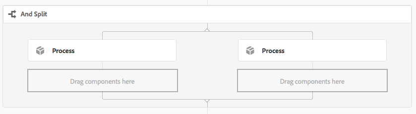

# Referens för arbetsflödessteg{#workflow-step-reference}

Arbetsflödesmodeller består av en serie steg av olika typer. Beroende på typ kan dessa steg konfigureras och utökas med parametrar och skript för att ge den funktionalitet och kontroll som du behöver.

>[!NOTE]
>
>I det här avsnittet beskrivs de vanliga arbetsflödesstegen.
>
>För modulspecifika steg, se även:
>
>* [AEM Forms Workflow Step Reference](/help/forms/using/aem-forms-workflow-step-reference.md)
>* [Bearbeta resurser med mediehanterare och arbetsflöden](/help/assets/media-handlers.md)

>


## Stegegenskaper {#step-properties}

Varje stegkomponent har en **[!UICONTROL Step Properties]**-dialogruta där du kan definiera och redigera nödvändiga egenskaper.

### Stegegenskaper - fliken Allmänt {#step-properties-common-tab}

En kombination av följande egenskaper är tillgängliga för de flesta arbetsflödesstegkomponenter på fliken **[!UICONTROL Common]** i dialogrutan Egenskaper:

* **[!UICONTROL Title]**

   Stegets titel.

* **[!UICONTROL Description]**

   En beskrivning av steget.

* **[!UICONTROL Workflow Stage]**

   En nedrullningsbar väljare som använder en [scen](/help/sites-developing/workflows.md#workflow-stages) på steget.

* **[!UICONTROL Timeout]**

   Den period efter vilken steget&quot;har gått ut&quot;.

   Du kan välja mellan: **[!UICONTROL Off]**, **[!UICONTROL Immediate]**, **[!UICONTROL 1h]**, **[!UICONTROL 6h]**, **[!UICONTROL 12h]**, **[!UICONTROL 24h]**.

* **[!UICONTROL Timeout Handler]**

   Den hanterare som ska styra arbetsflödet när steget går ut; till exempel:

   `Auto Advancer`

* **[!UICONTROL Handler Advance]**

   Välj det här alternativet om du vill att arbetsflödet automatiskt ska gå vidare till nästa steg efter körningen. Om du inte väljer det här alternativet måste implementeringsskriptet hantera arbetsflödets utveckling.

#### Stegegenskaper - fliken Användare/grupp {#step-properties-user-group-tab}

Följande egenskaper är tillgängliga för många arbetsflödesstegkomponenter på fliken **[!UICONTROL User/Group]** i egenskapsdialogrutan:

* **[!UICONTROL Notify user via email]**

   * Du kan meddela deltagare genom att skicka ett e-postmeddelande när arbetsflödet når steget.
   * Om det här alternativet är aktiverat skickas ett e-postmeddelande till användaren som definieras av egenskapen **[!UICONTROL User/Group]** eller till varje medlem i gruppen om en grupp har definierats.

* **[!UICONTROL User/Group]**

   * I en listruta kan du navigera och välja en användare eller grupp.
   * Om du tilldelar ett steg till en viss användare kan bara den här användaren utföra en åtgärd på steget.
   * Om du tilldelar steget till en hel grupp kommer alla användare i gruppen att få åtgärden i sin **[!UICONTROL Workflow Inbox]** när arbetsflödet når det här steget.
   * Mer information finns i [Delta i arbetsflöden](/help/sites-authoring/workflows-participating.md).

## OCH dela {#and-split}

**[!UICONTROL AND Split]** skapar en delning i arbetsflödet, varefter båda grenarna blir aktiva. Du kan lägga till arbetsflödessteg i varje gren efter behov. I det här steget kan du införa flera bearbetningssökvägar i arbetsflödet. Du kan t.ex. tillåta att vissa granskningssteg utförs parallellt, vilket sparar tid.


### AND Split - Configuration {#and-split-configuration}

* Redigera **[!UICONTROL AND Split]**-egenskaperna:

   * **[!UICONTROL Split Name]**: Ange ett namn för förklarande ändamål.
   * Ange antalet filialer som krävs. 2, 3, 4 eller 5.

* Lägg till arbetsflödessteg i grenarna efter behov.

   

## Behållarsteg {#container-step}

Ett **[!UICONTROL Container]**-steg startar en annan arbetsflödesmodell som körs som ett underordnat arbetsflöde.

Med **[!UICONTROL Container]** kan du återanvända arbetsflödesmodeller för att implementera vanliga stegsekvenser. En arbetsflödesmodell för översättning kan till exempel användas i flera redigeringsarbetsflöden.


### Behållarsteg - konfiguration {#container-step-configuration}

Om du vill konfigurera steget redigerar du och använder följande flikar:

* [**[!UICONTROL Common]**](#step-properties-common-tab)
* **[!UICONTROL Container]**

   * **[!UICONTROL Sub Workflow]**: Välj arbetsflödet som ska startas.

## Gå till steg {#goto-step}

Med **[!UICONTROL Goto Step]** kan du ange nästa steg i arbetsflödesmodellen som ska köras, beroende på resultatet av ett ECMAScript:

* `true`: Slutför  **[!UICONTROL Goto Step]** och arbetsflödesmotorn utför det angivna steget.

* `false`: Detta  **[!UICONTROL Goto Step]** slutförs och den normala routningslogiken avgör nästa steg som ska köras.

Med **[!UICONTROL Goto Step]** kan du implementera avancerade routningsstrukturer i dina arbetsflödesmodeller. Om du till exempel vill implementera en slinga kan du definiera **[!UICONTROL Goto Step]** för att köra ett föregående steg i arbetsflödet, där skriptet utvärderar ett slingvillkor.

### Gå till steg - konfiguration {#goto-step-configuration}

Om du vill konfigurera steget redigerar du och använder följande flikar:

* [**[!UICONTROL Common]**](#step-properties-common-tab)
* **[!UICONTROL Process]**

   * **[!UICONTROL The step to go to]**: Välj det steg som ska köras.
   * **[!UICONTROL Script Path]**: Sökvägen till ECMAScript som avgör om körningen ska utföras  **[!UICONTROL Goto Step]**.
   * **[!UICONTROL Script]**: Det ECMAScript som avgör om körningen ska utföras  **[!UICONTROL Goto Step]**.

>[!CAUTION]
>
>Ange antingen **[!UICONTROL Script Path]** eller **[!UICONTROL Script]**. Båda alternativen kan inte användas samtidigt. Om du anger värden för båda egenskaperna använder steget **[!UICONTROL Script Path]**.

#### Simulera en for-slinga {#simulating-a-for-loop}

När du simulerar en for-slinga måste du behålla antalet upprepningar av slingor som har inträffat:

* Antalet representerar vanligtvis ett index med objekt som hanteras i arbetsflödet.
* Antalet utvärderas som avslutningskriterier för slingan.

Om du till exempel vill implementera ett arbetsflöde som utför en åtgärd på flera JCR-noder kan du använda en loopräknare som index för noderna. Om du vill behålla antalet lagrar du ett `integer`-värde i datamappningen för arbetsflödesinstansen. Använd skriptet för **[!UICONTROL Goto Step]** för att öka antalet och jämföra antalet med avslutningskriterierna.

```
function check(){
   var count=0;
   var keyname="loopcount"
   try{
      if (workflowData.getMetaDataMap().containsKey(keyname)){ 
        log.info("goto script: found loopcount key");
        count= parseInt(workflowData.getMetaDataMap().get(keyname))+1;
      } 
 
     workflowData.getMetaDataMap().put(keyname,count);
 
     }catch(err) {
         log.info(err.message);
         return false;
    }
   if (parseInt(count) <7){
       return true;
   } else {
      return false;
   }
}
```

## ELLER Dela {#or-split}

**[!UICONTROL OR Split]** skapar en delning i arbetsflödet, varefter endast en gren är aktiv. I det här steget kan du lägga in sökvägar för villkorlig bearbetning i arbetsflödet. Du kan lägga till arbetsflödessteg i varje gren efter behov.

>[!NOTE]
>
>Mer information om hur du skapar en OR-delning finns i: [https://helpx.adobe.com/experience-manager/using/aem64_workflow_servlet.html](https://helpx.adobe.com/experience-manager/using/aem64_workflow_servlet.html)


### ELLER Dela - konfiguration {#or-split-configuration}

* Redigera **[!UICONTROL OR Split]**-egenskaperna:

   * **[!UICONTROL Common]**

      * Ange antalet filialer som krävs. 2, 3, 4 eller 5.
   * **[!UICONTROL Branch : *x *>]**

      * **[!UICONTROL Script Path]**: Sökvägen till en fil som innehåller skriptet.
      * **[!UICONTROL Script]**: Lägg till skriptet i rutan.
      * **[!UICONTROL Default Route]**: Standardförgreningen följs när flera förgreningar utvärderas som true. Du kan bara ange en gren som standard.

   >[!NOTE]
   >
   >Det finns en separat flik för varje gren:
   >
   >* Skriptet för varje gren utvärderas en i taget.
   >* Förgreningarna utvärderas från vänster till höger.
   >* Det första skriptet som utvärderas till true körs.
   >* Om ingen gren utvärderas till true, går arbetsflödet inte framåt.


   >[!CAUTION]
   >
   >Ange antingen **[!UICONTROL Script Path]** eller **[!UICONTROL Script]**. Båda alternativen kan inte användas samtidigt. Om du anger värden för båda egenskaperna använder steget **[!UICONTROL Script Path]**.

   >[!NOTE]
   >
   >Se [Definiera en regel för en OR-delning](/help/sites-developing/workflows-models.md#example-defining-a-rule-for-an-or-split).

* Lägg till arbetsflödessteg i grenarna efter behov.

## Deltagarsteg och väljare {#participant-steps-and-choosers}

### Deltagarsteg {#participant-step}

Med **[!UICONTROL Participant Step]** kan du tilldela ägarskap för en viss åtgärd. Arbetsflödet fortsätter bara när användaren har bekräftat steget manuellt. Detta används när du vill att någon ska vidta en åtgärd i arbetsflödet; till exempel ett granskningssteg.

Även om det inte är direkt relaterat måste användarauktorisering beaktas när en åtgärd tilldelas. användaren måste ha åtkomst till sidan som är arbetsflödets nyttolast.

#### Deltagarsteg - konfiguration {#participant-step-configuration}

Om du vill konfigurera steget redigerar du och använder följande flikar:

* [**[!UICONTROL Common]**](#step-properties-common-tab)
* [**[!UICONTROL User/Group]**](#step-properties-user-group-tab)

>[!NOTE]
>
>Arbetsflödesinitieraren meddelas alltid när:
>
>* Arbetsflödet är slutfört (färdigt).
>* Arbetsflödet avbryts (avslutas).

>


>[!NOTE]
>
>Vissa egenskaper måste konfigureras för att e-postmeddelanden ska kunna aktiveras. Du kan också anpassa e-postmallen eller lägga till en e-postmall för ett nytt språk. Se [Konfigurera e-postmeddelanden](/help/sites-administering/notification.md) för att konfigurera e-postmeddelanden i AEM.

### Steg {#dialog-participant-step} för dialogdeltagare

Använd en **[!UICONTROL Dialog Participant Step]** för att samla in information från användaren som är tilldelad arbetsposten. Det här steget är användbart när du vill samla in små mängder data som används senare i arbetsflödet.

När du är klar med steget innehåller dialogrutan **[!UICONTROL Complete Work Item]** de fält som du definierar i dialogrutan. De data som samlas in i fälten lagras i noder i arbetsflödets nyttolast. Efterföljande arbetsflödessteg kan sedan läsa värdet från databasen.

Om du vill konfigurera steget anger du vilken grupp eller användare som arbetsposten ska tilldelas till och sökvägen till dialogrutan.

#### Steg för dialogdeltagare - konfiguration {#dialog-participant-step-configuration}

Om du vill konfigurera steget redigerar du och använder följande flikar:

* [**[!UICONTROL Common]**](#step-properties-common-tab)
* [**[!UICONTROL User/Group]**](#step-properties-user-group-tab)
* **[!UICONTROL Dialog]**

   * **[!UICONTROL Dialog Path**]: Sökvägen till dialognoden i dialogrutan [som du skapar](#dialog-participant-step-creating-a-dialog).

#### Steg för dialogdeltagare - Skapa en dialogruta{#dialog-participant-step-creating-a-dialog}

Så här skapar du en dialogruta:

* Bestäm var de resulterande data ska sparas i nyttolasten](#dialog-participant-step-storing-data-in-the-payload).[
* [Definiera dialogrutan. Detta innefattar att definiera de fält som används för att samla in (och spara) data](#dialog-participant-step-dialog-definition).

#### Steg för dialogdeltagare - lagra data i nyttolasten {#dialog-participant-step-storing-data-in-the-payload}

Du kan lagra widgetdata i arbetsflödets nyttolast eller i arbetsobjektets metadata. Formatet på egenskapen `name` för widgetnoden avgör var data lagras.

* **[!UICONTROL Store Data with the Payload]**

   * Om du vill lagra widgetdata som en egenskap för arbetsflödets nyttolast använder du följande format för värdet för namnegenskapen för widgetnoden:

      `./jcr:content/nodename`

   * Data lagras i egenskapen `nodename` för nyttolastnoden. Om noden inte innehåller den egenskapen skapas egenskapen.
   * När den lagras med nyttolasten skriver efterföljande användning av dialogrutan med samma nyttolast över egenskapens värde.

* **[!UICONTROL Store Data with the Work Item]**

   * Om du vill lagra widgetdata som en egenskap för arbetsobjektets metadata använder du följande format för värdet för egenskapen name:

      `nodename`

   * Data lagras i egenskapen `nodename` för arbetsobjektet `metadata`. Data bevaras om dialogrutan sedan används med samma nyttolast.

#### Steg för dialogdeltagare - Dialogrutedefinition {#dialog-participant-step-dialog-definition}

1. **[!UICONTROL Dialog Structure]**

   Dialogrutorna för Dialog Deltagare-steg liknar dialogrutor som du skapar för redigeringskomponenter. De lagras under:

   `/apps/myapp/workflow/dialogs`

   Dialogrutor för det pekaktiverade standardgränssnittet har följande nodstruktur:

   ```xml
   newComponent (cq:Component)
     |- cq:dialog (nt:unstructured)
       |- content 
         |- layout 
           |- items 
             |- column 
               |- items 
                 |- component0
                 |- component1
                 |- ...
   ```

   >[!NOTE]
   >
   >Mer information finns i [Skapa och konfigurera en dialogruta](/help/sites-developing/developing-components.md#creating-and-configuring-a-dialog).

1. **[!UICONTROL Dialog Path Property]**

   **[!UICONTROL Dialog Participant Step]** har egenskapen **[!UICONTROL Dialog Path]** (tillsammans med egenskaperna för ett [deltagarsteg](#participant-step)). Värdet för egenskapen **[!UICONTROL Dialog Path]** är sökvägen till noden `dialog` i dialogrutan.

   Dialogrutan finns till exempel i en komponent med namnet `EmailWatch` som lagras i noden:

   `/apps/myapp/workflows/dialogs`

   För det beröringsaktiverade användargränssnittet används följande värde för egenskapen **[!UICONTROL Dialog Path]**:

   `/apps/myapp/workflow/dialogs/EmailWatch/cq:dialog`

   

1. **Exempeldialogrutedefinition**

   Följande XML-kodfragment representerar en dialogruta som lagrar ett `String`-värde i `watchEmail`-noden för nyttolastinnehållet. Titelnoden representerar komponenten [TextField](https://helpx.adobe.com/experience-manager/6-4/sites/developing/using/reference-materials/granite-ui/api/jcr_root/libs/granite/ui/components/coral/foundation/form/textfield/index.html):

   ```xml
   jcr:primaryType="nt:unstructured" 
       jcr:title="Watcher Email Address Dialog" 
       sling:resourceType="cq/gui/components/authoring/dialog">
       <content jcr:primaryType="nt:unstructured"
           sling:resourceType="granite/ui/components/foundation/container">
           <layout jcr:primaryType="nt:unstructured" 
               margin="false" 
               sling:resourceType="granite/ui/components/foundation/layouts/fixedcolumns"
           />
           <items jcr:primaryType="nt:unstructured">
               <column jcr:primaryType="nt:unstructured"
                   sling:resourceType="granite/ui/components/foundation/container">
                   <items jcr:primaryType="nt:unstructured">
                       <title jcr:primaryType="nt:unstructured" 
                           fieldLabel="Notification Email Address" 
                           name="./jcr:content/watchEmails"
                           sling:resourceType="granite/ui/components/foundation/form/textfield"
                       />
                   </items>
               </column>
           </items>
       </content>
   </cq:dialog>
   ```

   Det här exemplet kommer, när det gäller det beröringskänsliga användargränssnittet, att resultera i en dialogruta som:

   

### Steg för dynamisk deltagare {#dynamic-participant-step}

Komponenten **[!UICONTROL Dynamic Participant Step]** liknar **[!UICONTROL Participant Step]** med skillnaden att deltagaren väljs automatiskt vid körning.

Om du vill konfigurera steget väljer du en **[!UICONTROL Participant Chooser]** som identifierar deltagaren som arbetsposten ska tilldelas till, tillsammans med en dialogruta.

#### Dynamiskt deltagarsteg - konfiguration {#dynamic-participant-step-configuration}

Om du vill konfigurera steget redigerar du och använder följande flikar:

* [**[!UICONTROL Common]**](#step-properties-common-tab)
* **[!UICONTROL Participant Chooser]**

   * **[!UICONTROL Participant Chooser]**: Namnet på den  [deltagarväljare som du skapar](#dynamic-participant-step-developing-the-participant-chooser).
   * **[!UICONTROL Arguments]**: Alla obligatoriska argument.
   * **[!UICONTROL Email]**: Anger om ett e-postmeddelande ska skickas till användaren.

* **[!UICONTROL Dialog]**

   * **[!UICONTROL Dialog Path]**: Sökvägen till dialognoden i den  [dialogruta som du skapar (som med steget **för** dialogdeltagare)](#dialog-participant-step-creating-a-dialog).

#### Steg för dynamisk deltagare - Utveckla deltagarväljaren {#dynamic-participant-step-developing-the-participant-chooser}

Du skapar deltagarväljaren. Därför kan du använda valfri urvalslogik eller valfria villkor. Din deltagarväljare kan t.ex. välja den användare (i en grupp) som har minst arbetsobjekt. Du kan skapa valfritt antal deltagare som du kan använda med olika instanser av komponenten **Dynamic Participant Step** i arbetsflödesmodellerna.

Skapa en OSGi-tjänst eller ett ECMAScript-skript som väljer en användare att tilldela arbetsposten till.

* **[!UICONTROL ECMAscript]**

   Skript måste innehålla en funktion med namnet getParticipant som returnerar ett användar-ID som `String`-värde. Lagra dina egna skript i till exempel mappen `/apps/myapp/workflow/scripts` eller en undermapp.

   Ett exempelskript ingår i en AEM standardinstans:

   `/libs/workflow/scripts/initiator-participant-chooser.ecma`

   >[!CAUTION]
   >
   >Du *får* inte ändra något i `/libs`-sökvägen.
   >
   >
   >Detta beror på att innehållet i `/libs` skrivs över nästa gång du uppgraderar din instans (och kan skrivas över när du använder en snabbkorrigering eller ett funktionspaket).

   Det här skriptet väljer arbetsflödesinitieraren som deltagare:

   ```
   function getParticipant() {
       return workItem.getWorkflow().getInitiator();
   }
   ```

   >[!NOTE]
   >
   >Komponenten **[!UICONTROL Workflow Initiator Participant Chooser]** utökar **[!UICONTROL Dynamic Participant Step]** och använder det här skriptet som stegimplementering.

* **[!UICONTROL OSGi service]**

   Tjänsterna måste implementera gränssnittet [com.day.cq.workflow.exec.ParticipantStepChooser](https://helpx.adobe.com/experience-manager/6-4/sites/developing/using/reference-materials/javadoc/com/day/cq/workflow/exec/ParticipantStepChooser.html). Gränssnittet definierar följande medlemmar:

   * `SERVICE_PROPERTY_LABEL` fält: Använd det här fältet för att ange namnet på deltagarväljaren. Namnet visas i en lista över tillgängliga deltagarval i **[!UICONTROL Dynamic Participant Step]**-egenskaperna.
   * `getParticipant` metod: Returnerar det dynamiskt lösta huvud-ID:t som ett  `String` värde.

   >[!CAUTION]
   >
   >Metoden `getParticipant` returnerar det dynamiskt matchade huvud-ID:t. Detta kan vara ett grupp-ID eller användar-ID.
   >
   >
   >Ett grupp-ID kan dock bara användas för en **[!UICONTROL Participant Step]** när en lista över deltagare returneras. För en **[!UICONTROL Dynamic Participant Step]** returneras en tom lista som inte kan användas för delegering.

   Om du vill göra implementeringen tillgänglig för **[!UICONTROL Dynamic Participant Step]**-komponenter lägger du till din Java-klass i ett OSGi-paket som exporterar tjänsten och distribuerar paketet till AEM.

   >[!NOTE]
   >
   >**[!UICONTROL Random Participant Chooser]** är en exempeltjänst som väljer en slumpmässig användare (  `com.day.cq.workflow.impl.process.RandomParticipantChooser`). Stegkomponentexemplet **[!UICONTROL Random Participant Chooser]** utökar **[!UICONTROL Dynamic Participant Step]** och använder den här tjänsten som stegimplementering.

#### Dynamiskt deltagarsteg - Exempel på deltagarväljartjänst {#dynamic-participant-step-example-participant-chooser-service}

Följande Java-klass implementerar gränssnittet `ParticipantStepChooser`. Klassen returnerar namnet på deltagaren som initierade arbetsflödet. Koden använder samma logik som exempelskriptet ( `initator-participant-chooser.ecma`) använder.

`@Property`-anteckningen ställer in värdet för fältet `SERVICE_PROPERTY_LABEL` till `Workflow Initiator Participant Chooser`.

```java
package com.adobe.example;

import org.apache.felix.scr.annotations.Component;
import org.apache.felix.scr.annotations.Properties;
import org.apache.felix.scr.annotations.Property;
import org.apache.felix.scr.annotations.Service;
import org.osgi.framework.Constants;
import org.slf4j.Logger;
import org.slf4j.LoggerFactory;

import com.adobe.granite.workflow.WorkflowException;
import com.adobe.granite.workflow.WorkflowSession;
import com.adobe.granite.workflow.exec.ParticipantStepChooser;
import com.adobe.granite.workflow.exec.WorkItem;
import com.adobe.granite.workflow.metadata.MetaDataMap;

@Component
@Service
@Properties({
        @Property(name = Constants.SERVICE_DESCRIPTION, value = "An example implementation of a dynamic participant chooser."),
        @Property(name = ParticipantStepChooser.SERVICE_PROPERTY_LABEL, value = "Workflow Initiator Participant Chooser (service)") })
public class InitiatorParticipantChooser implements ParticipantStepChooser {

 private Logger logger = LoggerFactory.getLogger(this.getClass());

 public String getParticipant(WorkItem arg0, WorkflowSession arg1,
   MetaDataMap arg2) throws WorkflowException {

  String initiator = arg0.getWorkflow().getInitiator();
  logger.info("Assigning Dynamic Participant Step work item to {}",initiator);

  return initiator;
 }
}
```

I dialogrutan **[!UICONTROL Dynamic Participant Step]**-egenskaper innehåller listan **[!UICONTROL Participant Chooser]** objektet `Workflow Initiator Participant Chooser (script)`, som representerar den här tjänsten.

&quot;När arbetsflödesmodellen startas visar loggen ID:t för den användare som initierade arbetsflödet och som tilldelats arbetsposten. I det här exemplet startade `admin`-användaren arbetsflödet.

`13.09.2015 15:48:53.037 *INFO* [10.176.129.223 [1347565733037] POST /etc/workflow/instances HTTP/1.1] com.adobe.example.InitiatorParticipantChooser Assigning Dynamic Participant Step work item to admin`

### Formulärdeltagarsteg {#form-participant-step}

**[!UICONTROL Form Participant Step]** visar ett formulär när arbetsobjektet öppnas. När användaren fyller i och skickar formuläret lagras fältdata i noderna i arbetsflödets nyttolast.

Om du vill konfigurera steget anger du vilken grupp eller användare som arbetsposten ska tilldelas till och sökvägen till formuläret.

>[!CAUTION]
>
>I det här avsnittet behandlas [Forms-delen av Foundation Components för sidredigering](/help/sites-authoring/default-components-foundation.md#form).

#### Steg för formulärdeltagare - konfiguration {#form-participant-step-configuration}

Om du vill konfigurera steget redigerar du och använder följande flikar:

* [**[!UICONTROL Common]**](#step-properties-common-tab)
* [**[!UICONTROL User/Group]**](#step-properties-user-group-tab)
* **[!UICONTROL Form]**

   * **[!UICONTROL Form Path]**: Sökvägen till det  [formulär du skapar](#form-participant-step-creating-the-form).

#### Steg för formulärdeltagare - Skapa formuläret {#form-participant-step-creating-the-form}

Skapa ett formulär som ska användas med en **[!UICONTROL Form Participant Step]** som vanligt. Formulär för ett steg för formulärdeltagare måste dock ha följande konfigurationer:

* Komponenten **[!UICONTROL Start of Form]** måste ha egenskapen **[!UICONTROL Action Type]** inställd på `Edit Workflow Controlled Resource(s)`.

* Komponenten **[!UICONTROL Start of Form]** måste ha ett värde för egenskapen `Form Identifier`.

* Formulärkomponenterna måste ha egenskapen **Elementnamn** inställd på sökvägen till noden där fältdata lagras. Sökvägen måste hitta en nod i arbetsflödets nyttolastinnehåll. Värdet har följande format:

   `./jcr:content/path_to_node`

* Formuläret måste innehålla en **[!UICONTROL Workflow Submit Button(s)]**-komponent. Du konfigurerar inga egenskaper för komponenten.

Arbetsflödets krav avgör var fältdata ska lagras. Fältdata kan till exempel användas för att konfigurera egenskaper för sidinnehåll. Följande värde för en **[!UICONTROL Element Name]**-egenskap lagrar fältdata som värdet för `redirectTarget`-egenskapen för `jcr:content`-noden:

`./jcr:content/redirectTarget`

I följande exempel används fältdata som innehåll i en **[!UICONTROL Text]**-komponent på nyttolastsidan:

`./jcr:content/par/text_3/text`

&quot;Det första exemplet kan användas för alla sidor som återges av komponenten `cq:Page`. Det andra exemplet kan bara användas när nyttolastsidan innehåller en **Text**-komponent som har ID `text_3`.

Formuläret kan finnas var som helst i databasen, men arbetsflödesanvändare måste ha behörighet att läsa formuläret.

### Slumpmässig deltagarväljare {#random-participant-chooser}

Steget **[!UICONTROL Random Participant Chooser]** är en deltagarväljare som tilldelar det genererade arbetsobjektet till en användare som väljs slumpmässigt från en lista.


#### Slumpmässig deltagarväljare - konfiguration {#random-participant-chooser-configuration}

Om du vill konfigurera steget redigerar du och använder följande flikar:

* [**[!UICONTROL Common]**](#step-properties-common-tab)
* **[!UICONTROL Arguments]**

   * **[!UICONTROL Participants]**: Anger listan med användare som är tillgängliga för markering. Om du vill lägga till en användare i listan klickar du på **[!UICONTROL Add Item]** och skriver hemsökvägen för användarnoden eller användar-ID:t. Användarnas ordning påverkar inte sannolikheten att tilldelas en arbetsuppgift.

### Väljare för deltagare i arbetsflödesinitieraren {#workflow-initiator-participant-chooser}

Steget **[!UICONTROL Workflow Initiator Participant Chooser]** är en deltagarväljare som tilldelar det genererade arbetsobjektet till användaren som startade arbetsflödet. Det finns inga andra egenskaper att konfigurera än **[!UICONTROL Common]**-egenskaperna.

#### Väljare för deltagare i arbetsflödesinitiering - konfiguration {#workflow-initiator-participant-chooser-configuration}

Om du vill konfigurera steget redigerar du på följande flikar:

* [**[!UICONTROL Common]**](#step-properties-common-tab)

## Processsteg {#process-step}

En **[!UICONTROL Process Step]** kör ett ECMAScript eller anropar en OSGi-tjänst för att utföra automatisk bearbetning.


### Processsteg - konfiguration {#process-step-configuration}

Om du vill konfigurera steget redigerar du och använder följande flikar:

* [**[!UICONTROL Common]**](#step-properties-common-tab)
* **[!UICONTROL Process]**

   * **[!UICONTROL Process]**: Processimplementeringen som ska köras. Använd listrutan för att välja ECMAScript- eller OSGi-tjänsten. Mer information om:

      * Standardtjänsterna ECMAScripts och OSGi, se [Inbyggda processer för processteg](/help/sites-developing/workflows-process-ref.md).
      * Mer information om hur du skapar ECMAScript för ett **[!UICONTROL Process]**-steg finns i [Implementera ett processsteg med ett ECMAScript](/help/sites-developing/workflows-customizing-extending.md#using-ecmascript).
      * Information om hur du skapar OSGi-tjänster för ett **[!UICONTROL Process]**-steg finns i [Implementera ett processsteg med en Java-klass](/help/sites-developing/workflows-customizing-extending.md#implementing-a-process-step-with-a-java-class).
   * **[!UICONTROL Handler Advance]**: Välj det här alternativet om du vill att arbetsflödet automatiskt ska gå vidare till nästa steg efter körningen. Om du inte väljer det här alternativet måste implementeringsskriptet hantera arbetsflödets utveckling.
   * **[!UICONTROL Arguments]**: Argument som ska skickas till processen.


